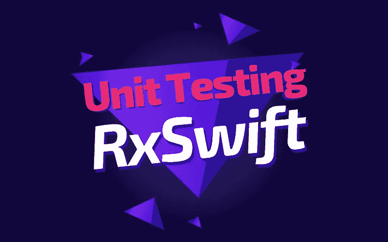
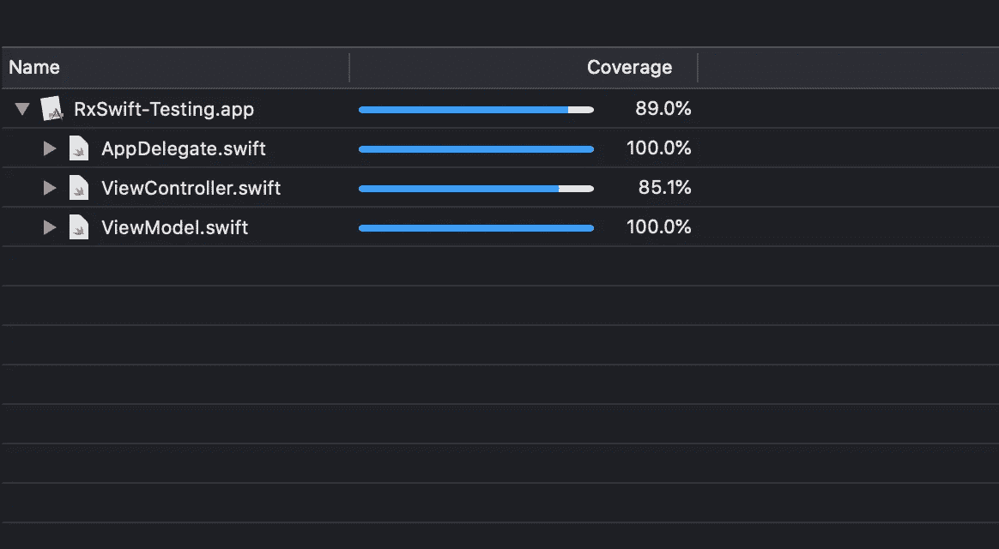

# RxSwift 单元测试 2 分钟讲解

> 原文：<https://betterprogramming.pub/rxswift-unit-testing-explained-in-3-minutes-c024b7a26d>

## 使用 RxTest 和 RxBlocking 库

图片来源:作者

今天，我们将学习如何使用 RxTest 和 RxBlocking 库测试我们的 RxSwift 应用。我们的示例项目遵循反应式 [MVVM](https://medium.com/better-programming/reactive-mvvm-and-the-coordinator-pattern-done-right-88248baf8ca5) 架构。

该项目的源代码可以在文章的底部找到。

# 我们开始吧

我们有以下屏幕:

而`ViewController`里面的结构如下:

我们可以看到，我们有一个包含三个`UIButton`的`UIStackView`。`ViewModel`内部的逻辑只允许选择一个按钮:

现在我们想测试这个逻辑，但是我们的输入和输出不仅仅是值，它们是数据流。因此，只使用`XCTest`并不是一个可行的选择。RxTest 和 RxBlocking 提供了帮助，允许我们以非常简单的方式测试异步逻辑。

让我们在`ViewModelTests.swift`文件中写下以下内容:

我们将在使用 RxTest 测试逻辑时使用`testScheduler`属性，在使用 RxBlocking 时使用`scheduler`属性。

让我们在`tearDown()`方法下创建我们的第一个测试:

这里，正如该方法的名称所暗示的，我们断言当`ViewModel`被实例化时，所有按钮都被禁用。我们不关心事件发生的时间，所以我们使用`XCTAssertRecordedElements`。

让我们使用 RxBlocking 创建另一个测试:

我们模拟了`ViewController`中的行为:当用户点击`secondButton`时，在`bindButtonActions()`中，我们将`false`的值发送给`ViewModel`的`didSelectFirst`和`didSelectThird`属性:

同样，我们可以测试选择`firstButton`和`thirdButton`时的行为:

因此，我们对`ViewModel`进行了全面测试:

# 资源

该项目的[源代码](https://github.com/zafarivaev/RxSwift-UnitTesting)可以在 GitHub 上获得。

# 包扎

要了解更多关于 RxTest 和 RxBlocking 的信息，请访问 GitHub 中的官方文档。

想了解更多关于 RxSwift 的信息？请随意查看我的其他相关文章，这些文章可能对您有所帮助:

*   [如何在 RxSwift 中创建定时器](https://medium.com/better-programming/how-to-create-a-timer-in-rxswift-578bf8712678)
*   [用 RxSwift 替换 Delegation】](https://medium.com/better-programming/replace-delegation-with-rxswift-32ad18d75140)
*   [在 RxSwift 中创建并链接可观察序列](https://medium.com/better-programming/create-and-chain-observable-sequences-in-rxswift-fae9c5bbbc49)

感谢阅读！