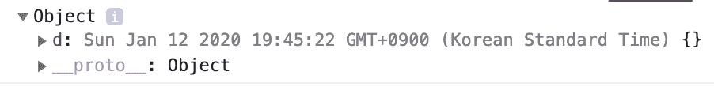
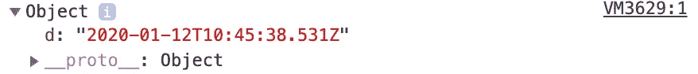
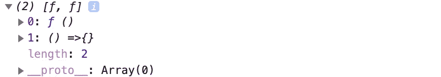
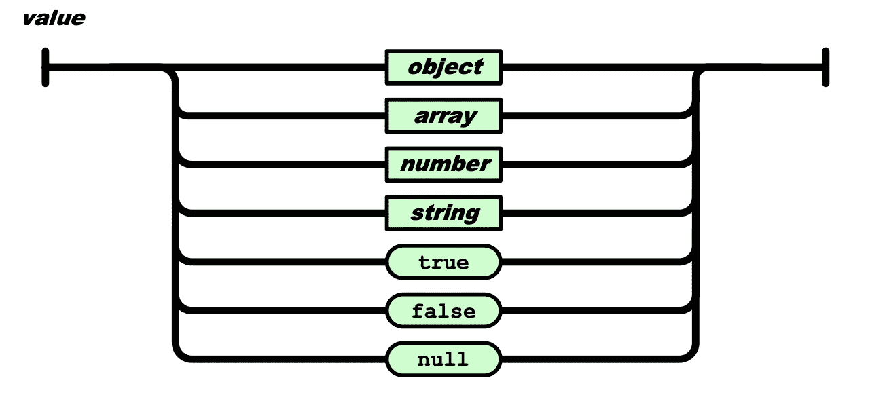
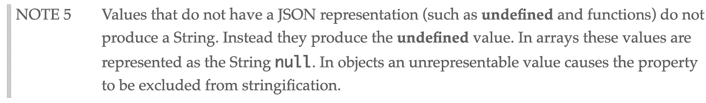
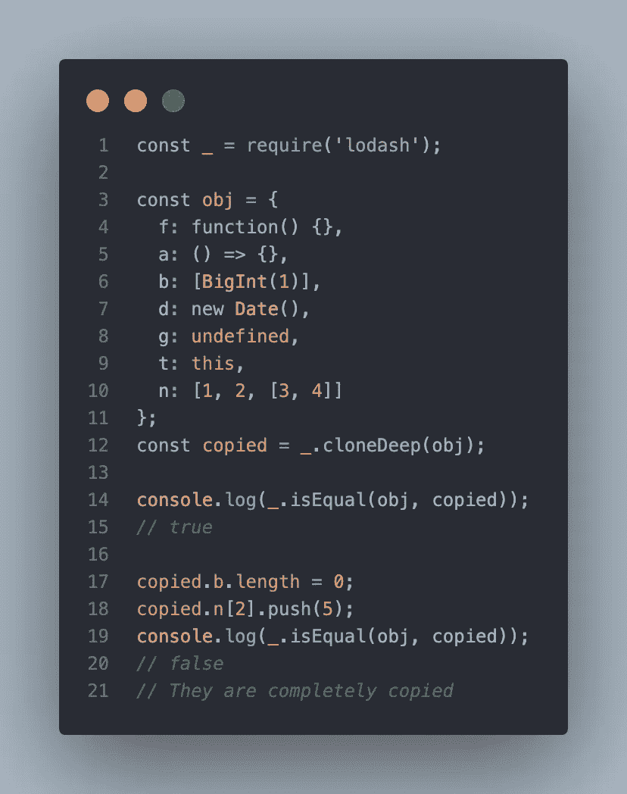
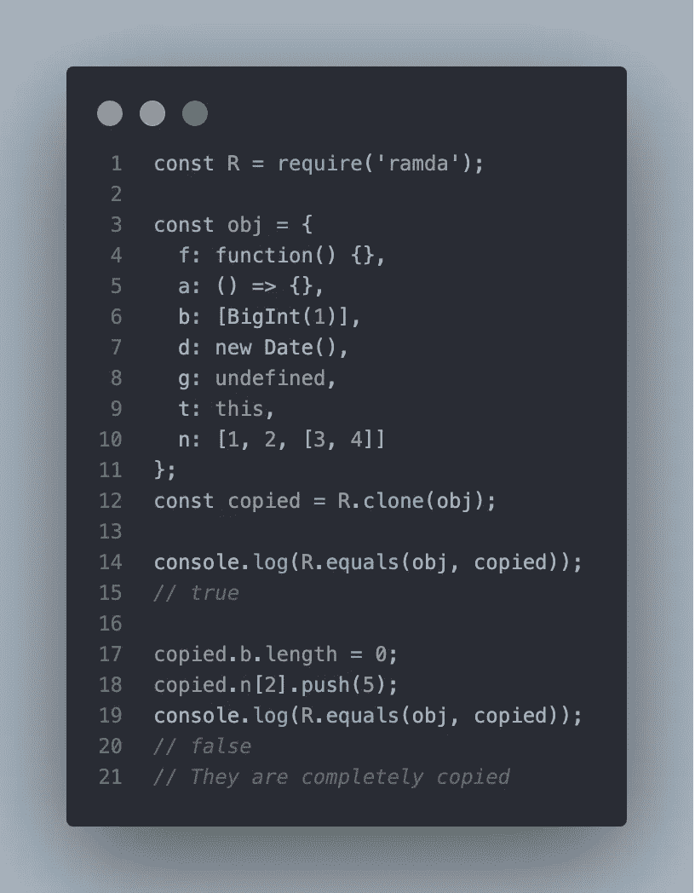

# JavaScript 中的深层拷贝——您认为正确的东西

> 原文：<https://betterprogramming.pub/sadly-you-cant-deep-copy-an-object-with-native-javascript-methods-f12127809cca>

## 在 JavaScript 中，没有办法深度复制一个对象。听我说完


约书亚·科尔曼在 [Unsplash](https://unsplash.com/s/photos/multiples?utm_source=unsplash&utm_medium=referral&utm_content=creditCopyText) 上拍摄的照片

抱歉，各位，这不是一个点击诱饵的帖子。不幸的是，到目前为止你所知道的复制数组或对象的方法并不是复制它们的最佳方法。事实上，做这件事没有完美的方法。我知道你们中的一些人已经开始寻找底部的“写回应”按钮来反对我，但我也很震惊。让我们看看这里发生了什么。

# 放弃

我将提到复制值的常见方法。如果你像 [Lodash](https://lodash.com/) 或 [Ramda](https://ramdajs.com/) 那样编写你的复制方法，也许可以完美地复制它们。另外，在未来，可能会有一个解决方案。

# 让我们创建一个 Checker 方法

我想比较两个对象之间的内容:原始源和新创建的源。

它执行起来非常简单。如果对象内部的值不相同，它返回`false`。你可以在 Ramda 文档中[了解更多关于](https://ramdajs.com/docs/#equals) `[equals](https://ramdajs.com/docs/#equals)` 的信息。

# 数组.原型.切片

这可能是复制数组最简单的方法之一。`Array.prototype.slice`从*开始*到*结束*位置复制一个数组。如果*开始*和*结束*没有显示，则从第一个步进执行到最后一个步进。

```
const arr = [1, 2, 3];
const copied = arr.slice();

checker(arr, copied); // true

copied.push(4);
checker(arr, copied); // false
```

内容好像是抄袭的。但是，`Array.prototype.slice`不能复制嵌套的结构化数组。

```
const arr = [1, 2, [3, 4]];
const copied = arr.slice();

checker(arr, copied); // true

copied[2].push(5);
checker(arr, copied); // true
~~~~~~~
// This shouldn't return true anymore
```

虽然`copied`必须与`arr`截然不同，但他们的价值观是一样的。这是因为`Array.prototype.slice`是一个浅拷贝方法，这意味着它不能深拷贝一个对象。

# 传播算子

JavaScript 中的 spread 操作符在内部执行迭代器循环操作。如果对象是可迭代的，也就是说如果它有`[Symbol.iterator]`在里面，它可以被循环。对内，`const b = [ ...a ]`如下。

```
if (!(Typeof(a) is Iterable)) {
  throw TypeError
}

var b = [];
for (var i = 0; i < a.length; i += 1) {
  b.push(a[i]);
}
```

复制的数组和原始数组的比较如下。

```
const arr = [1, 2, [3, 4]];
const copied = [ ...arr ];

checker(arr, copied); // true

copied[2].push(5);
checker(arr, copied); // true
~~~~~~~
// It should've been false
```

这意味着您也不能使用 spread 操作符执行深度复制。

# 对象.分配

不幸的是，`Object.assign`并没有完美地复制你的对象。

```
const arr = [1, 2, [3, 4]];
const copied = Object.assign([], arr);

checker(arr, copied); // true

copied[2].push(5);
checker(arr, copied); // true
~~~~~~~
// It should've been false
```

MDN 文档警告关于深度克隆对象的`Object.assign`:

> “对于深度克隆，我们需要使用替代方案，因为`Object.assign()`复制属性值。如果源值是对对象的引用，它只复制该引用值。

# JSON.parse w/ JSON.stringify

然而，这种方法可以解决上述方法存在的问题。从一个给定的对象生成一个字符串，将每个值转换成字符串的正确形式。

然后，您可以将字符串值解析成 JSON 对象。因为您解析的字符串是由原始对象构成的，并且是一个不可变的原始值，所以转换后的 JSON 对象也不会侵入原始源的领域。

```
const arr = [1, 2, [3, 4]];
const copied = JSON.parse(JSON.stringify(arr));

checker(arr, copied); // true

copied[2].push(5);
checker(arr, copied); // false
```

现在，`copied`终于与`arr`截然不同了。嵌套结构似乎复制正确。

然而不幸的是，这不能复制日期对象。

```
const obj = { d: new Date() };
const copied = JSON.parse(JSON.stringify(obj));

checker(obj, copied); // false
```

为什么？



obj 在左边/复制在右边

当日期对象值由`JSON.stringify`执行时，`JSON.stringify`运行其`toString`。所以实际的字符串值被改变了，尽管它们的内容是相同的。

问题不在这里。在最新版本的 ECMAScript 2020 中，`BigInt`作为一个新特性被添加进来。有了`BigInt` s，你甚至因为错误得不到结果。

```
JSON.stringify(BigInt(1));
~~~~~~~~~~~~~~
// Uncaught TypeError
// Do not know how to serialize a BigInt
```

与本文前面介绍的方法不同，您不能传递非循环的对象`JSON.stringify`。

```
const a = [];
a[0] = a;

JSON.stringify(a);
// Uncaught TypeError
// Converting circular structure to JSON
```

而且函数是不能被`JSON.stringify`复制的。

```
const arr = [function(){}, () =>{}];
const copied = JSON.parse(JSON.stringify(arr));

checker(arr, copied); // false
```



左边 arr 右边 copy

ECMAScript 的真名是 ECMA-262。JSON 的另一个 ECMA 有单独的文档。它的名字是 ECMA-404。在 ECMA-404 的文档中，你可以看到这个图。



图片来自 [ECMA-404 文档](https://www.ecma-international.org/publications/files/ECMA-ST/ECMA-404.pdf)

只有表示的数据类型可以作为 JSON 值。没有功能。

JavaScript 的 ECMA-262 提到了一些不被认为是 JSON 值的值:



图片来源:ECMA-262

```
JSON.stringify(function() {})     // undefined
JSON.stringify([function() {}])   // [null]
JSON.stringify({f: function() {}) // {}
JSON.stringify({f: () => {})      // {}
JSON.stringify({d: undefined})    // {}
```

# 定制的深度克隆:洛达什和拉姆达

你可以很容易地在 StackOverflow 中找到一些文章，在这些文章中人们推荐使用 Lodash 中的`cloneDeep`进行深度克隆。此外，我使用 Ramda，所以我也对它进行了测试。让我们看看它们是否正常工作。



洛达什在左边/拉姆达在右边

令人惊讶和有趣的是，他们工作得非常好。你可能会问:“你不是说我们不能复制它们吗？”没错。但是你难道不好奇他们是如何让它运转良好的吗？

洛达什的克隆方法

Ramda 中的克隆方法

它们的共同点是，它们都通过循环复制对象，检查对象的每个属性的类型，并在需要时通过用另一种方法包装它来将其转换为正确的格式。换句话说，他们为此定制了方法。

是否安装软件包并导入您需要的模块完全取决于您。

[等于— ramda.js](https://medium.com/u/dcf6de04e0fd#equals)

*   [array . prototype . slice—MDN](https://developer.mozilla.org/en-US/docs/Web/JavaScript/Reference/Global_Objects/Array/slice)*   [运行时语义:ArrayAccumulation — ECMAScript 规范](https://tc39.es/ecma262/#sec-runtime-semantics-arrayaccumulation)*   [JSON.stringify — ECMAScript 规范](http://ecma-international.org/ecma-262/10.0/index.html#sec-json.stringify)*   [ECMA-404，JSON](https://www.ecma-international.org/publications/files/ECMA-ST/ECMA-404.pdf)*   [Object.assign — MDN](https://developer.mozilla.org/en-US/docs/Web/JavaScript/Reference/Global_Objects/Object/assign)*   [Lodash — Github](https://github.com/lodash/lodash)*   [拉姆达— Github](https://github.com/ramda/ramda)