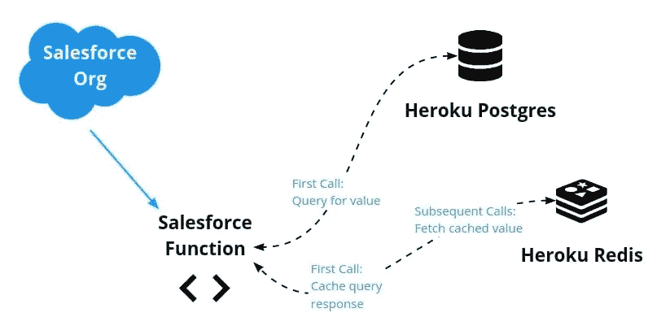
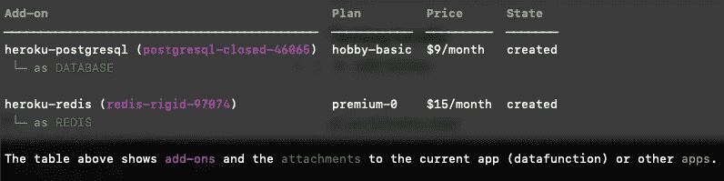
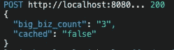
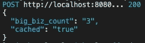

# 用于缓存昂贵查询的 Salesforce 函数

> 原文：<https://betterprogramming.pub/salesforce-functions-for-caching-expensive-queries-6b5ee2ce5380>

## 让我们将我们的 Salesforce 组织连接到 Heroku 数据存储并构建缓存机制


在 [Unsplash](https://unsplash.com?utm_source=medium&utm_medium=referral) 上 [engin akyurt](https://unsplash.com/@enginakyurt?utm_source=medium&utm_medium=referral) 拍摄的照片

缓存是一种可以帮助您节省资源和提高性能的策略。当您有一个经常运行的昂贵的查询并且结果很少改变时，缓存是一个理想的解决方案。必要时，可以通过缓存该查询的结果来返回缓存的结果。结果是一样的，但是您不需要运行昂贵的查询。每个人都赢了。

在本文中，我们将介绍如何使用 Salesforce 函数来缓存昂贵的查询。例如，我们想在许多记录中查询某个值，需要这个查询的页面经常被加载。但是，从一次查询执行到下一次查询执行，结果不会改变。

# 问题简介

在我们的演示中，示例查询将是“拥有超过 10，000 名员工的公司的数量”我们设想一个用例，其中有一个我们的销售团队经常加载的页面，该页面的一部分显示了我们的 Salesforce 组织中符合该条件的公司总数。理想情况下，并不是每次页面加载时都运行昂贵的查询；相反，我们将实现一个缓存机制。

为了解决这个问题，我们将:

1.  利用 [Heroku Connect](https://www.heroku.com/connect) 将我们的公司列表从 Salesforce 同步到 [Heroku Postgres](https://www.heroku.com/postgres) (或使用 Postgres 中已有的表格)。
2.  创建一个 [Salesforce 函数](https://developer.salesforce.com/docs/platform/functions/overview)来查询 Postgres 并返回计数。
3.  在指定时间内将结果值存储在 [Heroku Redis](https://www.heroku.com/redis) 中。
4.  使用 Salesforce 函数检查 Redis 中的值。如果 Redis 中存在该值，则返回它。如果没有，那么运行查询并将结果存储在 Redis 中。

数据流如下所示:



当然，Apex 确实有一个[平台缓存 API](https://developer.salesforce.com/docs/atlas.en-us.apexcode.meta/apexcode/apex_cache_namespace_overview.htm) 来促进特定用例的缓存。出于我们的使用案例和演示目的，我们将探索这个使用 Salesforce 函数的缓存解决方案。

在我们继续之前，让我们简要介绍一下我们系统中的每一个部分。

*   [Salesforce 功能](https://developer.salesforce.com/docs/platform/functions/overview):Salesforce 的一项功能，允许您运行仍在您的 sales force 组织的安全区域中但未在您的组织上运行的一些代码(JavaScript 或 Java 是当前支持的语言)。这使您可以卸载可能导致您超出限制的繁重工作负载。
*   [Heroku Connect](https://www.heroku.com/connect):Salesforce 家族中的一个工具，用于您的 sales force 组织和 [Heroku Postgres](https://www.heroku.com/postgres) 之间的双向数据同步。与 Salesforce 功能类似，您可以利用此工具，而不会影响您的 Salesforce 限制。
*   Heroku Postgres:Heroku 上的一个完全托管的 PostgreSQL (一个关系数据库)实例。
*   [Heroku Redis](https://www.heroku.com/redis):Heroku 上的一个完全托管的 [Redis](https://redis.io/) (内存中的键值存储)实例。

# 先决条件

要使用上述所有组件，您必须准备好以下组件:

*   一个 [Heroku 账号](https://signup.heroku.com/)
*   一个 [Heroku app](https://devcenter.heroku.com/articles/creating-apps) 创建，附带 [Postgres](https://devcenter.heroku.com/articles/heroku-postgresql#provisioning-heroku-postgres) 和 [Redis](https://devcenter.heroku.com/articles/heroku-redis#create-an-instance) 附加组件
*   启用了[功能的 Salesforce 组织](https://developer.salesforce.com/docs/platform/functions/guide/index.html)
*   本地 Salesforce 功能[开发环境](https://developer.salesforce.com/docs/platform/functions/guide/set-up.html)
*   [可选] [Heroku Connect](https://devcenter.heroku.com/articles/quick-start-heroku-connect-cli) 同步到 Postgres(提供样本数据集)

有了先决条件，我们就可以开始连接它们了。首先，我们将浏览连接环境。然后，我们将看看实现这一奇迹所需的代码。

# 从 Salesforce 功能访问 Heroku 数据服务

有了您的帐户和访问权限，我们就可以继续使用该功能了。假设您正在开始一个新项目，并且有一个空的 Postgres 数据库。

如果您是函数新手，我们建议您在涉及其他部分之前，先完成这个基本过程，以便对事物有所了解。如果您已经有一个 Salesforce 项目或正在通过 Heroku Connect 同步数据，您可以修改以下命令以满足您的需求。

首先，创建一个 Salesforce DX 项目，为您的功能提供一个家。

```
sfdx force:project:create -n MyDataProj
```

接下来，导航到项目目录并运行以下命令来创建一个新的 JavaScript 函数。

```
sf generate function -n yourfunction -l javascript
```

这将创建一个带有 Node.js 应用程序模板的`/functions`文件夹。

接下来，通过将 Heroku 用户作为协作者添加到您的职能部门的计算环境，将您的 Salesforce 职能部门与您的 Heroku 环境相关联:

```
sf env compute collaborator add --heroku-user <yourherokuaccount@email.com>
```

这些环境现在可以共享 Heroku 数据服务。

接下来，您需要获得计算环境的名称，以便可以将数据存储区连接到它。

```
sf env list
```

要附加 Heroku 数据存储库，您还需要附加组件的名称。您可以使用以下命令获得附加组件的名称:

```
heroku addons -a <yourherokuapp>
```

输出将类似于以下内容。每个附加组件的“名称”显示为紫色(例如，`postgresql-closed-46065`)。



使用计算环境和附加组件的名称，运行以下命令将 Postgres 和 Redis 附加到您的计算环境:

```
heroku addons:attach <your-heroku-postgres-name> --app <your-compute-environment-name>
```

```
heroku addons:attach <your-heroku-redis-name> --app <your-compute-environment-name>
```

现在，我们已经将 Salesforce 功能环境与 Heroku 数据存储连接起来，我们可以编写我们的 Salesforce 功能代码了。

# 实施 Salesforce 功能

在我们开始为这个 Salesforce 函数编写 JavaScript 之前，让我们用必要的库设置我们的本地开发环境。我们的函数将从部署环境中的环境变量获取数据连接信息。对于我们的本地环境，我们将使用 [dotenv](https://www.npmjs.com/package/dotenv) 节点包来读取一个名为`.env`的文件中的信息。我们可以使用以下命令创建该文件:

```
heroku config -a <yourherokuapp> --shell > .env
```

接下来，让我们安装与 Postgres 和 Redis 以及 dotenv 交互所需的包:

```
npm install dotenv pg redis
```

我们的项目设置已经完成。让我们写函数代码。

# 连接到 Heroku Postgres 和 Redis

让我们从添加允许我们在 Heroku Postgres 和 Heroku Redis 中读取和存储数据的代码开始。(注意: [Heroku Devcenter](https://devcenter.heroku.com/) 有关于从 Node.js 连接到 [Postgres](https://devcenter.heroku.com/articles/connecting-heroku-postgres#connecting-in-node-js) 和 [Redis](https://devcenter.heroku.com/articles/connecting-heroku-redis#connecting-in-node-js) 的有用文档。)

我们的函数代码将保存在项目中`functions`文件夹的`index.js`文件中(例如，`MyDataProj/functions/index.js`)。我们打开该文件，并在顶部添加以下行。这些行将导入我们刚刚安装的模块。

```
import "dotenv/config";
import pg from "pg";
const { Client } = pg;
import { createClient } from 'redis';
```

该函数的主要部分是正在导出的部分。从这个块返回的值将被返回给函数的调用者。

```
export default async function (event, context, logger) {
```

```
}
```

为了保持代码的整洁和模块化，让我们首先在文件的底部写几个助手函数。我们需要可以调用的函数来管理我们到 Postgres 和 Redis 的连接。在导出函数之下(之外)，我们添加了以下两个辅助函数:

```
/* Helper functions */
```

```
// Connect to PostgreSQL
async function pgConnect() {
   const DATABASE_URL = process.env.DATABASE_URL;
   if (!DATABASE_URL) {
     throw new Error("DATABASE_URL is not set");
   }
    const client = new Client({
     connectionString: DATABASE_URL,
     ssl: {
       rejectUnauthorized: false
     }
   });
    await client.connect();
   return client;
 }
```

```
// Connect to Redis
async function redisConnect() {
   const REDIS_URL = process.env.REDIS_URL;
   if (!REDIS_URL) {
     throw new Error("REDIS_URL is not set");
   }
    const redis = createClient({
       url: process.env.REDIS_URL,
       socket: {
           tls: true,
           rejectUnauthorized: false
       }
       });
    await redis.connect();
   redis.on('error', err => {
       console.log('Error ' + err);
   });
   return redis;
 }
```

# 在样本数据集中加载

让我们将一个小数据集加载到 Postgres 中，以保持示例的简单性。我们可以通过运行以下[要点](https://gist.github.com/alvinslee/3a7233eab951ec269f3d3fdf9d1e2283)中的数据库命令来创建一个名为“company”的表。将要点内容下载到一个名为`company.sql`的文件中。要从 Heroku CLI 运行数据库命令，请执行以下操作:

```
heroku pg:psql -a <yourherokuapp>
```

```
DATABASE=> \i /path/to/company.sql
```

您可以通过运行以下查询来验证您的示例数据集是否已加载:

```
DATABASE=> select * from company;
```

# 编写主函数

我们都准备好了！现在，我们要为我们的实际函数写一点代码。我们函数的代码可作为[要点](https://gist.github.com/alvinslee/62cb4ad3390740ed8a15e2da11d0d020)获得，如下所示。你可以把这个拷贝到你的`index.js`文件中。我们将逐步解释代码的每一部分。

```
export default async function (event, context, logger) {
   logger.info(`Invoking Datafunction with payload ${JSON.stringify(event.data || {})}`);
```

```
const redis = await redisConnect();
   let cached = {};
```

```
// Check Redis for cached entry first
   let big_biz_count = await redis.get(`big_biz`);
```

```
if (big_biz_count) {
       // If cached entry found, return it and be done.
       logger.info(`Found cache entry = ${big_biz_count}`);
       cached = "true"
       redis.quit();
```

```
return { big_biz_count, cached }
   }  else {
      // If cached entry not found, then:
      // 1\. Run the Postgres query
      // 2\. Store the result in Redis
      // 3\. Return the result and be done
       logger.info(`did not find in cache, returned ${big_biz_count}`);
       cached = "false"
       const pg = await pgConnect();
       const { rows } = await pg.query('SELECT COUNT(*) FROM company WHERE employees>10000;');
       big_biz_count = rows[0].count.toString();
```

```
redis.set(`big_biz`, big_biz_count, {
         EX: 30, // seconds to keep before expiring
         NX: true
       });
```

```
// Close the connections   
       redis.quit();
       pg.end();
```

```
// Return the value from Postgres, now stored in Redis
       return { big_biz_count, cached }
   }
}
```

# 代码的解释

正如本文开头提到的，我们希望找出有多少公司拥有超过 10，000 名员工，并返回该数字。我们希望缓存这个数字，因为这是一个“昂贵的查询”在我们的例子中，桌子很小，所以不贵。然而，它代表了我们在现实生活中可能想要运行的“昂贵查询”。你明白了。

让我们浏览一下函数代码的主要部分。

1)连接到 Redis，查看值是否存在。

```
const redis = await redisConnect();
  let cached = {};
  let big_biz_count = await redis.get(`big_biz`);
```

2)如果值在那里，意味着它已经被缓存，那么我们可以返回缓存的值，这样就完成了。

```
if (big_biz_count) {
    cached = "true"
    redis.quit();
    return { big_biz_count, cached }
```

3)如果没有找到缓存值，那么我们别无选择，只能在 Postgres 数据库上运行查询。

```
}  else {
    cached = "false"
    const pg = await pgConnect();
    const { rows } = await pg.query('SELECT COUNT(*) FROM company WHERE employees>10000;');
    big_biz_count = rows[0].count.toString();
```

4)然后，我们将查询返回的值存储在 Redis 中。

```
redis.set(`big_biz`, big_biz_count, {
      EX: 30, // seconds to keep before expiring
      NX: true
    });
```

5)最后，我们关闭数据存储连接，并返回查询结果。

```
redis.quit();
    pg.end();
    return { big_biz_count, cached }
```

您可能更喜欢重构代码或添加一些错误处理。然而，在这个最基本的水平上，这就是它的全部。

# 测试功能

现在我们有了一个 Salesforce 函数，我们可以在本地测试它。首先，我们启动函数服务器。

```
sf run function start
```

然后，我们使用来自另一个终端的有效载荷调用该函数。

```
sf run function -l http://localhost:8080 -p '{"payloadID": "info"}'
```

当您第一次对测试数据库调用该函数时，您应该会看到以下输出，因为缓存中没有值:



然而，在第一次运行之后，该值被存储在我们的 Heroku Redis 实例中。Salesforce 函数的后续运行返回相同的值，但这一次，`cached`为真。



当我们将该值添加到 Redis 时，我们将缓存过期时间设置为 10 秒。这使得测试更加容易。然而，在现实环境中，缓存值的生命周期应该对您的业务用例有意义。例如，如果报告在夜间运行后结果发生变化，那么您可以将缓存值设置为每 24 小时过期一次。更好的是，您可以创建另一个 Salesforce 函数，在报表完成后立即用新值更新缓存。

index.js 的全部内容可以在这里[下载。](https://gist.github.com/alvinslee/62cb4ad3390740ed8a15e2da11d0d020)

# 结论

我们做到了。缓存是减少资源负载同时提供更快响应的优秀策略。借助 Salesforce 功能，我们可以将 Salesforce 组织连接到 Heroku 数据存储(如 Postgres 和 Redis)并构建缓存机制。

Salesforce 功能允许我们执行通常可能负载繁重、导致超时或超出 Salesforce 施加的其他限制的任务。缓存只是一个用例，但是它可以产生巨大的好处，并且易于实现。现在，去享受吧！