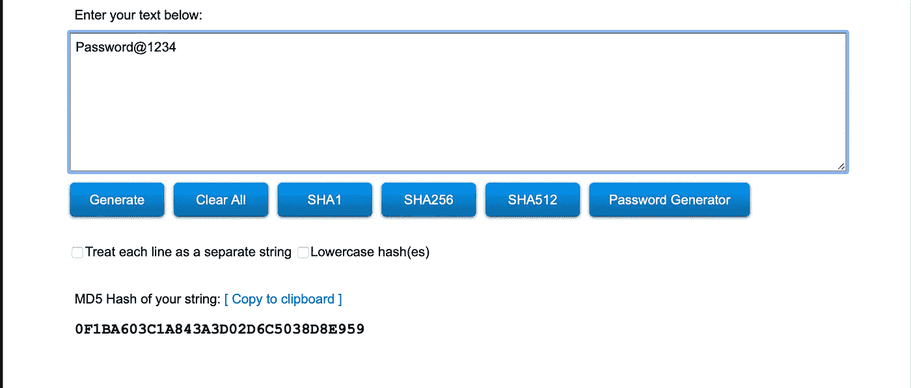
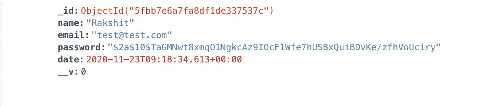

# 盐和哈希解释

> 原文：<https://betterprogramming.pub/salting-and-hashing-explained-b76f5af83554>

## 了解哈希和 salt 如何保护用户数据，以及如何在 Node.js 中使用它们


杰森·图因斯特拉在 [Unsplash](https://unsplash.com?utm_source=medium&utm_medium=referral) 上拍摄的照片。

用户信息和数据是高度敏感的信息，必须加以保护。因此，采取强有力的措施来不惜一切代价保护它是非常必要的。此外，密码不应该以纯文本的形式存储在数据库中。它们应该被高度加密以避免用户之间的混乱。

在本文中，我们将讨论 salt 和 hashing 如何加密用户密码，以及以纯文本形式存储敏感用户信息所固有的风险。

# 哈希是如何工作的

哈希算法(MD5 哈希)获取用户输入的密码，并将其转换为无法破译的字符串。这称为散列密码。任何对您的数据库发起攻击的人都无法理解它，因为哈希只有一种工作方式。这意味着一旦密码被散列，你就不能反过来再把它转换成纯文本。因此，散列用户密码是设计后端时应该完成的一项重要任务。

下面是一个密码散列方式的示例:



如果你想亲自体验一下哈希是如何生成新字符串的，请前往 [MD5 哈希生成器](https://passwordsgenerator.net/md5-hash-generator/)。

# 为什么散列是不够的

当你看上面的例子时，你可能会注意到散列字符串对你来说毫无意义。如果你认为仅仅散列你的密码就足够了，那你就错了。原因是哈希算法不会在每次收到相同的密码文本时为其生成唯一的字符串。换句话说，假设你的密码看起来像上面的例子(Password@1234) *。*算法每次接收到相同的输入字符串，总会产生相同的哈希字符串(即 0 f1 ba 603 C1 a843 a 3d 02 d6c 5038 D8 e 959)。这并不理想，因为黑客可以对你的数据库发起彩虹攻击，破解里面存储的密码。

让我告诉你一些关于彩虹桌攻击的事情。

## **彩虹表攻击**

攻击者可以使用预先构建的密码表，该表映射了相应的哈希字符串。然后，他们将使用随机散列字符串对表数据库运行它。如果找到匹配，他们可以简单地查看用于创建散列的密码，并映射它来破解密码。因此，不建议使用姓名、出生日期或常用字符串，如“密码”、“12345678”等。

# 咸杂碎

我们的散列问题可以用一个简单的解决方案来解决:使用 salt。Salt 是随机生成的固定长度值，对于每个用户密码都是唯一的。Salt 被附加上当前的密码字符串，并被送入哈希系统，以便在用户每次创建密码时产生一个新的哈希结果。这意味着如果你和我有相同的密码，我们的散列字符串将是不同的。由于彩虹表攻击严重依赖于找到一个匹配，这将使他们无用。

bcrypt 库创建 salt 和 hashed 数据，有强大的加密算法支持，非常适合这个目的。

# 如何在节点中添加 Salt 和 Hash

## **安装 bcrypt**

在终端中运行以下命令:

```
npm install bcrypt
```

## **加盐哈希用户密码**

下面是一个用户密码和一些其他信息如何存储在数据库中的示例:



# 结论

总是建议对数据库中每个用户的敏感信息进行加密。当你在设计后端系统的时候，一定要记住伴随任何行为而来的风险。因此，一些软件公司雇佣道德黑客来破坏他们的网络安全，以找到系统中的漏洞。从程序员的角度来看，在将代码部署给主流用户之前对其进行测试是一个很好的做法。