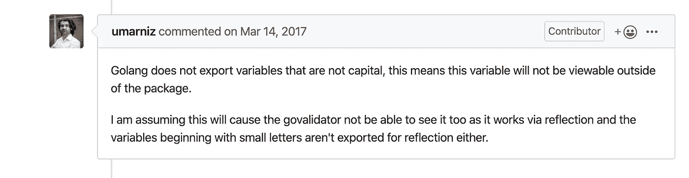

# 使用 MongoDB 和 AWS SAM 部署 GoLambda(第 3 部分)

> 原文：<https://betterprogramming.pub/sam-deploys-golambda-w-mongodb-a03cd97bae45>

## 微服务风雨兼程


萨姆-蒙戈得布-戈[弗]

你喜欢*而不是*有参照物来造东西吗？尽管这三种技术广为人知，但我很难找到另一篇文章来展示它们协同工作的模型。事实上，我没有找到。所以，我生了这个！

我想用一种新的语言开始新的一年。我还想记录一些我在这个过程中学到的东西。这篇文章更多的是解释我是如何让 Go 在本地运行的，以及我用 SAM、Go 和 Mongo 驱动程序在本地开发的经历。我将带您开始我的设置之旅，然后带您了解制作这个 API 的大约九个方法。 *Ahora* ，我们开始吧！

本文假设您有一些使用 Lambda 函数和 SAM 以及 MongoDB 的经验，但是没有在 Go 中使用它们。如果没有，首先要有 [Golang](https://golang.org/) 、 [SAM](https://aws.amazon.com/serverless/sam/) 、 [AWS CLI](https://aws.amazon.com/cli/) 和 [Docker](https://www.docker.com/products/docker-desktop) 。这是一个周末项目，我和我的介绍去。请欣赏！

安装好所有东西后，就可以开始工作了。

首先，你需要`cd`到你的 Go 目录。我用的是 Mac，所以对我来说这个目录最初位于`$HOME/go`。把它放在哪里很重要，因为你所有的 Goroutines 都需要放在这里的`src/`目录中——稍后会详细介绍。所以，既然我喜欢把*东西个性化*，我决定把它移到我的`projects/`目录里。

*自从添加了[模块](https://blog.golang.org/migrating-to-go-modules)后，这种情况有所改变。

为了做到这一点，并仍然有工作，我需要更新我的`$PATH`。因为我使用 Zsh，所以我需要用下面几行代码更新我的`.zshrc`:

```
export GOPATH=$HOME/porjects/go
export PATH="$PATH:$HOME/projects/go/bin"
```

运行以下程序为您的 Goroutine 制作`dir`:

`$ mkdir $HOME/projects/go/src/test-go`

我所有的围棋程序都需要在这里运行`$HOME/projects/go/src`。这就是所谓的 Go *工作空间。*你可以在这里阅读更多关于 Go Workspaces [的内容。](https://golang.org/doc/code.html#Workspaces)

然后，我运行以下代码，使用 SAM CLI 创建一个锅炉板 Hello World Golang Lambda:

```
$ cd $HOME/projects/go/src/test-go
$ sam init — runtime go1.x — name test-go
```

当您在终端中运行上面的命令时，您会得到这样的结果。

```
.
└── test-go
    ├── Makefile
    ├── README.md
    ├── hello-world
    │   ├── test-go
    │   ├── hello-world
    │   ├── main.go
    │   └── main_test.go
    └── template.yaml
```

接下来，我们要运行:

```
$ make deps
$ make build
$ sam local start-api
```

在新的终端窗口中，你可以运行`curl localhost:3000/hello`或者直接在浏览器中打开它。

如果您所有的`aws-cli`凭证都准备好了，第一次运行`$ sam local start-api`时，您会在控制台上看到类似这样的内容:

```
Mounting HelloWorldFunction at [http://127.0.0.1:3000/hello](http://127.0.0.1:3000/hello) [GET]
You can now browse to the above endpoints to invoke your functions. You do not need to restart/reload SAM CLI while working on your functions, changes will be reflected instantly/automatically. You only need to restart SAM CLI if you update your AWS SAM template
2019-12-15 13:23:18  * Running on [http://127.0.0.1:3000/](http://127.0.0.1:3000/) (Press CTRL+C to quit)
Invoking hello-world (go1.x)
2019-12-15 13:23:35 Found credentials in shared credentials file: ~/.aws/credentialsFetching lambci/lambda:go1.x Docker container image..........................................................................................................................
```

之后，你可以使用`curl [http://localhost:3000/hello](http://localhost:3000/hello)`或者通过浏览器访问我上面提到的 URL 来调用你的 lamba。

太好了！您已经开始运行并正在发展，但现在是谈论几个*问题*的好时机。

*   现在所有这些都是假设您还没有将`test-go/`初始化为一个 Git 库。如果您这样做并试图运行`$ make deps`命令，您可能会遇到类似如下的错误:

```
$ make deps
go get -u ./...
# cd /Users/jahagitonga/projects/go/src/test-go; git submodule update --init --recursive
fatal: No url found for submodule path 'test-go' in .gitmodules
package aahs-go-back-end/aahs-func/test-go: exit status 128
```

*   SAM 将*不会*原生热重装 Golang lambdas，这*太可怕了*。有鉴于此，我们需要一个名为 [supervisor](https://www.npmjs.com/package/supervisor) 的节点包来帮助我们观察变化。是的，我们需要 Node，所以如果你没有 Node，请点击[这里](https://nodejs.org/en/)找到更多关于 Node 的信息，并在你的机器上安装 Node。

现在让我们更新 Makefile。我的 Makefile 看起来像这样:

Go Makefile 支持代码更改时的热重载

这个想法来自于 Ucchishta Sivagur。他的回购可以在这里查看。谢谢 uccmen！如果您更新了 Makefile run `$ make && make watch`，您就可以为 Golang Lambda 启用热重装了。太棒了。

*   构建 lambda 时，如果您忘记在`template.yaml`文件中声明方法，您会在本地看到这个错误:

```
{
  "message": "Missing Authentication Token"
}
```

因此，请确保您相应地更新了您的`template.yaml`文件，尽管该消息极具误导性，也不要惊慌。希望 AWS 工作人员可以很快得到一个更好的错误消息！

# 启动并运行 MongoDb！

由于这是一个小项目，我不关心复制或分片；我只需要云中的一个 MongoDb 实例，所以我选择了 [mLab](https://mlab.com/) ，因为它是**免费的**，并且是 MongoDB 旗下的一家公司。如果将来我需要升级和利用复制和分片的能力，我可以毫无问题地迁移到 Atlas。

我们需要一些依赖项来完成这项工作:

```
"github.com/joho/godotenv""go.mongodb.org/mongo-driver/bson/primitive""go.mongodb.org/mongo-driver/mongo""go.mongodb.org/mongo-driver/mongo/options""go.mongodb.org/mongo-driver/mongo/readpref"bson "go.mongodb.org/mongo-driver/bson"
```

# 造拉姆达！

我们可以将上述内容添加到我们的`main.go`文件的导入语句中。我用过的所有软件包的完整列表可以在 [repo](https://github.com/JNaeemGitonga/first-golang-app) 中的[这里](https://github.com/JNaeemGitonga/first-golang-app/blob/master/aahs-func/aahs-backend/main.go)找到。我们开始看`func main()`:

func main() {…}

我喜欢让事情变得简单，所以`func main()`要做的第一件事就是获取我们的环境变量，检查是否已经有一个 Mongo 客户端，并且`mongoURI`没有被赋值为空字符串。一旦我们这样做了，我们就连接到我们的 MongoDb 实例，或者启动 lambda。

我注意到的来自 JavaScript 的第一件事是 Go 在处理环境变量时需要一点帮助。你可以使用你的系统和 Go 给你的`os`包来制作和访问它们。但是如果你习惯于使用`.env`文件存储这些变量，而不是在你的系统上，你将需要导入`["github.com/joho/godotenv"](https://github.com/joho/godotenv)`。即使在 Node 中，您也需要`[dotenv](https://www.npmjs.com/package/dotenv)`包，以便 Node 进程从您的系统和`.env`文件中收集这些`env`变量。要访问它们，你只需要`proces.env.YOUR_VAR_NAME`。但是我们不是在处理 Node 的简单性！检查`getMongoURIEnvVar`方法:

`func getMongoURIEnvVar() {...}`

这个函数只是取了一个类型为`string`的名字。首先，我们必须加载`.env`文件，然后我们可以使用`os`包来检索分配给该名称的值。注意`Load`方法如何只返回一个错误——有趣的假设。如果没有错误，它一定是有效的，对吗？

现在我们已经了解了所有这些，让我们看看如何连接到我们的 mongo 实例:

这里你可以看到我首先检查客户是否不是`nil`。如果不是，程序将继续运行，并使用可用于连接池的缓存实例(最佳实践)。如果是`nil`，我们创建一个`connectionError`变量，因为简写声明/赋值`:=`不会干扰我们在`line 7`上全局使用`client`。我们还创建了一个`[context](https://golang.org/pkg/context/)`,我们的函数将在其中运行并连接到数据库(我们也有一些基本的错误处理日志)。在高级术语中，这个*上下文*表示如果程序在 15 秒内没有连接，就停止并继续运行。Go 有很棒的关于谷歌如何使用上下文的文档。

如果我们在使用上下文之后注意并规范我们的使用，我们也可以开发出超高效的 API。我在这里做得不错，但我希望更有经验的*地鼠*能给我一些关于如何优化这里的*指点*——双关语！你需要传递上下文以确保你的应用程序的效率，并且一旦在上下文中执行了一些事情，这些资源就会得到适当的释放。语境越来越深，所以请查看我在这一段列出的两个资源，以了解关于语境的所有事情。

不管连接与否，我们的 Goroutine 的下一步是启动我们的处理程序:

我尽量保持简单(接吻)，对吧？请注意，我创建了另一个上下文。这是我们的 CRUD 操作运行的环境。我将把它传递给我的函数，一旦它们返回了这个 Goroutine 将运行对`cancel()`的`defer`调用，这将取消上下文，从而释放那些资源。接下来，我将检查客户端是否是`nil`。如果是，这是不应该的，程序将向客户端发送一个错误，警告最终用户无法建立连接——用这么多的话来说。

我使用一个简单的`switch`语句来决定接下来会发生什么。我选择这样做是因为这个项目很小，我只使用一个*通吃*路线来处理我的请求。如果项目更大，我可能不会，但看到这是一个使用 Go、MongoDb 和 SAM 的例子，就知道这里的一切并不完全符合 RESTful 规范——但我们真的很接近了！

话虽如此，我们还是来看看`func getStories()`。

首先，我联系了客户。我这样做是为了确保事情进展顺利。如果不是，程序会抛出一个错误。但是假设事情是这样的，那么我们在我们的集合上执行一个 find，评估它的错误，并使用`cursor`的`.Next()`方法循环遍历光标，将它的元素解码成我们的 Goroutine 稍后可以使用的东西。然后，我们将它们添加到一个故事列表中，并返回对`func marshalJSONAndSend()`的调用，将我们的列表传递给它。在`return`执行后做的最后一件事是*延迟*调用`cursor.Close(ctx)`。

但是`func marshalJSONAndSend()`呢。好吧，让我们来看一看:

这个小家伙将获取我们的故事列表，将其转换为数据类型— `[]byte` —然后可以转换为字符串—`line 7`，并通过我们的 API 网关响应发送给客户端。

就是这样！

我一直在用这个`func handleError()`但是没有显示出来。没什么大不了的。你自己看看吧。

func handleError(err error)(事件。APIGatewayProxyResponse，错误){…}

我们快完成了。我们能够从数据库中读取数据，但是让我们创建一个文档。我们用我们的`func postStory()`做到这一点。

我遵循其他方法中使用的相同模式，所以没有任何变化，但我确实需要做一些类型转换，以便它可以正确地添加到我的数据库中。完成之后，我使用一个变量`newDbResult`，根据结果的类型创建一个结果图。我这样做是为了减少一些用于处理结果和发送适当响应的代码。在我们跳到`func handleResultSendResponse()`之前，让我们先来看看这个故事`struct`。[struct](https://tour.golang.org/moretypes/2)让我想起了 TypeScript 中的`interfaces`(记得我来自 JavaScript 之地)。它们用于枚举一段数据的字段。它们包含作为字段的名称以及与所述字段相关联的值类型。它们还包含对我们的 API 的正常运行至关重要的元数据。看看这个故事`struct`:

如果字段类型右侧没有元数据，我们的结构就不会映射到 JSON/BSON 模式。我们还需要大写字段名。看看这个家伙对大写`structs`的字段名有什么看法。



[https://github.com/asaskevich/govalidator/issues/187](https://github.com/asaskevich/govalidator/issues/187)

那么`func handleResultSendResponse()`呢？

我对代码做了注释，所以，现在你知道了。这里重要的是*反射*。Golang 使用`reflect`允许我们以更动态的方式使用 Go，例如，在运行时和编译时检查类型。反思理应有自己的岗位。以至于除了 Go docs [这里](https://golang.org/pkg/reflect/)和他们的 blog [这里](https://blog.golang.org/laws-of-reflection)之外，我在这里找到了一个不错的[。一旦我们正确地*反射了*，我们就能够`fmt.Sprintf`一个`string`，这样我们就可以将它发送回我们的客户端`func handleResultSendResponse()`的`line 18`。了解反射让我可以在其他地方重用一些代码。你会喜欢的！](https://medium.com/capital-one-tech/learning-to-use-go-reflection-822a0aed74b7)

我们最后拥有的是更新功能。让我们开始吧！

首先，让我说我必须习惯所有的类型转换，这是*需要*来运行这个 API。如果有人有更好的方法或优化，请随时给我留言。

首先我们声明一个变量。把我们得到的更新转换成`[]byte` s。在第四行，我喜欢的方式允许我们做一些速记赋值，并在我们的`if/else`语句中使用这些变量。当然，这些都在`if`块的范围之内，如果它有一个的话，还有它各自的`else`。事实上，我非常喜欢它，以至于我愿意违背 go 的 linter，在一个`else`块中使用这种语法，这个块除了`return`一个函数调用之外什么也不做。我最终重构了代码。

当我们查看我们的`filter`和`upDate`变量时，我们看到 Go 驱动程序使用了 BSON。这对我来说是新的，双卷边让我想到了棱角。这里有一个关于使用 Go 驱动程序的很棒的教程。

现在是部署的时候了。要进行部署，请遵循 SAM 提供的`README.md`中的说明。公开地说，这是让你进入云端的最简单的方法。你可以在这里现场体验这个 API[。](http://americanairlineshorror.com/)

尽管我必须说，当我真的上线时，我还有一个问题要解决。最初，我在全局范围内放置了一些变量。其中一个正在`func getStories()`中使用；那是`stories []Story`名单。这在本地工作得很好，但是在优化的云中，每次我发出 get 请求，lambda 都会返回一个相同的故事——我在 Db 中只有一个。我花了大约 15 分钟才意识到潜在的问题是什么。我能想到的最好的情况是，lambda 的上下文比实际的请求持续的时间长，并且每次它收到一个新的请求时，都会向集合中附加一个新的文档。最好的做法是在`func getStories()`的范围内使用`stories`集合。一旦我这样做了，事情就恢复正常了。

我只有这些了。我希望这能让一些人受益，并节省几个小时的研究时间。让我知道我可以如何改进，你会有什么不同的做法，你喜欢什么！

感谢阅读！