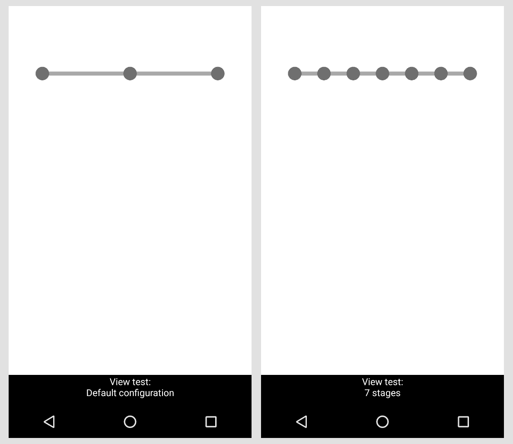
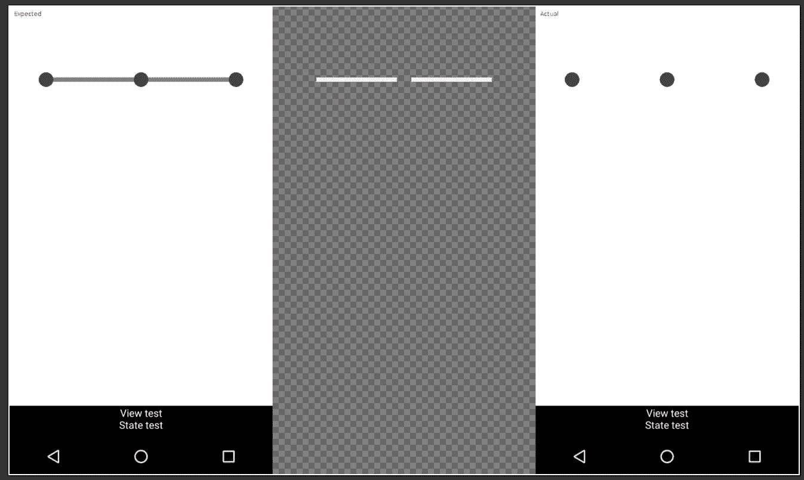
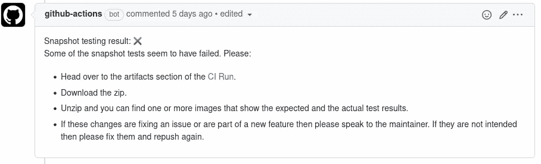
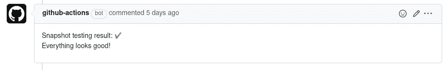

# 用狗仔队理智地测试你的 Android 用户界面库

> 原文：<https://betterprogramming.pub/sanely-test-your-android-ui-libraries-with-paparazzi-b6d46c55f6b0>

## 使用快照测试为 Android UI 库创建适当的验证流程


由[毛罗·吉利](https://unsplash.com/@maurogigliphoto?utm_source=medium&utm_medium=referral)在 [Unsplash](https://unsplash.com?utm_source=medium&utm_medium=referral) 拍摄的照片

测试应该是开发人员在编写(或试图编写)可发布代码时考虑的最重要的事情。

不管它有多重要，测试有时本质上是困难的。

在 Android UI 库上尤其如此，像单元测试或 UI 测试(使用 Espressο，UiAutomator)这样的事情开始变得不那么有意义。

# 我的使用案例

我必须解决的问题是试图测试我的库 StageStepBar。

它本质上是一个进度条，可以包含阶段(里程碑)和它们之间的单个步骤。它也是非常可配置的，有效地允许您改变其所有组件的外观和行为。这确实是一个大的定制视图，它的大部分代码都在它的`onDraw`中。

一切看起来都很好，直到我意识到在改变东西后测试它的方式非常麻烦。幸运的是，我包含了一个示例应用程序，但是我必须修改、构建和运行应用程序，以检查我的更改是否以正确的方式影响了库。但即使是这一过程也不够可靠，因为:

*   有时候我会忘记重新测试一些病例。
*   其他时候，我不会测试一些看似不相关，但会受到“神秘”影响的案例。
*   整件事仍然和一个装置有关。不同的会怎么样？RTL 地区？这个清单还可以继续下去…

# 进入快照测试

在参加 Droidcon 2021 @ London 的时候，我接触到了 Android 世界中的另一种测试方式——快照测试。[下面好好聊聊这个话题](https://www.droidcon.com/2021/11/17/an-introduction-to-effective-snapshot-testing-on-android-2/)。

它的要旨是:

*   你拍了一堆你 UI 的截图和/或视频。
*   如果你对它们感到满意，你就把它们作为黄金价值/真理的来源储存在你的回购协议中。
*   如果进行了任何更改，验证算法(通常是逐像素比较)会在您的代码中运行，并将黄金值与新的屏幕截图进行比较。
*   如果这些更改是预期/期望的，屏幕截图将被替换。否则，代码会破坏一些它不应该破坏的东西。

这似乎正是我的用例的正确方法。然而，在那次活动中展示的一个名为“狗仔队”的特定图书馆实际上让我确信它是。

# 什么是狗仔队

这是另一个快照测试库，但与其他当前可用的解决方案(例如，参见 [Shot](https://github.com/pedrovgs/Shot) )的区别在于，它完全在 JVM 上运行，不需要设备或仿真器。

[这个来自同一 Droidcon 的演讲更详细地介绍了它是如何工作的。](https://www.droidcon.com/2021/11/17/keeping-your-pixels-perfect-paparazzi-1-0-2/)

[https://github.com/cashapp/paparazzi](https://github.com/cashapp/paparazzi)

这对于我的用例来说非常方便，因为这意味着我可以使用 Github Actions 为我和任何未来的贡献者创建一种方式来快速获得关于他们的更改是否破坏了某些东西的反馈。

值得注意的是，在撰写本文时(2022 年 2 月 12 日)，该库还不稳定。完整的文档还没有完全准备好，看起来还在进行中。因此，你在这里看到的可能在几个月后就不一样了。在我再次写作的时候，还没有 Compose 支持。

因此，在排除了所有这些障碍之后，下面是我遵循的完整过程:

# **写作测试(记录过程)**

首先，我创建了一个简单的库模块。本模块:

*   取决于`StageStepBar`模块(即被测模块)。
*   应用了狗仔队插件。这为它提供了记录，并验证了我们稍后将使用的 Gradle 任务。
*   包含`src/test`和`src/test/snapshots`下的测试和黄金值(截图)。

我们可以编写的测试示例如下:

实际上，我们有一个布局文件，其中包含我们想要测试的视图。狗仔队使用`paparazzi.inflate()`用它的特殊上下文来夸大它。

然后，我们可以访问该视图，并让它达到我们希望它在每个特定测试用例中所处的状态。

然后调用`paparazzi.snapshot()`印章的交易，因为它将渲染到截图文件中我们已经设置的一切的第一帧。如果我们想要的不仅仅是一个帧(比如我们正在测试动画)，那么我们可以使用方便的`paparazzi.gif()`方法。在该模块上运行`gradle module-name:testDebug`后的结果是这两张截图:



所有这些快照文件现在都在`build/`文件夹中。如果我们对一切都满意，我们就可以运行:

```
gradle module-name:recordPaparazziDebug
```

这将把这些文件放在`src/test/snapshots`下，从而使它们可以用 git 签入。现在我们的真理之源已经被创造出来了！

**注:**值得注意的是，狗仔队作者强烈推荐使用 LFS 来处理这些文件。随着截屏在未来的变化，git 的历史也将充满这些二进制 blobs。LFS 使得保存指向另一个服务器上的远程文件的指针成为可能，使整个过程对你来说更容易和更快。狗仔队和 Github 文档都包含设置指南。

# 针对代码变更进行测试(验证过程)

在所有这些都被推到回购之后，是时候考虑从现在开始如何执行这些事情了。为此，我创建了一个 GitHub actions 工作流，它将为每个公开的 PR 推送:

*   运行`gradle module-name:verifyPaparazziDebug`任务，将 PR 代码输出的截图与黄金值进行比较。
*   如果任何一个测试失败，那么带有预期/实际截图的图像以及它们的增量将作为工件上传到该运行中(每个测试失败)。它还将在 PR 上放置一个注释，将开发人员指向工件部分，以便他们可以研究错误。德尔塔是我们从图书馆得到的非常好的额外资料。这是它的样子:



显示单个测试的实际/预期/增量的图像(由狗仔队创建)



快照测试**失败**时 CI 发出的 PR 消息

*   如果所有测试都通过了，那么在 PR 上就会发布一条快乐的消息。



快照测试**成功**时 CI 发出的 PR 消息

完整的 CI 工作流如下所示:

但是如果想要改变会发生什么呢？在这种情况下，评审者(在这种情况下是我)可以批准 PR，并要求作者对他们的代码运行记录任务，并推送结果快照。

最后，当 PR 合并到主分支时，黄金值将被更新。

# 最后的想法

我真的相信狗仔队的快照测试可以成为一种特别有效的方式，为之前很难测试的 Android UI 库创建一个适当的验证过程。它直接在 JVM 上运行的事实意味着没有仿真器/设备设置，执行速度快，并且更容易与 CI 集成。

对正在开发这个伟大的库的人们的巨大支持，我只是在使用它！

我很想知道你们这些人是怎么想的！