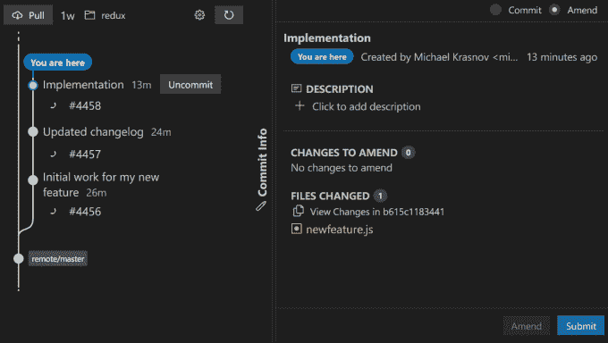

# 元数据下的树苗:新版版本控制系统述评

> 原文：<https://betterprogramming.pub/sapling-by-meta-a-review-of-the-new-version-control-system-42520e61473c>

## 建立新系统，学习如何使用它，并了解其利弊


版本控制系统是帮助开发人员跟踪和管理源代码变更的软件工具。有几种不同的版本控制系统可供使用，每种系统都有自己的特性和功能。

一些流行的版本控制系统包括 Git、Mercurial 和 Subversion。所有这些版本控制系统都旨在帮助开发人员在项目上协作，跟踪他们代码的更改，并维护他们工作的历史。在这篇文章中，我将谈论一个由 Meta-Sapling 内部开发的新球员。

# 为什么我们需要树苗？

鉴于我们已经有了 Git、Mercurial 和 Subversion 等，很难理解为什么我们还需要另一个版本控制系统。正如 Meta 所说，Sapling 特别关注可用性和可伸缩性，提到通用工作流更简单，从错误中恢复更容易。此外，Meta 将 Sapling 和 Sapling Server 设计为高度可扩展，能够处理数千万个文件。

Sapling SCM(源代码管理)由三部分组成:

*   Sapling CLI 是一个命令行工具，用户使用它来克隆存储库、执行提交以及将他们的更改推送到服务器
*   Sapling Server 是一个服务器端后端应用程序，用于托管和管理存储库。
*   Sapling 虚拟文件系统，Sapling 用来加速工作流的文件系统。

截至 2022 年底，仅发布了 Sapling CLI，而 Sapling 服务器和虚拟文件系统尚未向公众提供。好消息是，您可以将 Sapling 与现有的 Git 存储库一起使用，它甚至可以与 GitHub 很好地集成！

# 如何安装树苗

要获得树苗，你可以遵循官方安装指南，可在这里获得[。为了方便起见，以下是在您的系统上安装 Sapling 的步骤:](https://sapling-scm.com/docs/introduction/installation)

**对于 macOS —** 使用以下命令从自制软件安装:

```
$ brew install sapling
```

**对于 Windows —** [下载最新版本的 ZIP](https://github.com/facebook/sapling/releases/latest) 并在 PowerShell 中运行这些命令:

```
PS> Expand-Archive NAME_OF_DOWNLOADED_ZIP 'C:\\Program Files' 
PS> setx PATH "$env:PATH;C:\\Program Files\\Sapling" -m
```

注意，要使用所有可用的特性，您还需要安装 [Git](https://git-scm.com/download/win) 和[节点](https://nodejs.org/en/download/)。

**对于 Ubuntu 22.04 —** 运行以下命令:

```
$ curl -L -O <https://github.com/facebook/sapling/releases/download/0.1.20221213-150011-h9b0acf12/sapling_0.1.20221213-150011-h9b0acf12_amd64.Ubuntu22.04.deb> 
$ sudo apt install -y ./sapling_0.1.20221213-150011-h9b0acf12_amd64.Ubuntu22.04.deb
```

**对于 Ubuntu 20.04 —** 运行以下命令:

```
$ curl -L -O <https://github.com/facebook/sapling/releases/download/0.1.20221213-150011-h9b0acf12/sapling_0.1.20221213-150011-h9b0acf12_amd64.Ubuntu20.04.deb> 
$ sudo apt install -y ./sapling_0.1.20221213-150011-h9b0acf12_amd64.Ubuntu20.04.deb
```

**对于其他 Linux —** 如果您有家酿软件，您可以安装 Sapling:

```
$ brew install sapling
```

如果你没有自制软件，你唯一的选择就是从源代码开始[构建。](https://sapling-scm.com/docs/introduction/installation#building-from-source)

# 如何种植树苗

在您的系统上安装了 Sapling 之后，您的终端应该可以使用`sl`命令。要开始使用它，您首先需要配置您的身份。它用于授权您的提交，您可以像这样设置它:

```
$ sl config --user ui.username "YOUR NAME <YOUR EMAIL>" 
# for example... 
$ sl config --user ui.username "Michael Krasnov <[email protected]>"
```

运行这个之后，sapphire 应该准备好了。但是，如果要将 Sapling 与 GitHub 配合使用，则需要为 Sapling 设置 GitHub 认证。推荐的方法是安装 GitHub CLI ( `gh`)并运行以下命令:

```
$ gh auth login --git-protocol https
```

在我看来，有两个工具来使用 GitHub repos 是一种过度的杀戮。如果您创建一个[个人访问令牌](https://docs.github.com/en/authentication/keeping-your-account-and-data-secure/creating-a-personal-access-token)并在被要求时将它交给 Sapling，您可以在没有 GitHub CLI 的情况下让它工作。

# 如何使用树苗

现在让我们通过一些基本的工作流程来感受一下在实际项目中使用 Sapling 的感觉。我在我的 GitHub 账户上创建了一个 Redux repo 的分支来玩。让我们从克隆 Github 的 repos 开始。要使用 Sapling 从 GitHub 克隆一个 repo，请运行以下命令:

```
$ sl clone <GITHUB REPO URL> 
# for example... 
$ sl clone <https://github.com/r3dm1ke/redux>
```

我们得到的输出对过去使用过 Git 的人来说很熟悉:

```
remote: Enumerating objects: 20640, done.
remote: Counting objects: 100% (7/7), done.
remote: Compressing objects: 100% (6/6), done.
remote: Total 20640 (delta 1), reused 1 (delta 1), pack-reused 20633
Receiving objects: 100% (20640/20640), 23.78 MiB | 2.27 MiB/s, done.
Resolving deltas: 100% (13183/13183), done.
From https://github.com/r3dm1ke/redux
 * [new ref]           fbfe51458ca2addf97f426d505bf2c27503a5ff1 -> remote/master
452 files updated, 0 files merged, 0 files removed, 0 files unresolved
```

现在您可以`cd`到您的克隆项目中，并通过运行`sl`命令来验证一切工作正常:

```
$ sl
@  fbfe51458  Dec 15 at 10:20  65634467+Ahmed-Hakeem  remote/master
│  change reducer type validation place (#4452)
~
```

默认情况下，`sl`命令向我们显示回购中的最后一次提交，以及您自己在堆栈中的所有提交(稍后将详细介绍)。

要在 Sapling 中查看完整的提交历史，运行`sl log`命令:

```
$ sl log
changeset:   fbfe51458ca2addf97f426d505bf2c27503a5ff1  (@)
user:        Hakeem <65634467+Ahmed-Hakeem@users.noreply.github.com>
date:        Thu, 15 Dec 2022 10:20:08 -0500
summary:     change reducer type validation place (#4452)

changeset:   a0754310222ad61bde675078963afb7fc038d5d7
user:        Mark Erikson <mark@isquaredsoftware.com>
date:        Mon, 05 Dec 2022 10:49:27 -0500
summary:     Merge pull request #4448 from jshoung/docs/remove-dead-link

changeset:   89104853174e62de8ebbca4881ea14a04399f4e2
user:        julian <julianks@gmail.com>
date:        Mon, 05 Dec 2022 10:00:58 -0500
summary:     Remove link to deleted tweet

changeset:   9be553a2c5ba04d9d769f31e25a6dc93deb334cf
user:        Mark Erikson <mark@isquaredsoftware.com>
date:        Wed, 30 Nov 2022 10:12:49 -0500
summary:     Merge pull request #4447 from mariussd/patch-1

... 
```

现在让我们看看提交和推动在 Sapling 中是如何工作的。首先，我将对项目进行更改:

```
$ echo "PS Redux is awesome" >> README.md
$ touch newfeature.js
$ echo "TODO: write new feature" >> newfeature.js
$ sl status
M README.md
? newfeature.js
```

`sl status`命令的工作方式与`git status`相同。你可以看到小树苗看到我们修改了`README.md`，创造了`newfeature.js`。`newfeature.js`旁边的问号表示我们还没有`add`它:

```
$ sl add newfeature.js
$ sl status
M README.md
A newfeature.js
```

我们可以继续并提交更改。要提交 Sapling 中的更改，请运行以下命令:

```
$ sl commit -m "Initial work for my new feature"
$ sl
  @  b6989309b  2 seconds ago  mihalKrasnov
╭─╯  Initial work for my new feature
│
o  fbfe51458  Dec 15 at 10:20  remote/master
│
~
```

您可以在图表视图中看到我们的新提交。为了向您展示更多的特性，让我们继续添加更多的提交:

```
$ echo "Developed new exiting feature!" >> CHANGELOG.md
$ sl commit -m "Updated changelog"
$ echo "const feature = () => console.log('abacaba')" >> newfeature.js
$ sl commit -m "Feature implementation"
$ sl
  @  8c9eb0035  1 second ago  mihalKrasnov
  │  Feature implementation
  │
  o  e445f1379  87 seconds ago  mihalKrasnov
  │  Updated changelog
  │
  o  b6989309b  3 minutes ago  mihalKrasnov
╭─╯  Initial work for my new feature
│
o  fbfe51458  Dec 15 at 10:20  remote/master
│
~
```

现在，您可以在堆栈中看到 3 个提交。注意，最近的提交用`@`标记。您可以使用命令`sl prev`和`sl next`在堆栈中移动:

```
$ sl prev
1 files updated, 0 files merged, 0 files removed, 0 files unresolved
[e445f1] Updated changelog

$ sl
  o  8c9eb0035  4 minutes ago  mihalKrasnov
  │  Feature implementation
  │
  @  e445f1379  5 minutes ago  mihalKrasnov
  │  Updated changelog # NOTICE THAT @ IS NOW HERE
  │
  o  b6989309b  7 minutes ago  mihalKrasnov
╭─╯  Initial work for my new feature
│
o  fbfe51458  Dec 15 at 10:20  remote/master
│
~

$ sl prev
1 files updated, 0 files merged, 0 files removed, 0 files unresolved

$ sl
  o  8c9eb0035  4 minutes ago  mihalKrasnov
  │  Feature implementation
  │
  o  e445f1379  5 minutes ago  mihalKrasnov
  │  Updated changelog
  │
  @  b6989309b  7 minutes ago  mihalKrasnov
╭─╯  Initial work for my new feature # AND NOW HERE
│
o  fbfe51458  Dec 15 at 10:20  remote/master
│
~

$ sl next 2
2 files updated, 0 files merged, 0 files removed, 0 files unresolved
[8c9eb0] Feature implementation

$ sl
  @  8c9eb0035  4 minutes ago  mihalKrasnov
  │  Feature implementation # AND BACK UP
  │
  o  e445f1379  5 minutes ago  mihalKrasnov
  │  Updated changelog
  │
  o  b6989309b  7 minutes ago  mihalKrasnov
╭─╯  Initial work for my new feature
│
o  fbfe51458  Dec 15 at 10:20  remote/master
│
~
```

现在，假设我对我的特性的实现不满意，并且想要撤销我的最后一次提交。要撤销您在 Sapling 中的最后一次提交，请运行以下命令:`sl uncommit`:

```
$ sl uncommit
$ sl
 # FIRST COMMIT GONE!
  @  e445f1379  9 minutes ago  mihalKrasnov
  │  Updated changelog
  │
  o  b6989309b  11 minutes ago  mihalKrasnov
╭─╯  Initial work for my new feature
│
o  fbfe51458  Dec 15 at 10:20  remote/master
│
~
$ sl status
M newfeature.js # CHANGES ARE UNTOUCHED
```

最后，在修复了最后一个更改之后，我们想要推送我们的更改并打开一个拉取请求。由于 Sapling 集成了 GitHub，这非常容易:只需运行这个命令来推送并打开一个拉取请求:`sl pr`

```
$ sl pr
pushing 3 to https://github.com/r3dm1ke/redux
created new pull request: https://github.com/r3dm1ke/redux/pull/1
created new pull request: https://github.com/r3dm1ke/redux/pull/2
created new pull request: https://github.com/r3dm1ke/redux/pull/3
```

您可以看到 Sapling 创建了 3 个拉请求，每个提交一个。这似乎违反直觉，是彻头彻尾的犯罪，尤其是在使用 GitHub 的时候。事实上，这意味着与 ReviewStack 一起使用，review stack 是一个用于浏览 Meta 发出的 GitHub pull 请求的 UI。你可以在这里了解更多信息[。](https://sapling-scm.com/docs/addons/reviewstack/)

一个更有用的功能是从命令行查看 PR 状态。打开您的拉动请求后，运行`sl ssl`以获取它们的状态:

```
$ sl ssl
  @  b615c1183  7 minutes ago  mihalKrasnov  #4458 Closed ✓
  │  Implementation
  │
  o  e445f1379  17 minutes ago  mihalKrasnov  #4457 Closed ✓
  │  Updated changelog
  │
  o  b6989309b  19 minutes ago  mihalKrasnov  #4456 Closed ✓
╭─╯  Initial work for my new feature
│
o  fbfe51458  Dec 15 at 10:20  remote/master
│
~
```

# 如何使用 Sapling UI

Sapling 不是一个纯粹的 CLI 程序，但它也附带了一个 GUI。使用 GUI 进行版本控制可能比命令行界面更加用户友好和易于使用，并且可以提供可视化功能，例如分支和提交历史的图形表示。然而，GUI 应用程序可能比 CLI 更慢，可定制性更差。

要打开 Sapling 的 GUI，运行这个命令:`sl web`

```
$ sl web
started a new server

access Sapling Web with this link:
http://localhost:3011/?token=
```

如果您打开此 URL，您将看到用户界面:



使用这个 UI，您可以查看提交历史、打开 PRs、diffs、执行修改和提交，以及与服务器同步更改。然而，我并没有发现它特别有用，并将继续使用 GitKraken 来处理 GUI 的所有事情。

# 与 Git 的主要区别

Sapling 是一个版本控制系统，它与 Git 有许多共同的特征，例如分布式、使用散列寻址提交、具有称为“书签”的分支，以及类似的工作流，包括克隆、拉取、推送、提交和 rebase。然而，这两个系统之间也有一些显著的差异。

*   **不需要本地分支:**在 Git 中，您的存储库是由本地分支的存在来定义的，您需要在本地分支上工作。相比之下，如果你愿意，Sapling 允许你使用本地书签(相当于 Git 分支)，但是它们不是必须的。相反，您可以简单地通过哈希值引用您的提交，这些哈希值在“smartlog”显示中可见。
*   部分下载:当您从 Git 中的存储库克隆或提取数据时，通常会检索所有新数据。在 Sapling 中，克隆或拉取将只获取存储库的主要分支，根据需要获取其他分支。
*   **撤销功能:**这个功能肯定会受到社区的喜爱。Sapling 提供了专用的“取消提交”、“取消修改”、“取消隐藏”和“撤销”命令，用于撤销常见的操作，而“撤销-i”命令允许您在应用之前预览多个撤销的效果。
*   **没有临时区域:** Git 要求您在提交变更之前将变更添加到临时区域，但是 Sapling 没有临时区域。如果您只想提交或修改您的部分更改，您可以使用一个交互式选项来选择特定的更改，或者创建一个临时提交并修改它，然后将其合并到真正的提交中。
*   内置 UI:对于那些不喜欢使用 CLI 的人来说，这将是一个受欢迎的特性

# 利弊

在使用 Sapling 一段时间后，我想以我个人的利弊列表来结束我的发言。值得注意的是，这些只是一些潜在的优点和缺点，使用 Sapling 的实际好处和缺点将取决于您的具体需求和用例。

## **优点**

*   在使用 Git 多年后，Sapling 确实感觉像是一股清新的空气。工作流(至少我使用的那些)看起来更简单，Sapling 感觉更快，命令更直观
*   撤销命令是救命稻草，当我知道撤销一切是多么容易时，我对在 Sapling 中使用高级 VCS 功能更有信心了

## **缺点**

*   缺少分支对我来说似乎是违反直觉的。当很多人在一个回购协议上工作时，很容易看到所有的分支并在它们之间切换，并将其他更改转移到您的分支上。也许这将随着经验而来，但是现在，我更喜欢 Git 的分支而不是 Sapling 的书签
*   每次提交一个 PR:虽然这在使用 Sapling Server 或 ReviewStack 时可能有意义，但在普通 GitHub 中没有用
*   Sapling 仍处于早期开发阶段，因此它缺少 Git 所具有的许多特性，例如 Git 挂钩(客户端和服务器端)、社区支持、工具和 ui。

我还不会从 Git 转换到 Sapling，但这非常令人兴奋，我很高兴在 VCS 世界有一些竞争。我也将急切地等待 Sapling 服务器和虚拟文件系统的发布，并提交我对它们的评论。