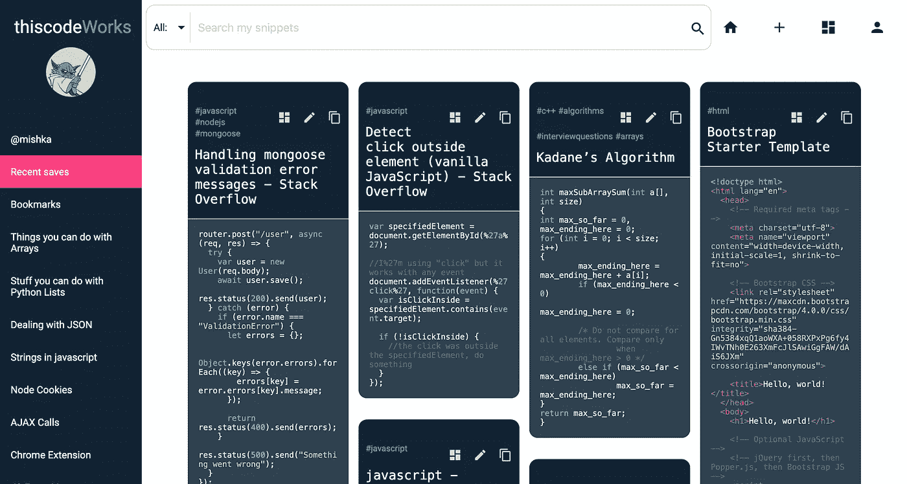
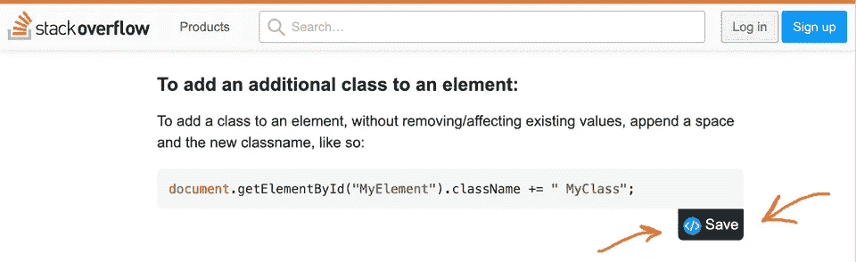
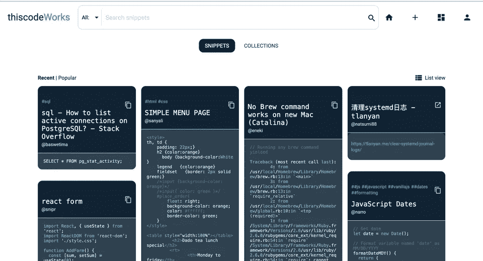

# 用 thiscodeWorks 保存更好的代码片段

> 原文：<https://betterprogramming.pub/save-better-code-snippets-with-thiscodeworks-dc28efaca9a4>

## 您期待已久的代码片段管理器

图片来源:作者

*如果你想直奔主题，保存代码片段的最佳工具是***。**

*大约两年前，当我学习编码时，我花了太多的时间在谷歌上搜索代码片段，花了太多的时间在笔记本上写下这些代码片段。*

*为什么不用你说的 notes app？我试过了。我做到了。但是他们会消失。就像我的笔记一样，我的片段会被埋没，消失在保存在顶部的新片段下面。我喜欢写它们是因为我可以翻阅几页，直观地搜索我的片段。有一半的时间我甚至不记得我给一个片段起了什么标题/名字，所以搜索栏从来就不方便。我必须见到他们。*

*但是随着我继续编码，页面不断增长，这显然不是一个好的解决方案。更不用说我每次需要的时候都必须手动输入代码片段。*

*因此，当我发现代码的超能力，知道我可以用代码解决几乎任何问题时，我立即知道我需要构建什么:一个保存和组织代码片段的工具。*

*我没想到的是，其他人也开始使用它，并像我一样热爱它。我发现了一个不可思议的用户群体(或者说是他们发现了我)，他们不断地分享建议和反馈，使得这个应用程序比我想象的要好得多。*

*在 thiscodeWorks 社区的帮助下，这里有五种方法可以让它成为在线保存代码片段的最佳工具。*

# *1.代码片段不会消失*

*眼不见心不烦。这是大多数 notes 应用程序的问题。你的笔记被埋在一个列表中，让你只记得你最近保存的笔记，因为它们是你打开应用程序时看到的第一件事。这不仅仅是记住要搜索的确切术语，甚至是记住你首先保存了那些片段。*

*代码片段在这个 codeWorks 中的保存方式就像一块木板——想想 Pinterest。当您访问您的仪表板时，您可以直接看到您保存的所有片段，甚至可以按语言、标签或收藏过滤它们，以使扫描更容易。*

# *2.无需键入或复制/粘贴来保存片段*

*在我继续编码的过程中，有一件事我一直很欣赏，那就是节省时间。有时候，你对编程如此深入，以至于你甚至没有时间将你在 Stack Overflow 上找到的一个片段复制并粘贴到你的 notes 应用程序中。然后当你再次需要它时，你又回到谷歌上的兔子洞，追踪紫色的链接。*

*一位用户建议使用一个类似于 Pinterest 徽章的按钮，你通常会在网上的图片上看到这个按钮。他说，“一个保存你在网上看到的代码片段的按钮怎么样？”所以[我构建了一个 Chrome 扩展](https://chrome.google.com/webstore/detail/save-code/annlhfjgbkfmbbejkbdpgbmpbcjnehbb),为你在网上看到的任何代码片段添加一个保存按钮。当你点击它时，它会自动保存网页的代码片段和网址，它的功能，甚至语言。只需一次点击！*

**

# *3.上下文信息*

*这让我想到了上下文信息。通常当你发现一个对你有用的片段时，会有很多额外的信息使它变得有用，这就是为什么我从来没有得到过 GitHub gists。它只允许您保存代码片段和标题。*

*在 thiscodeWorks 上，除了代码片段本身，您还可以保存:*

*   *你找到它的网址*
*   *一些描述性的文字，关于它在哪里为你工作或者解释它*
*   *标签*
*   *将它组织成集合*

# *4.代码的 Pinterest*

*构建这个 codeWorks 的一个有趣的结果是它如何变成了代码的 Pinterest:一个不仅可以保存和组织你的代码片段，还可以浏览其他人的集合的地方。就像 Pinterest 一样——只不过是为了代码。*

*看到其他程序员在主页上发布的内容以及搜索最近在社区中为其他人工作的片段总是很有趣的。通过收藏，你可以发现你从来不知道要搜索的代码，打开一个全新的可能性世界。*

**我正致力于根据你的语言偏好和你关注的人建立一个个性化的订阅源。敬请关注。**

**

# *5.与其他平台的集成*

*随着社区中的编码员从“你好，世界！”对于软件工程师和编程博主来说，共享代码的需求和保存代码的需求一样多。因此，我们正致力于与其他平台的集成。*

*最令人兴奋的是，你可以[将保存在这个 codeWorks 上的代码片段嵌入到 Medium、](https://medium.com/@thiscodeworks.com/how-to-embed-code-snippets-on-medium-wordpress-more-efaf3280f579) WordPress 和其他一系列博客平台上，只需粘贴链接即可。看起来是这样的:*

# *资源*

*   *[www.thiscodeWorks.com](http://www.thiscodeworks.com)*
*   *[保存代码 Chrome 扩展](https://www.thiscodeworks.com/extension/chrome)*