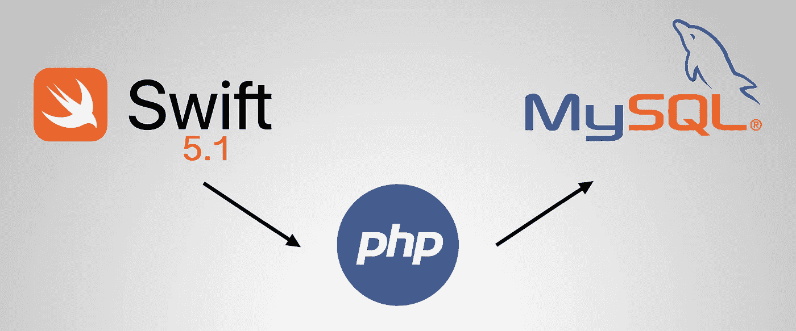
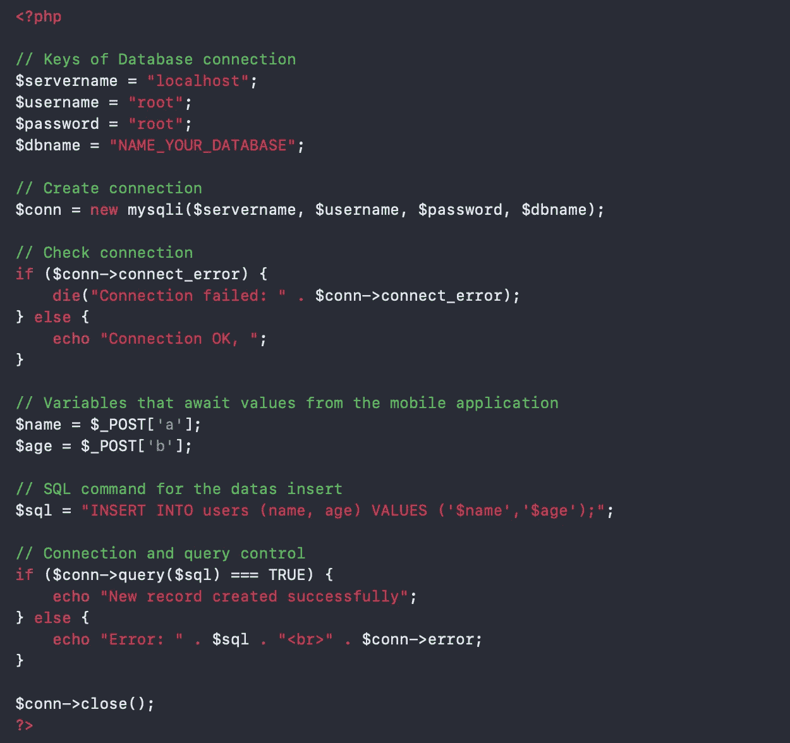
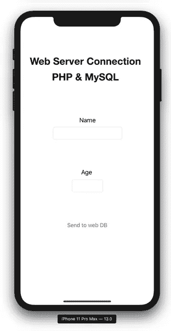
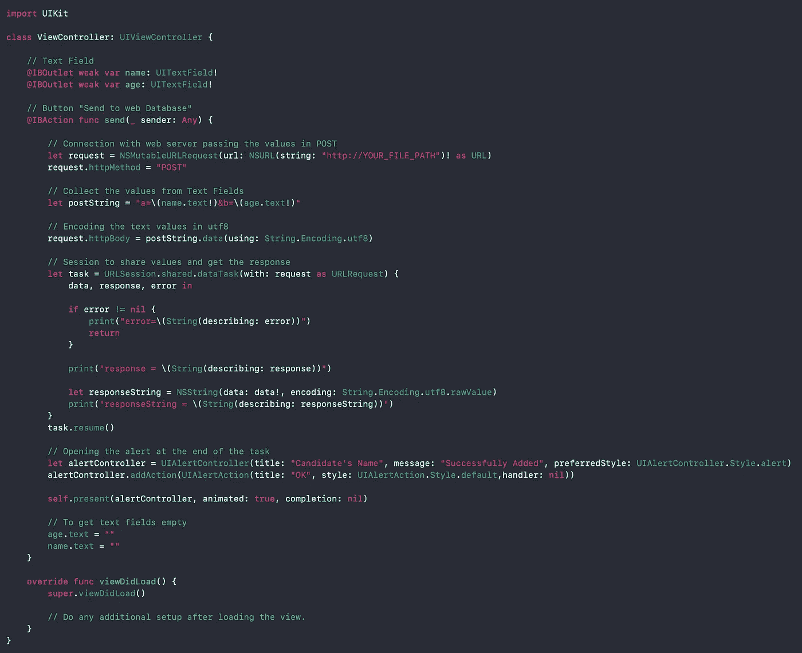
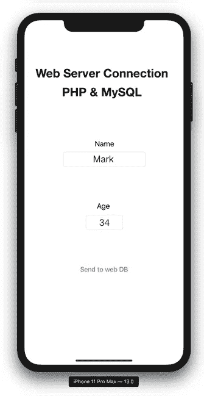
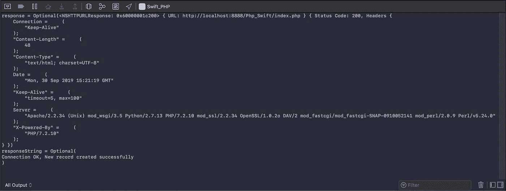
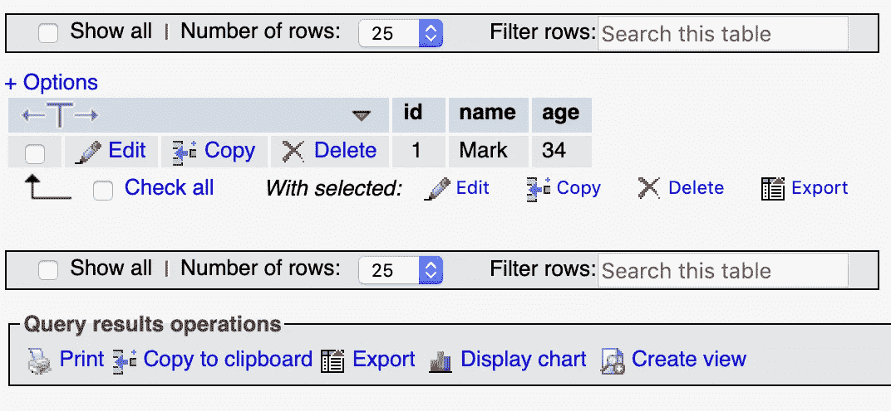

# 从 iOS 应用程序将数据存储在 Web 服务器上

> 原文：<https://betterprogramming.pub/save-data-on-a-web-server-from-an-ios-application-d1d35196f65b>

## 一个使用 PHP、MySQL 和 MAMP 的例子

有时我们正在进行的 iOS 项目会看到 web 平台的移动版本的构建，在那里我们会找到注册、登录或任何其他模块。

这些平台的任务是将相关数据保存在数据库中，并使用 web 语言构建，例如，逻辑部分使用 **PHP、** Python、C #、JS，存档部分使用 **MySQL** 、SQL、MongoDB、PostgreSQL。

在这种情况下，我们将介绍两个广泛使用的应用， **PHP** 和 **MySQL** 。

> 我想提醒你，在这个解释中，我假设你已经了解了 MySQL。

**注意**:我们将使用 **MAMP，**一个开发环境，它提供了一些工具，比如 **phpMyAdmin** ，允许我们管理我们的数据库。

# 让我们开始游戏吧

现在，您的任务将是在 web 或本地机器上连接 PHP 脚本。

本例中使用的 PHP 脚本非常简单，可以看到接下来的步骤:

1.  服务器访问，声明其凭证(主机、用户、密码)
2.  获取并检查连接。
3.  生成两个变量。(它们的值将通过 iOS 应用程序中的一个模块传递。)
4.  声明用于保存到 MySQL 数据库的插入查询
5.  查询检查
6.  关闭连接。

就像这个屏幕:

干得好！现在我们来看看 **iOS 部分**。

这部分也很简单。

打开 **Main.storyboard** ，创建两个**文本字段**和一个**按钮**，如下图所示。

这些字段必须包含在 **ViewController.swift** 中，因为您将需要它们来收集相关的值，并且按钮将用于将这些值发送到数据库。

> ***每一步都将在主按钮*** 中执行

您将首先连接到 web 上的 PHP 文件( **URL 请求函数**)。然后您将收集这些值，并最终与 PHP 文件共享它们。

> ***为了让这个演示更加令人愉快，你可以添加一个警告控制器来指示文本字段的插入和清空，如本例所示。***

现在，是模拟器运行应用程序的时候了。

如果一切顺利，您可以测试应用程序并查看 Xcode 输出的正确结果。

在文本字段中写入和保存值。

精彩！一切都很顺利，但是检查您的本地机器，看看相关数据是否存在于数据库中。

**恭喜你！现在您可以将数据保存到 web 服务器上的数据库中。**

# 结论

这是一个使用 web 服务器并将数据保存在远程数据库中的简单示例。

我决定使用 **PHP** 、 **MySQL** 和 **MAMP** 来模拟一个真实的 web 服务器，因为它们是最常用的，但是如果你愿意，你可以使用任何其他语言和开发环境。

您可以通过查看 GitHub 上的示例项目:[https://github.com/OryDS/Swift_PHP_MySQL](https://github.com/OryDS/Swift_PHP_MySQL)来了解关于这个主题的更多信息。