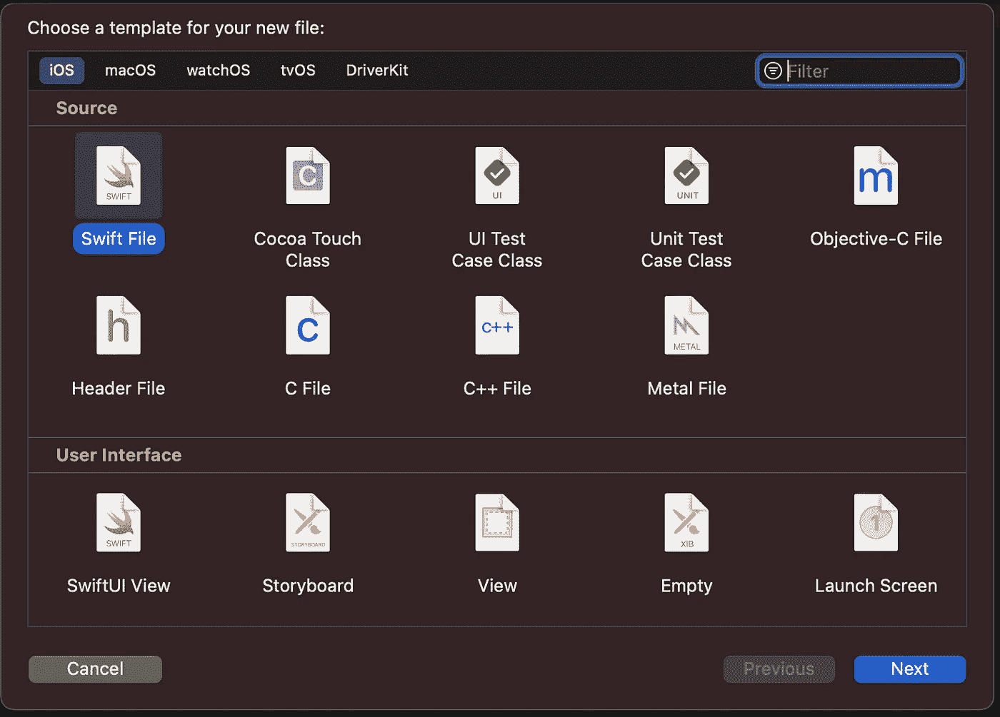
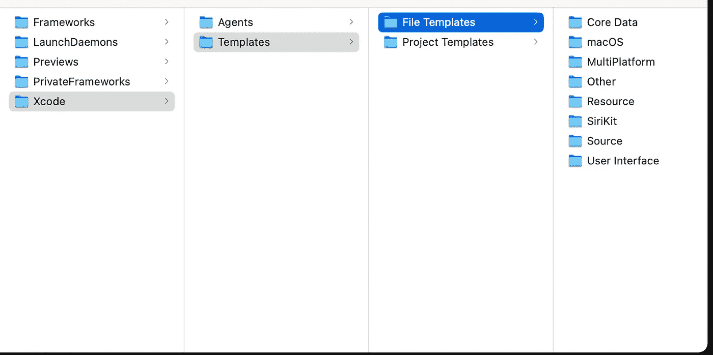
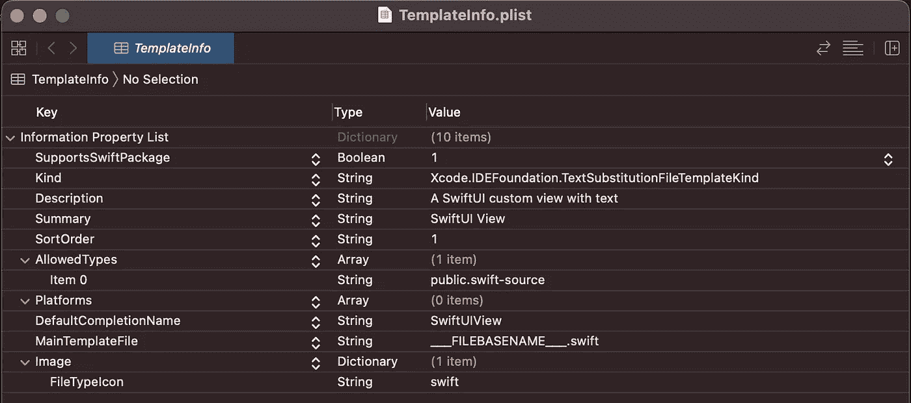
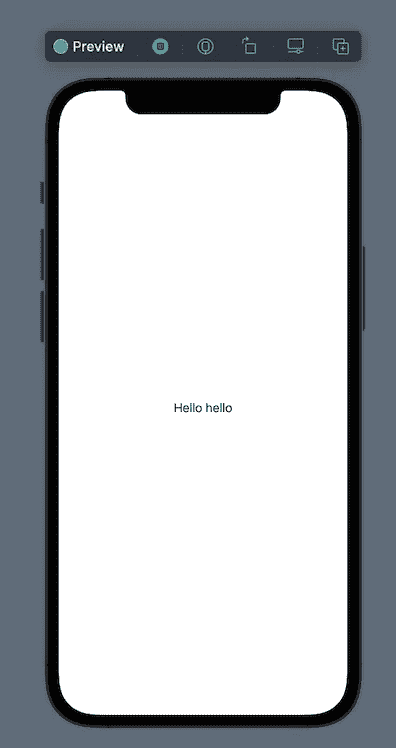
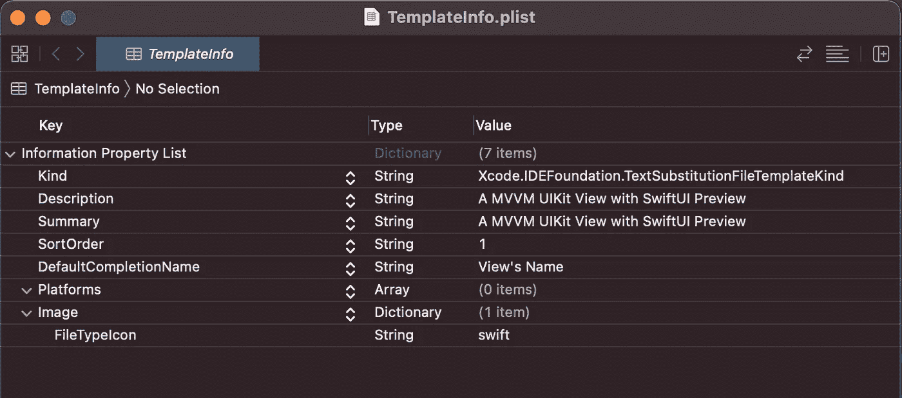
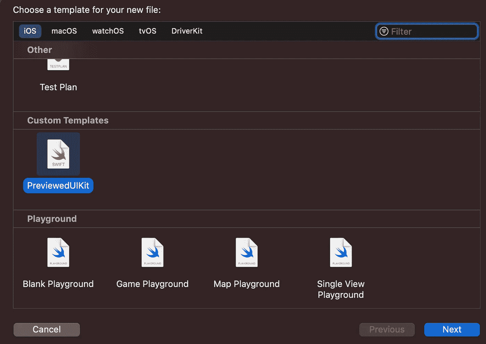

# 使用 Xcode 模板节省开发时间

> 原文：<https://betterprogramming.pub/save-development-time-by-using-xcode-templates-92b8c620fff6>

## 如何在 Xcode 中为自己和团队创建自定模板


[Zan](https://unsplash.com/@zanilic?utm_source=medium&utm_medium=referral) 在 [Unsplash](https://unsplash.com?utm_source=medium&utm_medium=referral) 上的照片。

每当一个团队成长时，它决定采用特定的架构和特定的模式。它可以使用 [MVVM](https://en.wikipedia.org/wiki/Model%E2%80%93view%E2%80%93viewmodel) 或[蝰蛇](https://www.objc.io/issues/13-architecture/viper/)。它可以使用 UIKit 或 SwiftUI。它可以使用[面向协议的编程](https://www.hackingwithswift.com/sixty/9/5/protocol-oriented-programming)或[协议见证方法](https://riccardocipolleschi.medium.com/stop-using-protocols-cd63744a3261)。许多这些模式需要一些样板文件，我们从来不喜欢写。

任何 Xcode 开发者都非常熟悉“新文件”屏幕，可以通过输入⌘+N.来调用它



Xcode 13.0 中的新文件屏幕

该对话框为某些文件类型提供了不同的模板。其中一些模板只是空文件。“Swfit 文件”出现了一些标题，一个`import Foundation`语句，就是这样。其他人已经有了几行可以进一步定制的代码。

很多 iOS 开发者不知道我们可以自己创建模板。我们甚至可以用不同的文件创建文件夹。在 MVVM 应用程序中，我们可以自动创建整个`View`、`ViewController`、`Model`和`ViewModel`样板文件。

# 模板在哪里？

模板是带有一些特定占位符、宏和配置的源文件，Xcode 在启动时会读取这些文件。为了创建我们自己的模板，我们需要知道 Xcode 将从哪个文件夹中读取它们。

任何 Xcode 安装都自带包含所有模板的`Templates`文件夹。对于默认安装，文件夹是:

```
/Applications/Xcode.app/Contents/Developer/Library/Xcode/Templates
```

如果您在这个路径上运行`open`,您应该会看到类似这样的内容:



默认 Xcode 模板。我深入到文件模板以获取更多信息。

如果默认路径中没有安装 Xcode，您可以通过导航到`Xcode.app`包，然后沿着`/Contents/Developer/Library/Xcode/Templates`路径找到相同的目录。

例如，我安装了不同版本的 Xcode，Xcode 13.0 `Templates`文件夹的路径如下:

```
/Applications/**Xcode-beta.app**/Contents/Developer/Library/Xcode/Templates
```

# 模板是用什么做的？

从这个位置，我们可以探索 Xcode 提供的所有标准模板。这是一个开始研究它们和学习我们能做什么的好地方。例如，我们可以深入到`/File Templates/Multiplatform/User Interface/`路径，看看`SwiftUI View`模板是如何工作的。


甚至在打开 Swift 文件之前，我们就可以推断出一些规则:

1.  模板的所有文件被分组到一个扩展名为`.xctemplate`的文件夹中
2.  Swift 文件有一个古怪的名字:`___FILEBASENAME___.swift`。
3.  有一个配置文件叫`TemplateInfo.plist`。

如果我们打开 Swift 文件，我们可以看到它的代码:

在这个文件中，有两种占位符。有以`___`(三个下划线字符)开始和结束的占位符，也有用`/*@`和`@*/`包装的占位符。

前者在创建文件时被 Xcode 替换，或者通过从对话框中请求用户输入，或者用一些预配置的值替换它们，就像`___FILEHEADER___`占位符的情况一样。

后者以经典的自动完成外观出现在项目中:它们以浅灰色突出显示，我们可以使用`TAB`按钮浏览它们。

然后，我们可以打开`TemplateInfo.plist`文件:



这个文件包含一些关于模板的元信息。它包含文件的`Kind`，文件类型(在`AllowedTypes`键中)，我们甚至可以在`Image/FileTypeIcon`字段中提供一个自定义图标。

这里最重要的属性是`MainTemplateFile`:这个属性将`TemplateInfo`映射到实际的模板。

# 我可以在哪里创建自己的模板？

既然我们知道 Xcode 将这些文件存储在哪里，我们可能会尝试直接在这些文件夹中创建自定义模板。然而，这并不是最聪明的事情:

1.  如果我们使用不同版本的 Xcode，这些模板只能被我们保存它们的版本访问。
2.  当我们用一个新的版本更新那个版本时，有一个不小的机会，文件夹将被删除并用新的版本重新创建，导致我们心爱的模板完全丢失。

为了解决这两个问题，我们可以利用系统中的另一个文件夹:

```
~/Library/Developer/Xcode
```

这个文件夹被所有 Xcode 版本用来加载我们的偏好和自定义设置。它还包含许多其他文件夹:`DerivedData`、`Products`和`UserData`、**、**(包含我们在 Xcode 中定制的所有代码片段和按键绑定)。

*注意:你这里可能还没有* `*Templates*` *文件夹。可以和第一个模板一起自己创建！*

# 如何创建模板

要创建一个模板，我的建议是使用向后的方法:

1.  找出什么可以作为有用的模板。一般来说，这是我们反复使用的东西，需要一些样板文件。
2.  编写它的非模板版本。用真实的类名、结构名和变量名创建文件。在操场或真实项目中创建它，这样您就可以测试它是否正常工作。
3.  将其转换为模板。应该是用适当的宏替换一些名称。
4.  将其移动到自定义子文件夹中的`~/Library/Developer/Xcode/Templates`文件夹。
5.  在同一个子文件夹中创建`TemplateInfo.plist`。
6.  测试一切正常。

## 确定模板的内容

我们已经列出了一些可能性:MVVM/毒蛇碎片，有`live`和`unimplemented`骨架的目击者，等等。

出于本文的考虑，我想为利用 SwiftUI 预览的 UIKit `View`创建一个模板。

## 编写非模板版本

我通常和 MVVM 一起工作，那里的`ViewModel` (VM)和`View`保存在同一个文件中。因此，第一步将是使用 UIKit 创建一个简单的 View+VM 文件:

我们创建了一个`ViewModel`，它包含一个`String`属性和一些默认代码来呈现它。我们可以立即看到有许多样板文件。每个视图都有相同的`viewModel`属性及其属性观察者，相同的`setup`、`style`和`update`方法签名，以及相同的初始化器。

*注意:这些东西中的一些可以在一个适当的基类中分解出来，而不是从* `*UIView*` *中子类化。如果可能的话，将它们分解出来并在更具体的父类中对它们进行子类化是更好的方法。*

如果我们在视图控制器中测试这个视图，我们会得到下面的结果。


第二步是实际添加 SwiftUI 预览功能。让我们将这段代码添加到文件的底部。为了简明起见，这是前一个文件末尾的扩展名。

我就不细说这是如何工作的了。几个月前我已经写了一篇关于它的文章，我建议如果你感兴趣的话可以看看。

简而言之，我们需要创建一个可以映射到 UIKit 组件的 SwiftUI 视图。这可以使用`UIViewRepresentable`协议来完成。然后，我们可以利用 SwiftUI `PreviewProvider`创建一个预览。完成后，预览面板将在 Xcode 中弹出，外观如下:



现在我们确信一切都如我们所愿。

## 将其转换为模板

在修改代码之前，有几个细节值得讨论。正如我们预期的那样，Xcode 的模板系统通过利用占位符来工作。让我们看看最常见的:

*   `___FILEHEADER___`是创建文件时 Xcode 放入每个 Swift 文件的头的占位符。
*   `___FILEBASENAME___`是一个占位符，触发 Xcode“新建文件”对话框中的附加对话框。在我们选择使用自定义模板创建新文件后，Xcode 会要求我们选择文件名。此名称取代了此标识符。
*   `___FILEBASENAMEASIDENTIFIER___`是 Xcode 用来获取`___FILEBASENAME___`值并将其用作标识符的占位符。然后我们可以添加一个后缀来描述不同的实体。例如，`___FILEBASENAMEASIDENTIFIER___ViewModel`可以用来创建一个结构，它的名字和文件的名字一样，只是加了一个`ViewModel`后缀。

通过使用这些占位符并删除当前特定于视图的部分，模板的最终代码如下所示:

## 将模板移动到自定义模板文件夹

这一步使文件对 Xcode 可用。让我们运行命令导航到正确的文件夹:

```
cd ~/Library/Developer/Xcode/
```

如果我们没有`Templates`文件夹，我们需要创建一个包含`File Templates`文件夹的文件夹。之后，让我们进入其中:

```
mkdir -p "Templates/File Templates"
cd "Templates/File Templates"
```

现在，我们需要创建一个文件夹来包含我们所有的定制模板。姑且称之为`Custom Templates`。在 Xcode 对话框中，这是一个可以包含许多模板的部分。然后，我们在其中创建`PreviewedUIKit.xctemplate`文件夹，并导航到`xctemplate`文件夹。

```
mkdir -p "Custom Templates/PreviewedUIKit.xctemplate"
cd "Custom Templates/PreviewedUIKit.xctemplate"
touch ___FILEBASENAME___.swift
touch TemplateInfo.plist
```

最后两行创建了一个空的`Swift`文件和一个空的`TemplateInfo.plist`。让我们打开`___FILEBASENAME___.swift`,将上面创建的模板粘贴进去。

## 创建`TemplateInfo.plist`

最后一步是创建`TemplateInfo.plist`文件。

我的建议是从复制粘贴默认 Xcode 模板中的一个`TemplateInfo.plist`文件开始，然后根据需要修改它。就我而言，我的`plist`的最后一个方面如下。



这里有趣的属性是:

*   `DefaultCompletionName`—Xcode 使用它来建议文件的名称。
*   `Platforms` —留空，我们将创建一个多平台模板。
*   `Image` —通过用`swift`值指定`FileTypeIcon`键，Xcode 为我们的模板使用默认的 Swift 图标。

*注意:还有许多其他属性可以用来进一步定制我们的模板。例如，我们可以在* `*TemplateInfo.plist*` *中定义一个* `*Options*` *键，这个键可以在模板中用* `*___VARIABLE_optionName___*` *占位符来访问。不幸的是，我没有找到任何关于 Xcode 模板的官方和详细的文档。*

## 测试我们的模板

最后但同样重要的是，我们需要测试我们的模板。作为第一步，我们需要关闭并重新打开 Xcode。IDE 需要刷新可用的模板来允许我们使用它们。

然后，让我们按下⌘+N 打开“新文件”对话框，并向下滚动到列表的末尾。这就是我们闪亮的新模板！



让我们选择它并给视图命名。我选了`AppSetup`。这是 Xcode 使用我们的模板自动生成的文件:

# 结论

今天，我们学习了如何在 Xcode 中创建模板。我们看到了它们是如何工作的，以及它们需要什么文件才能正常工作。

我们学习了使用哪些占位符和哪些配置来创建基本模板。

我们没有涉及如何创建包含多个文件的文件夹，或者如何使用更高级的机制，比如变量。不幸的是，我找不到任何关于如何在 Xcode 中创建模板的官方文档。目前，最好的学习方法是花一些时间探索默认的 Xcode 模板，并在 GitHub 上搜索一些开源库。只需搜索其中一个占位符，它们就会弹出来。

模板可以为您节省大量时间，甚至防止一些错误。他们也很容易分享。把整个`.xctemplate`文件夹压缩一下发给同事就行了。这样就可以解锁很多价值。你和你的团队的速度都会提高。