# 使用 Danger 节省日常代码审查的时间

> 原文：<https://betterprogramming.pub/save-time-in-daily-code-review-using-danger-336654fe0d24>

## 自动代码审查可以节省团队的时间


危险

代码评审是必不可少的，但是你不应该一次评审代码太长时间。你可能会发现自己做出了同样的评论:

*   你需要格式化代码。
*   请为该更改添加一个单元测试。
*   这个 PR 太长了。请缩短它。

诸如此类。

[危险](https://danger.systems/js/)可以解决这些问题。Danger 允许我们通过在您的 CI 期间运行来自动化常见的代码审查杂务。在本文中，我将向您展示如何使用 CI 流程在您的应用程序中设置 Danger。

# 回购示例

以下是完整代码库的链接，以供参考:

[](https://github.com/manakuro/danger-app-example) [## manakuro/danger-app-示例

### 这个项目是用 Create React App 引导的。在项目目录中，您可以运行:在…中运行应用程序

github.com](https://github.com/manakuro/danger-app-example) 

# 概观

为了测试危险，我们将按照以下步骤设置 React 应用程序和 CircleCI:

1.  创建 React 应用程序。
2.  设置 CircleCI。
3.  让危险在 CircleCI 蔓延。
4.  添加危险规则。

# 创建 React 应用

为了快速开始，我们将使用`[create-react-app](https://github.com/facebook/create-react-app)`创建一个应用程序:

```
npx create-react-app danger-app --template typescript
```

安装后，您可以运行服务器:

```
yarn dev
```

您将看到欢迎页面:

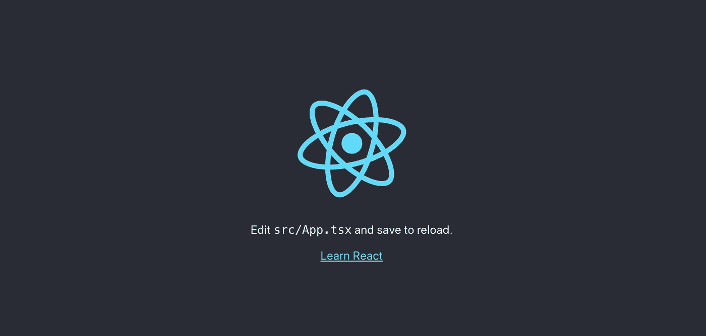

欢迎页面

# 建立 CircleCI

接下来，我们将在 CircleCI 创建一个项目。转到 [CircleCI 控制台](https://circleci.com/)并点击添加项目:

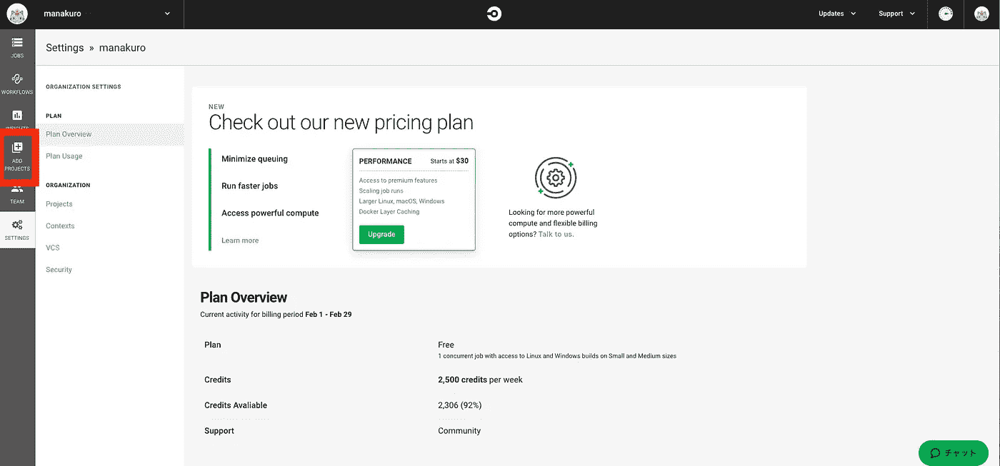

CircleCI 控制台页面

您可以在 GitHub 存储库中设置您的项目。在这一块，我们将设置`danger-app-example`:

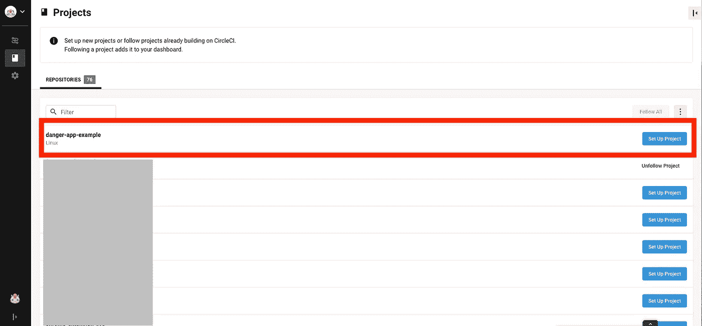

设置项目

单击开始构建:

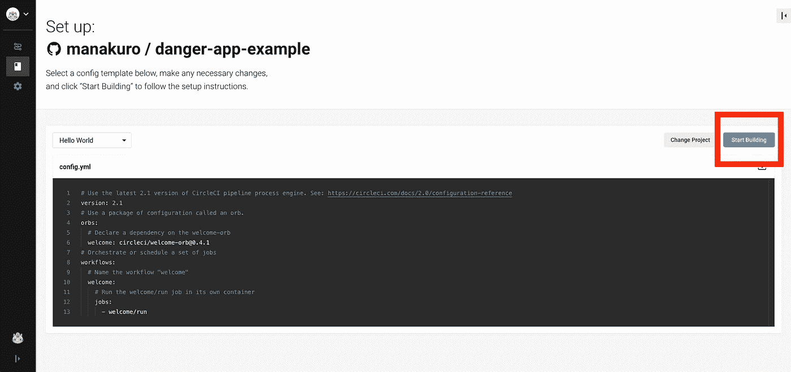

开始建造

接下来我们将添加`.circleci/config.yml`，所以点击手动添加按钮:

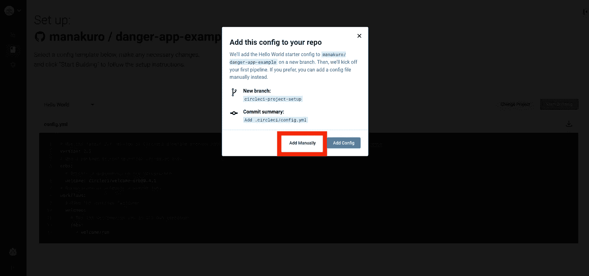

既然我们可以使用 CircleCI，我们将设置配置文件。让我们创建一个`.circleci/config.yml`:

这是一项安装节点包依赖项并进行缓存的工作。

如果您想检查配置是否有效，请在本地计算机上运行以下命令:

```
$ circleci config validateConfig file at .circleci/config.yml is valid.
```

在提交和推送之后，您可以在 CircleCI 控制台中检查流程:


CircleCI 控制台

# 让危险在 CircleCI 蔓延

Danger 提供了一个也支持 TypeScript 的 NPM 模块。

安装`danger`:

```
yarn add -D danger
```

创建一个`dangerfile.ts`:

代码将在 PR 中显示修改后的文件。

接下来，我们将为 Danger 创建一个在 GitHub 中使用的令牌。为此，请访问 GitHub 页面并点击设置:

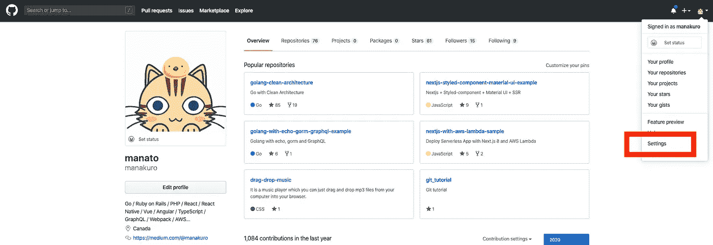

开源代码库

单击开发者设置:

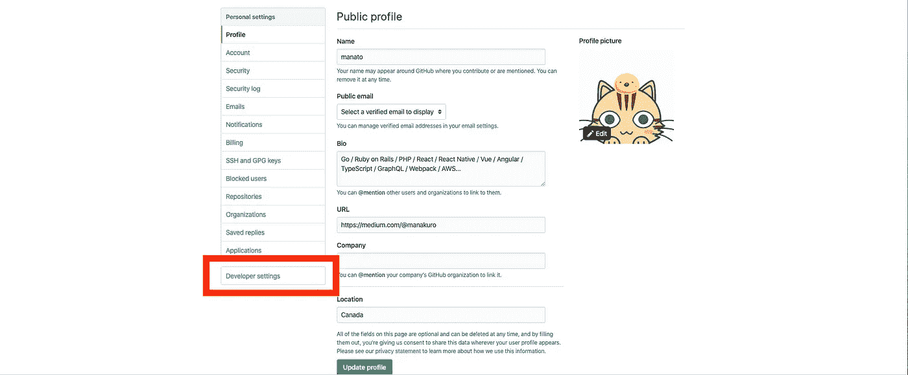

开发者设置

然后单击个人访问令牌:

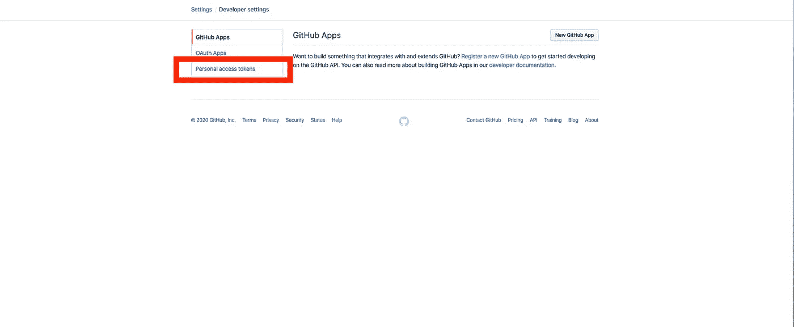

个人访问令牌

单击生成新令牌按钮:

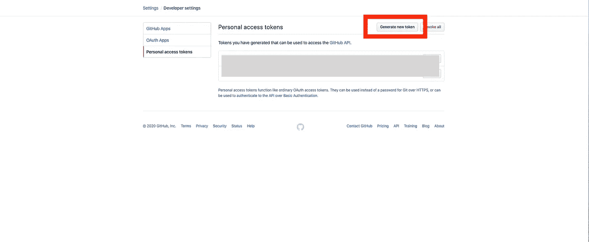

生成新令牌

您可以选择可以通过 GitHub API 访问您的信息的范围。对于危险，可以启用`repo`并生成:

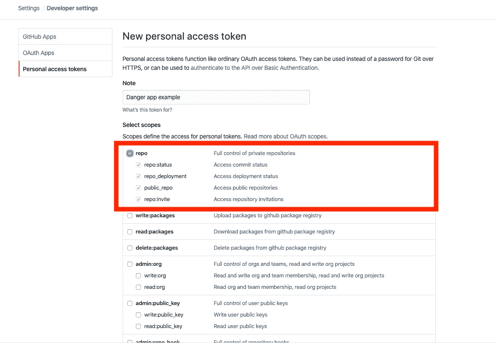

新的个人访问令牌

生成后，您可以获得列表中的令牌:

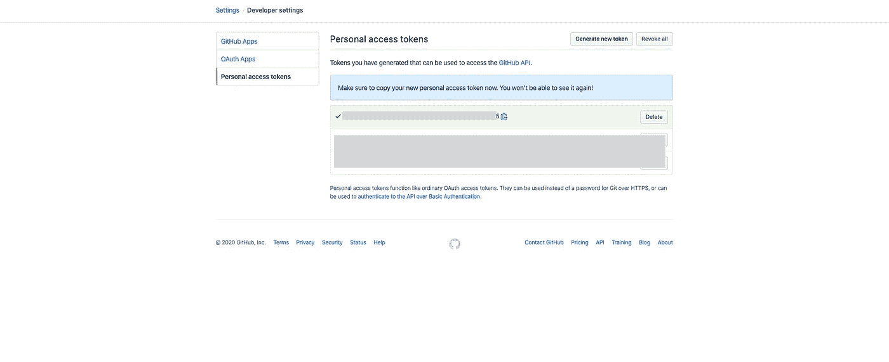

个人访问令牌

确保复制令牌并将其保存在您的笔记或其他内容中。

注意:如果你在组织的项目中，他们建议为 Danger 创建一个 bot 帐户，而不是你的帐户。

接下来，转到 CircleCI 控制台并单击环境变量:

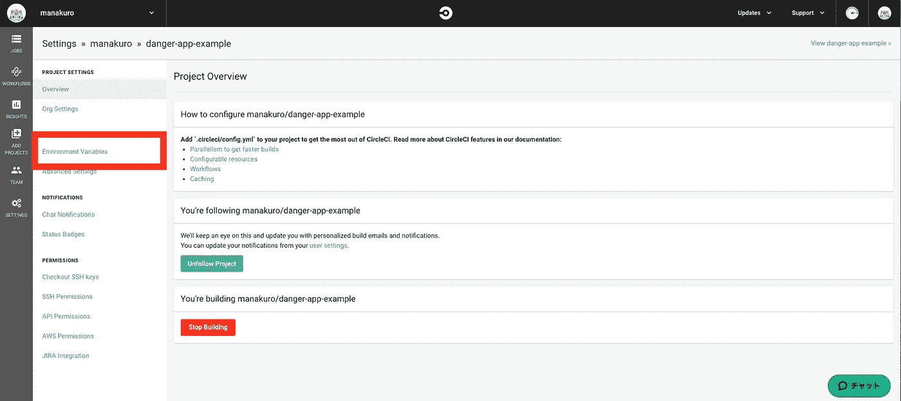

环境变量

单击添加变量并将其设置为:

*   名称:`DANGER_GITHUB_API_TOKEN`
*   价值:你在上面得到的代币

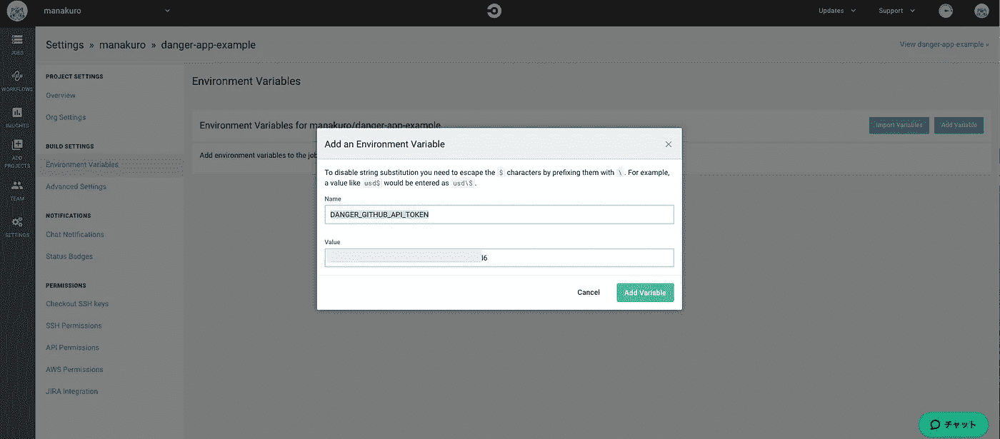

添加环境变量

现在 Danger 可以有权限访问 GitHub API 了。

接下来，为了使危险运行，我们将在`.circleci/config.yml`中添加作业:

并将`“danger:ci”: “danger ci”`添加到`package.json`:

让我们创建一些公关，看看它是如何工作的:

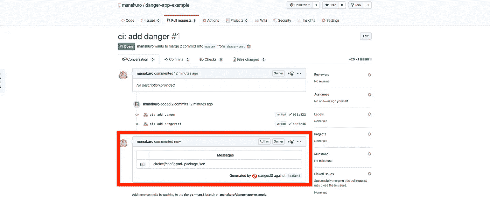

一对

你可以在你的公关评论中看到危险信息。

注意:如果您想让 Danger 在您的本地机器上运行，请运行以下命令:

```
$ DANGER_GITHUB_API_TOKEN={your personal access token} yarn danger pr {your PR url}
```

# 添加危险规则

既然我们已经在 CI 流程中设置了 Danger run，我们将添加一些在代码审查中有用的规则。

在这一块，我们将添加这些规则:

*   鼓励较小的 PRs。
*   鼓励更多的测试。
*   报告测试覆盖率。

让我们一步一步地创建它们。

## 鼓励较小的 PRs

当 PR 太长(300 阈值)时，危险会警告你。

您可以在[本 PR](https://github.com/manakuro/danger-app-example/pull/2) 中看到警告信息:

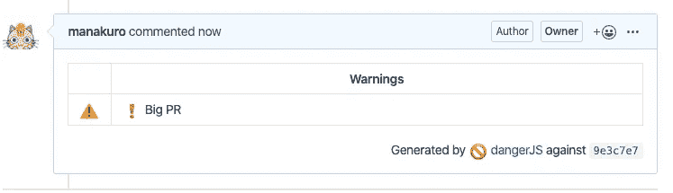

报警信息

## 鼓励更多的测试

当没有与修改或创建的文件相对应的测试文件时，危险将警告您。

让我们对`src/App.tsx`做一些修改:

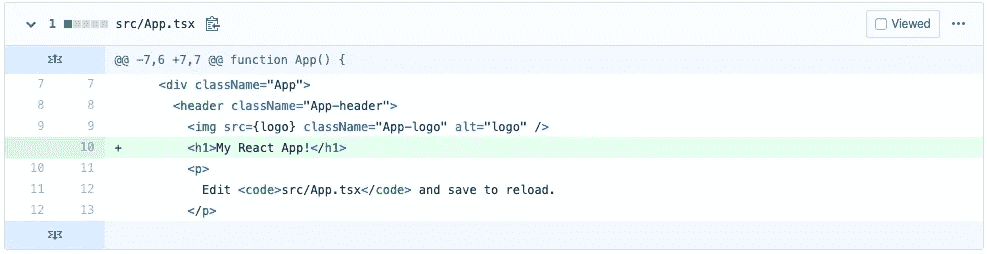

鼓励更多的测试

你会在[这个 PR](https://github.com/manakuro/danger-app-example/pull/3) 看到警告:

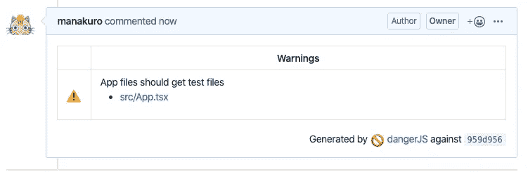

警告信息

挺有用的。如果你修改了`src/App.test.tsx`，这种情况下危险不会警告你。

## 报告测试覆盖率

为了进行危险报告测试覆盖，我们可以使用[危险插件伊斯坦布尔覆盖](https://github.com/darcy-rayner/danger-plugin-istanbul-coverage)。

安装它:

```
$ yarn add -D danger-plugin-istanbul-coverage
```

启用`dangerfile.ts`中的插件:

为了完成这项工作，我们需要在运行 Danger 之前创建覆盖文件，所以在`./circleci/config.yml`中添加`yarn test —ci —coverage —watchAll=false` :

默认情况下，Istanbul 内置于 Jest 中，因此您可以通过用`—coverage`标志触发`jest`来生成报告。

注意:需要禁用`watchAll`才能在`create-react-app`中生成覆盖率文件。

您可以在本 PR 的[中看到报告:](https://github.com/manakuro/danger-app-example/pull/4)

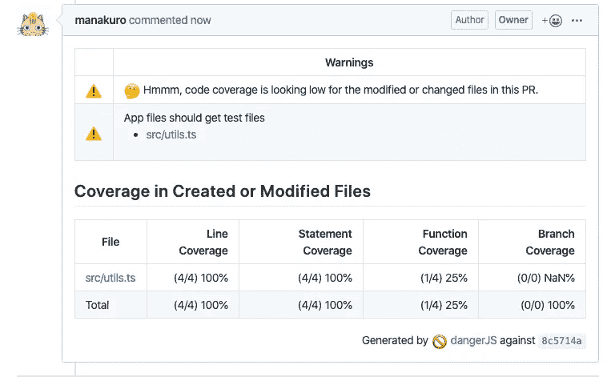

报告测试覆盖率

那是一份出色的报告！

# 结论

我们已经介绍了如何通过使用 Danger 来自动化代码审查中的常见任务。Danger 的生态系统中有很多有用的插件，所以你可以根据自己的需要定制规则。

[](https://github.com/danger/awesome-danger) [## 危险/可怕-危险

### 在你的 CI 之后，一个关于所有危险的可怕列表，自动化你的团队围绕代码的约定…

github.com](https://github.com/danger/awesome-danger) 

我希望你能从这篇文章中找到一些灵感。

以下是最终的代码库:

[](https://github.com/manakuro/danger-app-example) [## manakuro/danger-app-示例

### 这个项目是用 Create React App 引导的。在项目目录中，您可以运行:在…中运行应用程序

github.com](https://github.com/manakuro/danger-app-example)