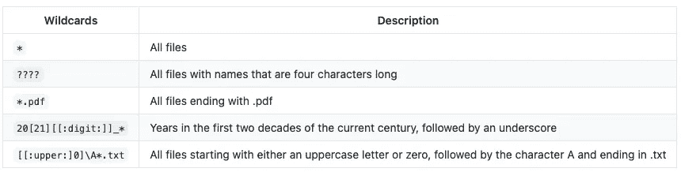

# 使用命令行节省时间:Glob 模式和通配符

> 原文：<https://betterprogramming.pub/save-time-using-the-command-line-glob-patterns-and-wildcards-17befd6a02c8>

## 使用模式匹配文件名

照片由 [CHUTTERSNAP](https://unsplash.com/@chuttersnap?utm_source=unsplash&utm_medium=referral&utm_content=creditCopyText) 在 [Unsplash](https://unsplash.com/s/photos/clock?utm_source=unsplash&utm_medium=referral&utm_content=creditCopyText) 上拍摄

现在计算机最常见的操作系统是 Windows、Linux 和 OS X，它们都配有终端——也叫 shell。Linux 和 OS X 是类似 Unix 的操作系统。因为这个系统经常被数据科学家使用，所以我将关注 Bash — ，它是一种 Unix shell [1]。那么，我们开始吧。

如果在使用命令行时，您知道如何复制、创建和查找文件的唯一方法是向`**cp**`传递参数——或者完全避免传递参数——那么请继续阅读。通配符用于创建匹配文件名组的模式。这些模式被称为 glob 模式，其工作方式类似于正则表达式(又名 regex)，但规则不同。好消息是 glob 模式结合其他命令将成为避免重复命令的有用工具。

# **为什么您应该关注**

假设您必须在命令行中复制数百个文件。将每个文件名作为参数传递给`**cp**`显然不是对时间的最佳利用。有些人很可能会花很多时间试图找出一个替代方案，而不是处理命令行语法。然而，终端通过创建模式来匹配文件名，为您提供了一种指定文件组的方法。您可以使用特殊字符(通配符)和标准字符(字母和数字)生成匹配文件名的 glob 模式。

# 如何使用全局模式和通配符

下面是一个命令列表，它将帮助您了解 glob 模式和通配符。经过一些练习，您将能够匹配任何字符、字符串或数字，而无需避开命令行。你是这样搭配的:

## **1。单个字符**

通配符`**?**`匹配任何单个字符。例如，如果您想要查找包含`**its**`的文件，那么使用模式`**?its**`。输出将显示四个字符长的文件名，如 hits.jpg、fits.png 或 kits.docx

下面是一个使用`**ls**`命令的例子，它用于列出一个目录的内容。在下面的例子中，我使用了模式`**b??t**`，它匹配任何以 **b** 开始并以 **t** 结束的四字单词。结果 shell 返回了一个名为 *best* 的文件。

`**/home/a_folder$ ls b??t**`

`**best**`

然而，您可能想知道当文件名中包含字符`**?**`时会发生什么。像正则表达式一样，您可以通过包含反斜杠`**\**`来使用字符的字面含义(与其特殊含义相反)。在这些情况下，一个反斜杠被称为一个*转义字符*【2】。

## **2。一串字符**

字符`*****`充当任何单词的占位符。它是任意数量字符的占位符，包括空格。这意味着`*****`可以用来匹配多个单词。通配符`*****`将匹配任意次数的任意字符，除了前导点`**.**`。

将`*****`作为参数传递给`**ls**`将列出工作目录中所有*非隐藏的*文件和目录，以及所列目录根目录下的所有文件。它看起来是这样的:

`**/home/a_folder$ ls ***`

`**file_A** **file_B Pic_C**`

后台发生了什么？

*   对于每个文件或目录，shell 会检查`*****`是否与其名称匹配。它将适合除隐藏文件以外的每个单词。
*   匹配的名称作为参数传递给`**ls**`。因为匹配的名字是`**file_A**`、`**file_B**`和`**Pic_C**`，所以在这个实例中运行`**ls ***`和运行`**ls file_A file_B Pic_C**`是一样的。
*   为了让结果更容易阅读，你可以阅读更多关于*pretty print*【3】。

更重要的是，您可以将通配符与其他字符结合使用，形成更复杂的模式，就像您使用正则表达式一样。这是通过将通配符与其他字符连接起来以匹配您要搜索的内容来实现的。

这里有一个例子:假设你想列出`**/home/a_folder**`中所有文件名以`**ics**`结尾的文件(或目录内容)。这可以通过运行`**ls *ics**`来完成。

`**/home/learn$ ls *ics**`

`**Statistics Analytics**`

上面的模式将文件名与`***ics**`匹配。它是通配符`*****`和`**ics**`的串联。字符`*****`与 *Statist* (在统计中)和 *Analyt* (在分析中)都匹配，并且`**ics**`与两个文件名中的`**ics**`都匹配。如果没有返回其他内容，这是因为没有其他文件名或目录名以`**ics**`结尾。

## **3。字母、数字或两者都有**

也可以使用*字符类*如`**[[:alpha:]]**`(字母)`**[[:digit:]]**`(0 到 9 的数字)`**[[:lower:]]**`(小写字母)`**[[:upper:]]**` (大写字母)`**[[:alnum:]]**`(字母和数字都有)。

马科斯·费雷拉在 [Unsplash](https://unsplash.com/s/photos/keyboard-computer?utm_source=unsplash&utm_medium=referral&utm_content=creditCopyText) 上拍摄的照片

字符类不是方括号通配符。它们和`**?**`或`*****`一样都是通配符，但必须用在方括号内；否则，shell 将按字面意思解释它们，并返回其他内容。以下是一些例子:

*   列出工作目录中所有文件名以`**.**`结尾，后面直接跟三个小写字母(例如。jpg 或者。pdf)，我们可以运行`**ls *.[[:lower:]][[:lower:]][[:lower:]]**`。
*   要列出工作目录中名称不以大写字母开头、以数字结尾的所有文件(以及目录的内容)，我们可以运行`**ls [![:upper:]]*[[:digit:]]**`。感叹号字符`**!**`代表**而不是**。

虽然本文中只有通配符与`**ls**`命令的例子，但是通配符可以与您可能熟悉的大多数命令一起使用，比如`**cp**`、`**mv**`、`**rm**`和`**rmdir**`。

在命令`**rm**`、`**cp**`和`**mv**`中使用通配符时要格外小心，因为它们可能会产生负面影响。在使用任何带有通配符的文件系统更改命令之前，首先通过使用`**ls**`来尝试它们，确保它们会如您所愿地工作。

# **结论**

通配符允许我们创建匹配文件名组的模式。这些模式像正则表达式一样工作——被称为 glob 模式——但是具有不同的规则。在使用命令行或终端时，Glob 模式与其他命令的结合可以使您的生活更加轻松。以下是帮助您熟悉通配符的摘要:

作者复制的表格。

# 资源:

[1]痛击:[https://tiswww.case.edu/php/chet/bash/bashtop.html](https://tiswww.case.edu/php/chet/bash/bashtop.html)

【2】逃亡人物:【https://en.wikipedia.org/wiki/Escape_character】T2

[3]pretty print:【https://en.wikipedia.org/wiki/Prettyprint】T4