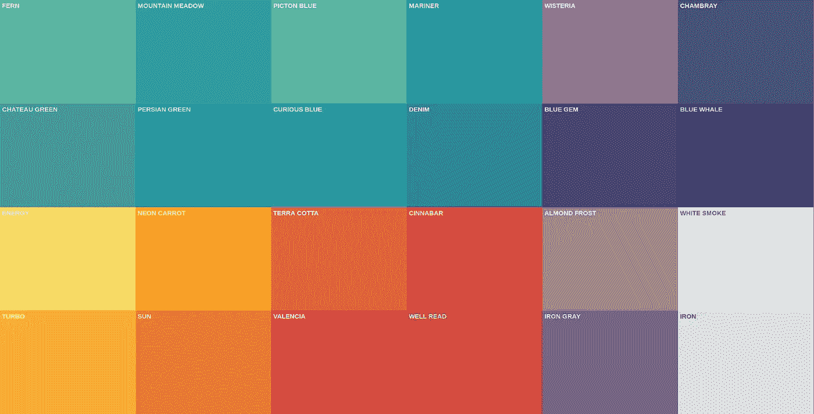

# 在 Swift 5 中使用用户默认值保存 UIColor

> 原文：<https://betterprogramming.pub/save-uicolor-with-userdefaults-in-swift-5-951ef1aa88e8>

我想把`UIColor`保存到`UserDefaults`中，所以我谷歌了一下，找不到任何关于 [Swift](https://developer.apple.com/swift/) 5 的更新资源。因此，我想出了自己的解决办法。希望对你有帮助。

没有直接的方法可以用`UserDefaults`来拯救`UIColor`，所以我们不得不稍微操纵一下类型。

我们将把`UIColor`转换成`Data` ，并保存为`any?`。为了转换`UIColor`的类型，我们需要使用一个叫做`NSKeyedArchiver`的特殊方法。

> "`NSKeyedArchiver`，`[NSCoder](https://developer.apple.com/documentation/foundation/nscoder)`的一个具体子类，提供了一种将对象(和标量值)编码成可存储在文件中的与架构无关的格式的方法。当存档一组对象时，每个对象的类信息和实例变量都会写入存档。伴生类`[NSKeyedUnarchiver](https://developer.apple.com/documentation/foundation/nskeyedunarchiver)`对档案中的数据进行解码，并创建一组与原始集合等效的对象。 *—苹果*

因此，让我们对`UserDefaults`进行扩展。

我们已经将`UIColor`转换为`Data`，然后保存为`Any?`。然后，我们使用解归档器解归档`data` 并返回`UIColor`。

此外，如果你不是设计师，你也可以购买一些很棒的 [iOS 应用程序模板](https://www.iosapptemplates.com/)，如果你对 [React 原生应用程序模板](https://www.instamobile.io/)更感兴趣，你可以从这里购买，他们有非常棒的收藏。

# 资源

*   [如何用 NSKeyedArchiver 和 NSKeyedUnarchiver 保存和加载对象](https://www.hackingwithswift.com/example-code/system/how-to-save-and-load-objects-with-nskeyedarchiver-and-nskeyedunarchiver)
*   [在 Swift 3 中存储带有用户默认值的 ui color](https://www.sitepoint.com/store-uicolor-with-userdefaults-in-swift-3/)
*   [iOS 应用模板](https://www.iosapptemplates.com/)
*   [React 原生 App 模板](https://www.instamobile.io/)