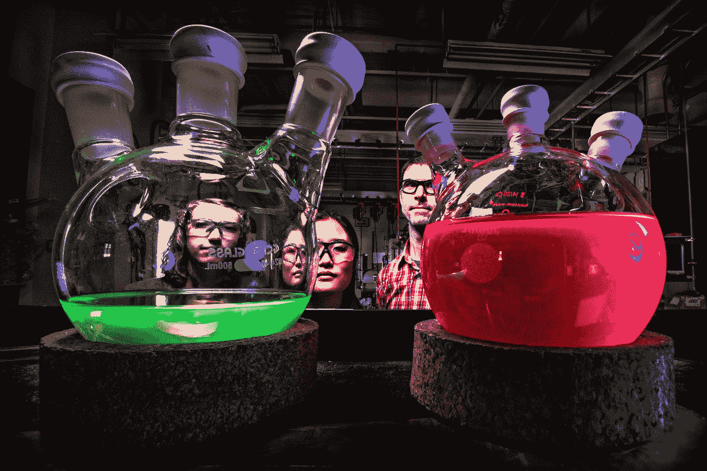
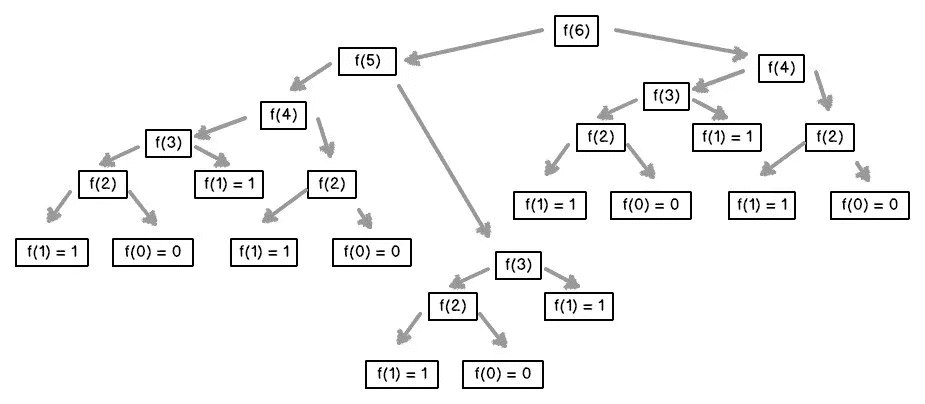

# 使用记忆包装函数节省 JavaScript 中的计算时间

> 原文：<https://betterprogramming.pub/save-up-computation-time-in-javascript-using-memoized-wrapper-functions-ae85f28d8087>

## 创建包装器来记忆预先存在的函数

[布拉德·奈瑟里](https://unsplash.com/@bradneathery?utm_source=medium&utm_medium=referral)在 [Unsplash](https://unsplash.com?utm_source=medium&utm_medium=referral) 上的照片

想象一下，由于一个函数导致大量处理阻塞所有其他执行，您必须等待大约 15 秒才能继续使用您的程序。

像 [Leetcode](http://seekoapp.io/61445d337c08ca0009305f9a) 、 [Hackerrank](http://seekoapp.io/61445d347c08ca0009305f9c) 和 co 这样的编码挑战网站的存在是有特定原因的。例如，斐波纳契数列可以用巨大的数量来计算一个值。如果你使用递归并处理中间结果，你不应该重复地重新计算现有的结果并记住[大 O 符号](http://seekoapp.io/61445d367c08ca0009305f9e)。

作为开发人员，尤其是用户，这是不可接受的，所以你必须找到一种更好的方法来记忆，并学习如何用一个[记忆化的](http://seekoapp.io/61445d377c08ca0009305fa0)函数包装任何函数。

**注意:**这些例子是用 JavaScript 编写的，但是该技术适用于任何支持所示结构的语言。

# 柠檬榨汁机

我想用一个简单的例子让你进入这个主题:取一个 Fibonacci 函数，它接收一个参数(数值)并返回元素的和，直到`n`。

我想向您展示如何在这个函数中实现一个缓存来更快地计算结果。

提示:您可以测试高数字的计算时间，您将看到不同之处。或者你可以继续读下去，看看我的测试:)

虽然这个`cachedFibonacci`做得很好，但它不符合功能性的要求。它也不符合编码原则的特定法则(*全局空间，改变现有代码*)。

`cachedFibonacci`解决方案在概念上是通用的，但特别是在实现上。这意味着你或我不得不直接修改函数的代码来利用记忆化。

但是我们可以做得更好。

相反，你应该考虑一种自动完成事情的方法。

以与[相同的方式，我对其他包装函数](http://seekoapp.io/61445d387c08ca0009305fa2)做了同样的处理。

解决方案将是一个`memoize()`函数，它包装任何其他函数来应用记忆:

*这是怎么回事？*

返回的函数检查对于任何给定的参数，参数是否已经被接收。要么它是数组`cache`的一部分，可以用适当的键找到，要么不能。

如果是，就不需要计算，返回缓存的值。

否则，您需要计算缺失值并将其存储在缓存中。

*`*cache*`*是闭包的一部分，用于隐藏缓存，防止外部访问。我在这里使用闭包是因为假设 memoized 函数只接收一个参数(* `*x*` *)并且是一个原始值。然后，它可以直接用作缓存对象的键值。**

# *启动计时器测试*

*为了验证这种方法是否工作正常，您必须对这些函数进行计时。我将使用以下计时功能来验证我的创作:*

*让我们从最初的`fibonacci()`功能开始。我将对整个计算进行计时，而不是每次递归调用，所以我创建了一个辅助的`testFibonacci()`函数，并将从文件`simpleFibonacci.js`中测试原始的`fibonacci()`。*

*提示:这个练习不是获得实际计算时间的正确方法。一个普通的测试是合适的。但我想确认记忆起作用了。*

*当你用你的机器重复测试时，你的时间会有所不同。这取决于您的具体 CPU、RAM 等。*

*然而，结果似乎是合乎逻辑的:指数似乎存在，时间增长很快。*

*现在，让我们纪念一下`testFibonacciMemoized()`。结果我应该找到更短的时间…不是吗？*

*如果您查看时间，您会看到第 3 行和第 4 行之间的显著变化。 ***哇！*** 从 2.7s 降到几乎 0…那看起来棒极了！*但这是什么？！**

*我之前用了一个新的数字(第 4 行到第 5 行)，我又回到了之前的数字。同样，从第 5 行到第 6 行的转换也证明了这一点。*

> *“你看到了，但你没有观察。”——阿瑟·柯南道尔， [*波希米亚的一桩丑闻*](http://www.bookbub.com/books/the-adventures-of-sherlock-holmes-by-arthur-conan-doyle)*

*我已经计时了`testFibionacciMemoized()`，但是代码没有调用那个函数，除了计时，计时只发生一次！*

**在内部，所有的递归调用都是对* `*fibonacci()*` *的，没有被记忆。**

*所以同一个号码的两次通话实际上是被记忆的。但其余的就不是了。这就是毫秒数再次上升的原因。要获得正确的结果，您必须将代码更改为:*

*这段代码与众不同的地方在于，您将`memoize()`包装在`fibonacci`周围，并将其保存到自身中。它不再是一个只被`addTiming`函数调用的变量。你已经成功地绕过了`memoize()`。*

*这意味着在计算`fibonacci(42)`时，所有的中间斐波那契值(从 0 到 42)都被存储，所以未来的调用实际上不用计算。他们查找这些值，这就是大幅降低计算时间所证明的。*

> *记忆化是一种降低函数的**时间**成本以换取**空间**成本的方法。—维基百科*

*你现在已经掌握了记忆的基础。让我们转向更复杂的世界。*

# ***争论越多，乐趣越多！***

**

*泰勒·迪斯-梅莱什在 [Unsplash](https://unsplash.com?utm_source=medium&utm_medium=referral) 上的照片*

*如果你有一个函数接受不止一个参数，你该怎么办？不要想象它也可以接受数组或对象。*

*在我介绍这个函数的解决方案之前，您可以从一个只包装一元的函数开始，剩下的就不管了。*

*这样做意味着通过使用 if 表达式实际访问函数的`.length`来检查函数的 arity:*

*如果你的函数不是一元的，它会直接返回函数而不做任何记忆。*

*如果你想记住*任何函数*，你必须想办法生成缓存键。换句话说:*

*你必须找到一种方法将任何参数转换成字符串。*

*不能直接用非原语作为缓存键。您可以尝试用类似`str = String(x)`的东西将值转换成字符串，但是会有问题。*

*另一方面，对于数组，它似乎工作得很好，不是吗？*

*`String()`函数在任何时候都会产生精确的扁平字符串。嵌套数组被转换成一个字符串。这对我们想要的记忆行为是不利的。当不同的数组产生相同的密钥时，这是一个问题。*

*如果您必须接收对象作为参数，事情会变得更糟，因为任何对象的`String()`表示都是`[object, Object]`。*

*你该怎么办？最简单的解决方案是使用`JSON.stringify()`将我们收到的任何参数转换成有用的、独特的字符串:*

*你所要考虑的就是获得更好的性能:如果你要记忆的函数接收到一个参数，它就是一个原始值。因此，您可以将它直接用作缓存键。*

*在所有其他情况下，您必须使用应用于参数数组的`JSON.stringify()`的结果。*

*遵循这种区别导致记忆[高阶函数](http://seekoapp.io/61445d3a7c08ca0009305fa4)的改进版本。*

*从通用性来说，这是最安全的版本。*

*每当你明确知道函数中参数的类型时，第一个记忆函数会更快。*

*根据您的意愿，您可能还希望代码更简单，因此在您看来更好。然后，用这个版本的更简单也更通用的记忆功能。*

*提示:这一次，更简单的代码会浪费一些 CPU 周期。Ciao Gondim 编写了世界上最快的记忆库。自从 JSON 之后。Stringify()执行得不是很好[你可以在这里查看最快的方法](https://community.risingstack.com/the-worlds-fastest-javascript-memoization-library/)。*

*我介意你现在已经记够了。*这部分做完了。**

*剩下的就是测试了。测试记忆化高阶函数提出了一个有趣的问题——你会怎么做？*

# ***记忆测试***

**

*[科学高清照片](https://unsplash.com/@scienceinhd?utm_source=medium&utm_medium=referral)上 [Unsplash](https://unsplash.com?utm_source=medium&utm_medium=referral)*

*有什么新想法吗？没有吗？*

*好吧，那我先说:查看藏宝阁可能是一种方法。但这是隐私。重写使用全局缓存的函数也不是一个有效的选择。*

*你想过用更直接的方式来分析吗？比如统计实际通话的次数？*

*使用一个非记忆的、原始的`fibonacci()`，你可以测试这个函数是否正常工作，并检查调用。*

*这里没什么特别的。只是检查原始的`fibonacci()`函数，测试调用和产生的值。以`fibonacci(6)`等于`8`为例，你可以很容易地验证这一点。*

**但是你怎么发现函数被调用* `*25*` *次呢？**

*要得到答案，请看一下计算`fibonacci(6)`所需的所有递归调用的图表。*

**

*图斐波纳契(6)通过[发射学校](https://medium.com/launch-school/recursive-fibonnaci-method-explained-d82215c5498e)*

*每个节点代表对我们函数的一次调用。通过计数，可以看到为了计算`fibonacci(6)`，已经进行了`25`次调用。*

*现在，让我们来看看这个函数的记忆版本，并测试它是否仍然产生相同的结果:*

**你能猜出为什么计算* `*fibonacci(6)*` *要调用 11 次，然后计算*`*fibonacci(5)*`*`*fibonacci(4)*`*`*fibonacci(3)*`*后才多三次(14 的总和)？****

**为了回答这个问题的第一部分，让我们分析前面的图(Fibonacci(6)通过 [LaunchSchool](http://seekoapp.io/61445d3b7c08ca0009305fa6) )并沿着左边的分支。**

*   **第一个调用到`fibonacci(6)`，调用`fibonacci(5)`，`fibonacci(4)` = 3 个调用。**
*   **要计算`fibonacci(5)`，必须调用`fibonacci(4)`和`fibonacci(3)`；+2= 5 次呼叫。**
*   **要计算`fibonacci(4)`，必须调用`fibonacci(3)`和`fibonacci(2)`；+2= 7 次呼叫。**
*   **要算`fibonacci(3)`，`fibonacci(2)`，`fibonacci(1)`都得叫；+2= 9 次呼叫。**
*   **要计算`fibonacci(2)`，就得调用`fibonacci(1)`和`fibonacci(0)`；+2= 11 次呼叫。**
*   **整个右分支已经被缓存，所以计算`fibonacci(6)`的调用计数是 11。**

**回答这个问题的第二部分:因为您缓存了所有以前的`fibonacci(n)`到`fibonacci(6)`的值，所以很容易理解为什么计算`fibonacci(5)`、`fibonacci(4)`和`fibonacci(3)`只增加了三个调用(实际上每个调用一个来获得新的结果)。**

**所有其他必需的值都已经被计算和缓存，**

# **结论**

**您已经学习了如何处理几个包装函数来记忆已经存在的包装函数。**

**函数的 arity 无关紧要；现在，您已经拥有了找到合适解决方案所需的所有工具。**

**主要目标是通过不接触现有的和工作的代码来继续扩展您的应用程序。**

**然而，另一种情况是当你想改变一个函数的工作方式时。但这是我下一篇文章的内容。**

**获取 26 份备忘单，只研究你真正需要的东西，以获得你的第一份网络开发工作！**

****

**[Arnold Code Academy 26 Web 开发人员备忘单](https://arnoldcodeacademy.ck.page/26-web-dev-cheat-sheets)**

# **参考**

*   **[3 分钟了解 JavaScript 记忆化](https://codeburst.io/understanding-memoization-in-3-minutes-2e58daf33a19)**
*   **[如何使用 Memoize 缓存 JavaScript 函数结果，加速你的代码](https://www.freecodecamp.org/news/understanding-memoize-in-javascript-51d07d19430e/)**
*   **[记忆化](https://en.wikipedia.org/wiki/Memoization)**
*   **[掌握 JavaScript 函数式编程](https://amzn.to/3ziF8cL)**