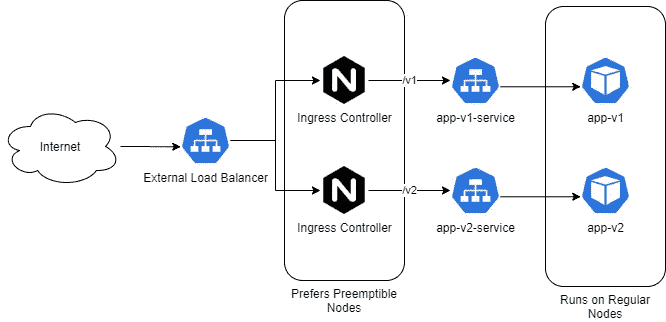
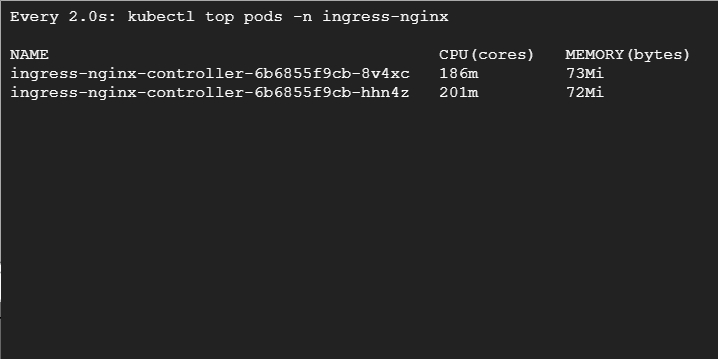

# 利用可抢占实例节省高达 50%的 Kubernetes 成本

> 原文：<https://betterprogramming.pub/save-up-to-50-of-your-kubernetes-costs-with-preemptible-instances-bdade99ccd39>

## 在 Google Kubernetes 引擎的可抢占实例上运行 Kubernetes 入口控制器


由 [Unsplash](https://unsplash.com/s/photos/save?utm_source=unsplash&utm_medium=referral&utm_content=creditCopyText) 上的[Damir spanick](https://unsplash.com/@spanic?utm_source=unsplash&utm_medium=referral&utm_content=creditCopyText)拍摄的照片

容器已经走过了漫长的道路，Kubernetes 不仅改变了技术领域，也改变了组织的思维方式。随着越来越多的公司转向云原生技术，对容器和 Kubernetes 的需求也在不断增加。

Kubernetes 运行在服务器上，服务器可以是物理的，也可以是虚拟的。随着云在当前 IT 环境中占据重要地位，实施近乎无限的扩展和优化工作负载成本变得更加容易。

预先购买服务器、在机架中进行配置并手动维护的日子已经一去不复返了。借助云，您可以在几分钟内启动和关闭虚拟机，并且只需为您调配的基础架构付费。的确是一种强大的力量！

大多数云提供商，如 AWS 和 GCP，以比按需实例低得多的价格提供现场或可抢占实例。唯一的条件是，他们可以随时终止实例来收回资源。在 GCP，可抢占的实例在被供应 24 小时后被自动移除。

根据谷歌的说法，可抢占实例可以减少你的[计算引擎](https://cloud.google.com/compute)高达 80%的成本。

对于云提供商和用户来说，这是一个双赢的局面。虽然云提供商通过在非高峰时段尽可能充分地利用闲置资源而受益，但用户也可以从它提供的低价中受益，并轻松运行无状态工作负载。

# 在哪里使用可抢占/点实例

可抢占的实例适合所有类型的工作负载吗？不要！它们的用例很少，但通常用于机器学习应用程序或运行无状态工作负载。

无论何时设计在可抢占实例上运行的任何东西，都需要确保应用程序是容错的，并且可以从离开处理的同一点恢复。

可抢占的实例不适合有状态的应用程序，如数据库，其中数据持久性至关重要。但是，如果您需要运行负载平衡器、Hadoop 集群或任何不受状态变化影响的应用程序，那么可抢占实例可能是一个不错的选择。

# GKE 的可抢占实例

Google Kubernetes 引擎(GKE)是由 Google Cloud 提供的托管 Kubernetes 服务。这是可用的最健壮和功能最丰富的 Kubernetes 集群之一，它提供的功能之一是允许您提供可抢占的 Kubernetes 节点池。这意味着您也可以利用容器工作负载中的成本节约。

如果你运行的是不存储状态的微服务，那对你来说就是个金矿。如果架构得当，您可以通过在 Kubernetes 集群的独立节点池中组合按需和可抢占实例，并利用 GKE 提供的集群自动伸缩特性，来节省大量资金。

# 在 GKE 上运行负载平衡器

负载平衡器是昂贵的资源，大多数组织倾向于使用入口控制器来管理 Kubernetes 集群中的流量。对于使用 Istio 等服务网格的组织，Istio 入口控制器提供了类似的功能。

这些资源是无状态的，很适合在可抢占的工作节点上运行。这里我们将使用混合策略，允许工作负载分布在可抢占节点和普通节点之间。这是因为如果可抢占的节点被收回，我们希望确保客户不会注意到服务质量下降。

我们将在 GKE 集群上安装 NGINX 入口控制器，并使用可抢占的节点来运行它们。所以让我们开始吧。



# 创建集群

让我们首先创建一个 GKE 集群，在默认节点池中有两个工作节点。

现在，让我们创建一个可抢占的节点池，并将其连接到群集。

好的，现在我们有一个 Kubernetes 集群，默认节点池上有两个常规工作节点，可抢占节点池上有两个可抢占工作节点。可抢占节点池启用了自动扩展，可以包含 2 到 6 个节点。

# 将污点分配给可抢占节点

您可能已经注意到，我们还为可抢占节点池分配了一个污点，因为我们不希望所有工作负载都被调度到可抢占节点上。我们只想将入口控制器盒分配给可抢占的节点。其余的应该保留在标准节点上。

# 部署入口控制器

要部署入口控制器，请下载 NGINX 入口控制器清单。

```
wget [https://raw.githubusercontent.com/bharatmicrosystems/nginx-lb/master/deploy.yaml](https://raw.githubusercontent.com/bharatmicrosystems/nginx-lb/master/deploy.yaml)
```

我对它进行了修改，增加了对可抢占节点池上的`NoSchedule`污点的容忍，以及在调度期间优先选择可抢占节点池的节点关联性。

如果您不希望它优先选择可抢占的节点，而希望 Kubernetes 决定最佳节点，请从`deploy.yaml`文件中删除`nodeAffinity`部分。

## 默认

## 节点关联性

应用清单:

```
kubectl apply -f deploy.yaml
```

部署后，我们应该能够在`ingress-nginx`名称空间中看到 pod。

```
$ kubectl get pod -n ingress-nginx
NAME                                        READY   STATUS      RESTARTS   AGE
ingress-nginx-controller-6b6855f9cb-sj4mw   1/1     Running     0          3m16s
```

让我们等待一段时间，让云提供商为`ingress-nginx-controller`负载均衡器服务分配一个外部 IP，然后让服务知道这个外部 IP。

```
$ kubectl get svc -n ingress-nginx ingress-nginx-controller
NAME                       TYPE           CLUSTER-IP   EXTERNAL-IP    PORT(S)   AGE
ingress-nginx-controller   LoadBalancer   10.8.6.193   **35.224.126.9**   80:32546/TCP,443:32267/TCP   10m
```

现在，让我们为入口控制器创建一个`HorizontalPodAutoscalar`，以便在集群中进行扩展。这是必要的，因为对工作负载的所有请求都是通过入口控制器 pods 路由的，所以我们希望它们随着流量而扩展。

等待 HPA 开始工作，很快我们会发现`nginx-ingress-controller`有两个吊舱。

有趣的是，两个入口控制器都在可抢占池中提供。这是因为它更喜欢它，但当负载增加时，我们会发现它在整个集群中爆发。

# 部署示例应用程序

现在，让我们部署一个示例应用程序，入口控制器将通过负载平衡器提供服务。让我们部署应用程序的两个版本，以了解它是如何工作的。

让我们为 v1 创建`deployment`和`service`。

```
$ kubectl create deployment app-v1 --image=bharamicrosystems/nginx:v1
deployment.apps/app-v1 created
$ kubectl expose deployment app-v1 --port 80
service/app-v1 exposed
```

然后为 v2 创建一个`deployment`和`service`。

```
$ kubectl create deployment app-v2 --image=bharamicrosystems/nginx:v2
deployment.apps/app-v1 created
$ kubectl expose deployment app-v2 --port 80
service/app-v2 exposed
```

# 部署入口资源

现在让我们通过一个入口资源对外公开`app-v1`和`app-v2`。

正如我们所定义的，如果我们用`/v1`点击入口控制器负载平衡器，我们应该从`app-v1`得到响应(从`app-v2`得到`/v2`)。让我们自己去看看吧。

```
$ curl 35.224.126.9/v1
This is version 1
$ curl 35.224.126.9/v2
This is version 2
```

入口规则运行得非常好。

# 负载测试群集

让我们把事情变得有趣一些，做一些负载测试。我们将使用`hey`工具进行测试，但是您可以随意使用任何您想要的负载测试工具。

我们已经将`nginx-ingress-controller`pod 配置为当目标 CPU 利用率增加超过 70%时自动扩展，并且我们已经将 pod 限制设置为 200 毫核 CPU。因此，任何超过 140 米的吊舱都应该旋转另一个吊舱来处理负载。

让我们为 v1 和 v2 的 300 个并发请求计划 1000 个。这应该会在可抢占的节点池中旋转几个 pod 副本。

我将在两个独立的终端上运行测试。在第三个终端中，我将运行`watch 'kubectl top pod -n ingress-nginx'`。

让我们在第一个终端中使用`hey`命令继续工作:

```
$ hey -z 300s -c 1000 [http://35.224.126.9/v1](http://35.224.126.9/v1)
```

和第二终端同时:

```
$ hey -z 300s -c 1000 [http://35.224.126.9/v2](http://35.224.126.9/v2)
```

在第三个终端中，我们看到以下内容。随着负载的增加，Kubernetes 增加了额外的 NGINX 入口控制器盒。



如果我们得到 pod，我们会看到大多数 pod 都出现在 preemptibe 节点中。默认节点池上部署了一个单元。这是因为该策略优先选择可抢占的节点，但这是一个软检查，因此如果我们失去了可抢占的节点，可以在常规节点池中部署 pod。

如果我们得到这些节点，我们会看到 GKE 节点在自动缩放。GKE 在节点池中创建了另一个可抢占的节点来处理额外的负载。

# 结论

在可抢占的节点上运行无状态应用程序是一个不错的成本节约策略。它们可以快速恢复和替换，如果一个节点被拿走，它们可以快速进入其他可用节点。

如果您的应用程序 SLO 可以容忍一些错误，并且您没有非常高的可用性要求，那么使用可抢占节点来运行您的入口控制器可能是一个不错的策略。

当 GCP 取走一个节点时，需要一分钟来旋转一个新的可抢占节点。在新节点中旋转另一个 pod 需要 10 秒钟。您需要决定您的 SLO 是否允许每 24 小时中断一分钟。如果不是，那么您应该坚持使用常规节点。

您可以通过在一天中最不繁忙的时段创建节点池来最大限度地减少中断。在大多数情况下，较小的可抢占节点存在 24 小时，所以当您丢失节点时，您会在没有很多用户的时候丢失它们。

还可以在节点虚拟机中使用关闭脚本来清空节点。这将确保更好的可用性。

感谢阅读——我希望你喜欢这篇文章。