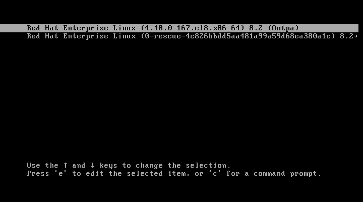
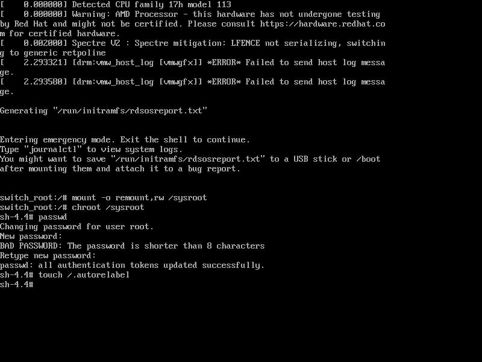
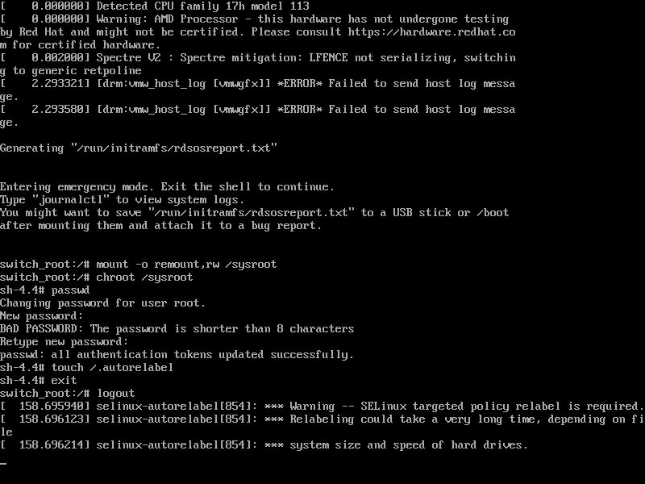
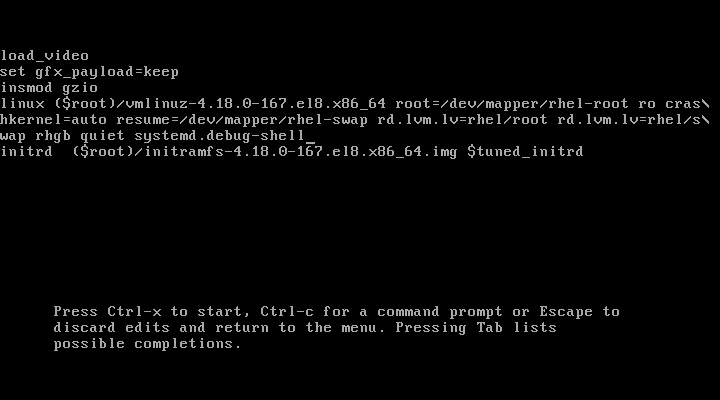

# 从死亡中拯救你的 Linux 机器

> 原文：<https://betterprogramming.pub/save-your-linux-machine-from-certain-death-24ced335d969>

## 恢复您的根密码和更多

照片由[雷金·索伦](https://unsplash.com/@designbytholen?utm_source=unsplash&utm_medium=referral&utm_content=creditCopyText)在 [Unsplash](https://unsplash.com/?utm_source=unsplash&utm_medium=referral&utm_content=creditCopyText) 上拍摄

排除损坏系统的故障是每个系统管理员、SRE 或 DevOps 工程师的基本技能。我们每个人都会时不时地遇到与操作系统相关的问题，当事情变得非常糟糕时，最好做好准备。

能够快速识别问题并采取行动以防止任何重大损害尤其有益。为了在本文中有所帮助，我们将回顾一些您可能遇到的常见问题，以及收集信息、故障诊断和解决这些问题的方法。

注:本文使用 [RHEL 8](https://www.redhat.com/en/enterprise-linux-8) / [百分位](https://www.centos.org/)。但是，下面的例子/概念可以应用于任何 Linux 发行版。

# 恢复 R `oot`密码

如果您丢失了`root`密码，并且无法访问特权用户，该怎么办？如果您仍然可以访问机器，那么有一种方法可以解决这种不方便的情况。

首先，从重启机器开始。当机器启动时，按任意键进入启动菜单:

启动菜单截图

在启动菜单中，点击`e`编辑启动选项。使用箭头，移动到以`linux`开始并添加`rd.break`的行。这*在早期中断了*引导过程。

可选地，您也可以添加`enforcing=0`，暂停 SELinux 的执行。接下来，点击`CTRL+X`让机器启动。

已编辑的启动菜单截图

启动几秒钟后，您应该会得到外壳。此时，您可以以只读模式访问系统。

因此，要改变系统中的任何东西——比如`root`密码——我们需要使文件系统*读写*。我们可以通过运行`mount -o remount,rw /sysroot`来实现。

我们需要做的下一件事是使用`chroot /sysroot`进入根监狱——这将文件系统的根改为`/sysroot`,而不是`/`。这是必需的，这样我们运行的任何进一步的命令都将与`/sysroot`目录有关。现在我们可以使用`passwd`更改`root`密码。

如果您在启动选项中添加了`enforcing=0`，现在您可以点击`CTRL+D`(或键入`exit`)让系统完全启动。如果没有，运行`touch /.autorelabel`来触发 SELinux 系统重新标记。

这是必要的，因为更改密码会导致`/etc/password`具有不正确的 SELinux 安全上下文。因此，我们需要在下一次引导时重新标记整个文件系统(这可能需要一些时间，取决于文件系统的大小)。

密码更改命令

作为替代方案，您也可以访问 Linux 的`debug-shell`。这也可以通过在引导期间访问 GRUB 并附加`systemd.debug-shell`而不是`rd.break`来实现。

当您让系统用这个选项启动时，您将在一个正常的 shell 会话中结束，这不是很有帮助。但是，如果您尝试使用`CTRL+ALT+F9`访问终端 9，您将使用完全`root`权限打开`debug-shell`。

在这里，您可以正常更改密码。此时，您可以切换回正常的 shell ( `CTRL+ALT+F1`)并登录。

但是你不应该忘记停止`debug-shell`，因为它是系统的一个巨大漏洞。你可以通过运行`systemctl stop debug-shell.service`来做到这一点(你仍然可以切换回`debug-shell`，但是它将没有响应；被杀死的)。

调试外壳

# 修复不可挂载的文件系统

创建新分区、创建文件系统、挂载文件系统等。是大多数系统管理员的常见任务。

但是，即使这些是基本任务，也很容易出错，导致系统无法启动。让我们看看如何解决与不可挂载的文件系统相关的问题。

和以前的解决方案一样，我们从重启机器开始，访问启动菜单并编辑它，这次添加了`systemd.unit=emergency.target`。这告诉您的系统启动到一个紧急目标，而不是默认目标(多用户或图形)。

当系统启动并获得 shell 时，我们以 root 用户身份登录，并再次使用`mount -o remount,rw /`重新挂载文件系统。现在我们可以通过运行`mount -a`来尝试挂载所有的文件系统。

如果挂载特定的文件系统有问题，您可能会看到类似于`mount: /wrong-mount: mount point does not exist.`或`mount /wrong-mount: special device /dev/sdb1 does not exist.`的错误消息。这些问题需要在`/etc/fstab`内部解决:

在`/etc/fstab`中解决问题后，运行`systemctl daemon-reload`，这样`systemd`就会得到改变。现在，再次运行`mount -a`。如果问题确实得到了解决，您应该看不到任何错误(没有消息，就是好消息)。您现在可以使用`CTRL+D`退出，让系统正常启动。

除了键入错误的设备或装载点名称，您还可能遇到 VDO(虚拟数据优化器)或 Stratis 的问题，这需要额外的装载参数。

例如`x-systemd.requires=vdo.service`或`x-systemd.requires=stratisd.service`，否则系统无法正常启动。

另一个常见且容易修复的错误可能是在使用`UUID="...`指定设备时缺少引号(使用`/etc/fstab`语法突出显示，这可以为您省去许多问题)。

# SELinux 问题疑难解答

这不是生死攸关的情况，但它会导致很多问题，所以当它发生时能够快速识别它是有益的。

重要的是要认识到，大多数时候，SELinux 都在正确地完成它的工作。但是有可能你正在尝试实现 SELinux 没有预料到的事情。

您可能遇到的一些问题可能包括文件上下文不正确的问题，例如，将文件从一个位置移动到另一个位置后。有时，问题可能出在过于严格的策略(SELinux 布尔值)或阻塞的服务端口上。

首先使用`setenforce 0`暂时将 SELinux 更改为非强制模式，然后重试之前不起作用的操作，就可以解决所有这些问题。

如果问题是通过将 SELinux 切换到非强制模式解决的，那么我们知道问题是由 SELinux 违规引起的。

现在，如果我们使用`setenforce 1`重新打开 SELinux，我们可以尝试分析并修复违规。

首先，使用`yum -y install setroubleshoot-server`安装`setroubleshoot-server`。该故障排除服务器将监听`/var/log/audit/audit.log`并向`/var/log/messages`发送总结消息。

接下来，要分析这些消息，运行`grep sealert /var/log/messages`应该会给出如下消息:

作为一个例子，我将`httpd`配置为在端口`8012`上运行，该端口由于 SELinux 服务允许的端口而被阻塞。如果我们没有意识到这一点，那么就很难找到这个问题的根源。

上面的输出有助于解决这个问题。我们可以看到对 SELinux 违规的描述，以及可以帮助我们进一步排除故障的命令，所以让我们试一试:

这将生成一份关于违规原因的完整报告。包括建议的(不一定是最合适的)修复。

如果您对 SELinux 有一些经验，您可能会意识到解决这个问题的最合适的方法是向 SELinux 服务添加相关的端口(`http_port_t`)。这可以通过运行`semanage port -a -t http_port_t -p tcp 8012`来完成。

这种复制违规、在`var/log/messages`中寻找`sealert`消息、查看报告以及分析报告的模式可以应用于任何 SELinux 违规/问题，而不仅仅是上面的例子。

或者，您也可以使用`ausearch`直接在`/var/log/audit/audit.log`中搜索。您想要运行的特定命令:`ausearch -m AVC -ts recent`。这显示了所有最近的否认。

输出应该是这样的(同样的信息，但是不太用户友好):

# 从崩溃的系统中获取日志

默认情况下，存储在`/run/log/journal`中的日志不会在系统重新启动后保存。如果您需要在崩溃的系统上调试日志，这可能会成为一个问题。

为了保存日志，我们需要修改`/etc/systemd/journald.conf`。更具体地说，`Storage`参数:

通过取消注释并将`Storage`改为`persistent`，我们告诉`systemd`将所有日志存储在`var/log/journal`中。除了这个变更，我们还需要运行`systemctl reload systemd-journald`来确保变更生效。

尽管此更改会将日志保留在您的系统中，但它不会永远保留所有日志。默认情况下，`journald`被配置为不超过文件系统的 10%,或者给系统留下少于 15%的可用空间。

现在，实际检查之前存储的日志。首先切换到`root`用户。跑`journalctl --list-boots`。这会给你一个类似这样的列表:

根据日期和时间，选择要查看日志的引导。例如，要查看日志级别为`err`或更高的 id 为`-2`的引导的日志:

如果以上日志不足以解决您的问题，那么还有其他日志文件可供检查:

*   `/var/log/messages` —大多数系统日志消息应该在这里。
*   `/var/log/boot.log` —系统启动消息(与系统日志无关)。

或者，如果您不能正常启动您的机器，那么您可以访问如上所示的`emergency.target`，一个视图以同样的方式记录在那里。

# 结论

在 Linux 机器上，除了我在上面几节中展示的以外，还有很多地方可能出错。然而，这些示例/方法可以应用于您可能遇到的各种其他问题。

此外，并不是所有这些都是生死攸关的情况，但是能够快速解决它们总是更好的，特别是如果这个有问题的机器是一个生产系统。

大多数问题的解决取决于获得正确的信息并能够恢复以前的配置，因此，在修改日志之前，务必在系统上存储日志并备份关键文件

*本文最初发布于*[*martinheinz . dev*](https://martinheinz.dev/blog/22)