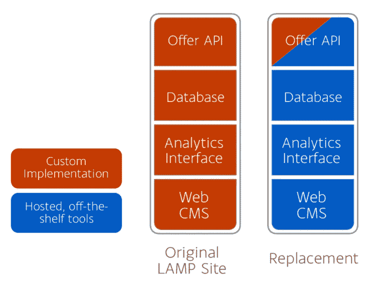

# 使用 Squarespace、Airtable 和 Glitch.com，每年为非营利组织节省六位数的开支

> 原文：<https://betterprogramming.pub/saving-a-non-profit-six-figures-a-year-using-squarespace-airtable-and-glitch-com-23537161e18f>

## 通过 SaaS 和大量文档降低复杂性和成本

在 [Unsplash](https://unsplash.com/search/photos/non-profit?utm_source=unsplash&utm_medium=referral&utm_content=creditCopyText) 上由 [Austin Distel](https://unsplash.com/photos/744oGeqpxPQ?utm_source=unsplash&utm_medium=referral&utm_content=creditCopyText) 拍摄的照片

我使劲咽了口唾沫。

我盯着一个 4g 的网站转储。没有记录。没有版本控制。仅仅是跨越几十个目录的几千个 PHP 文件，加上一个庞大的 MySQL 数据库。

我让自己陷入了什么？

我正在看的文件包括 [EveryoneOn](http://everyoneon.org/) 的网站，这是一个为低收入家庭提供可负担得起的互联网接入的非营利组织。自从奥巴马时代的 connect home 以来，我们已经一起工作了几年，当时他们来找我寻找新的网络技术提供商。他们现有的合同 web 开发人员的费用相当于整个高级人员的工资，他们想要更实惠的选择。

我向他们提出了一个私下交易，目的只有一个:让他们达到自给自足的程度。对于合同 IT 提供商来说，存在着不正当的动机——增加复杂性是有意义的，会使客户更加依赖，从而确保未来的计费。我想打破这个循环。

但是当我看着他们网站的内部结构时，我想知道我是不是被弄糊涂了。

# 技术复杂性

每个人每月支付数千美元只是为了保持他们的网站在线，这是有原因的。

这件事很复杂。多年来，多个 IT 提供商参与了它的维护。一个单一的数据库驱动着一切，从 WordPress 内容到网站分析，再到让用户搜索负担得起的互联网服务的 API。

这不是我的第一个 LAMP 服务器，但是让一切正常运行需要几个星期的故障排除。在没有文档的情况下，要找出如何配置 Apache 和 MySQL 来与多年来随处可见的 PHP 一起工作是一件反复试验的事情。

这种复杂性也给每个人的员工带来了日常成本。对网站及其内容的许多更改必须通过他们的承包商进行。这使得这一过程变得缓慢，并限制了他们对自己网站的控制。

这需要一些工作，但一旦替换服务器处于良好状态，我们就将域切换过来。我的下一个任务是:扑灭偶尔发生的火灾，想出一个更好、更简单、更便宜的技术策略。

# 其他人的服务器

一台服务器上托管的一堆相互依赖的服务意味着，每个人的 IT 成本中有很大一部分是在出现故障时有人随叫随到来修理。但是，如果我们可以使用由第三方托管和维护的技术，我们就可以将这一负担转移给他们。

我认为每个人负责的定制代码越多，他们的技术就越昂贵。然而，每个人都需要他们的技术来完成的任务是共同的:

*   用于网站的内容管理系统
*   关于网络使用和报价采用情况的分析和统计
*   关于互联网优惠的结构化数据

相对于它们强加的高昂成本，拥有所有这些定制版本并没有提供太多价值。

但是如果我们可以使用现成的工具，那么保持它们在线、更新和安全就是别人的工作了。组织的固定技术成本不是每月花费数千美元，而是每年数百美元。

最重要的是，因为这些产品是为销售给成千上万的用户而设计的，它们将比我们开始时的产品更容易接近，更直观。

下面是我们如何用可访问的、经济高效的第三方服务取代 PHP 和 MySQL 数据的混乱局面:

# 方形空间

费用:218 美元/年

大量定制的 WordPress 安装让位于 [Squarespace](https://www.squarespace.com/) 。有了 24/7 的客户支持和如此多的电子商务客户每天使用它，我们知道我们可以依靠它保持正常运行。不仅如此，Squarespace 还有一个易于使用的文本和页面布局编辑界面。现在，任何人都可以随时直接编辑他们的网站设计。

我喜欢 Squarespace 的另一个原因是它的设计限制。全局样式面板使每个人的页面保持一致。多人可以为同一个网站建立页面，所有人的排版和颜色都是一样的。对这些样式的任何更改都会在以后自动传播。

对于一个没有内部平面设计师的组织来说，这些细节非常重要。给他们留下一个设计上逐渐偏离专业和完美的网站会危及他们的信誉和使命。再多的自动化也无法保护你远离丑陋的网站，但是产品中内置的防护栏却能起到很大的作用。

# 谷歌分析

费用:免费

与此同时，定制分析仪表板的大部分子集可以由 Google Analytics 处理。Google Analytics 的基本原理是一劳永逸的:确保你的页眉模板中包含一个脚本。在 Squarespace 中，你只需将你的站点 ID 粘贴到一个设置字段中。

但是谷歌分析可以做的不仅仅是被动地跟踪浏览量。您还可以通过[编写一些定制的 JavaScript 代码](https://developers.google.com/analytics/devguides/collection/analyticsjs/events)来跟踪对您的用户的站点之旅重要的事件。除了自定义事件跟踪，还可以附加额外的“T2”维度的数据，这是您的 web 应用程序独有的。在这和谷歌的点击式[定制报告构建器](https://support.google.com/analytics/answer/1151300?hl=en)之间，你可以根据自己的业务需求组合详细的报告。在此基础上，谷歌负责将不断增长的数据集分割成你想要的任何时间段和维度。

# 充气台

价格:每个用户每月 12 美元(非盈利定价)

即使谷歌分析处理了大量的网站行为统计，我们仍然需要一个数据库。

但更重要的是，我们需要一个工具，使数据可以访问。MySQL 是一种神秘的技术。甚至它流行的 GUI PHPMyAdmin 也不是特别用户友好。如果您不是软件开发人员，并且如果没有人费心编写一些公开您想要的数据库内容的代码，那么这些数据也可能不存在。

空中桌极大地改变了游戏。它具有电子表格的所有用户友好性，以及数据库的所有技术优势。任何人都可以很容易地阅读、过滤或编辑 Airtable 内容——甚至像复制和粘贴这样的细节也能很好地工作。

然而，作为一个数据库，字段是经过格式化、结构化和验证的。您可以在不同表中的记录之间创建关系。正因为如此，Airtable 甚至比电子表格更好地设置了自动查找数据的[字段。](https://support.airtable.com/hc/en-us/articles/202576519-Guide-to-formula-lookup-count-and-rollup-fields)

这是迄今为止我最喜欢的现代软件之一。

在 Airtable 中，我们有一个工具可以存储邮政编码和相关互联网连接服务之间的关系。它可以存储关于伙伴组织的数据，并在相关时显示在网站上。它甚至可以存储发送到谷歌分析的实时事件，让每个人都能在报告的基础上审核数据。

因为 Airtable [有一个 API](https://airtable.com/api) 。

# 小故障

价格:免费

这让我想到了[故障](http://glitch.com/)。如果你在六个月前告诉我，我在网站基础设施上使用 Glitch，我不会相信你。

但是，虽然我们有很多由他人维护的伟大的新工具，但有一个障碍:一小部分人的网络技术仍然需要定制的服务器端代码。谢天谢地，不再有成千上万的文件了。

不过，将用户的邮政编码与他们可以使用的互联网服务进行匹配，然后在网页上显示这些服务的过程是独一无二的，Squarespace 没有为服务器端代码提供便利。我为此烦恼了几个月。我最初的计划是每月 5 美元的 DigitalOcean 实例来托管自定义代码。

这并不理想。理解如何管理这样的东西会有很大的障碍。他们的定制技术越复杂，未来每个人对其进行改变的挑战就越大，成本也就越高。对于网站的大部分内容，我设法找到了许多技术水平都可以使用的托管工具。我讨厌一个不可思议、难以触及的黑匣子偷偷潜入这个过程。

大约在这个时候，小故障[退出了测试版](https://medium.com/glitch/glitch-opens-up-welcome-85c62d0d6e84)。看了看[的局限性](http://help-center.glitch.me/help/restrictions/)，我意识到它完全可以应付每个人的交通需求。Glitch 提供了按需 node.js 沙箱，您可以在其中编写任何想要的服务器端代码。更好的是，[有内置的自动版本控制](https://medium.com/glitch/reinventing-version-control-with-glitch-rewind-914c350da442)。

虽然我是 node 的新手，但使用 Airtable 作为存储机制，我很快就构建了 EveryoneOn 的 offer API 的替代实现。在此基础上，我为该组织需要在其网站上显示的其他数据构建了几个 Airtable 包装器。

当要迁移他们的搜索插件时，我特别开心。这些是基于 PHP 的微型网页，允许第三方将 EveryoneOn 的搜索嵌入到他们自己的网站中。使用 [Express](https://expressjs.com/) 和 [EJS 模板包](https://scotch.io/tutorials/use-ejs-to-template-your-node-application)，很快就可以构建一个仿真器，在适当的时候为小部件提供服务。php 网址。所以实现完全改变了，从 PHP 到 JavaScript，但是这种改变对最终用户是透明的。没有人需要更新他们的页面。

我在 Glitch 中发现的是为网站添加定制功能的完美工具箱。这很容易开始—您只需点击一个按钮来创建一个新项目。你不需要理解 ssh 或 SFTP 来进行修改。你不需要任何特殊的软件。如果你有网络浏览器，你可以编辑代码。

这意味着任何知道或能够学习 JavaScript 的人以后都可以扩展或增强这些服务。有了自动版本控制，锐利的边缘变钝了。如果他们破坏了它，他们可以回滚到一个已知的工作状态没有问题。由于 Glitch 的基于项目的沙箱模型，每个服务都是独立的。打破一个不会伤害任何其他人。

我对 Glitch 的一个抱怨是:如果我能给他们一些钱来确保他们的长期成功，我会感觉好得多。现金购买定制域名，现金购买更高的服务限制——见鬼，甚至是小费罐。

尽管如此，Glitch 允许您轻松地将项目导出到 GitHub。最坏的情况是，有人可以转储这些项目并在节点服务器上运行它们。

# 长期影响

这些服务并不能 100%取代我们开始使用的 beast，但是我们能够使用更容易理解的工具来处理绝大多数的旧任务，并且价格便宜很多。年度固定成本从六位数下降到 1000 美元以下。虽然保留了一些定制代码，但它只有大约十几个文件，文档齐全，完全受版本控制，编辑也很容易。作为 Google Sites wiki 托管的文档的数字活页夹提供了所有服务的概述，并明确指导如何进行更改。最重要的是，未来的承包商没有什么可挟持的。EveryoneOn 直接控制着驱动他们网络形象的每个账户。

该项目极大地减少了要维护的定制代码的范围，同时还将需要管理的服务器数量减少到零。

我不希望这被看作是对 WordPress 或者 LAMP 的攻击。有时这是完成一项工作的完美工具组合。

虽然运行自己的服务器曾经是解决这类问题的唯一方法，但我们现在有了更多的选择。令人兴奋的是，我们可以看到一些托管服务是如何组合起来创建一个动态的网站，报告大量的商业智能，同时对非营利组织来说仍然是用户友好和经济有效的。不再需要有经验的系统管理员，现在每个人都可以通过学生实习生或志愿者——任何愿意学习基础 JavaScript 的人——来提高他们的 web 需求。

虽然从运营预算中为每个人节省一些现金是一个很好的开始，但他们仍然需要帮助让超过 6000 万人在家中连接到高速互联网。[踢他们几块钱](https://www.everyoneon.org/donate/)支持他们缩小数字鸿沟的使命。