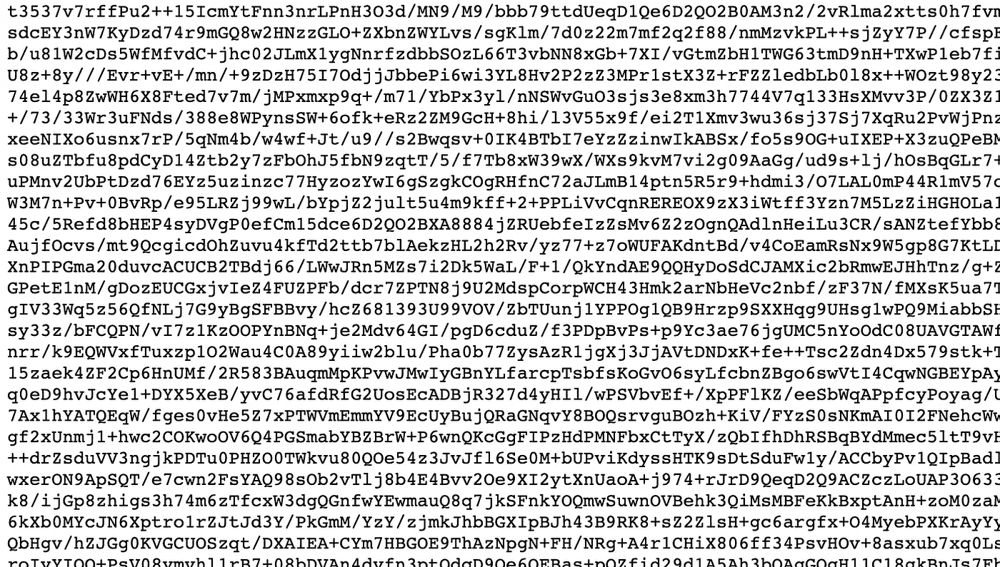
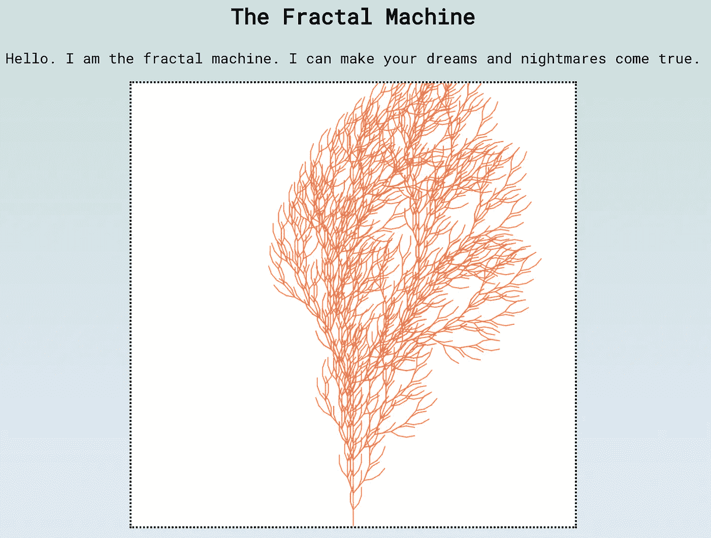
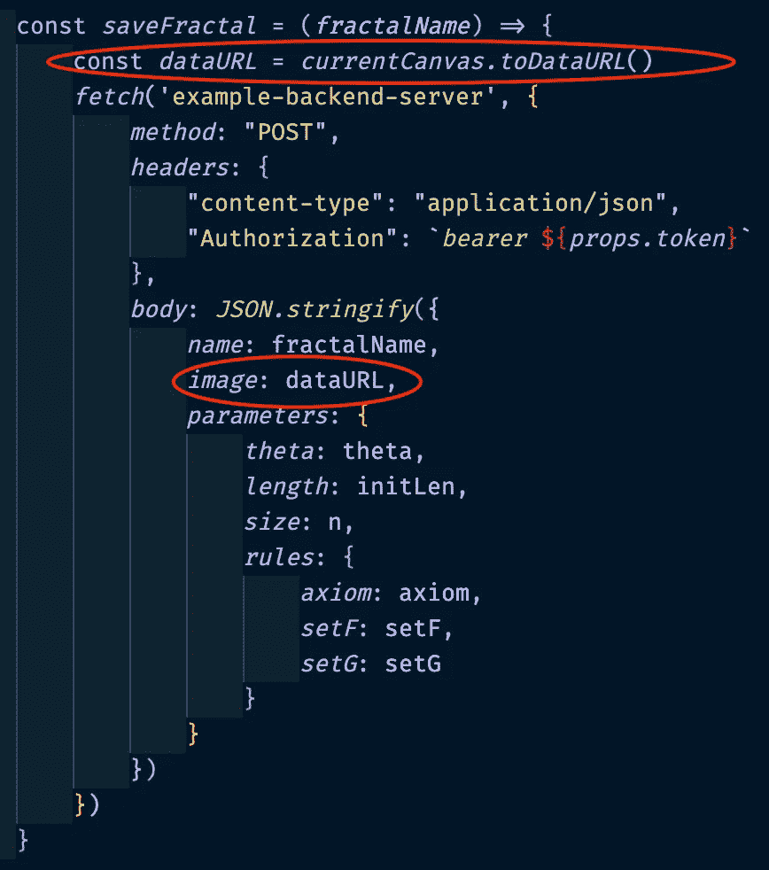
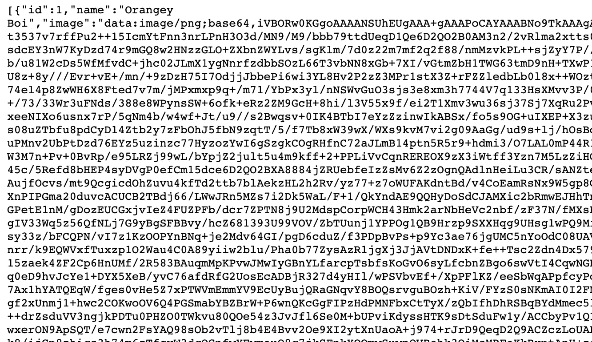
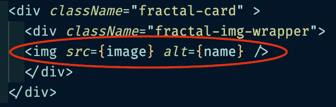
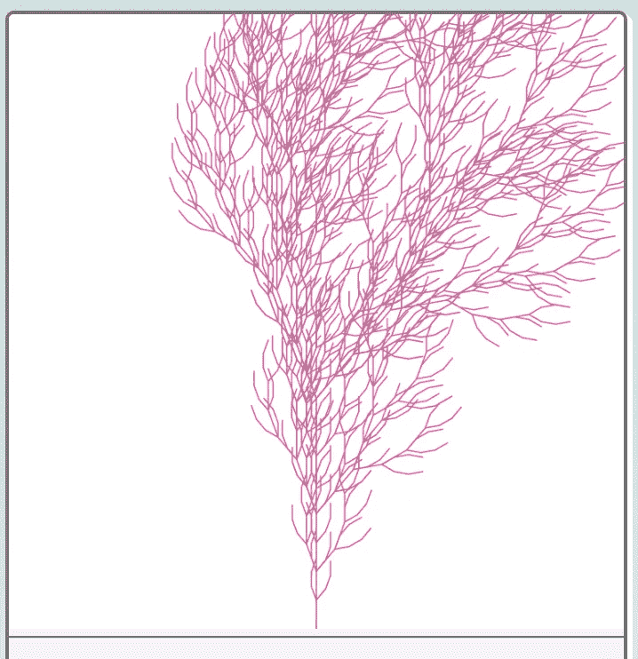
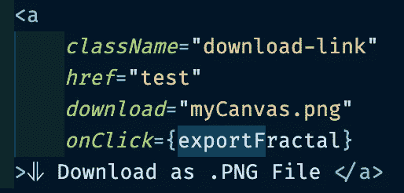
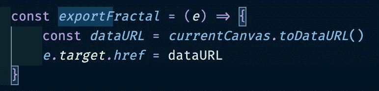
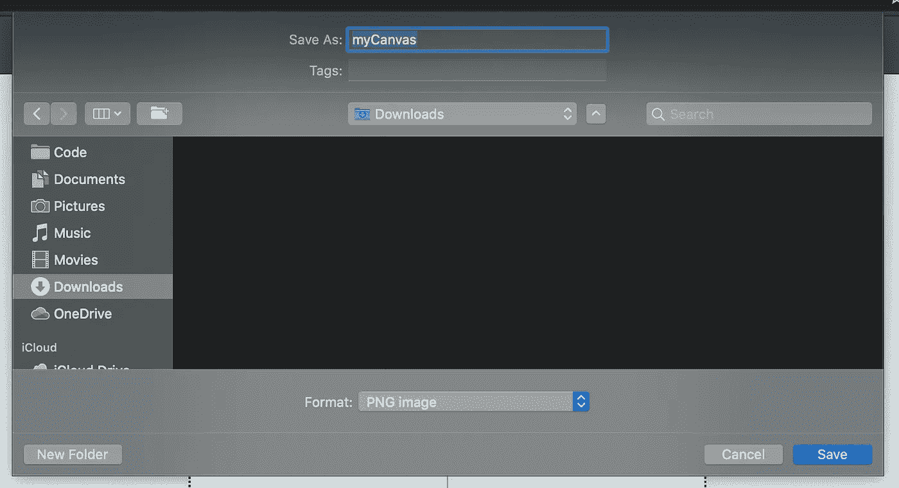

# 如何将 HTML5 画布保存为图像？toDataURL()

> 原文：<https://betterprogramming.pub/saving-an-html5-canvas-as-an-image-with-todataurl-f9b7cb61595d>

## 增强艺术应用及其他领域的交互性


一个非常真实的画布，不要和数字的那种混淆。(图片来源:[杰克逊的艺术](https://www.jacksonsart.com/blog/2018/09/12/how-to-use-canvas-wedges-that-come-with-a-canvas-or-stretcher-bars/))

假设您已经创建了一个 web 应用程序，该应用程序使用 HTML 画布动态呈现某些内容，这些内容是自动生成的或基于用户输入生成的。太好了！你做了一件可爱的事情，给你的用户的浏览器窗口带来了一些令人眼花缭乱的东西。

现在，假设您希望该用户(如果已登录)能够将画布保存到他们的个人资料中以供以后显示，或者匿名保存到您的应用程序的数据库中，或者以图像文件的形式保存到他们的计算机中。这正是`[.toDataURL()](https://developer.mozilla.org/en-US/docs/Web/API/HTMLCanvasElement/toDataURL)`方法发挥作用的地方。

`.toDataURL()`是一个内置于现代 HTML5/JS 浏览器生态系统中的方法，应该在网页上的画布元素上调用。它有两个参数:

```
*canvas*.toDataURL(***type***, ***encoderOptions***);
```

*   `type`表示您希望画布保存的文件格式，默认为 PNG。
*   `encoderOptions`是一个介于 0 和 1 之间的数字，表示 JPEG 或 WEBP 等有损文件格式的图像质量。默认值为 0.92，如果没有输入值，则使用该值。

`.toDataURL()`方法的显著特点是，它不像我们最熟悉的那样将画布直接导出为图像文件，而是如其名称所示导出为[数据 URL](https://developer.mozilla.org/en-US/docs/Web/HTTP/Basics_of_HTTP/Data_URIs) 。

图像上下文中的数据 URL **、**实质上是以 [Base64](https://en.wikipedia.org/wiki/Base64) 编码的图像文件的二进制数据，显示为 ASCII 字符串。

没错，这意味着你可以这样表现一幅图像:


我能找到的最可爱的例子

像这样的 ASCII 字符串:



注意:这是一个真实的数据 URL。真的。

很狂野，对吧？

对于那些精通二进制数据在互联网上传输历史的人来说，这可能是常识，但当你第一次看到它时，会感到惊讶。这也是图像文件作为附件通过电子邮件发送的方式，也是图像在全球数据库中传输和存储的方式。

这正是我们试图用我们的应用程序做的事情！

作为上下文中的一个例子，我们将使用一个应用程序，这个应用程序是我和我的一个开发伙伴在今年早些时候的训练营中开发的。我们开发了一个名为[分形区域](https://thefractal.zone/)的应用程序，这是一个交互式网站，允许用户输入不同的规则集和值，并在画布上实时生成分形设计。松脆的东西！



是的，我们是疯狂的科学家。

我们知道我们希望这些画布设计在我们的 Rails 后端数据库中持久化，但是需要找到一种方法来实现。我们使用 PostgreSQL，我们知道我们不能直接在数据库中保存图像文件。又一次，救援来了。

在我们的数据库模式中，我们为保存的分形设置了一个参数，类型为`text`(一个超大字符串)，名称为`image`:


这使得我们可以通过在前端将画布编码为一个字符串来将它保存为一个图像。我们在一个保存按钮点击事件中调用的方法中这样做，就像这样:



这就是全部了。我们所做的是:

1.  在状态下，抓取变量`currentCanvas`下的主画布。
2.  在画布下的 Save 按钮上放置一个 click 事件的监听器，这个监听器在被激活时调用`saveFractal()`函数。
3.  在`currentCanvas`上调用`.toDataURL()`并赋给另一个变量`dataURL` *。*
4.  将提取的`dataURL`发布到我们后端服务器的`image`参数下，将图像保存在我们的数据库中。

现在，如果我们通过 Chrome 将数据库呈现为 JSON，我们可以看到这个数据 URL 的原始形式:



这只是整个字符串的一小部分。数据 URL 实际上非常大，以至于它重载了 JSON 格式化扩展，所以我建议在开发过程中需要测试其他参数时不要序列化它。

现在，我们已经在后端数据库中成功地将画布持久化为一个以 ASCII 字符串表示的 PNG。

但是如果我们想在应用程序中重新呈现它呢？由于数据 URL 格式从技术上来说是一个 URL，所以它与处理任何其他图像 HTML 标签的 URL 一样简单。

回到我们的前端，我们可以从数据库中获取一个保存的分形的数据，将数据 URL 赋给一个变量`image`，并在页面上以卡片的形式呈现它，如下所示:



瞧啊。



多亏了`.toDataURL()`，我们现在已经成功地将 HTML5 画布导出、持久化、检索并呈现为图像。

最后一点，也是可能比将画布保存到数据库更有用的一点，是将画布作为图像直接导出并保存到用户硬盘的能力。这里我们将使用相同的概念，但执行起来略有不同。

本质上，我们在前端所做的是创建一个带有下载属性和临时 HREF 属性的导出链接(一个标签，尽管它可以被设计成一个按钮),并向它添加一个侦听器，该侦听器调用一个带有两个动作的函数:

1.  用`.toDataURL()` *将画布设置为变量。*
2.  将链接的临时 HREF 更改为我们刚刚编码的数据 URL。

看起来是这样的:



单击此按钮将在您的浏览器中打开一个下载窗口，您分配给链接的下载属性的值是临时文件名，如下所示:



你完了！

如果您已经到了这一步，那么您已经学会了如何使用`.toDataURL()` 的内置功能将 HTML5 画布保存为数据库中的编码字符串，并将其呈现在页面上，或者直接保存到用户的硬盘上。使用它可以为 web 应用程序增加一些很好的交互性和功能。

感谢阅读！