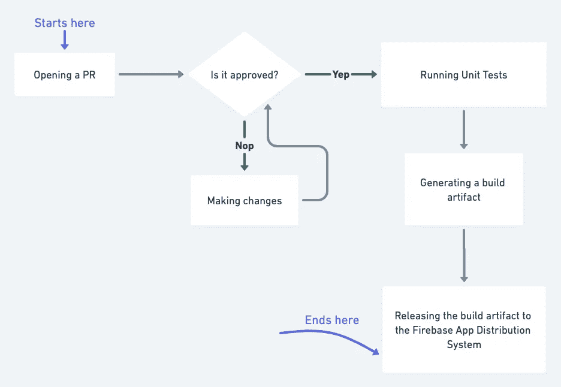
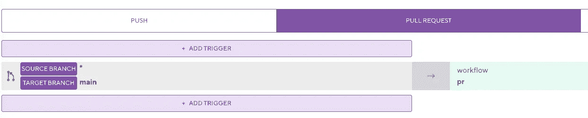
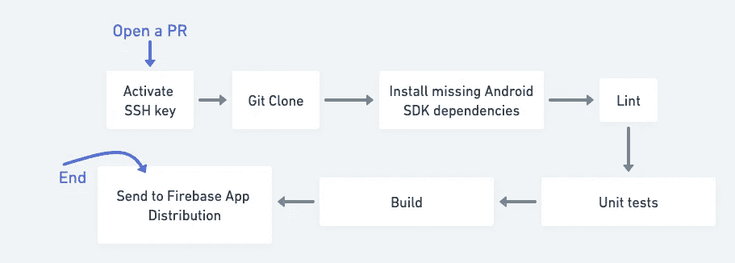
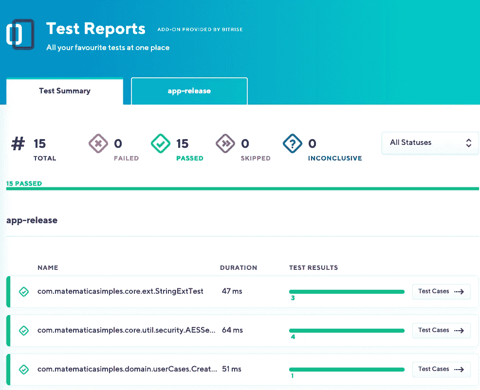
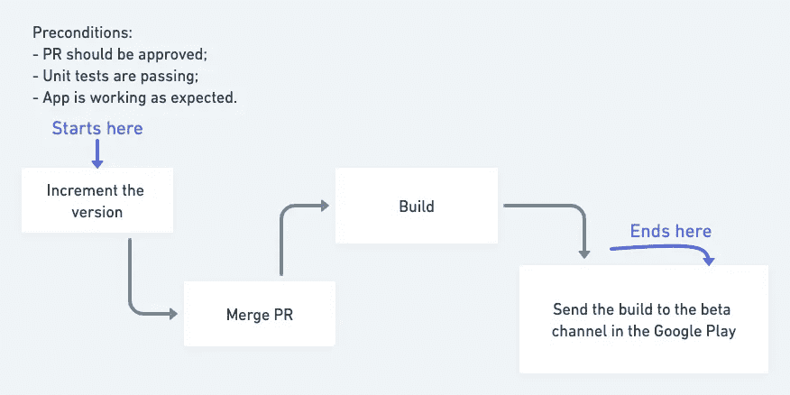
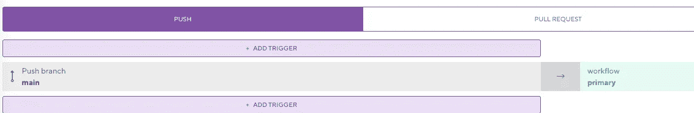
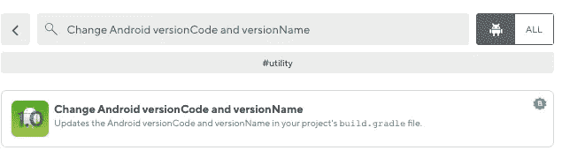
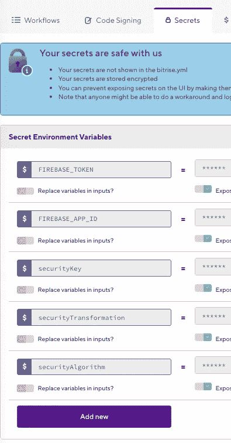

# 在 Android 项目中使用 Bitrise 工作流节省时间

> 原文：<https://betterprogramming.pub/saving-time-using-bitrise-workflows-in-android-projects-77f1d535d902>

## 使用此 CI/CD 工具更快地发布应用程序

照片由[Djim Loic](https://unsplash.com/@loic)——[Unsplash](https://unsplash.com/photos/ft0-Xu4nTvA)拍摄

在⌛️.软件开发中，时间是非常宝贵的资源重复性任务，如运行单元测试🧪，生成构建📦，或向某些用户发布🏁当开发人员手动创建它们时，可能会成为瓶颈。

本文的主要思想是展示如何在 Android 项目中使用 Bitrise 来节省时间的概述。

# 出发点

没有蛋糕食谱，但我认为回答以下问题是一个很好的起点:

*   我的项目中使用的版本系统是什么？
*   我的工作流程中有拉动式请求(PRs)吗？有人在审查我的代码吗？
*   有基地分支吗？
*   谁需要访问发布来进行测试？
*   app 发布了吗？
*   有没有任务板或者工单系统，我需要在那里更新任务或者 bug 的进度？
*   我有单元测试要运行吗？我需要运行这些测试的频率是多少？
*   我是否有证书文件，例如运行应用程序所需的密钥或令牌？

# 在 Bitrise 上创建工作流

Bitrise 是一个移动 CI/CD(持续集成和持续交付)平台，在这里可以创建自动化的工作流。因此，如果您有前面问题的答案，现在是时候创建 Bitrise 工作流来满足您的需求了。

我将展示一个个人项目的两个手动过程，我将其转换为 Bitrise 工作流。

## **开公关**

从打开一个 PR 开始，如果它被批准，我需要运行所有的单元测试。之后，我向 Firebase 应用程序发行版发送一个构建，特定用户将在合并之前测试修改。下图显示了手动流程的工作方式:

手动流程 1 —打开采购申请

在这个手动过程中，检查工具是一个很好的学习案例:

*   GitLab :存储库所在的位置；
*   **Firebase 应用分发**:发布构建的地方。

完全自动化这一手动过程的主要任务是“教会”Bitrise 如何:

*   克隆存储库；
*   每当开发人员打开一个 PR 时，监视存储库；
*   生成构建工件；
*   在 Firebase 应用程序发行版中分发构建工件。

要在 Bitrise 中创建项目，您需要指定指向您的存储库的 Git URL。你必须将你的项目定义为一个 Android 项目。之后，你可能就有了一个工作流模板。

在工作流模板中，您需要定义一个触发器。什么是工作流应该开始的时间。为此，Bitrise 使用 Webhooks 在 Gitlab 服务器(或 GitHub、Bitbucket，它们都以类似的方式工作)中运行一个额外的逻辑。我有一个图像，显示了为从任何分支(特性分支)到基本分支(主分支)的每个 PR 定义的触发器。

定义触发器—工作流 PR

每次打开 PR 时，工作流程都应该在 Bitrise 服务器中运行。

工作流程公关

每次工作流启动时，Bitrise 都必须访问存储库。您需要为此设置一个 SSH 密钥。放心吧！你需要做一次。

另一个很好的工具是测试报告。执行测试后，Bitrise 会生成一份报告:

测试报告— Bitrise 示例。

要使用 Firebase 应用程序分发来分发您的应用程序，您需要在工作流程中添加一个新步骤。Bitrise 提供了一个步骤库。在那里，您可以根据自己的需求找到改进工作流程的步骤。

为 Firebase 增加一个新步骤。

例如，如果您必须更新一张 JIRA 的机票，您可以寻找一个步骤来处理它。有时你有不止一个选择:

另一个步骤示例—更新 JIRA 机票

工作流 PR 帮助我在每次打开 PR 时运行所有的单元测试。我还定义了一个触发器，当一个新的提交发生在已经打开的 PR 上时。

## **发布版本**

手动流程发布版本和手动流程打开请购单之间的区别在于任务:

*   递增版本；
*   不要运行单元测试；
*   将版本发送到 Google Play 的测试频道。

手动流程 2 —发布版本

首先，我们需要定义触发器。每次我在主分支中提交一个变更(关闭一个 PR)都是一个好的选择。

定义触发器-主要工作流

我们可以使用以下步骤增加版本:

更改版本代码和版本名称的步骤。

这一步有两个输出变量:`ANDROID_VERSION_NAME`和`ANDROID_VERSION_CODE`。您可以在 Bitrise 的构建期间修改`build.gradle`来捕捉这些值。

使用 Step 提供的环境变量的代码示例。

Bitrise 有一个将构建发送到 Google Play 的步骤:

Google Play 部署

在此步骤中，还可以定义应用程序可用的曲目。在我的情况下，我使它在“测试”轨道可用。在这一步中，您必须在 Google Cloud 上创建一个服务帐户。之后，您将拥有一个 JSON 文件，允许 Bitrise 使用该帐户向 Google Play 发送构建。

# 最后但同样重要的是…

您可以在 Bitrise 中创建环境变量和秘密变量:

秘密变量示例。

这些变量很敏感，所以最好在本地环境(Git 会忽略)和 Bitrise 中定义它们。因此，您可以根据生成您的构建的环境来使用这两种方法。

您也可以将变量作为资源提供:

# 结论

自动化耗时的任务在开始时可能是一个挑战，但是在配置工作流的最初努力之后，您将看到在开始时花费的时间将很快恢复。

这篇文章的想法只是给出一个概述。如果您对某个具体步骤感兴趣，请随时发表评论。我很乐意提供链接和参考资料。

谢谢！