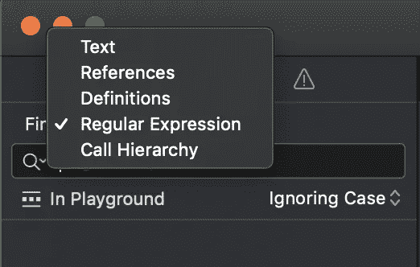

# 在 Swift 中使用正则表达式节省时间

> 原文：<https://betterprogramming.pub/saving-time-with-regular-expressions-f48e6c632521>

## 使用 R.swift 清理 NSLocalizedString 和 UIImage 引用


照片由[布拉德在](https://unsplash.com/@bradneathery?utm_source=medium&utm_medium=referral) [Unsplash](https://unsplash.com?utm_source=medium&utm_medium=referral) 上整理

我最近接到一个任务，要实现一个奇妙的库，名为 [*R.swift*](https://github.com/mac-cain13/R.swift) *，*，它会清理项目中的所有资源，并允许它们被轻松引用。

这篇文章不会详细介绍这个库。相反，我想向您展示 Xcode 的“用正则表达式查找和替换”功能有多有用，以及它如何帮助我节省了大量时间，而我本来是要花大量时间不厌其烦地逐一修复数百行代码的。

任务是使用 R.swift 获取资源的方式替换我们所有的`NSLocalizedString`和`UIImage`引用。

例如，获取如下本地化字符串:

```
NSLocalizedString("common_cancel", comment: "Cancel")
```

必须替换为以下内容:

```
R.string.localizable.common_cancel()
```

由于我们的应用程序中有超过 1，000 个本地化的字符串和图像资源，一次替换一个引用将是一项非常耗时的任务。幸运的是，我发现了一个非常棒的 Xcode 特性，这正是我所需要的。

# 使用正则表达式查找和替换

正则表达式，或称 *regex* ，允许您使用特殊的语法定义一个搜索模式，匹配您可能正在寻找的任何文本。它还允许您捕获部分文本以供重用。

如果您还没有使用过这个 Xcode 特性，您可以在项目导航器中找到这个选项。



点击“查找”，切换到“替换”。点击“文本”，切换到“正则表达式”。

考虑这个表达式:

```
NSLocalizedString\("(.*)",(?:.*)
```

它的作用是查找任何以`NSLocalizedString`开头的文本，并存储第一个参数的引号内容。因为这是我需要捕捉的全部内容，所以我忽略了第一个参数之后的每个字符。

让我们把这个表达式再分解一下。

`NSLocalizedString`后面的反斜杠需要用来转义左括号字符。

请注意，特殊字符需要使用反斜杠进行转义。如果遇到表达式不起作用的问题，请确保对特殊字符进行了转义。

`(.*)` 括号内创建一个编号的捕捉组。这允许您存储与表达式匹配的字符串的一部分，以便以后提取。

*点*表示任何字符，而`asterisk`表示前面的正则表达式标记的零个或多个实例。因此，无论括号中的内容是什么。

在我的例子中，它将捕获`common_cancel`，这是我的本地化字符串资源的名称。这是我关心的文本部分，也是我的字符串替换所需要的。

`(?:.*)` 带问号和冒号的括号创建一个非捕获组。其中的内容被丢弃。由于括号中包含另一个点和星号，它忽略了我的代码行中的其余字符。

所以，现在我的正则表达式匹配了项目中所有的`NSLocalizedString`实例，我准备用下面一行替换它们:

```
R.string.localizable.$1()
```

`$1` 是包含我捕获的文本的编号引用。如果我点击替换，我就能得到我想要的。

```
R.string.localizable.common_cancel()
```

太神奇了！表达式匹配的所有数百个实例都立即被替换为我需要的新代码行。节省了大量的时间。

# 更新图像资源

我必须做的下一个更新与上一个例子非常相似。该资源在我的项目中每次被`UIImage` 引用。

得到这样的图像:

```
UIImage(named: "menuIcon")
```

不得不由 R.swift 引用图像的方式代替:

```
R.image.menuIcon()
```

同样，唯一需要捕获的是图像的名称。在这个例子中，它是`menuIcon`。

这是我使用的正则表达式:

```
UIImage\(named: "(.*)"\)
```

它匹配了我所有的`UIImage`引用，并存储了我需要的图像名称。与上一个示例类似，我用下面这行代码替换了所有的引用:

```
R.image.$1()
```

导致以下结果:

```
R.image.menuIcon()
```

至此，我完成了。本来要花我几个小时的事情，现在只花了我几分钟。

如果您遇到类似的技术债务任务，尝试看看是否可以利用正则表达式查找和替换。在从事这项工作时，我是一个完全的正则表达式初学者，所以这对我来说是一个很好的成就。当我让一切都运转起来时，我非常激动。

希望这篇文章对你们有些人有所帮助。最后，看看 r .斯威夫特。这是一个非常棒的工具，我强烈推荐，并将在我未来所有的 iOS 项目中使用。