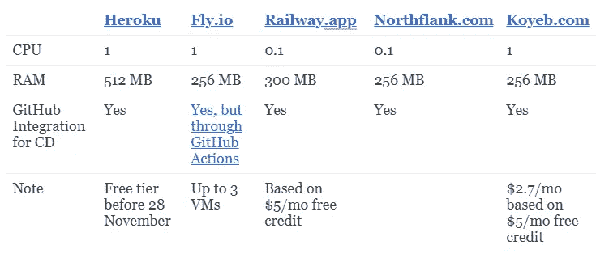
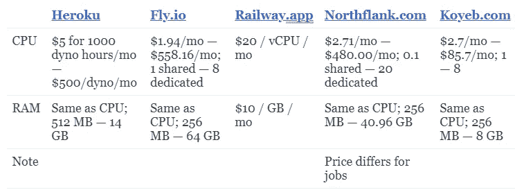

# 告别 Heroku 免费层——这里有 4 种选择

> 原文：<https://betterprogramming.pub/say-goodbye-to-heroku-free-tier-here-are-the-4-alternatives-8d82bb10b495>

## 深入的指南，包括比较


照片由 [Growtika 开发商营销](https://unsplash.com/@growtika_developer_marketing_agency?utm_source=medium&utm_medium=referral)在 [Unsplash](https://unsplash.com?utm_source=medium&utm_medium=referral) 上拍摄

2022 年 11 月 28 日对于开发商来说是个悲伤的日子。如果您还没有听说，Salesforce (Heroku 的母公司)将在今天逐步取消其自由层计划。

多年来，Heroku 一直是事实上的标准平台即服务(PaaS)。所以很多学生和开发者在 Heroku 上部署了他们的第一个 web 应用。有趣的是，Heroku 对我的职业生涯至关重要。

*TL；博士，如果你正在寻找 Heroku 免费层的替代品，检查出*[](https://free-for.dev/#/?id=paas)**。我把我的 Cron 作业迁移到了*[*north flank*](https://northflank.com/pricing)*，把 Heroku Dynos 迁移到了*[*Koyeb*](https://www.koyeb.com/)*。**

# *发生了很多事情*

*就背景而言，对于 Heroku 来说，2022 年发生了很多事情。两个最引人注目的事件是:*

1.  *2022 年 4 月，Heroku 出现安全漏洞([事件](https://status.heroku.com/incidents/2413))，CI 和 Review App 机密遭到泄露。Heroku 上的 GitHub Actions 集成关闭了几个月。从 Heroku 发来的通讯客观上很糟糕。当我不得不求助于使用 GitHub CI 动作来部署我的应用程序时，我亲身经历了这一点。*
2.  *2022 年 8 月， [Heroku 宣布取消他们的免费产品计划](https://blog.heroku.com/next-chapter)。*

*如果你一直在看互联网，你会看到人们对 Heroku 如何失去魔力表示担忧。自从安全漏洞事件以来，我看到了更多关于 Heroku 替代方案的讨论。*

*尽管事情开始变得糟糕，但赫罗库提供的东西仍然很棒，我决定坚持下去。直到现在，那是。*

# *Heroku 替代方案*

*在过去的几周里，我一直在把我的演示和小项目从 Heroku 转移出去。*

*如果你仍然在寻找 Heroku 免费层的替代品，请查看[free-for . dev](https://free-for.dev/#/?id=paas)([GitHub](https://github.com/ripienaar/free-for-dev))。*

*虽然现在互联网上散布着许多博客文章和推荐，但 free-for.dev 提供了最好的覆盖面。该列表附有对每个 Heroku 备选方案的简要描述。*

# *我在找什么*

*请注意，我的用例主要用于小规模的个人项目。因此，无论我写了什么，对您的用例来说可能都不理想。*

1.  *CPU 和 RAM 方面的等效空闲层。(剧透:没有一样好)*
2.  *开箱即用的 Cron 作业支持。理想情况下，不需要奇怪的变通方法*
3.  *自定义域*
4.  *GitHub 集成*
5.  *支持基本的日志记录和监控(即 CPU、内存、磁盘、网络指标)*

*我主要关心的不是每个 PaaS 的带宽成本和支持区域。*

# *我的选择*

*Heroku Postgres——2022 年 5 月起，[我从 Heroku Postgres 迁移到铁路](https://jerrynsh.com/saying-goodbye-to-heroku-postgres/)。到目前为止，我对此毫无怨言。我关注的另一个选择是[行星尺度](https://planetscale.com/)。然而，我没有去找它，因为它与 Postgres 不兼容。*

*heroku Dynos apps—[Burplist](https://burplist.me/)被迁移到 [Koyeb](https://www.koyeb.com/tutorials/migrate-from-heroku) 。在尝试了其他著名的 Heroku 替代方案，如 [Fly.io](https://fly.io/docs/rails/getting-started/migrate-from-heroku/) 、 [Northflank](https://northflank.com/docs/v1/application/migrate-from-heroku) 和 [Railway](https://railway.app/heroku) 之后，我可以有把握地说，从 Heroku 到 Koyeb 的迁移需要最少的努力和困难。它只是在我的情况下工作。*

*heroku Scheduler——对于我的 Cron 任务，我选择了 Northflank。他们对 Cron jobs 的支持是迄今为止最好的。撇开价格不谈，开发者体验比 Heroku Scheduler 好得多。*

*Heroku 附件—不适用于我的情况。我依赖 Heroku 插件进行监控和日志记录。幸运的是，今天大多数现代 PaaS 都支持开箱即用。*

# *一些想法*

*可悲的是，大多数 Heroku 替代品的免费计划都不如 Heroku。例如，大多数自由计算实例是一个共享 CPU 和 256 MB RAM (Heroku Free Dynos 从 512 MB RAM 开始)。还没有考虑到允许的有限数量的应用程序。*

*令人惊讶的是，大多数 PaaS 仍然不支持原生运行 Cron 作业。再次向 Northflank 大声疾呼，感谢它为开发者提供了如此丰富的体验。*

*对于 Koyeb，在撰写本文时，自由层支持的区域非常有限。*

*最后，[render.com](https://render.com/pricing)是市场上另一个受欢迎的选择。你可能想去看看。*

# *成本比较*

*截至 2022 年 11 月 21 日更新。*

## *自由层*

**

*图片来源:作者*

## *定价*

**

*图片来源:作者*

*这里我没有提到的一点是带宽成本(入站+出站)。对于更大的项目，这可能是你需要认真考虑的事情。*

# *他们感觉…不一样*

*也许我有偏见。没有任何明显的替代 Heroku 免费层(至少不符合 Heroku 的慷慨)。抛开免费计划不谈，大多数都不能提供和 Heroku 一样的开发者体验。*

*在我看来，Heroku 自由层是软件工程有史以来最好的事情之一。*

*我很欣赏 [Heroku 的自由工作时间](https://devcenter.heroku.com/articles/free-dyno-hours)。我不介意 dynos 进入睡眠状态，只在需要时被唤醒——这意味着我可以一次托管多个演示，并且只在需要时消耗我的免费限制。*

*需要快速向某人展示某样东西？只需把你的网址发给他们。几秒钟后就好了，我完全不介意冷启动。这种开发者体验是所有现有平台都无法给予的，至少用他们的免费计划无法给予。*

*虽然我是一个快乐的付费客户，但每月支付 5 美元购买我 99%的时间都不使用的东西却让人感到很恼火。*

# *结束语*

*可悲的是，事实就是如此。互联网是一个崎岖不平的地方。如果你在互联网上提供免费服务，人们会想办法滥用它们。我记得[举办了我的第一次网址缩写](https://jerrynsh.com/i-built-my-own-tiny-url/)。这项服务在我公开的第一天就收到了垃圾邮件。我必须实现验证码和过期链接，以减少滥用。*

*今天，每当我看到由个人创造的“真正免费”(*如果你知道我指的是什么*)的东西，我不禁想知道他们将如何出于善意持续地保持光明。我讨厌看到某人的良好愿望落空。也许我们应该开始为网络支付费用。*

*虽然我几乎每天都使用 AWS 等云服务，但 Heroku 等 PaaS 在我心中一直占据着特殊的位置。*

*Heroku 太棒了。我认为，除了间接倡导免费教育(以这种或那种方式)，它在提高 PaaS 领域的标准方面做了很大的工作。*

*谢谢你，赫罗库，我从心底里感谢你。*

```
***Want to Connect?**

Originally published at [jerrynsh.com](https://jerrynsh.com/bid-farewell-to-heroku-free-tier/)*
```