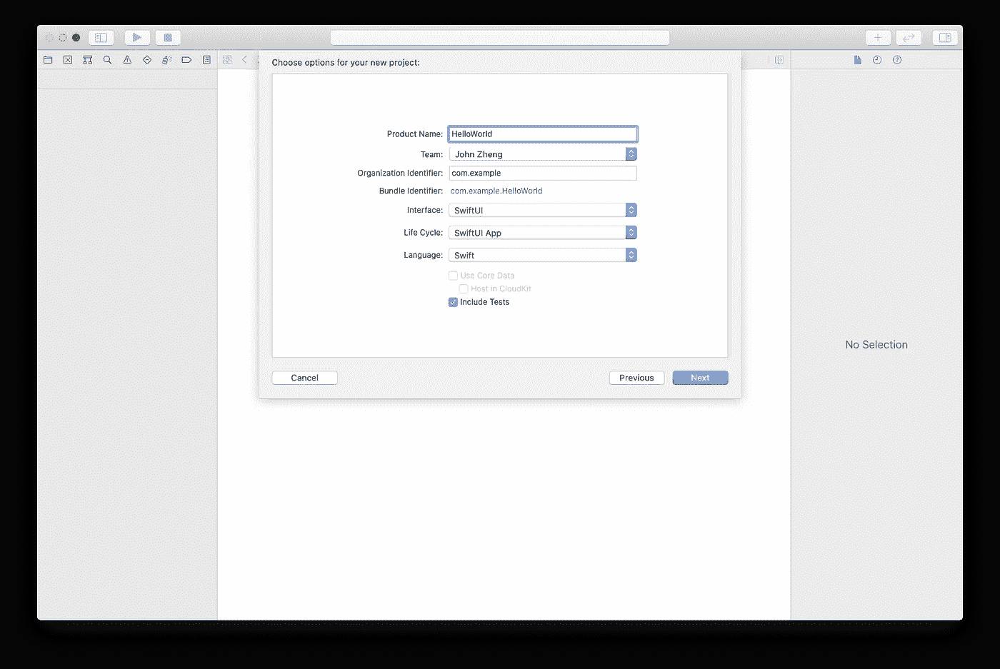
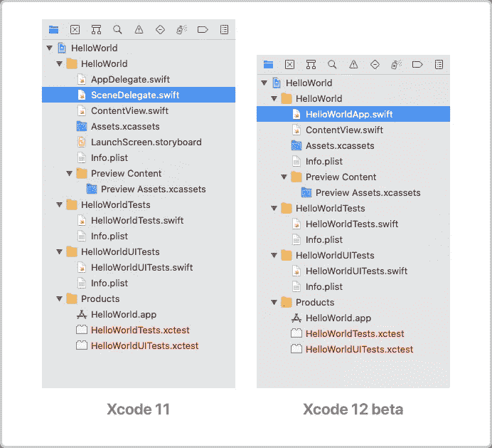

# 告别 SwiftUI 中的 SceneDelegate

> 原文：<https://betterprogramming.pub/say-goodbye-to-scenedelegate-in-swiftui-444173b23015>

## 17 行代码如何替换两个完整的文件

Jonathan Kemper 在 [Unsplash](https://unsplash.com?utm_source=medium&utm_medium=referral) 上拍摄的照片。

SwiftUI 是构建应用程序的好方法。它简单、简洁、快速。UIKit 中的内容可以在 SwiftUI 中用一半的代码重新创建。过去需要几周的事情现在只需要几个小时。但是直到今天，它 *um* … 还是依赖于 UIKit。

要显示用 SwiftUI 创建的视图，您必须将它包装在一个`UIHostingController`中，这个`UIHostingController`必须包装在一个`UIWindow`中，这个`UIWindow`必须在`SceneDelegate`中定义:

对于一个为简单性和性能而设计的框架来说，所有这些代码都没有意义。为什么要写 30 行代码来定义一个视图呢？！

今天在 WWDC20 上公布了一个解决方案:`App`。

嗯，`App`？是的，`App`。`App` 协议。简单到说了几次就觉得怪怪的。

在 Xcode 11.5 到 [Xcode 12 beta](https://developer.apple.com/download/) 中，你会在创建 SwiftUI app 时看到一个新选项:“SwiftUI App。”

什么，苹果是想给 Xcode 加个回声发生器吗？不尽然——它实际上是“生命周期”的两个选项之一:

“生命周期”指的是应用程序的状态，通常是“活动”、“非活动”或“后台”我们用它在启动时显示用户界面，并在退出时保存用户数据。

以前，这是在`AppDelegate`和`SceneDelegate`中处理的，这使得管理应用程序状态变得很麻烦——它分散在两个文件中！两个。文件。荒谬！

嗯，如果你选择“SwiftUI App”并创建项目，你会注意到`AppDelegate` *和* `SceneDelegate`都不见了！取而代之的是一个名为`<App Name>App`的文件来代替它们！

想知道`HelloWorldApp`里有什么？你不会相信的:

就是这样！怎么会？苹果用什么魔法把两个完整的*文件*代码替换成了 17 行(包括注释)？

虽然“生命周期”事件听起来很重要，但大多数人只会碰一两次`AppDelegate`或`SceneDelegate`。代码清理、状态更改和大多数其他重要事件都是自动处理的。你不需要担心这些。和保存数据？一个好的应用程序可以即时保存，而不是在其生命周期结束时保存。生命周期中唯一需要手动修改的部分是入口点。Xcode 需要知道你想要显示什么。

苹果对`App`协议所做的就是将生命周期剥离到单一的、最基本的元素——入口点。每个附加的生命周期都是可选的，您可以在以后添加它。

无论如何，如果您熟悉 SwiftUI，我们的入口点语法并不是什么新东西。它是在一个结构中声明的，这在提高性能的同时也使它易于阅读。

以下面的代码为例，它呈现了一些文本“Hello World！”：

看起来和我们的`HelloWorldApp` struct 非常非常相似！但是，也有一些不同之处:

*   `@main`告诉 Xcode 下面的结构`HelloWorldApp`将是应用程序的入口点。只能用此属性标记一个结构。
*   根据[文档](https://developer.apple.com/documentation/swiftui/app)，`App`是一个“代表应用程序的结构和行为”的协议`HelloWorldApp`符合这一点。这就像你的应用程序的基本视图——不，是应用程序本身。您实际上是在这个结构中写出了您的应用程序的外观。
*   `Scene`—swift ui`View`的主体必须是`View`类型。类似地，SwiftUI `App`的主体必须是类型`Scene` …

等等，什么？不应该是类型`App`吗？嗯，其实，`Scene`在这里更有意义:

> “每个场景都包含一个视图层次的根视图，并且有一个由系统管理的生命周期。”— [苹果开发者](https://developer.apple.com/documentation/swiftui/app)

场景就像是视图的容器，可以自动管理:

> “系统决定何时以及如何以适合平台的方式在用户界面中呈现视图层次结构，并取决于应用程序的当前状态。”— [苹果开发者](https://developer.apple.com/documentation/swiftui/scene)

因为像 macOS 和 iPadOS 这样的平台支持多窗口，将应用程序的所有视图包装在一个`Scene`中使得重用更容易，同时还允许包括活动、非活动和背景状态的“场景阶段”。

*   `WindowGroup`是一个包装视图的`Scene`。我们想要呈现的景色`ContentView`，是一个`View`——而不是一个场景。`WindowGroup`让我们将它们包装成 SwiftUI 可以识别和显示的单个`Scene`。

这就是所有的新语法！

但是如果你*需要*去观察那些可选的生命周期事件，比如用户退出应用程序的时候，该怎么办呢？在旧的`SceneDelegate`中，它看起来是这样的:

这还不算太糟，但是每个生命周期事件都有独立的函数，这使得我们的代码很难管理。

在新的`App`协议中，苹果确保了即使是生命周期的可选部分——那些没有多少人会使用的部分——仍然非常容易实现:

我们首先创建一个属性`scenePhase`，它从系统中获取活动的当前状态。反斜杠(`\`)表示我们使用的是 [keypath](https://www.hackingwithswift.com/example-code/language/what-are-keypaths) ，这意味着我们引用的是属性本身，而不是它的值。每当属性值改变时，就会调用`onChange`修饰符，在这里我们可以获得生命周期状态！

就这么简单。

# 结论

你还会回到`SceneDelegate`和`AppDelegate`吗？如果我有选择，我不会。

问题是，新的`App`协议只适用于使用 SwiftUI 的应用程序——那些使用 UIKit 的应用程序不会得到它。而且 SwiftUI 在功能上还是比不上 UIKit 你得不到集合视图，基于坐标的动画，视觉效果视图等等。

还有，有时候你还是需要`AppDelegate`(对于 Firebase 和主屏幕快速动作之类的东西)。在这种情况下，您可以继续使用`App`协议——只需用`[@UIApplicationDelegateAdaptor](https://gist.github.com/aheze/6998b4bae660c8dade8ba6a75687772c)`扩展它。

在今天的 WWDC20 上，我们得到了很多我们想要的东西，但我们还需要再等几年才能得到所有的东西。

感谢阅读！祝编码愉快，并享受 WWDC 的其余部分！