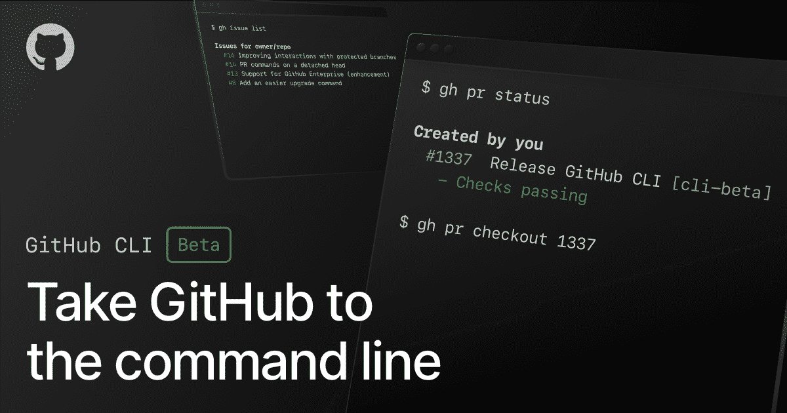
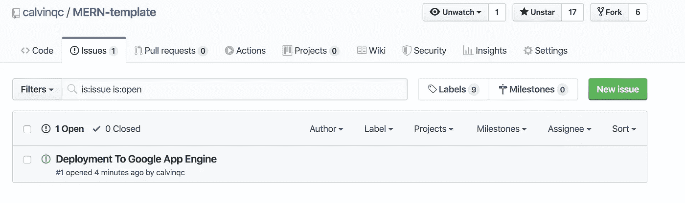
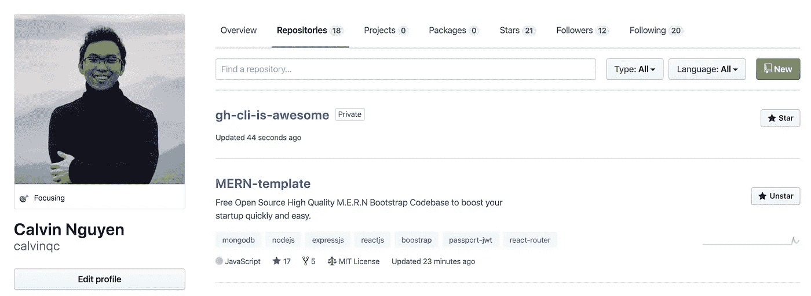

# 向新的 GitHub CLIs 问好

> 原文：<https://betterprogramming.pub/say-hello-to-the-new-github-clis-7e2612fb3918>

## 关于从终端使用 GitHub，您需要知道的是

# 作者说明

问候读者，

本文是“ ***【我与创业公司一起成长】”***系列的一部分，该系列由各种*技术教程、新闻和软件开发技巧*组成:

1.  [用 Node.js(第 1 部分)— ES6](https://medium.com/swlh/a-complete-guide-build-a-scalable-3-tier-architecture-with-mern-stack-es6-ca129d7df805) 构建一个结构良好的三层架构
2.  [提高团队代码质量的两个简单技巧](https://medium.com/swlh/2-simple-tips-to-increase-your-team-code-quality-143b879ae2f7)
3.  [认证的完美结构&用 Node.js 授权你的 API](https://medium.com/swlh/perfect-structure-to-authenticate-authorize-api-with-node-js-and-passport-jwt-d529b1a618ba)
4.  [我在一个小时内构建了一个 M.E.R.N 代码库](https://medium.com/swlh/i-built-a-m-e-r-n-codebase-in-an-hour-742acd71ed7e)(第 2 部分)
5.  [如何用 Java 构建 REST API&MySQL 使用 Tomcat](https://medium.com/@calvinqc/build-a-simple-rest-apis-with-java-8-tomcat-jsp-mysql-intellij-on-mac-3308f4e59a03)
6.  [使用 Nodemailer、Gmail & Google OAuth2](https://medium.com/swlh/multi-purposes-mailing-api-using-nodemailer-gmail-google-oauth-28de49118d77) 构建自己的邮件 API
7.  [WebRTC——支持 Google Meet、Facebook Messenger 的技术](https://medium.com/swlh/webrtc-the-technology-that-powers-google-meet-hangout-facebook-messenger-and-discord-cb926973d786)
8.  向新的 Github CLIs 问好
9.  [使用 Java、Springboot、Kafka 进行简单设置](https://levelup.gitconnected.com/easy-java-springboot-apache-kafka-setup-on-macos-ceb481e167f8)
10.  [成功的团队合作需要什么](https://levelup.gitconnected.com/what-it-takes-to-have-a-successful-team-cooperation-bc21b82e9f3)
11.  [如何使用 Docker、EC2、ECS 和 ECR 将应用程序部署到 AWS](https://medium.com/swlh/how-to-deploy-an-application-to-aws-using-docker-ecs-and-ecr-aa7785fc9667)
12.  [通过将我们的客户端托管到云存储，我们节省了 45%的总成本](https://medium.com/@calvinqc/we-cut-down-45-of-our-budget-by-switching-to-google-cloud-storage-7e5a6a10542)

感谢访问这个系列，并享受阅读！



来源于 Github

GitHub 工具都很棒，但有时，我在编写代码时会感到筋疲力尽，不得不从终端/文本编辑器切换到浏览器中进行多次点击，只是为了创建或查看一个 PR。

幸运的是，2020 年 3 月 6 日，GitHub 发布了一个新的很酷的 GitHub CLI，用它你可以在你的本地终端上*做你在 github.com 上做的任何事情。在这个测试版中有三个主要的命令，我将在下面讨论:*

1.  问题
2.  拉式请求
3.  被卖方收回的汽车

# macOS:使用 brew 轻松安装

```
brew install github/gh/gh
```

## 提升

```
brew update && brew upgrade gh
```

# Windows 操作系统

`gh`可通过[勺](https://scoop.sh/)获得:

```
scoop bucket add github-gh https://github.com/cli/scoop-gh.git
scoop install gh
```

对于 Linux 等平台，请参考这个 [GitHub 页面](https://github.com/cli/cli/releases/tag/v0.6.1)。

# 1.gh 问题[创建、列表、查看、状态]

## 制造一个问题

```
~/Documents/MyProject (master)$ **gh issue create**
Creating issue in calvinqc/MERN-template? Title Deployment To Google App Engine
? Body <Received>
? What's next? Submit
[https://github.com/calvinqc/MERN-template/issues/1](https://github.com/calvinqc/MERN-template/issues/1)
```

或者，如果您仍然喜欢在浏览器中编辑，请快速输入:

```
$ gh issue create --web
```

## 列出所有问题

```
$ gh issue list
Issues for calvinqc/MERN-template#1  Deployment To Google App Engine
```

## 查看问题

```
$ gh issue view 1
```

然后，它会将我重定向到问题链接。



或者您也可以在本地预览:

```
$ gh issue view 1 --preview
```

## 状态

```
$ gh issue status
Relevant issues in calvinqc/MERN-templateIssues assigned to you
  There are no issues assigned to youIssues mentioning you
  There are no issues mentioning youIssues opened by you
  #1 Deployment To Google App Engine about 9 minutes ago
```

# 2.GH pr[状态、列表、查看、结帐、创建]

## 创建公关

```
~/Documents/project/MyProject (gh-testing)$ **gh pr create**
Enumerating objects: 9, done.
Counting objects: 100% (9/9), done.
Delta compression using up to 4 threads
Compressing objects: 100% (5/5), done.
Writing objects: 100% (5/5), 444 bytes | 444.00 KiB/s, done.
Total 5 (delta 4), reused 0 (delta 0)
remote: Resolving deltas: 100% (4/4), completed with 4 local objects.
To github.com:calvinqc/MERN-template.git
   1c179cb..7953ecc  HEAD -> gh-testing
Branch 'gh-testing' set up to track remote branch 'gh-testing' from 'origin'.Creating pull request for gh-testing into master in calvinqc/MERN-template? Title Change sha256 to bcrypt
? Body <Received>
? What's next? Submit
[https://github.com/calvinqc/MERN-template/pull/2](https://github.com/calvinqc/MERN-template/pull/2)
```

如你所见，如果说有一件事我喜欢`gh pr create`，那就是*会将你的提交推送到你的工作分支*，并在几秒钟内创建一个 PR。

## 与 PR 一起列出/查看/状态(与问题相同)

```
$ **gh pr list**Pull requests for calvinqc/MERN-template
#2  Change sha256 to bcrypt  gh-testing$ **gh pr view 2**
Opening [https://github.com/calvinqc/MERN-template/pull/2](https://github.com/calvinqc/MERN-template/pull/2) in your browser$ **gh pr status** Relevant pull requests in calvinqc/MERN-templateCurrent branch
  #2  Change sha256 to bcrypt [gh-testing]
   - Checks passingCreated by you
  #2  Change sha256 to bcrypt [gh-testing]
   - Checks passingRequesting a code review from you
  You have no pull requests to review
```

## 签出请购单

这非常类似于常规的分行结帐。

```
$ gh pr checkout 2
```

# 3.GH repo[克隆、创建、派生、查看]

## 克隆一个回购

```
$ gh repo clone [git@github.com](mailto:git@github.com):calvinqc/MERN-template.git
```

## 创建/查看回购

```
$ gh repo create gh-cli-is-awesome
$ gh repo view calvinqc/gh-cli-is-awesome
Opening github.com/calvinqc/gh-cli-is-awesome in your browser.
```



## 叉回购

```
$ gh repo fork calvinqc/MERN-template
```

# 未来改进

由于这仍然是测试版，我还没有发现任何错误，我相信这些很酷的 Git CLIs 将有助于提高许多开发人员的生产力。

这就是这个测试版。它让我的发展更好，我喜欢它！

用 GitHub CLIs 少点鼠标，多点键盘——我的工作效率就越高。

感谢你的阅读，我希望它能让你感到更快乐！

# 后续行动

*   如果你喜欢阅读 ***《我与创业公司一起成长*** 》，并希望在未来阅读更多。请在此订阅[。​](http://eepurl.com/g5qIBf)
*   在 [Github](https://github.com/calvinqc) 、 [LinkedIn](https://www.linkedin.com/in/calvinqc/) 上与我联系