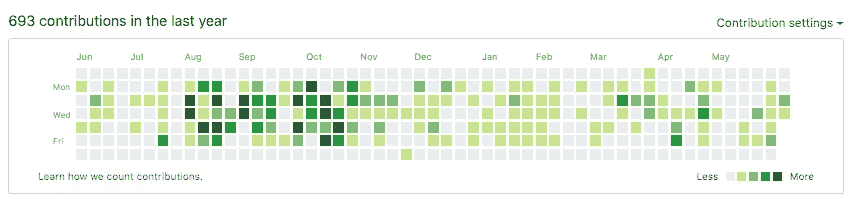

# 大声说出来，自豪地说出来:我是非凡的

> 原文：<https://betterprogramming.pub/say-it-loud-say-it-proud-i-am-remarkable-aedfa555c809>

## *旨在支持妇女和代表性不足群体谈论其成就的研讨会报告*

作者照片。

*Zone 高级前端开发人员 Kayleigh Ridd 报道了一个旨在支持妇女和代表不足的群体谈论其成就的研讨会。*

谈论和庆祝你的成就是在工作场所获得认可的一种强有力的方式——不这样做可能会成为晋升的障碍。对于那些代表性不足的群体来说，缩小领导层的多样性差距更为重要。

但对我和许多其他人来说，这不是一件容易的事。对于女性来说，社会压力要求她们谦虚，不要自夸。有人告诉我们，我们的努力会证明一切。除此之外，那些选择自我推销的人可能会被他们的同行(以及他们自己)严厉地评判。所有这些都意味着很难在不感到不舒服的情况下直接谈论我们的成就。

我最近参加了谷歌的 iam apparent workshop，这是一个支持女性和代表性不足的群体轻松谈论她们的成就并挑战自我推销的社会观念的倡议。以下是我学到的一些重要的东西。

# **成绩不会说话**

第一个重要的教训是，我们的成就不会自己说话。如果我们等待别人注意到我们的成就，这可能永远不会发生。如果不大声说出来，我们就有可能落后于那些大声说出来的同龄人——即使我们和他们一样努力(或者比他们更努力)。

这一点非常重要，例如，当你要升职的时候。能够把你的成就列表交给你的经理和团队，让他们认识到你能为这个职位带来什么，并让你能够控制别人对你的看法。

# **有事实根据的就不是吹牛**

吹牛会让人感觉不舒服，那种尴尬的感觉会让我们羞于庆祝自己的成就。我们都听说过“无耻的自我推销”这个词但是研讨会的第二大收获是“如果它是基于事实的，那就不是吹牛。”这是一种非常有效的方式来重塑我们对谈论自己的看法。

对我来说，这意味着自我推销不应该是自我放纵的(正如吹牛所暗示的那样)。我正努力帮助他人了解我能做出的贡献和我能提供的技能。专注于事实，谈论我们所做的工作或我们已经完成的事情并不是吹牛。这就是我说“我有两年专业编写 JavaScript 的经验，在此期间，我是三个大规模应用程序的主要贡献者”和“我对 JavaScript 相当陌生，但我已经很擅长了”之间的区别即使作为一个例子，我写起来也觉得很奇怪。

去年我的代码贡献的可视化表示

# **付诸实践**

自我推销是一种技巧，需要通过练习才能感到舒适和正确。为了帮助我们开始练习，工作坊给了我们一个简单的练习。我们开始写日记，完成陈述“我是非凡的，因为…”

首先，这感觉非常困难。我花了一点时间来写我的第一份声明。

*“我很出色，因为……我每天都花时间支持我的团队成员。”*

这看起来是件小事，但却是我引以为豪的事情。这是一小步，我需要它来建立更大的东西，并允许自己谈论自己而不道歉。

一旦我写完了第一份声明，克服了最初的不确定性，就更容易认识到为什么我如此出色的更多原因。

*“我之所以出色，是因为我每天都在应对新的挑战，不断将自己推出舒适区。”*

*“我之所以出色，是因为我向用户事件库(一个被超过 55 万个项目使用的 repo)提供了错误修复代码，以支持一个新的用例。”*

“我很出色，因为我的同事提名我获得内部奖项。”

*“我不平凡是因为，因为，因为……”*

每次都以“我之所以不同凡响，是因为……”这句话开始，这真的很有力量，给了我为自己感到骄傲的空间，也让我试着抑制内心的呼喊，“她以为她是谁？”

# **大声说出来**

练习的第二部分是向对方大声朗读两个陈述。这有力地提醒我们，在内部认可我们的成就是强大的，但向他人宣扬这些成就是重要的一步。

对自己说，“我做的这件事让我变得不同凡响”从一开始就够难的了，所以大声说出来感觉相当令人生畏。这让我感到脆弱，但克服这一点，说“是的，这是我引以为豪的事情”是令人振奋和授权的。

我工作室里的一群人都有着同样的感受，并且非常支持我。听到其他人谈论他们的成就令人感动，为这些我从未见过的人感到骄傲是一件美妙的事情。

# **你很了不起**

这并不是我独有的挑战，如果表达你的才能和贡献不是天生的，这里有一些我认为有用的建议:

*   写下来。从“我很出色”的练习或任何对你有用的事情开始，但是写下这些话有助于将信息内化，并给你一个可以回头参考的成就列表。
*   不要听从你内心的批评。如果它告诉你你写的东西不够出色，不要担心。把它放下。
*   不要对自己太苛刻。自我推销是一项需要练习才能达到目的的技能，所以要不断尝试——即使很困难。
*   不要对别人太苛刻。创造一个空间，让我们可以为自己感到自豪，并允许他人不加评判，这一点至关重要。

要了解谷歌的[iam 卓越](https://iamremarkable.withgoogle.com/)计划的更多信息，请加入 [LinkedIn](https://www.linkedin.com/groups/12074882/) 群组获取更新。

感谢阅读！