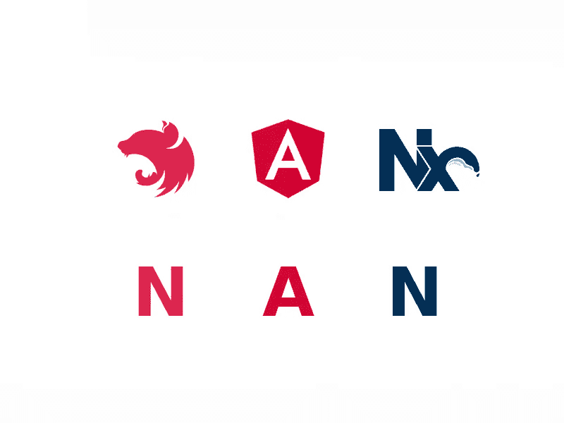

# 向南栈问好！

> 原文：<https://betterprogramming.pub/say-welcome-to-the-nan-stack-8e84cda6fdd0>

## NestJS、Angular 和 Nx

作者照片。

# 用 Express 和 Angular 与 Nest 反应

Node.js 最流行的框架还是 Express.js，前端有 Angular、React、Vue 三大王者。在添加了最流行的 NoSQL(类似于 JavaScript 对象)MongoDb 之后，我们得到了 JavaScript 开发人员最流行的堆栈组合:MEAN、MERN 和 MEVN。

我们可以在 React 和 Express 之间找到很多相似之处。这两种解决方案都是基于 JavaScript 的极简方案，它们只在核心版本中提供最基本的功能。它们在选择工具和构建应用程序方面提供了很大的灵活性。

对于 [Angular](https://angular.io/) 来说，服务器端的对等物是 [NestJS](https://nestjs.com/) ，其创造者在工作时受到了谷歌同事的解决方案的强烈启发。

以下是这些框架区别于其他框架的共同点:

*   打字稿语言的使用
*   装饰者的广泛使用
*   基于模块的依赖注入系统(具有导入、导出和提供者)
*   一组官方支持的第三方库
*   功能丰富的框架核心，具有许多现成的功能
*   硬币指示器 （coin-levelindicator 的缩写）命令行界面（Command Line Interface for batch scripting）

这些方法各有利弊。最大的缺点是在一个堆栈中混合不同的编码理念。虽然 MERN 堆栈的元素配合得非常好，但不能说平均堆栈也是如此。

这就是为什么我想提出一个更好的替代方案:NAN 堆栈。

# NAN 堆栈

NAN 堆栈由三种技术组成:NestJS、Angular 和 Nx。NestJs 和 Angular 的自然组合如上所述。 [Nx](http://nx.dev/) 是一套帮助你使用 monorepos 的工具，在开发大型单个应用时也是必不可少的。对于全栈开发人员来说，在后端和前端之间共享代码、工具和存储库的能力不能被高估——Nx 提供了更多。

更重要的是， [nrwl](https://nrwl.io/) 也注意到了上面描述的依赖性，并开始支持使用 Angular-Nest 或 React-Express 组合来创建项目的可能性。

# 关系数据库并没有消失

南和 MERN 的最后一个重要区别是省略了数据库。在新堆栈中包含一个将是不必要的限制。一个优秀的后端或全栈开发人员应该熟悉 NoSQL 数据库和经典的关系数据库。也许更重要的是，他们应该能够有意识地为项目需求选择一个合适的数据库，在这种情况下，技术栈不应该是决定性因素。

我在这里的意思是，每个 Node.js 开发人员肯定知道这种技术在某些类型的应用程序中不起作用(例如，计算量大的应用程序),并且应该能够说服涉众考虑一种不同的技术。即使 NoSQL 是你唯一知道的技术，它的选择也应该是合理的。

# 摘要

MEAN stack 非常受欢迎，有几个版本，并为许多公司和开发人员选择开发技术铺平了道路。然而，我们现在有了一个有价值的继任者，那些欣赏 Angular 和 NestJS 风格的人应该迁移到他那里。我相信 NAN 栈将获得同样的受欢迎程度，引入改进，并在 JavaScript 环境中占据其应有的位置。

你可以在 GitHub 上看到一个真实项目[中 NAN 栈的使用。](https://github.com/valueadd-poland/pimp-my-pr/pulls)