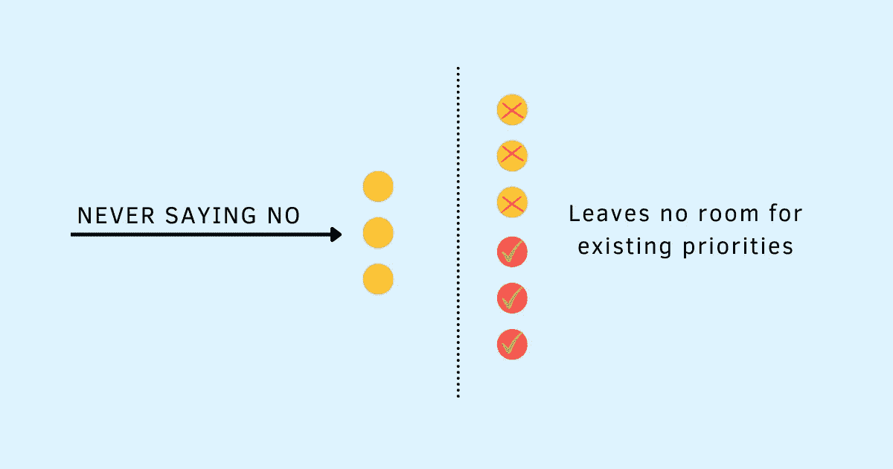

# 对最后一刻的请求说不

> 原文：<https://betterprogramming.pub/saying-no-to-last-minute-requests-81eff31de748>

## “不”帮助你认识到自己的局限性，并让你做出正确的选择

鸣谢:作者

在我职业生涯的早期，我习惯于对每一个最后一刻的请求都热情地说“是”——我正要离开办公室时出现的会议请求，发布前一天所谓的小变化或产品增强，同事让我留下来帮助他们解决生产问题，或者我的经理拉我去做一个迟到的交付品。

最初，一切感觉都很好。能够帮助别人，扑灭火灾，分享我的知识和专业技能让我有成就感。知道别人需要我让我觉得自己很重要。但是多巴胺的作用是有代价的。很快，这些小小的“是”加起来，我就在周末工作到深夜。

试图跟上我现有的承诺，同时为新的承诺腾出空间，这注定会导致压力和焦虑。将所有这些要求纳入一个已经排得满满的日程表让我感到疲惫、精疲力竭。

然而，我没有意识到说不是一种选择。如果我说不，这损害了我的形象怎么办？如果我被贴上了没有帮助或者没有团队精神的标签怎么办？我越是接受这些最后一刻的请求，我的身份就越是和那个来拯救世界的人联系在一起。

不愿意放弃这个身份只会让事情变得更糟——试图让每个人都开心影响了我的健康和个人幸福。曾经是快乐源泉的东西现在感觉像是一种义务——伴随着愤怒、沮丧和不满的感觉。

> “自我关心并不自私。这是必要的。问题是，如果你总是对别人说“是”，把他们的优先放在你自己的前面，你就没有时间和精力去关心自己。你会慢慢变得烦躁、愤世嫉俗、痛苦。”―达蒙·扎哈里亚德斯

我不记得我有这个突破时刻的确切日子，但我对自己说，“够了。我不能继续过这样的生活。”对我来说，是时候从统治我生活的不正常的“是”转变为给我力量的健康的“不”了。

我已经习惯了总是说“是”,以至于拒绝一个请求在开始时有点令人紧张。我担心让老板失望，让同事不高兴，担心说不对我的职业生涯意味着什么。

我明白，虽然有几次我在这件事上没有选择，但大多数时候我有。经过一点点的试错、大量的实践和经验，我学会了拒绝一个请求而不冒犯对方并保持关系完整。

就像我一样，你也能做到。你可以对最后一分钟的请求说不，但看起来仍然像一个团队成员。简单地说“不”,而不暗示你为什么拒绝他们的请求，肯定会让人们望而却步。但是当你以一种深思熟虑的方式去做的时候，大多数人会理解的。至于那些没有的，你也不要为他们烦恼。

以下是我遵循的三个步骤，让我更容易决定和传达我的拒绝:

# 第一步:让别人失望没关系

我们能够说“不”的最大障碍是大脑的情感部分，它将“不”与拒绝感联系在一起。在成长过程中，当我们的父母对我们的要求说不时——我能看电视吗，我能吃糖果吗，我能在床上跳吗——我们会感到强烈的负面情绪。自然而然地,“不”在我们的字典里成了一个邪恶的词。

我们现在已经长大了，但我们脑海中的“不”字仍然会唤起同样的拒绝感。不管我们是接受的一方，还是说不的一方，说不都会带来同样的负面情绪。

作为学会说“不”的第一步，你需要重新连接你的大脑，把“不”这个词从不好的、需要避免的东西转移到必要的、健康的东西上。你需要用新的故事来充实你的大脑——在这些故事中,“不”会帮助你认识到自己的局限性，并让你做出正确的选择。说“不”有助于你信守承诺和建立信任的故事。那些“不”让你放弃付出巨大个人代价的工作的故事。

> “这不是我们父母的错。或者我们的学校。或者政府的。或者我们朋友的。他们都有自己的问题——没必要责怪他们。但也没必要对他们的故事说是。现在是我们构建自己故事的时候了。"―詹姆斯·阿尔图彻

说不会让别人失望不再会带来强烈的负面情绪。说“不”会慢慢地将你大脑中的神经回路从回避“不”转变为接受它。你将学会做出正确的选择，而不是听天由命，对一切顺其自然。

你可以通过优先考虑你自己的幸福、个人健康和精神健康来加倍你的影响和你增加的价值，而不是避免伤害他人或试图让每个人都开心。

# 步骤 2:将请求放在更大的图片中

知道何时以及为什么说不和知道如何说不一样重要。

不要不假思索地回答是或否，而是使用以下维度来评估请求:

1.  机会:这是一个能帮助你建立新技能或掌握现有技能的机会，对你的职业生涯很重要吗？
2.  兴趣:是你感兴趣的事情吗？这个机会让你兴奋的是什么？
3.  成本:承担这项工作的成本是多少——就工作量、所需时间而言，以及它将如何影响您现有的优先级？了解请求的规模和范围，以确定它需要什么样的时间承诺。
4.  重要性:不做的代价是什么？它对个人和组织有多重要？

如果某个领域需要你的帮助，而你已经多次做出了贡献，那么这项工作不会引起你的兴趣，因为它不涉及学习。与其浪费你的时间去做你以前一直在做的事情，不如把这变成你团队中另一个人的机会。

如果这是一个高机会、高兴趣、高成本的活动，你可能会想要接受它。在这种情况下，不要试图用你现有的承诺来挤进去。确保联系到合适的人(大多数情况下，是你的经理)，帮助你重新安排现有的优先事项，为这个腾出空间。

有时候，当事情对其他人真的很重要时(比如当他们在处理危机时)，或者对组织有很高的价值时(一个影响数百万客户的 bug)，说“是”是可以的。确保限制你接受此类请求的数量。不要把每件事都归类为紧急和重要。

从正确的角度提出要求将有助于你优化你的影响力和你增加的价值，而不会损害你的健康和个人福祉。

> “你不做什么决定了你能做什么。”―蒂莫西·费里斯

# 第三步:精心准备一份深思熟虑的回复

对土地权利说不不需要冗长的解释——它们给人的印象是正当的，经常会分散和迷惑他人。相反，要精确。直截了当、清晰简洁地陈述你的理由——良好沟通的三大要素。

例如，你可以说:

*我不是做这项工作的最佳人选。我可以推荐更适合帮忙的[xyz]人吗？*

*我现在正在处理很高的工作量，不能再增加了，因为这会影响我现有的承诺。我希望你能理解，目前我不能帮你这个请求。*

两天后我就要截稿了。我把我所有的时间和精力都奉献给了它。我不得不拒绝这个请求。

我不能参加这个会议，因为它在最后一刻突然出现在我的日程表上。我需要这个时间做【xyz】。如果你能在没有我的情况下开这个会，请继续。如果你在某些方面需要我的帮助，请给我发邮件，我会在第一时间回复你。

善良而富有同情心，但不显得冷漠。不要直截了当地说不，而是表达对他们面临的问题的关心。你可以这样说，“我知道这对你来说很有挑战性。我极其抱歉，此刻我帮不上忙。”

使用表现出愤怒或不情愿的肢体语言的面部表情肯定会让他们感觉不好。拒绝时保持同情不会让别人喜欢你，但他们也很有可能不会怨恨你——一个深思熟虑的回应可能会平息拒绝感带来的负面情绪。

当你担心最后一刻的请求会伤害到别人而难以拒绝时，请记住阿齐兹·加济普拉的话

> “你不对别人的感受负责。他们不是无能的孩子。他们是成年人，能够处理自己的感情。他们可以克服失望、伤害、愤怒、悲伤和不安。事实上，从长远来看，这样做会使他们更加强壮和健康。你不能阻止别人感受所有的不适或所有的痛苦。这是一个不可能的任务，一个傻瓜的差事。”

# 摘要

1.  我们大多数人都很难拒绝别人在最后一刻提出的请求，因为我们担心会伤害他们，让他们失望。
2.  永远不说“不”并不能让你成为一名团队成员。
3.  承担超出你能力范围的工作会导致你周末和晚上都很忙。无法赶上你的承诺最终会影响你的心理健康和个人幸福。
4.  说不是最大化你的影响力和你创造的价值的重要部分。
5.  从重新连接你的大脑开始，接受让每个人快乐不是你的工作。让别人失望是可以的。
6.  接下来，从几个关键方面评估请求——机会、兴趣、成本和重要性——以确定是否值得说“是”或“好”来传递它。
7.  最后，给出一个深思熟虑的回答有助于确保你的信息被很好地接收，而不会给人留下傲慢或难以共事的印象。

关注我这里和 Twitter 上的更多故事。

*这个故事最初发表于*[*【https://www.techtello.com】*](https://www.techtello.com/how-to-say-no-to-last-minute-requests/)*。*