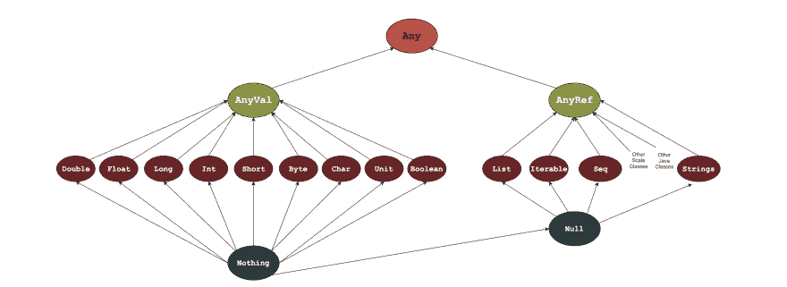

# Java 程序员的 Scala 教程(带示例)

> 原文：<https://betterprogramming.pub/scala-tutorial-for-java-programmers-with-examples-ed703ecfb56b>

## 寻求向 Scala 过渡的 Java 开发人员的起点


图片由作者提供。

Scala 是一种通用的、类型安全的编程 JVM 语言，支持面向对象编程(OOP)和函数式编程。Scala 旨在解决 Java 的一些限制和乏味。

对于想让自己的职业生涯更上一层楼的 Java 开发人员来说(或者对于那些只是厌倦了 Java 的怪癖的人来说)，这是一个很好的选择*。* Scala 现在被大公司——即 Twitter 和 LinkedIn——认为是一种强大的语言。事实上，根据 [Stack Overflow 的 2020 年调查](https://insights.stackoverflow.com/survey/2020)，美国 Scala 开发者的薪资最高。

如果您是一名 Java 开发人员，想要过渡到 Scala(或者只是想看看它能提供什么)，那么您来对地方了。今天，我们将向您介绍 Scala 来实现这种转变。

本教程一目了然:

*   Scala 与 Java
*   使用 Scala 的 Hello World
*   Scala 语法快速指南
*   Scala 中的对象和类
*   继承和重写
*   Scala 中的特征
*   Scala 之旅的下一步

# Scala 与 Java

Java 以其复杂性和冗长著称。它需要许多行代码来执行简单的任务。Scala 旨在创建一个“更好的 Java”，就像 Kotlin 和 Ceylon 一样。然而，Scala 是独一无二的，因为它没有试图与 Java 的语法保持太接近。

Scala 摆脱了 Java 的限制和繁琐，有利于打造一种更好的语言。

这意味着两者之间有一些显著的区别和范式转变。因此，Scala 的学习曲线比 Kotlin 更长。但这是值得的。它产生干净、简单、有组织的代码，提高您的生产力，并且比 Java 需要更少的代码行。

这两种语言之间有几个关键的区别。让我们把它们分解开来。

*   Scala 是一种静态类型语言。
*   Scala 使用 actor 模型实现并发(而不是 Java 的基于线程的模型)。
*   Scala 不使用静态成员。
*   默认情况下，Scala 变量是不可变的。
*   Scala 支持类的多重继承(不是抽象类)。
*   Scala 支持惰性求值，不像 Java。
*   Scala 支持操作符重载。
*   Scala 不提供向后兼容性。
*   Scala 可以用于[函数式编程](https://www.educative.io/blog/what-is-functional-programming-python-js-java)。
*   任何 Scala 方法或函数都被视为变量，而 Java 将其视为对象。
*   Scala 使用 traits 而不是 Java 接口。

Scala 的主要优势之一是可以在 Java 虚拟机(JVM)上执行，这使得与 Java 代码的交互变得非常容易。默认情况下，Scala 会导入`java.lang`包中的所有类。

然而，它的一个缺点是社区支持:与 Java 相比，它没有那么详细的文档、社区存在和更少的第三方库。然而，随着越来越多的 Java 开发人员将 Scala 添加到他们的工具带中，这种情况正在改变。

关于 Java 和 Scala 区别的实际例子，让我们看看如何用两种语言创建一个`Strings`列表:

```
// java
List<String> list = new ArrayList<String>();
list.add("1");
list.add("2");
list.add("3");// scala
val list = List("1", "2", "3")
```

正如你所看到的，Scala 更加精确，需要的代码更少。Scala 也更容易浏览，是团队的绝佳选择。

# 使用 Scala 的 Hello World

现在我们已经熟悉了 Java 和 Scala 之间的主要区别，让我们深入一些代码来理解这两种语言的不同之处。首先，看看我们熟悉的 Java 中的`Hello World`程序:

```
class HelloWorld {
    public static void main( String args[] ) {
        System.out.println( "Hello World!" );
    }
}
```

现在，看看 Scala 中的一个等价程序。你会马上注意到这有点相似:

```
object HelloWorld {
  def main(args: Array[String]): Unit = {
    println("Hello, world!")
  }
}
```

这是怎么回事？就像在 Java 中一样，`main`方法是我们的 Scala 程序的入口点，该程序将一个数组`Strings`作为其参数。方法体有一个对`println`方法的调用，将我们的问候语作为参数。因为`main`方法不返回任何值，所以它的类型是`Unit`。

您可能会注意到`object`声明的使用。这引入了一个 singleton 对象，它是一个只有一个实例的类。这里，我们定义了一个名为`HelloWorld`的类和同名类的一个实例。

你可能也注意到了`main`方法没有被声明为静态的。Scala 不支持静态成员，所以我们将其定义为单例对象。

## 用 Scala 编译代码

这里编译我们的代码也有点不同。对于上面的 Scala 例子，我们将使用`scalac`，它像大多数编译器一样工作。对于 Scala，其编译器生成的目标文件是 Java 类文件。

因此，假设我们将 Hello World 程序保存在一个名为`HelloWorld.scala`的文件中。我们将使用下面的命令。这将生成一些类文件，包括一个名为`HelloWorld.class`的文件:

```
> scalac HelloWorld.scala
```

一旦我们编译了程序，我们就可以用`scala`命令运行它，就像`java`命令一样:

```
> scala -classpath . HelloWorldHello, world!
```

# Scala 语法快速指南

现在我们已经介绍了 Scala 的 Hello World 程序，让我们快速了解一些您需要了解的基本 Scala 语法。我们不会在这里定义术语，因为假设你已经从 [Java](https://www.educative.io/blog/learn-java-from-scratch) 或另一种语言中了解它们。

## 变量

第一，变量。下面是我们如何在 Scala 中声明一个变量:


与 Java 的语法相比，Java 的语法遵循以下基本结构:

```
<variable type> <variable identifier>;
```

在我们的 Scala 代码中，我们声明了一个名为`myFirstScalaVariable`的变量，它存储类型为`Int`的数据，并被赋予一个初始值`5`。这是一个不可变的变量，因为我们选择了关键字`val`。

在 Scala 中，`val`类型的变量是不可变的，而`var`类型的变量是可变的。

## 数据类型

Scala 有一个类型层次结构，类型`Any`位于顶部。`Any`是定义通用方法的超类型，比如`equals`、`hashCode`和`toString`。



作者配图。

`Any`有两个子类:`AnyVal`和`AnyRef`。`AnyRef`是引用类型，包括 Scala 用户定义的类型。`AnyVal`代表我们的值类型，共有九种:

*   `Double`
*   `Float`
*   `Long`
*   `Int`
*   `Short`
*   `Byte`
*   `Char`
*   `Unit`
*   `Boolean`

下面，我们有一个类型为`Any`的变量`anyInAction`。我们可以给`anyInAction`分配任何类型的值:

输出:

```
A String
5
☺
1.985
true
```

## 字符串和文字

`Strings`不属于`anyVal`。相反，它们是文字。字符串文字包括用双引号括起来的字符组合。声明`String`的语法与声明任何基本值类型的变量的语法相同。

```
val stringLiteral: String = "Hello"// Driver Code
println(stringLiteral)
```

整数文字与值类型`Long`、`Int`、`Short`和`Byte`一起使用。不管如何声明，Scala 总是将整数作为小数打印。浮点文字与`Double`和`Float`一起使用。

输出:

```
1.2345
12.345
12345.0
```

## 控制结构

Scala 的控制结构有`if`、`while`、`for`、`try`、`match`和函数调用。在 Scala 中，控制结构像函数一样返回值。

`if`表达式具有以下语法:


`while`表达式使用以下语法:


```
var count = 1
while (count <= 10) {
  println(count)
  count += 1
}
```

`for`表达式的一般语法如下:


生成器定义一个命名变量，并将其赋给一组值。我们用三个部分来构造它:一个变量、一个`<-`和一个生成器表达式。

```
for (i <- 1 to 5) {
  println(s"iteration $i")
}
```

## 用户定义的函数

我们可以在 Scala 中定义函数。看一下这个例子，它取两个整数并返回它们的和:

```
def sum(x: Double, y: Double): Double ={
  x+y
}
```

*   `def`是定义函数的关键字。
*   `sum`是函数的给定名称。
*   `sum`后面是`()`。您可以在这里定义用逗号分隔的函数参数。
*   `(x: Double, y: Double)`告诉我们，我们的函数有两个参数:`Double`类型的`x`和`Double`类型的`y`。
*   我们通过在`()`后插入`: Double`来定义函数`Double`的返回类型。不需要插入返回类型。
*   然后我们插入一个`=`。接下来的就是函数体了。函数体用花括号括起来(`{}`)。

*注意:如果函数体只包含一个表达式，你可以选择不使用花括号。*


# Scala 中的对象和类

与区分原语和引用类型的 Java 不同，Scala 将一切视为对象，因为它是一种纯粹的面向对象语言。在 Scala 中，数字也被当作对象，所以它们也有方法。取下面的算术表达式:

```
1 + 2 * 3 / x
```

这个表达式是通过方法调用产生的，因为它与下面的表达式相同，所以`+`和`*`是 Scala 中的有效标识符。

```
1.+(2.*(3)./(x))
```

## 班级

在 Scala 中，类的声明很像 Java，但是 Scala 类可以有参数。看看这个 Scala 中的基本类定义，使用`class`关键字和`var`关键字来定义我们的属性(在 Scala 中称为字段):

```
class Person{
  var name: String = "temp"
  var gender: String = "temp"
  var age: Int = 0
}
```

为了定义我们类的方法，我们使用以下语法:

现在我们可以使用`val`来创建类的实例:

## 在函数中调用函数

在 Scala 中，函数也被视为对象，所以我们可以将函数作为参数传递，存储在变量中，或者从其他函数返回。这是 Scala 提供的函数式编程的一个有价值的特性。

看看下面这个例子，我们在另一个函数`SquareSum`中调用函数`square`:

# 继承和重写

Scala 支持几种类型的[继承](https://www.educative.io/blog/java-inheritance-tutorial):

*   单级继承:一个类从另一个类继承。
*   多级继承:一个类扩展了另一个类，后者又扩展了另一个类。
*   多重继承:一个类从多个基类继承。

在 Scala 中，所有的类都继承自一个超类，当没有声明超类时，Scala 使用`scala.AnyRef`。您可以重写从超类继承的方法，但是您必须使用`override`修饰符显式地指定这一点。例如:

# Scala 中的特征

Scala 使用 traits，类似于 Java 接口。与 Scala 的继承非常相似，一个类也可以从一个或多个 traits 导入代码。当这种情况发生时，一个类实现给定特征的接口和该特征中的所有代码。可以把这看作是在 Scala 代码中实现可重用行为的一种方式。

特征的基本属性是:

*   特征指定了给定类支持的方法的签名。
*   特征像类一样用关键字`trait`声明。看一下这个例子:

```
trait Iterator[A] {
  def hasNext: Boolean
  def next(): A
}
```

在 Scala 中，我们可以使用`extends`关键字来扩展一个特征。然后，我们用关键字`override`实现任何抽象成员:

# Scala 之旅的下一步

恭喜你坚持到最后。现在，您正在向 Scala 开发人员过渡。如您所见，Scala 使您能够利用现有的 Java 技能。关于 Scala 还有很多东西需要学习，实践对于掌握这门语言至关重要。

对于接下来的步骤，我们建议您采用以下概念:

*   Scala 的泛型
*   高阶函数
*   Currying
*   Scala 的收藏库

快乐学习！