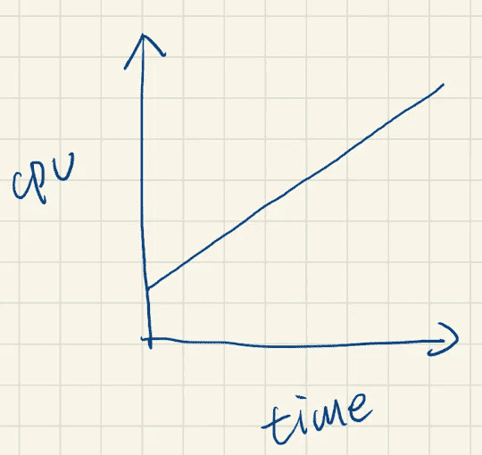
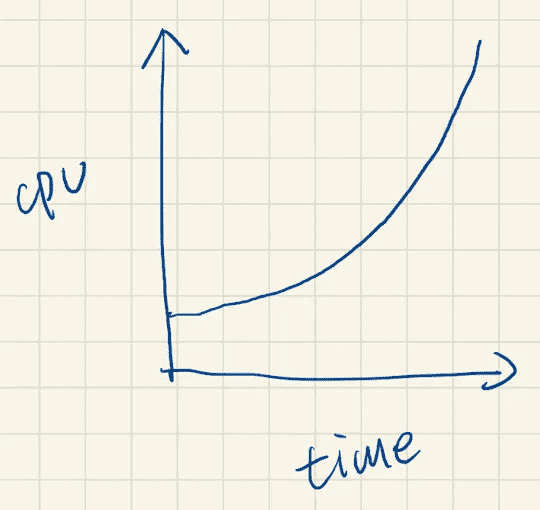
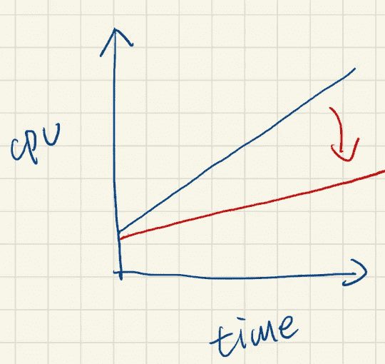
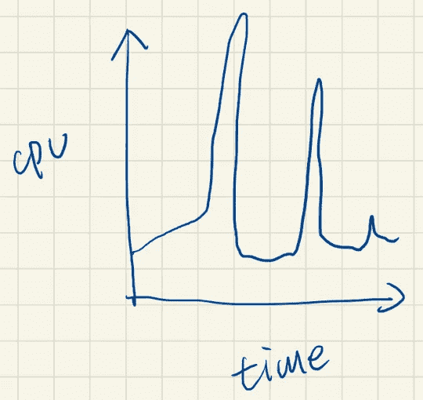
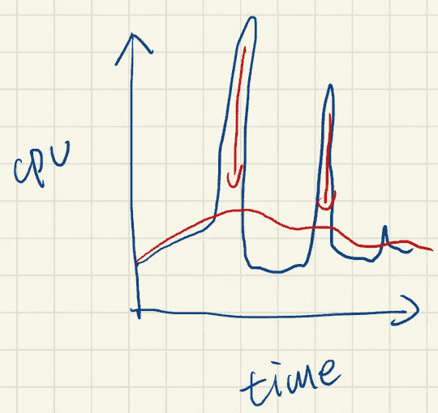

# 可扩展性与弹性

> 原文：<https://betterprogramming.pub/scalability-vs-elasticity-cfae2d7a19b>

## 理解可伸缩性和弹性之间的主要区别

丹尼尔·弗兰奇在 [Unsplash](https://unsplash.com/photos/SXRhpwKcMpc) 上的照片

在系统设计中，有两个词很容易混淆，那就是可扩展性和弹性。它们如此相似，以至于我们不能正确区分它们。

然而，当我们想要单独解决由这两个非功能性需求引起的问题时，我们需要完全不同的方法。

因此，为了设计正确的方法，我们必须了解它们并认识它们的特性。在本文中，我们将讨论什么是可伸缩性和弹性，以及如何处理这些症状。

# 可量测性

我们经常谈到水平可伸缩性和垂直可伸缩性，即横向扩展和纵向扩展。

但是对可伸缩性有什么好处和坏处呢？

让我们看一个例子。

CPU 与时俱进。这很正常。随着系统的增长，用户数量增加，功能需求增加，因此资源消耗也增加。在这种情况下，资源是指 CPU，但它可以应用于其他资源，如内存、响应时间等。

那么，如果这个图表示正常情况，那么什么图表示问题呢？

当资源使用量不是线性增长，而是指数增长时，一定是出了问题。这可能是导致额外开销的使用瓶颈，或者是当数据量超过一定数量时性能的急剧下降。

另一方面，什么样的形状代表良好的可扩展性？

类似地，资源使用随着时间的推移而增加，但增加的速度会缩小，这意味着可伸缩性会变得更好。理想状态是一条水平线，无论用户数量和功能需求增加多少，资源使用都保持不变。

换句话说，如何让这条线尽可能的直，尽可能的接近水平，是解决可扩展性要解决的问题。

# 弹性

谈完可伸缩性，我们来看一个弹性的例子。

首先，我们也来看看一个系统的正常情况。

资源使用量会随着时间的推移而大幅波动，在特定时间会出现峰值。很容易理解为什么会发生这种情况。以一个电子商务网站为例，当黑色星期五销售或圣诞节即将到来时，系统使用率会比平时高得多。或者一个售票网站，某个顶级歌手要开演唱会的时候，也会吸引大量的人前来抢票。

那么什么是弹性好呢？当然，这是为了消除那些尖峰。

在这个图表中有两个关键点。

1.  红线比蓝线更稳定，但红线不是水平线。
2.  出现尖峰后，红线明显高于蓝线。

第一点的原因很简单，因为系统的使用量是不固定的，所以资源的使用量会随着系统的使用量而变化。但总的来说还是可以维持在一个稳定的状态，不会有大幅度的起伏。

第二点，我相信也不难理解:我们之所以能够尽可能的扁平化蓝线，并不是拒绝所有的用户请求，而是通过“一种机制”来推迟瞬时使用。所以，秒杀之后，总会有一段消化期，导致红线高于蓝线。

你可能会问，虽然，系统可以在没有弹性的情况下处理这么多用户，那还有必要提高弹性来做出红线的效果吗？

答案是，肯定的。为什么？

因为蓝线的最高点是系统所能记录的极限，更多被拒绝的用户请求无法进入系统，没有被记录。在峰值时刻，系统的最大容量在那里被定义，所有超过它的请求都被拒绝。

另一方面，一个更有弹性的系统具有更平滑的资源使用，可以处理更多的用户请求，而不会使系统崩溃。

# 自动缩放的神话

现在，我们了解了可伸缩性和弹性。你能回答一个问题吗？

> *提问:自动扩展解决了可扩展性或弹性需求吗？*

答案是，可扩展性。

首先，自动缩放的原理是通过采样来跟踪特定的指标，当超过阈值一段时间后开始缩放。

因此，在开始缩放之前，峰值已经出现了一段时间。此外，缩放不是立即可用的；即使是容器化的应用程序也必须经过几个步骤才能扩展，比如加载容器映像并在新实例上冷启动它。一个复杂的应用程序从决定扩展到启动可能需要几分钟时间。

因此，自动伸缩不是关于弹性，而是关于可伸缩性。

更重要的是，自动缩放并不能改善整个系统。换句话说，自动伸缩只允许系统以其原有的可伸缩性继续增长，而不会使其变得更好。

一个例外是，如果可以预测弹性需求，那么可以有效地应用自动缩放。

例如，如果系统在工作日开始时(例如，上午 9:00)收到大量请求，则系统可以通过定期激活来自动缩放。在这个例子中，将自动缩放的时间设置在上午 8:30 和 9:30 之间可以有效地解决在这段时间所面临的弹性问题。

然而，一般来说，自动缩放面临可伸缩性的问题。

# 结论

在本文中，我们介绍了可伸缩性和弹性，并解释了改进后的情况。

尽管如此，本文并没有描述如何提高可伸缩性，因为可伸缩性是一个系统问题，没有一个特定的解决方案可以一次性解决它。

首先要找出瓶颈，然后要找出根本原因，最后要针对每个瓶颈提出不同的解决方案。这需要投入额外的时间和人力资源来支持系统的发展，而自动伸缩是一种争取时间的妥协。通过投入额外的资金，系统有时间发展，而不会因为无法扩展而关闭。

但是自动扩展不是一个长期的解决方案，需要额外的分析、设计和实施成本才能从根本上解决可扩展性问题。

另一方面，如何解决弹性问题？

答案相对简单，通过缓存或消息传递。为了在一瞬间容忍大量的请求，必须有一种机制来推迟当前的峰值，最常用的做法是缓存。

然而，有许多不同的方法来实现缓存，缓存和一致性之间的平衡是一个重要的问题。我介绍了几种缓存实践。

1.  [缓存和数据库之间的一致性，第 1 部分](https://medium.com/starbugs/consistency-between-cache-and-database-part-1-f64f4a76720)
2.  [缓存和数据库之间的一致性，第 2 部分](https://medium.com/starbugs/consistency-between-cache-and-database-part-2-e28fc7f8a7c3)

这些是缓存的基本版本，但是还有许多更高级的缓存实践将在后续文章中提到。

本文的目的只是解释这两个容易混淆的词，而在众多方法中找到可行解决方案的唯一方法就是正确理解可伸缩性和弹性。