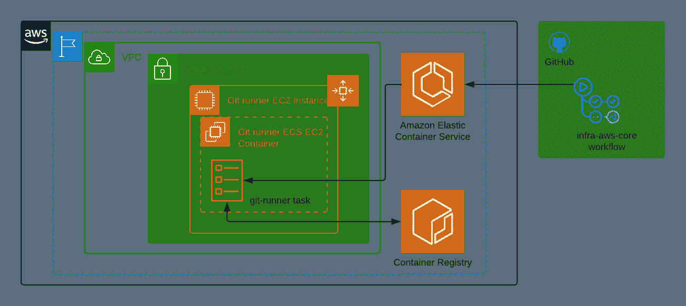
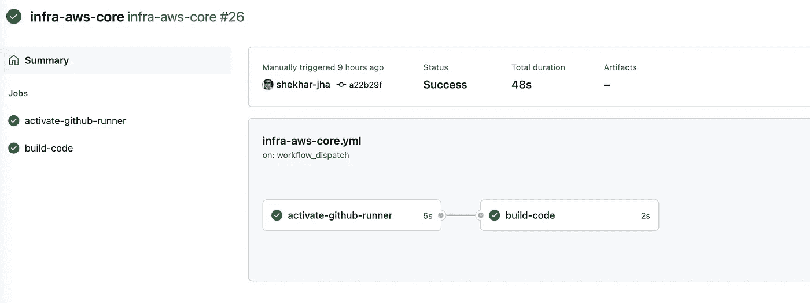
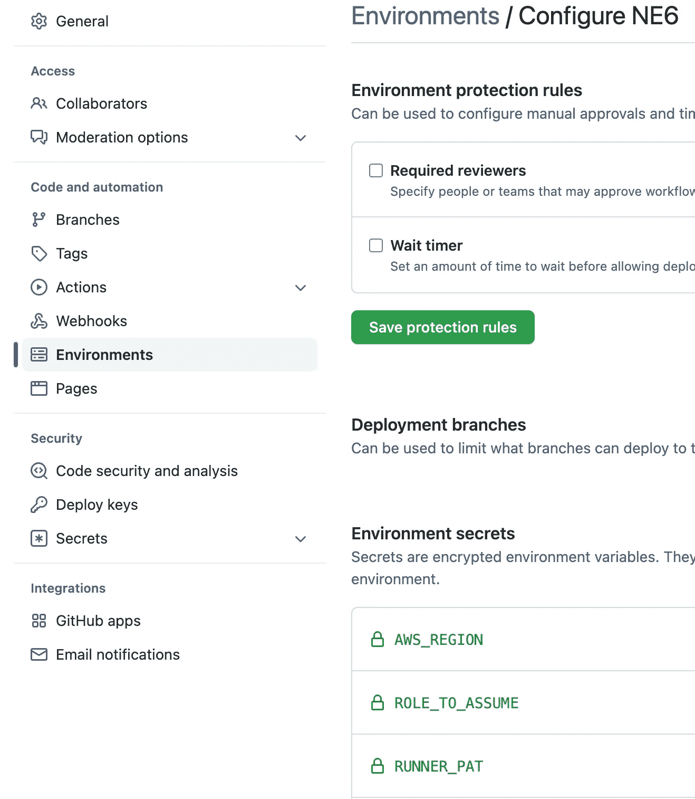

# 使用 AWS ECS 扩展 GitHub 工作流

> 原文：<https://betterprogramming.pub/scale-github-workflows-with-aws-ecs-e7e2854ac100>

## 使用没有访问键、复杂 lambda 函数或 Kubernetes 集群的自托管运行器



用于 GitHub 工作流的 ECS 上的 GitHub 自托管运行程序基础架构的架构

[GitHub 动作](https://docs.github.com/en/actions)允许 CI/CD 管道的自动化，以自动化构建和部署。它提供了在 [GitHub 托管的虚拟机](https://docs.github.com/en/actions/using-github-hosted-runners/about-github-hosted-runners)或[自托管运行程序](https://docs.github.com/en/actions/hosting-your-own-runners/about-self-hosted-runners)上运行流水线操作的能力。

使用自托管运行器允许组织实施一些安全控制，如控制代码溢出和构建工件，并且它使用在云中执行操作所需的最低权限的服务角色(AWS ),而不是使用访问密钥(访问密钥具有安全存储和轮换的额外负担)。

GitHub 已经发布了[两个推荐的自动伸缩](https://docs.github.com/en/actions/hosting-your-own-runners/autoscaling-with-self-hosted-runners#recommended-autoscaling-solutions)方法，它们使用 Kubernetes 集群和 AWS lambda 函数与 webhook 集成来为 GitHub 自托管运行程序扩展构建基础设施。

本文将介绍一种替代机制，它使用一种更简单的方法，使用相对较新的功能[OpenID](https://docs.github.com/en/actions/deployment/security-hardening-your-deployments/configuring-openid-connect-in-amazon-web-services)AWS 和 GitHub 之间基于连接的集成，以及 [GitHub 自托管运行器](https://jonico.github.io/awesome-runners/)容器，这些容器被配置为 ECS 上的任务，以按需启动短暂的运行器。

该方法使用自由层 AWS EC2 实例作为 ECS 容器，但可以很容易地扩展到使用 Fargate(或 spot)实例来运行容器，以优化成本。


GitHub 工作流的自托管 runner 基础设施架构

# GitHub 工作流程

下面的示例 GitHub 工作流文件显示了一个包含两个步骤的工作流:第一步，在 ECS 上启动 GitHub runner 容器；第二步，在新启动的 runner 上构建代码。



GitHub 工作流的输出，它激活自托管的运行器并在运行器上构建代码

相应的工作流程在[这里](https://github.com/shekhar-jha/base-demo/blob/infra-core/.github/workflows/infra-aws-core.yml)可用。

让我们浏览代码，了解如何使用 ECS 任务激活 GitHub 自托管 runner:

```
name: infra-aws-core
on:
  workflow_dispatch:
    inputs:
      Env:
        ...
      LaunchMode:
        ...
```

上一节描述了工作流程，并指定可以用`Environment`和`LaunchMode`作为输入手动调用。

```
jobs:
  activate-github-runner:
    runs-on: ubuntu-latest
    environment: ${{ github.event.inputs.Env }}
    permissions:
      id-token: write
      contents: read
    outputs:
      gitrunner_vm_id: ${{ steps.runner-label.outputs.vm_id }}
```

`activate-github-runner`任务负责启动 GitHub 自托管运行程序。它将使用最新的 ubuntu 实例`runs-on` GitHub runner 基础设施。`environment`用于定义输入值:

*   `AWS-REGION`其中将提供 GitHub 自托管 runner。
*   `RUNNER_PAT`(个人访问令牌)，能够注册自托管跑步者(详情见下文)
*   `ROLE_TO_ASSUME`连接到 AWS(查看 [OpenID 连接](https://docs.github.com/en/actions/deployment/security-hardening-your-deployments/configuring-openid-connect-in-amazon-web-services)了解更多详情)
*   一个网络的`SECURITY_GROUP`和`SUBNET`，连接到一个运行在 Fargate 上的容器。



`permissions`设置提供给作业的 GitHub 令牌的权限。`id-token: write`需要启用 OpenID Connect 登录 AWS。此外，`outputs`定义了作业的输出，该输出可被依赖于该作业的其他作业使用。这个作业输出`gitrunner_vm_id`，它代表构建作业应该运行的 GitHub 自托管运行程序。

```
 steps:
      - name: Configure AWS credentials
        uses: aws-actions/configure-aws-credentials@master
        with:
          role-to-assume: ${{ secrets.ROLE_TO_ASSUME }}
          aws-region: ${{ secrets.AWS_REGION }}
      - name: Check identity
        id: validate
        run: |
          aws sts get-caller-identity
```

`Configure AWS credentials`是 GitHub 执行 OpenID Connect 登录到 AWS 的标准步骤，`Check identity`打印呼叫者身份以供参考。

```
 - name: Generate Runner label
        id: runner-label
        run: |
          task_vm_id=$(uuidgen)
          echo "::set-output name=vm_id::$task_vm_id"
          echo "VM ID generated $task_vm_id"
```

这一步生成一个标签来惟一地标识将用于运行构建的 GitHub runner 实例。它使用一种简单的方法，即使用`uuidgen`命令来生成一个标签。

根据`LaunchMode`是 EC2 还是 Fargate，设置`NET_CONFIG`和`TASK_DEF_NAME`。Fargate 需要`NET_CONFIG`,因为一个显式的 ENI 附加在容器上，用于连接 GitHub 基础设施(以及其他操作)所需的互联网连接。EC2 和 Fargate 的任务定义主要在网络模式上不同，分别具有[桥](https://docs.aws.amazon.com/AmazonECS/latest/developerguide/task-networking-bridge.html)和 [awsvpc](https://docs.aws.amazon.com/AmazonECS/latest/developerguide/task-networking-awsvpc.html) 的值。有关此主题的其他注意事项，请参见以下内容。

此步骤使用上一步中确定的任务定义运行任务。它将`RUNNER_NAME`、`GITHUB_PAT`和`RUNNER_LABELS`传递给容器，以便入口点脚本可以使用它来配置 GitHub 自托管 runner 容器。有关该图像的更多详细信息，请参见以下内容。

该作业完成后，自托管运行程序任务已经启动，下一个要运行的作业是`build-code`，可以根据需要进行定制。以下示例显示了打印工作目录的`build-code`作业。

```
build-code:
    needs: [activate-github-runner]
    runs-on: [self-hosted, "${{ needs.activate-github-runner.outputs.gitrunner_vm_id }}"]
    permissions:
      id-token: write
      contents: read
    steps:
      - name: Testing build
        run: |
          MY_WD=$(pwd)
          echo "Hello world ${MY_WD}"
```

`needs`设置对`activate-github-runner`的依赖，以确保自托管运行程序在该作业运行之前启动。`runs-on`明确指出该作业应该在带有标签`self-hosted`和生成的`gitrunner_vm_id`的转轮上运行。通过`runs-on`,我们能够将构建过程与我们在之前的工作中开始的容器绑定在一起。

在这个实现中，因为我们已经将自托管运行器标记为`[ephemeral](https://docs.github.com/en/actions/hosting-your-own-runners/autoscaling-with-self-hosted-runners#using-ephemeral-runners-for-autoscaling)`，所以容器将在构建工作完成后自动退出。

# ECS 基础设施

GitHub 利用 ECS 基础设施来运行工作流。以下组件构成了 ECS 基础架构的一部分，旨在利用 AWS 自由层。还有其他可能的设计，它们更安全(例如，使用 NAT、VPC 端点等)、w.r.t .成本更优、维护更优(例如，使用 Fargate 而不是 EC2)。

## 网络

这里使用`terraform` [定义的`VPC`网络使用简单的公私子网模型。可以通过使用](https://github.com/shekhar-jha/base-demo/blob/infra-core/infra/aws/core/tf-network.tf)`[NAT gateways](https://docs.aws.amazon.com/vpc/latest/userguide/vpc-nat-gateway.html)`、`[Private Links](https://docs.aws.amazon.com/vpc/latest/privatelink/privatelink-access-aws-services.html)`来增强该模型，以避免计算组件被公开访问，并分别减少互联网流量。

## 计算

使用`autoscaling group`管理的`EC2`计算实例，在仅允许出口流量的`security group`公共子网中启动，此处使用`terraform` [描述](https://github.com/shekhar-jha/base-demo/blob/infra-core/infra/aws/core/tf-runner-ec2.tf)。

除此之外，遵循最小特权原则，分配给 EC2 计算实例的`AmazonSSMManagedInstanceCore`和`AmazonEC2ContainerServiceforEC2Role` IAM 角色将分别在 EC2 实例上启用`[SSM agent](https://docs.aws.amazon.com/systems-manager/latest/userguide/ssm-agent.html)`和`[ECS agent](https://docs.aws.amazon.com/AmazonECS/latest/developerguide/ECS_agent.html)`。

用户数据(在模板文件`[setup-vm.sh.tpl](https://github.com/shekhar-jha/base-demo/blob/infra-core/infra/aws/core/setup-vm.sh.tpl)`中指定)用于保存配置数据，然后从`codecommit` repo 中提取`[build-runner.sh](https://github.com/shekhar-jha/base-demo/blob/infra-core/infra/aws/core/github_runner/build-runner.sh)`脚本以开始配置过程。这种分两步走的方法减少了用户数据配置的规模，同时确保了灵活性。

`build-runner.sh`脚本做以下三件事:

*   启用`SSM`代理
*   安装和配置`ECS`代理
*   使用从 codecommit 中提取的`[Dockerfile](https://github.com/shekhar-jha/base-demo/blob/infra-core/infra/aws/core/github_runner/Dockerfile)`和`[entrypoint.sh](https://github.com/shekhar-jha/base-demo/blob/infra-core/infra/aws/core/github_runner/entrypoint.sh)`脚本为 GitHub 自托管运行程序构建映像，然后将构建的映像推送到`[AWS Elastic Container Registry](https://docs.aws.amazon.com/AmazonECR/latest/userguide/what-is-ecr.html)`。

## 代码基础设施

[tf-code-infra.tf](https://github.com/shekhar-jha/base-demo/blob/infra-core/infra/aws/core/tf-code-infra.tf) 定义了`[CodeCommit](https://docs.aws.amazon.com/codecommit/latest/userguide/welcome.html)`、`Elastic Container Registry`的基础设施和`EC2`角色的相关策略，以允许`EC2`实例访问这些组件。codecommit 的 terraform 脚本使用脚本和 terraform provisioner 功能将`docker`文件、`entrypoint`脚本和`build-runner`文件上传到`codecommit`。

## ECS 配置

ECS 配置在`[tf-runner-ecs.tf](https://github.com/shekhar-jha/base-demo/blob/infra-core/infra/aws/core/tf-runner-ecs.tf)`中可用，创建 cloudwatch 日志组、ECS 集群和 ECS 任务定义。除此之外，它还定义了执行 ECS 任务所需的 IAM 服务角色(即拥有权限`AmazonECSTaskExecutionRolePolicy`)。为 Fargate 定义了两个独立的 ECS 任务定义，以简化启动流程。

## 开源代码库

`[tf-code-github.tf](https://github.com/shekhar-jha/base-demo/blob/infra-core/infra/aws/core/tf-code-github.tf)`描述了`AWS`和`GitHub`集成所需的配置。它包含一个新的 IAM OpenID 连接提供程序，该提供程序代表 GitHub，并使用其指纹验证 TLS 证书。除此之外，还创建了一个具有`AssumeRoleWithWebIdentity`权限的 IAM 角色，对特定用户和回购有限制。这个角色有`run-task`、`stop-task`、`pass-role`的能力。

除此之外，它还定义和设置 GitHub workflow 使用的环境变量。请注意，由于 GitHub APIs 的限制，运行者注册所需的 PAT 令牌(`RUNNER_PAT`)需要手动添加到环境中。

# 考虑

使用这种方法时，应该记住以下注意事项

1.  个人访问令牌(PAT):用于注册自托管跑步者，应限制其访问权限，以减少其受到损害时的影响。需要两个不同的 PAT 令牌:一个是创建作为 Terraform 一部分的环境变量，另一个是创建用于注册的自托管 runners 令牌。
2.  GitHub portal 的 Actions 选项卡显示了在 repo 的默认分支中定义的工作流。
3.  暂时停止与显式停止:如果构建/部署过程在多个作业上执行，暂时容器可能不合适。在这种情况下，可以通过将`—-query “tasks[0].taskArn” --output text`添加到`run-task`命令中，在第一个作业中提取任务 arn，然后在最后一个作业中使用[停止任务](https://awscli.amazonaws.com/v2/documentation/api/latest/reference/ecs/stop-task.html)。
4.  ECS 任务网络模式:对于在自由层 EC2 实例上运行任务，ECS 任务定义网络模式被设置为`bridge`而不是`awsvpc`。这主要是因为公共 IP 不能被分配给这样的容器(由于 EC2 的限制)。同时，如果在公共子网中设置了 NAT 网关，可以使用`awsvpc`模式来定义在 EC2 上运行的任务。
5.  GitHub runner 图像:有[多种图像清晰度](https://jonico.github.io/awesome-runners/)可供选择。这里使用的映像脚本基于这里提供的，它使用最新版本的 GitHub 自托管 runner 安装程序创建一个映像，以非根模式运行该进程，在容器启动时安装`ADDITIONAL_PACKAGES`，支持`GITHUB_TOKEN`和 PAT，并删除 SIG_TERM 和 SIG_INT 信号上的 runner。回购中可用的版本没有移除，因为它利用了临时标志。

# 资源

自动缩放 GitHub 自托管跑步者:[https://docs . GitHub . com/en/actions/hosting-your-own-runners/auto scaling-with-self-hosted-runners](https://docs.github.com/en/actions/hosting-your-own-runners/autoscaling-with-self-hosted-runners)

GitHub OpenID Connect 与 AWS 的集成:[https://docs . GitHub . com/en/actions/deployment/security-hardening-your-deployments/configuring-OpenID-Connect-in-Amazon-web-services](https://docs.github.com/en/actions/deployment/security-hardening-your-deployments/configuring-openid-connect-in-amazon-web-services)

GitHub 工作流程示例:

[https://github.com/shekhar-jha/base-demo/blob/infra-core/.github/workflows/infra-AWS-core . yml](https://github.com/shekhar-jha/base-demo/blob/infra-core/.github/workflows/infra-aws-core.yml)

这里显示了所有的地形定义:[https://github . com/shek har-jha/base-demo/tree/infra-core/infra/AWS/core](https://github.com/shekhar-jha/base-demo/tree/infra-core/infra/aws/core)

参考 GitHub runner 图片:[https://github.com/SanderKnape/github-runner](https://github.com/SanderKnape/github-runner)

感谢阅读！敬请关注更多内容。