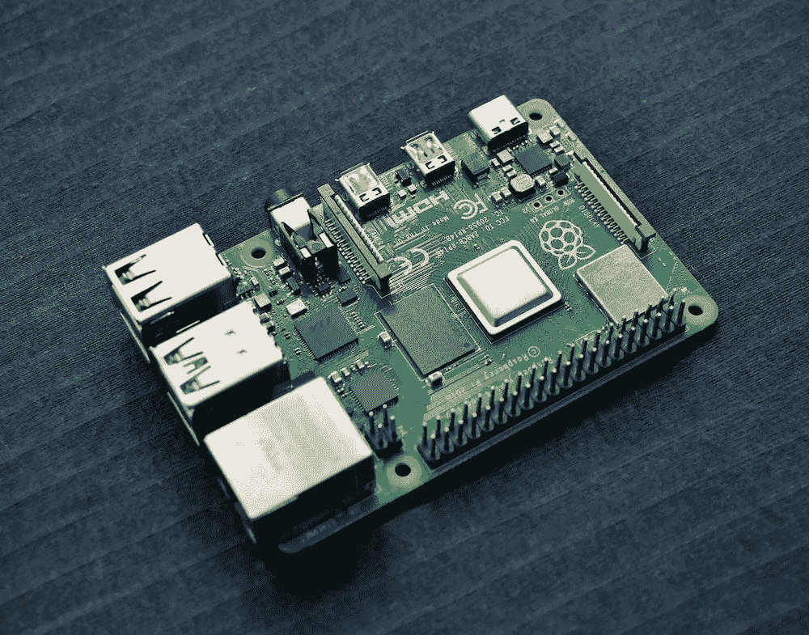
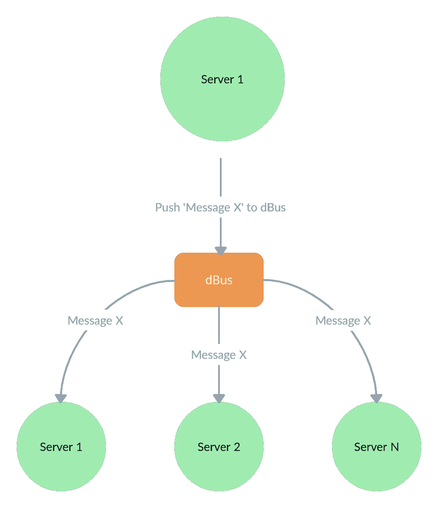
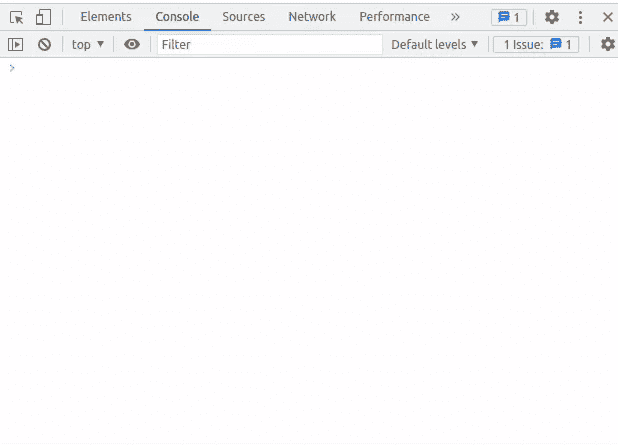

# 如何扩展 Go WebSocket 服务

> 原文：<https://betterprogramming.pub/scaling-a-websocket-service-with-go-858b259d4974>

## 因为 Linux 只能打开一定数量的文件

Vishnu Mohanan 通过 Unsplash 提供的图片

如果你在科技行业呆过，你可能会听到有人提到“规模”这个词。甚至在科技之外，你可能已经观察到企业“扩大”他们的生产方式以满足需求。本质上，“缩放”等同于增加你的生产方式。在技术背景下，扩展增加了您作为服务提供商的能力。在技术领域，有两种常见的扩展方式，一种是垂直扩展，另一种是水平扩展。在这篇文章中，我将谈论水平伸缩，以及如何将它应用到通过 websockets 运行的服务中。作为参考，水平扩展包括添加额外的服务器(或节点)来增加容量。

# 这个想法

当我开发多人游戏时，我处理通信的最佳模式是让客户端只向服务器发送输入。然后，服务器将负责控制客户端的状态。这将保证所有玩家看到的是完全一样的东西。另一种方式是让服务器决定客户端的状态。对于这篇文章，客户机将是 websocket 服务器，服务器控制状态将是`dBus`。下面的图表可以更好地说明这一点:

假设我想向服务器 1 上的所有 websocket 连接广播一条消息，我会将该消息推送到我的 IPC(在本例中是`dBus`)，并等待 dBus 在服务器 1 上调度实际的广播。现在用代码实现它。

# 代码

在这篇文章中，我将尝试构建一个 echo 服务器。服务器会将消息中继到所有连接的设备，这包括另一个服务器实例上的 websocket 连接。我的临时消息代理人将是`dBus`。我将使用包`github.com/gorilla/websocket`来实现我的 websocket。我将使用包`github.com/godbus/dbus/v5`访问`dBus`。首先，我将定义一个包含 websocket 连接数组和到`dBus`的连接的类型。下面是结构定义:

我将继续定义全局变量。`upgrader`将启动 websocket 连接。变量`AppPath`和`AppID`将用于`dBus`通信。以下是我的全局变量:

接下来，我将为类型`App`定义一个方法。该方法将向服务器上的所有 websocket 连接广播一条消息。我从这个方法开始，因为它不依赖于其他函数/方法来操作。下面是方法`broadcast`的定义:

虽然没有提到，但请确保在循环之前锁定数组，之后解锁。

接下来，我将实现监听来自`dBus`的消息的方法。该方法还将负责建立到`dBus`的连接，以及向所有连接广播消息。一旦从`dbus`接收到数据，该方法将向服务器实例上的所有 websocket 连接广播消息。这种方法将被称为`listen`，下面是它的定义:

我将为类型`App`实现的最后一个方法是 HTTP 处理程序。这个处理程序负责建立 websocket 连接，存储连接，并将消息转发给`dBus`。这个方法将被称为`handler`。下面是它的定义:

` p '是一个字节数组。虽然没有提到，但请确保锁定涉及阵列连接的操作

现在我已经定义了所有的组件，我将继续实现。方法`listen`将在 Goroutine 上运行。我将把处理程序安装到端点路径`sockettome`。下面是代表我的实现的代码:

下面是实际运行的代码:

# 结论

在生产环境中，`dBus`可能并不合适。还有其他消息代理会表现得更好。`dBus`是有限的，因为服务器实例必须在同一个物理主机上。在这篇文章中，我使用`dBus`来模拟一个消息代理。

我的理论是，中央服务(消息代理)应该规定每个单独的服务器实例向 websocket 连接写入什么。并且客户应该告诉中央服务要广播什么。在我看来，这消除了在实例级管理状态的需要，因为中央服务正在做这件事。下面有这篇文章中使用的代码的链接。

# 附加链接

 [## medium _ examples/scale-web socket at main cheikh shift/medium _ examples

### 中型文章的代码示例。在 GitHub 上创建一个帐户，为 cheikhshift/medium_examples 开发做贡献。

github.com](https://github.com/cheikhshift/medium_examples/tree/main/scale-websocket)