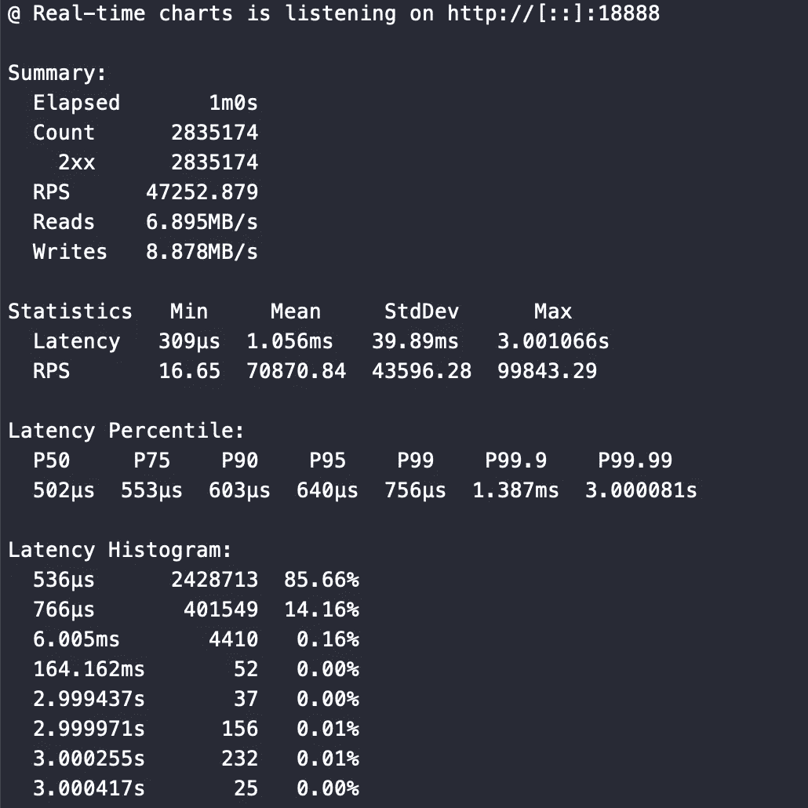
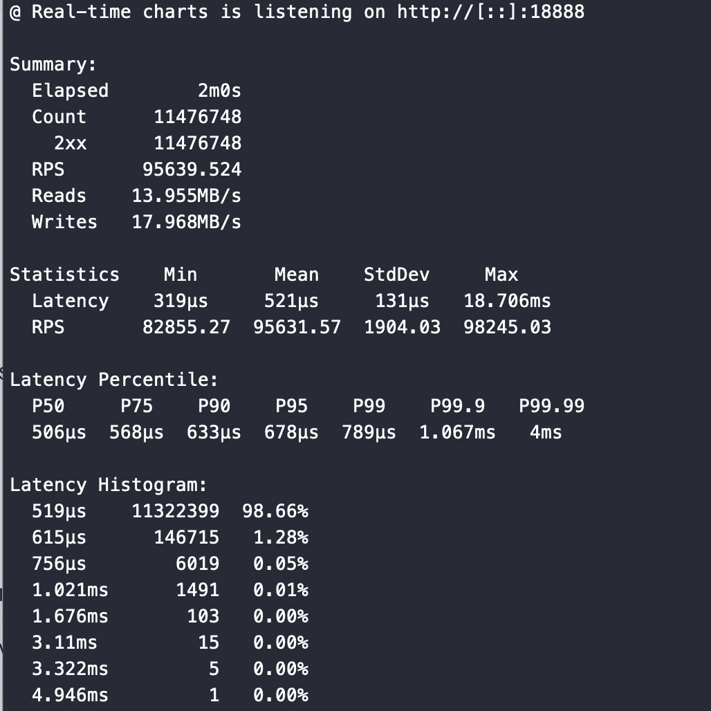

# 在 Rust 中使用 REST APIs 扩展 Kafka 摄取

> 原文：<https://betterprogramming.pub/scaling-kafka-ingestion-using-rest-apis-in-rust-high-throughput-data-ingestion-system-a60cc0c2366>

## 高吞吐量数据摄取系统


这篇文章是关于卡夫卡和鲁斯特的。作为一个想法，我试图建立一个数据摄取服务，接受半结构化的 Json 有效载荷并将它们发布到 Kafka。更具体地说，我想达到以 Kafka 为缓冲的摄取服务的理论最大值，并尝试调整它来测量性能。

我将分享如何使用 Rust 编写 REST API，并运行一个简单的 HTTP 性能调优基准。我还将使用`rdkafka,`展示不同的生产者类型，它们可用于获得良好的持久性和高级用例的极高吞吐量。一切都已在 Rust 中实现。我们将查看 Kafka 调整前后的数字来测试性能。剧透一下——我可以在一台 8C32M 服务器上实现大约 96K 事件/秒的发布速率。我会在这篇文章中分享细节。

所有的代码都在我的知识库中。[https://github.com/shanmukhsista/rust-kafka-demo](https://github.com/shanmukhsista/rust-kafka-demo)

让我们开始吧！

# 应用程序设置

这个应用程序设置很简单。它通过 REST API ( POST Call)接受 JSON 数据(事件)的有效负载，并将这些`events` 发布到 Kafka 主题。出版给卡夫卡是有趣的部分。我们将讨论两种不同场景的发布。

1.  发布以获得某种程度的持久性。在这种情况下，我们确保消息在某种程度上被传递给卡夫卡。
2.  以优化的方式发布以获得更高的性能。在这种情况下，我们将考虑使用一个在发布前缓冲一些事件的生成器，并在不阻塞任何响应的情况下优化最佳性能。

由于性能至关重要，我们将编写一个基准测试，并使用一个简单的 HTTP 测试工具(`plow`)对其进行测量。

顺便提一下，在 rust 中编写 API 时使用 Kafka Producer 的目的也是为了突出向 RUST 中的处理程序传递一些状态/服务的能力。在编写真实世界的应用程序时，这是很常见的。它甚至可能是一个数据库池服务或自定义资源管理器。理解这一点很重要，因为 Rust 中的编程范式与 Java、C# …

对于这个演示，我们将使用 Actix Framework(Web)来编写 API 和发布事件。让我们开始吧。

# 创建新的二进制应用程序

让我们从创建一个新的应用程序开始。

```
cargo new rust-rdkafka-demo
```

在您的`Cargo.toml`中添加以下依赖项。

我们添加了`serde`依赖来解析请求 JSON，并在发布数据之前将其反序列化为 Rust 结构。

> 这个应用程序的另一个先决条件是**在您的本地机器**上安装 kafka，或者准备好远程代理 URL 来编写服务。我们将从应用程序内部连接到这个 kafka 集群。

# 阻塞生成器(等待响应)

在第一种情况下，我们将与 Kafka 生产者合作，确保消息在返回响应之前被发送到 Kafka。这意味着会有延迟和性能问题，因为我们在等待一些网络操作，以及 Kafka 对消息的确认。

## 初始化生成器

我们通过设置一些默认的配置变量来初始化生产者，并在这个函数中返回生产者的所有权。

这个生产者是一个`FutureProducer`实例，可以跨线程共享。因为克隆对于这个生产者来说是廉价的，所以我们可以为每个请求发布一个事件，并为高吞吐量进行伸缩。这个制作人也为每一个出版的事件制作一个未来。因此，我们必须执行一个`await`来发布并从 Kafka 获得结果。

在这种情况下，我们使用最低要求的配置创建生成器。

## 定义有效负载结构

现在，让我们把我们的有效载荷数据定义为一个锈`struct`。出于本演示的目的，有效负载是一个带有相关名称的事件对象，由一个`data`部分组成，它可以保存发送到服务器的任意键-值对。这只是作为键值对发送的半结构化 JSON 数据。

确保添加了派生属性，以便在 JSON 中序列化和反序列化有效负载。

现在我们已经有了基本的应用程序设置，我们还需要编写最后一部分来处理请求。

## 定义 API 处理程序

用于执行我们的 API 逻辑的 API 处理程序如下所示:

`collect_events`将在每次对根`/`端点进行 POST 调用时被调用。在这个方法中，我们还将 Kafka Producer 作为数据依赖项。我们可以用它来直接发布事件并返回响应。

请注意，Kafka 制作者默认是一个`FutureProducer`。除非我们`await`上了生产者(第 17 行)，否则不会有消息发布给卡夫卡。对于初始版本，让我们执行一个`await`操作并测量一些请求延迟。我们很快就会看到另一种方法。

在这个函数中，我们为这个事件生成一个新的 event_id。并将这一事件送回卡夫卡。

还要注意，我们再次进行反序列化和序列化，中间没有应用任何逻辑。在现实世界的应用中，也可能会有一些丰富的内容。因此，我们需要这一步。更好的选择是使用`Protocol Buffers`而不是 JSON 序列化/反序列化来降低序列化成本并更好地标准化有效负载。

一旦发布了事件，我们返回一个带有 **event_id** 的文本响应。

## 主要功能

完成我们的应用程序的最后一步是集成一切并更新我们的主要功能。参考下面的代码来检查一下。

在 main 中，我们首先初始化我们的 kafka 生成器。这个生产者将被所有在`actix-web`中创建的线程共享。Main 函数获得该数据的所有权，然后负责该变量的生存期。

然后，我们使用 Actix-Web 的服务器工厂来定义服务器及其路由。这里需要注意的一点是，Actix 只定义了布局和初始化。在收到客户端的请求之前，我们不会初始化并开始使用 Kafka producer。输入到`HttpServer.new`的λ只是一个工厂。我们的服务器会为收到的每个请求创建一个新的实例。

在处理路由时，我们在处理程序中获得了有效负载的[所有权。这个处理程序还获得了共享的`kafka_producer`引用以及有效负载。这就是运行我们的应用程序所需的全部内容。](/understanding-rust-ownership-model-by-example-5d586ec5e8e4)

## 运行和测试应用程序

要运行应用程序，请在项目的根目录下执行下面的命令。

```
cargo run
```

触发一个 POST 请求来测试向我们的服务发布事件。

如果一切正常，您应该期望响应中有一个新的事件 id 作为纯文本输出。

```
9502ea0e-9856-4626-b621-2c6fd0d35cfe
```

# 无阻塞方法

上面显示的方法在向 Kafka 发布事件后等待异步未来。即使这是一个异步操作，也可能会有一些等待，不管网络有多好。

我们将研究另一种方法来进一步优化它。一个不需要等待期货的非阻塞生产者。

我们将利用低级的`ThreadedProducer`类来发送事件。在内部，这个类有自己的专用线程来缓冲和发布事件。在这个实现中，我们将用这个类创建一个生产者来发送事件。这应该会给我们带来显著更高的吞吐量，而无需对代码做太多的修改。下面是代码的变化。

## 初始化生成器

## API 处理程序

我们在这里可以看到，我们没有等待 Kafka 发送操作完成。我们只是发布并立即回复。有互斥体来保证线程安全，以共享生产者，而没有任何副作用。

## 主要功能

现在我们有了这两种方法，让我们看看一些性能数字。

# 性能试验

为了测量性能，我们将在 GCP 使用一组远程机器来执行测试。这是一个从另一台远程机器上执行的简单 HTTP 测试。创建了一个全新的 VM 来在一个**实例上托管我们的应用程序。**我们将比较两个生产商，看看延迟和带宽的分布。

## 设置

*API 服务器:8 核 32 GB 内存——GCP 实例*

*Kafka —同一个本地网络中的通用 Kafka 集群。*

*负载测试从同一网络内的* ***单独的机器上运行。***

## 期货生产商(等待操作)

对于这两个生成器，我们将从`[Plow](https://github.com/six-ddc/plow)`开始，在 1 分钟的时间内发出 50 个并发请求。下面是相同的截图。



对于这个设置，我注意到在以高吞吐量接收事件之前有一个初始延迟。吞吐量在几秒钟内从 4000 /秒扩展到 45k。这就是最初大约 6 毫秒的延迟。考虑到我们正在向卡夫卡发布每一张唱片并等待回复，这一点都不坏。现在让我们看看另一种方法。

# 非阻塞方法(无等待)

现在，让我们来看看一种可以显著提高服务性能的方法。这可能不是最准确的方法，但它确实显著提高了性能。我仍在研究一些方法，并了解最佳方法的底层库。

请注意，我们使用这种方法的目标是为我们的摄取服务提供高吞吐量。在这个案例中，我们使用了一个不需要我们等待未来的制作人。



> 该服务被 Kafka 接收的事件数达到了每秒 95，000 个。延迟也没有太多变化。尽管这只是一个基本的设置，但我还是对这一表现印象深刻。

# 摘要

总之，这是一个非常简单的实现。我对我看到的数字印象深刻。很快，我将尝试对数据有效载荷执行一些昂贵的操作，并看看这些数字是如何受到影响的。

但就个人而言，如果我要设计一个高吞吐量的分析数据收集服务，我会在其他考虑和因素中选择 Rust。不仅因为性能，还因为能效:)