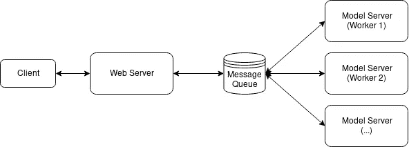
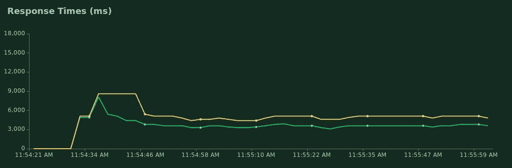
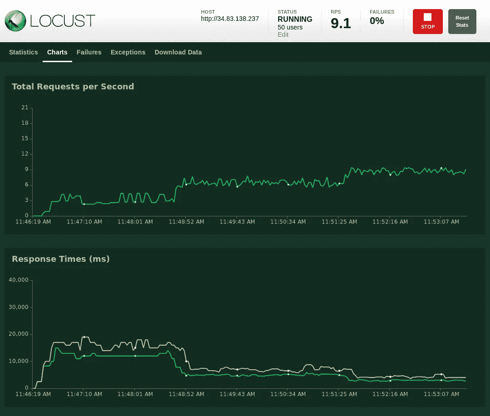

# 用 Docker Swarm 扩展机器学习模型

> 原文：<https://betterprogramming.pub/scaling-machine-learning-models-with-docker-swarm-39a1a875a692>

## 本教程展示了我们如何使用 Docker Swarm 在多台主机上轻松扩展机器学习服务


这篇教程是我之前的文章的后续，关于用 FastAPI、Redis 和 Docker 对 Keras 模型进行 dockerizing 和部署。在这里，我们将看到如何使用相同的代码和相同的`docker-compose.yml`通过 Docker Swarm 轻松地将我们的部署扩展到多个主机上。

我们还将使用 Locust 来进行负载测试，并展示我们的响应时间是如何随着我们向集群中添加的每个工人而提高的。

# 概述



在之前的帖子中，我们看到了我们如何在 [Adrian Rosebrock 的教程](https://www.pyimagesearch.com/2018/02/05/deep-learning-production-keras-redis-flask-apache/)中对服务进行分类，并使整个服务变得非常容易。

然而，我们也从负载测试中看到，服务的性能可能不足以满足生产使用。在本教程中，我们将使用 Docker Swarm 来复制我们的模型服务器，以提供更好的性能。

和以前一样，本教程中的所有代码都可以在以下位置找到:

[](https://github.com/shanesoh/deploy-ml-fastapi-redis-docker) [## Shane soh/deploy-ml-fastapi-redis-docker

### 使用 FastAPI、Redis 和…服务于生产就绪和可扩展的基于 Keras 的深度学习模型图像分类

github.com](https://github.com/shanesoh/deploy-ml-fastapi-redis-docker) 

# 什么是 Docker Swarm？

Docker Swarm 是 Docker 的本地集群。Docker 的现代版本带有内置的群模式，用于管理 Docker 引擎集群，有效地将一个 Docker 主机池转变为一个虚拟主机。

# 为什么 Docker 蜂拥而至？

对于容器编排，有 Docker Swarm 的替代品，即 Kubernetes，这也可以说是更受欢迎的选择。还有基于云的部署机器学习模型的解决方案(如 AWS SageMaker)。

然而，有时我们可能希望推出自己的解决方案，无论是为了学习还是为了自托管整个管道(即，不依赖于云)。后者在政府或监管行业中非常普遍。

在我的工作中，数据科学家和工程师经常需要部署在各种敏感的“基础设施受限”的无线网络中(例如，人们不能指望本地 Kubernetes 集群随时可用)，我们必须在各种受限环境中独立部署和扩展 ML 模型。

在这些公认的小众场景中，Docker Swarm 是我的首选。Docker Swarm 与 Docker 完全集成，使用相同的 CLI，并且可以使用与 Docker Compose 相同的配置文件进行配置。与 Kubernetes 相比，它也更容易建立和大规模运行。

# 决定在哪里托管你的 Docker 群

出于开发和测试目的，您可以选择使用虚拟机来设置 Docker Swarm 集群。Docker 官方网站有一个[很好的教程](https://docs.docker.com/get-started/part4/)，可以在你的本地机器上初始化一大群虚拟机。但是，通过这样做，我们将看不到跨多台机器横向扩展模型服务器的性能优势(因为虚拟机仍然在资源有限的同一物理主机上运行)。

托管蜂群的最简单方式是在云上(例如，在谷歌云平台上；GCP)。您可以使用 Docker Machine 在 GCP 实例上轻松启动和安装 Docker。[本教程](https://engineering.galleon.ph/posts/docker-swarm-gcp/)将其分解为几个命令。

如果你在一个离线环境中工作，或者如果你选择自托管，那么建立一个 swarm 可能就是在一些物理机器上安装 Docker Engine，并用几个简单的 Docker 命令将它们连接起来。在这篇文章中，我选择在我的家庭服务器上运行它们(一台在壁橱里嗡嗡作响的白色盒子超微至强-D 服务器)。

不管你选择在哪里托管你的 swarm，除了一些小的不同，你都应该能够遵循下面的步骤。

# 创造一个码头工人群体

假设我们没有在可以使用 Docker Machine 供应的[环境中托管我们的 swarm，那么我们将不得不在我们所有的主机上手动安装 Docker Engine 和 Docker Compose。](https://docs.docker.com/machine/drivers/)

在本练习中，我们将设置一个管理者节点和三个工作者节点。

一旦你完成了这些，在你想用作管理器的节点上运行`docker swarm init`。您将看到 join 命令以及向节点添加新工人所需的令牌:

```
Swarm initialized: current node (12mfhmaqslwd2x2jqs8c6k36m) is now a manager.To add a worker to this swarm, run the following command:docker swarm join --token xxxxxxx 10.145.1.20:2377To add a manager to this swarm, run 'docker swarm join-token manager' and follow the instructions.
```

`10.145.1.20`是我的经理节点。我们将在我们的三个工作节点上运行上面的命令`docker swarm join --token xxxxxxx 10.145.1.20:2377`,将它们添加到集群中。

现在运行`docker node ls`，您应该会看到您的集群中的所有节点:

```
$ docker node ls                                                                                                                                          
ID                            HOSTNAME            STATUS              AVAILABILITY        MANAGER STATUS      ENGINE VERSION
niairu4mt6az6y8263qk3yl4y *   swarm-manager-1     Ready               Active              Leader              19.03.2
n2gzk977b02byajotketwlhb3     swarm-worker-1      Ready               Active                                  19.03.2
aupx477hzv4m8t0f4n1hqlmt2     swarm-worker-2      Ready               Active                                  19.03.2
711gwle1dpzr9cjen6rqbqwdr     swarm-worker-3      Ready               Active                                  19.03.2
```

就是这样！

# 在 Docker Swarm 上部署

现在我们已经创建了我们的 swarm，在其上部署我们的机器学习服务也很容易。

在 manager 节点上，下载包含环境变量的`docker-compose.yml`和`app.env`，然后部署一个名为`mldeploy`的堆栈，如下所示:

```
$ wget [https://gist.githubusercontent.com/shanesoh/225b99902410a43fecb42b5f26ea5673/raw/e622e263911fc5bd285038f83e3c2d9e7cc0ce97/docker-compose.yml](https://gist.githubusercontent.com/shanesoh/225b99902410a43fecb42b5f26ea5673/raw/e622e263911fc5bd285038f83e3c2d9e7cc0ce97/docker-compose.yml)$ wget [https://raw.githubusercontent.com/shanesoh/deploy-ml-fastapi-redis-docker/master/app.env](https://raw.githubusercontent.com/shanesoh/deploy-ml-fastapi-redis-docker/master/app.env)$ docker stack deploy -c docker-compose.yml mldeploy
```

运行`docker stack ps mldeploy`,您应该会看到三个服务已经启动:

```
ID                  NAME                     IMAGE                         NODE                DESIRED STATE       CURRENT STATE           ERROR               PORTS
hffngo1qrnch        mldeploy_webserver.1     shanesoh/webserver:latest     swarm-manager-1     Running             Running 2 minutes ago                       
otctku7gvpaf        mldeploy_modelserver.1   shanesoh/modelserver:latest   swarm-worker-2      Running             Running 2 minutes ago                       
hwvr9mm50rhe        mldeploy_redis.1         redis:latest                  swarm-manager-1     Running             Running 2 minutes ago
```

管理器节点上的 web 服务器、工作器节点上的一个模型服务器实例，以及管理器或工作器节点上的 Redis 节点。

docker-compose.yml

这是因为我们在合成文件中约束了`modelserver`和`webserver`的`node.role`。另外，请注意，我们已经默认设置了`replicas: 1`。

这个机器学习服务的可伸缩性的主要来源是由`replicas:`参数提供的`modelserver`的复制。在下一节中，我们将使用负载测试和`modelserver`的动态缩放来说明这一点。

# 用 Locust 扩展模型服务器和负载测试

在我之前的文章中，我们看到了如何使用 [Locust](https://locust.io) 对像我们这样的 HTTP 端点进行负载测试。



绿色表示平均响应时间；黄色代表 p95

我们还发现我们的性能在 50 个模拟用户的情况下并不好。如图所示，p95 的响应时间约为 5000 毫秒。

我们将使用从带有`locust — host=http://localhost`的回购中提供的`locustfile`再次启动 Locust。现在将您的浏览器指向`http://localhost:8089`以访问 web UI，并开始 50 个用户的测试。



从一个工人扩展到两个工人，然后是三个工人。

注意，现在响应时间更长了(大约 12000 ms ),因为我选择了从互联网访问端点(模拟某人通过 web 访问该服务)。

在使用命令将`modelserver`扩展到两个工人之前，我运行了一两分钟的蝗虫测试来稳定响应时间:

```
docker service scale mldeploy_modelserver=2
```

给它几秒钟让第二个工人开始工作，你应该看到响应时间下降。在我的例子中，响应时间从 12000 ms 下降到了大约 5000 ms:仅仅通过扩展模型服务器就有超过 100%的改进。

现在发生的是，两个模型服务器都在轮询 Redis 消息队列，并并行处理请求。

通过使用`docker service scale mldeploy_modelserver=3`将`modelserver`扩展到三个工人，可以进一步提高性能。响应时间进一步下降到大约 3000 毫秒。这是一个较小的改进，因为我们逐渐接近开销(来自网络、处理、代码效率低下等)的响应时间。)我们不能通过简单地横向扩展模型服务器来解决这个问题。

# 结论

在这篇文章中，我们看到了如何快速构建我们自己的 Docker-native 集群(即 Docker Swarm)并在其上部署可扩展的机器学习服务。我们还做了一个负载测试，观察复制模型服务器如何提高性能。