# 从不同角度分析如何扩展 Web 服务

> 原文：<https://betterprogramming.pub/scaling-web-service-b391557a1134>

## 扩展 web 服务

约书亚·厄尔在 [Unsplash](https://unsplash.com/photos/oz1GKlRWab4) 上的照片

这篇文章是我的团队的内部培训，向新成员解释在扩展 web 服务时什么是实践，什么是需要考虑的方面。

本文中提到的缩放分为几个不同的级别。

1.  读取加载
2.  写入加载
3.  数据卷大小
4.  任务加载
5.  用户分布

此外，还有另一个级别的缩放在本文中没有详细解释，即特性缩放，但我会在文章的最后稍微描述一下特性缩放的概念。

接下来，让我们一步一步地进化我们的系统。

# 裸金属

所有产品都是从单机开始的。为了验证概念，我们采用最简单的方法，将所有东西放在同一个盒子里，也许是手边的笔记本电脑。无论是物理机、虚拟机还是容器，一台上面有你需要的一切的机器如下。

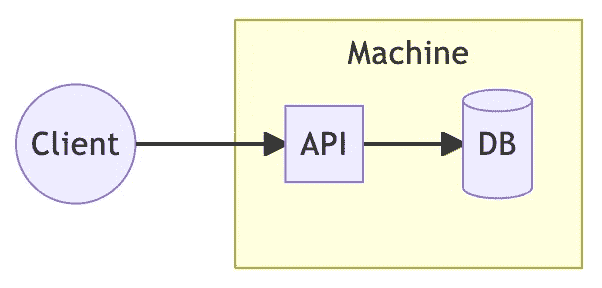

裸金属

用户可以通过网络或移动设备使用这项基本服务。这台机器包含用于业务逻辑的 API 和用于数据存储的数据库。这是所有项目开始的地方，也是最容易实现的地方。

当这个概念被成功验证后，用户数量将开始上升，很容易超过单台机器所能处理的极限。在这一点上，我们选择将服务从笔记本电脑转移到专业服务器，以便继续验证项目将继续增长，而不是昙花一现。硬件规格的升级被称为垂直扩展，也称为纵向扩展。

然而，即使对于硬件可以轻松升级和更换的专业服务器，也存在一些限制。这里的极限不仅是物理极限，也是预算极限。例如，1TB 固态硬盘的价格是 512GB 硬盘的两倍多。硬件成本的增长曲线是指数型的。

因此，有必要将组件分开，以使成本更易于管理，尤其是数据库，它通常是最昂贵的组件。

# 分层架构

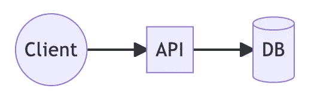

分层架构

当我们将数据库从 API 中分离出来时，我们能够单独升级他们的硬件。从最初的单机放大到单个部件的放大。

数据库的硬件规范通常非常先进，但 API 的并不先进。主要原因是随着用户的增长，API 需要更强的 CPU 来处理更多的流量，但其余的资源并不紧迫。升级 CPU 会遇到与硬盘驱动器相同的问题，即呈指数增长的成本曲线。

换句话说，增加 CPU 的数量比增加 CPU 的大小要划算得多。所以为了处理增加的流量，我们通常采用增加 API 数量的策略。

# 水平缩放

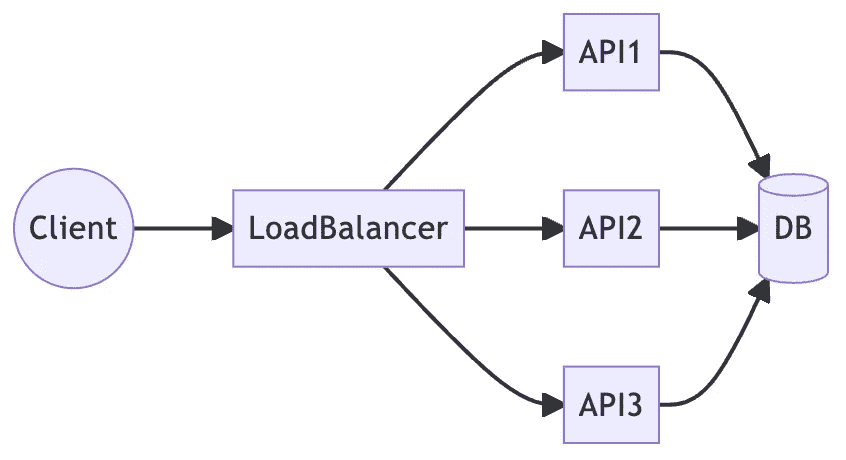

水平缩放

为了让 API 的数量平稳地扩展，我们需要一个新的角色来分配所有的传入流量，这个角色叫做负载平衡器。负载平衡器根据其算法分配流量，常见的算法有 RR(循环法)和 LU(最少使用法)，但我建议使用最简单的 RR，因为复杂的算法会给负载平衡器带来额外的负载，使其成为另一种瓶颈。

当用户的使用量发生变化时，可以动态调整 API 的数量，比如使用量上升时增加 API 的数量，这叫向外扩展，反之叫向内扩展。

到目前为止，API 可以扩展以处理不断增加的流量，但是还有另一个瓶颈，即数据库，可以在上图中找到。

当使用增加到一定数量时，单个数据库将无法有效地处理它，从而导致总体响应时间增加。结果是糟糕的用户体验，甚至可能是功能故障。关于[页面速度如何影响 web 用户体验](https://uxplanet.org/how-page-speed-affects-web-user-experience-83b6d6b1d7d7)的文章很多，这里就不赘述了。

为了解决数据库瓶颈，我们还希望对数据库进行横向扩展。然而，与 API 的无状态特征不同，数据库通常是有状态的，因此不能简单地向外扩展。

# 读写拆分

为了使数据库能够水平扩展，一种常见的做法称为读/写拆分。

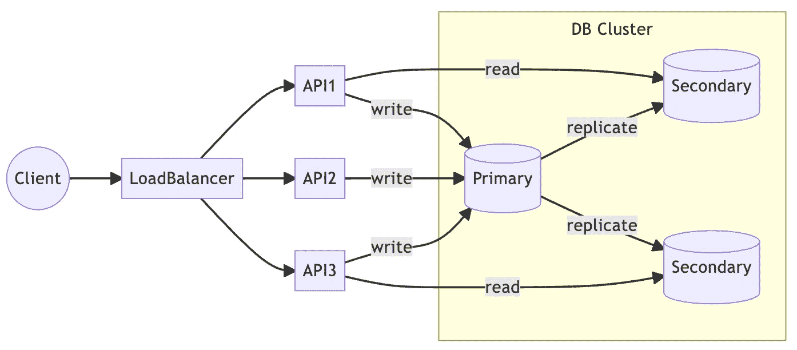

读/写拆分

首先，我们将所有写入保存在同一个数据库实体中，以维护数据库的状态。另一方面，读取是对可以水平伸缩的实体的读取。将读取和写入分开可以更容易地横向扩展数据库。

当有数据更新时，主节点负责将更改复制到每个读取实体。这样，读取的实体可以根据使用情况进行扩展。

这在几个常见的数据库中都可以看到，比如 MySQL Replication 和 MongoDB ReplicaSet。

然而，有一个问题是，为了处理更多的读取，我们必须创建更多的数据库副本，这对预算来说是一个挑战。由于数据库的高硬件规格，创建副本的代价非常高。

有没有一种方法可以在支持流量的同时节省成本？是的，缓存。

# 贮藏

有几种类型的缓存实践，常见的有:

1.  旁读缓存
2.  内容交付网络

这两种方法各有利弊，下面将简要分析。

# 旁读缓存

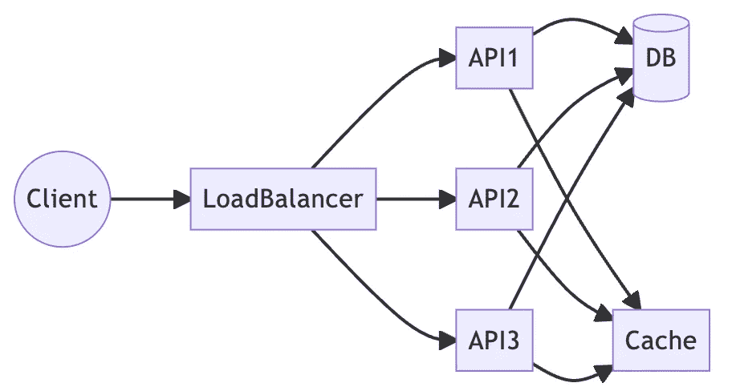

旁读缓存

除了原始数据库之外，我们还放置了一个缓存。阅读的整个过程是，

1.  首先从缓存中读取数据。
2.  如果数据不在缓存中，则从数据库中读取。
3.  然后写回缓存。

这是最常见的缓存场景。根据数据的性质、不同的生存时间，将在缓存的数据集中设置 TTL。

# 加拿大

另一个缓存实践是 CDN。

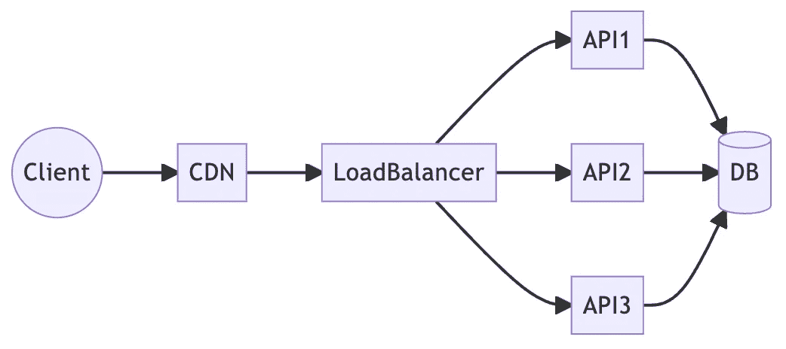

加拿大

不是构建缓存，而是使用一个新的组件并将其放在负载平衡器的前面。当任何读取请求进入时，CDN 首先根据配置的规则确定是否已经有缓存的数据。如果有，会直接回复请求。另一方面，请求会遵循原来的流程，响应通过 CDN 时会缓存数据，以便下次直接回复。

与旁读缓存相比，我们可以从图中看到 CDN 中的行数更少。更少的代码行意味着应用程序实现的复杂性更低，也更容易实现。毕竟 CDN 只需要配置规则，应用根本不需要改动。

缓存的一个潜在问题是数据的不一致性。当数据库中的数据被更新时，如果缓存的 TTL 没有过期，缓存的数据将不会被更新，然后用户可能会看到不一致的结果。

对于旁读缓存，当 API 更新数据库时，可以同时删除缓存中的数据，这样下次读入时就可以得到最新的数据。另一方面，cdn 必须通过每个供应商提供的 API 来执行失效，这在实践中比旁读缓存更复杂。

# 写作瓶颈

缓存和读/写拆分在处理数量不断增加的读请求方面一直很有效，但是正如您从上面的图表中所看到的，仍然没有有效的方法来处理对数据库的大量写入。要解决写入瓶颈，有许多不同的机制可以应用，下面列出了两种常见的方法。

1.  主-主复制
2.  直写缓存

这两种方法是正交的，并且具有完全不同的实际考虑，并且很难相互比较。那么，我们来分析一下这两种途径。

# 主-主复制

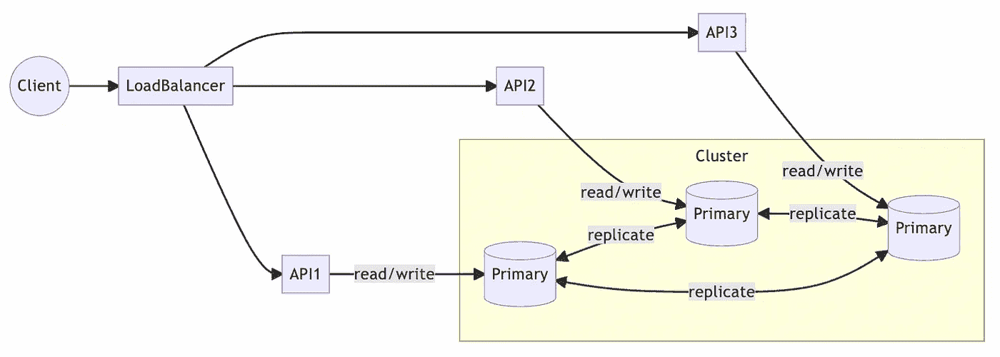

主-主复制

尽管上图中的每个 API 都有一个对应的数据库实体，但是这些 API 实际上并没有锁定到一个特定的实体，这取决于所使用和配置的数据库实现。

与读写分离相比，你会发现读和写都可以在同一个数据库实体上执行。对任何数据库实体的写入都将与其他实体同步。

master-master 复制的一个典型例子是 Cassandra，它对于写入具有很好的可伸缩性，并且可以支持大量的并发写入。另一方面，MySQL 也支持主-主复制，但 MySQL 主-主复制的一个主要问题是它的复制是在后台异步执行的，这牺牲了 MySQL 最重要的特性，一致性。

如果需要主-主复制，则必须考虑 PACELC。

主-主复制是一种容忍分区故障的技术，因此您只能在一致性和可用性之间进行选择。此外，MySQL 可以与外部框架(如 Galera Cluster)实现一致的主-主复制，这反过来会产生长延迟。

因此，在选择主-主复制来提高写入性能时，重要的是要考虑使用场景是否合适。如果你不得不在 MySQL 上应用这种技术，最好换一个数据库，比如 Cassandra。

然而，改变数据库是一项巨大的工作。有没有办法在不改变数据库的情况下解决写瓶颈？是的，通过再次缓存。

# 直写缓存

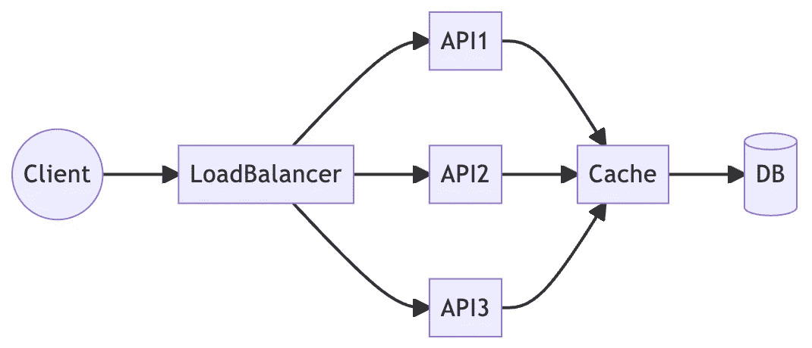

直写缓存

在 API 将数据写入数据库之前，将所有数据写入缓存。一段时间后，缓存的结果再批量写入数据库。通过这种方式，大量的写操作可以变成少量的批处理操作，可以有效地降低数据库的负载。

读取操作也可以像旁读缓存一样，先从缓存读取，然后从数据库读取，这样一方面我们可以获得第一次更新，另一方面我们可以减少数据库读取的负载。

直写缓存是一种与主-主复制完全不同的设计模式，主-主复制通过架构更改来扩展数据库性能，同时保留原始数据库。虽然不需要通过更改数据库来修改应用程序，但是通过缓存写入也会增加复杂性。

我们已经介绍了整个 web 服务如何处理大流量，从纵向扩展到横向扩展，从 API 到数据库，但是故事并没有到此结束。我们已经克服了流量问题，但是当数据库中的数据量非常大时，数据库的性能(包括读取和写入)会受到严重影响。考虑到数据量很大，即使几次读取也会占用大量资源，从而导致数据库性能问题。

# 分片

由于数据量对于单个数据库来说太大，因此将数据均匀地分布在几个数据库实体中就足够了，这就是分片的概念。

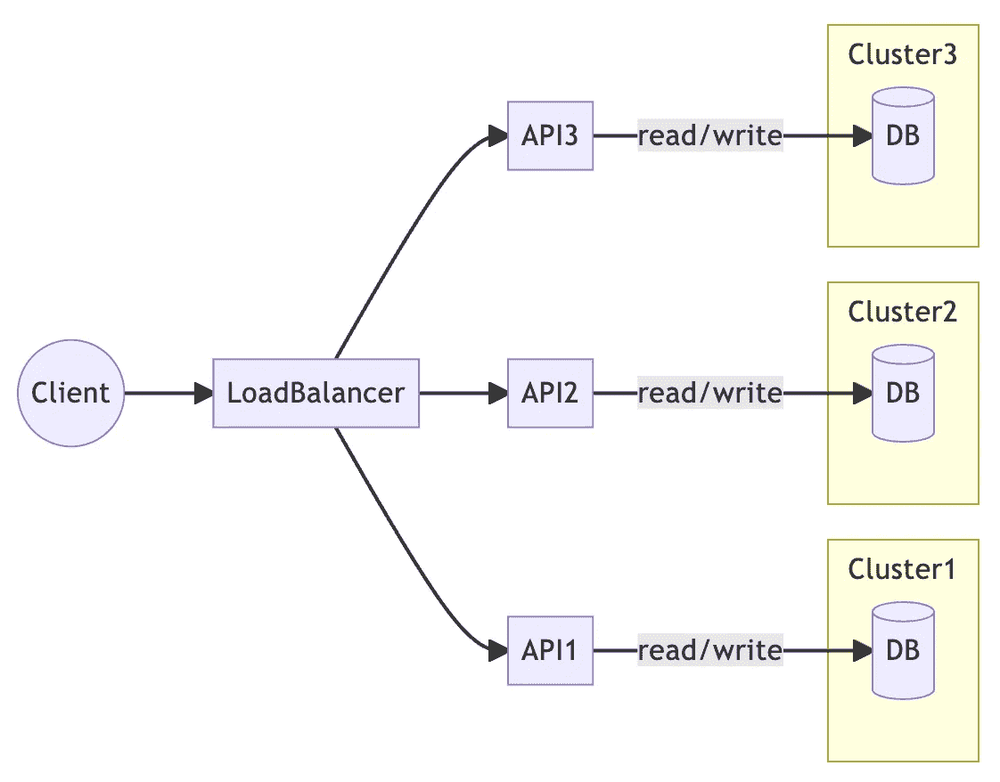

分片

虽然上述每个集群中只有一个数据库，但这三个集群实际上都是数据库集群，可以应用前面提到的读写拆分或主从复制。此外，尽管 API 分别对应于一个数据库集群，但这并不意味着 API 只能访问特定的集群。比如`API2`也可以访问`Cluster3`。

分片是将一个大数据集分成几个小数据集的技术。通过使用预定义的索引，如分片键(MongoDB)或分区键(Cassandra)，数据被分发到相应的数据库实体。因此，对于一个应用程序来说，访问一个特定的数据将在一个特定的数据库实体中，如果数据分布足够均匀，那么单个数据库实体的负载就是`1/N`，`N`是集群的数量。

尽管如此，如果数据没有足够分散，过度集中在一个数据库中，分片的意义就失去了，这就是所谓的热点，这不仅会导致性能下降，还会导致冗余数据库的成本。我前面提到过，一个数据库的成本很高，如果有一个冗余的数据库，那将是非常浪费的。

一旦我们克服了扩展流量和数据量的问题，下一个挑战就是当要执行的任务变得足够大以至于影响到 API 和数据库的性能时该怎么办？答案是分解任务。

# 信息发送

当 API 运行的任务变大时，API 的响应时间将受到显著影响。为了减少 API 对大型任务的响应时间，最常见的方法是异步执行同步任务，有时甚至将大型任务分成几个较小的任务。

异步方法实际上在我以前的很多文章中都提到过，也就是事件驱动架构。

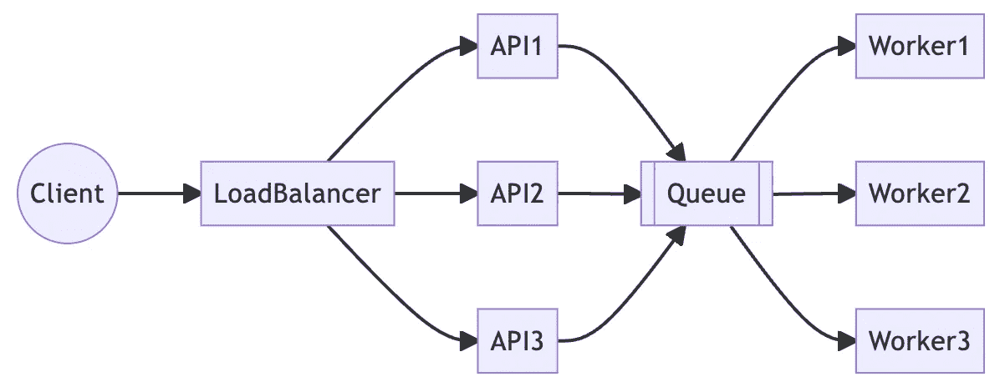

信息发送

API 将任务发送到消息队列，这些任务由队列后面的工作人员执行。随着事件数量的增加，工作线程的数量可以根据待处理事件的数量进行水平扩展。

下面列出了事件驱动架构的细节，所以我不会在本文中深入探讨。

*   如何选择消息队列？[主要有四个方面](https://selectfrom.dev/message-queue-in-redis-9efe0de2c39c)。
*   什么是事件驱动架构模式？[设计模式第一部分](https://lazypro.medium.com/design-patterns-of-event-driven-architecture-bf0121cfda7b)和[设计模式第二部分](https://lazypro.medium.com/design-patterns-of-event-driven-architecture-part-2-ea4296dc58d)。
*   如何做到事半功倍？[解决方案](/implement-event-driven-architecture-with-minimal-effort-182c3bbe5524)。

最后，当项目成功时，用户遍布世界各地。如果数据中心位于同一个地方，那么对于物理上距离较远的区域，延迟会很明显，导致用户接受度下降。那么，我们如何解决用户的可扩展性问题呢？

# 边缘计算

边缘意味着将系统布置得尽可能靠近用户，以获得良好的用户体验。

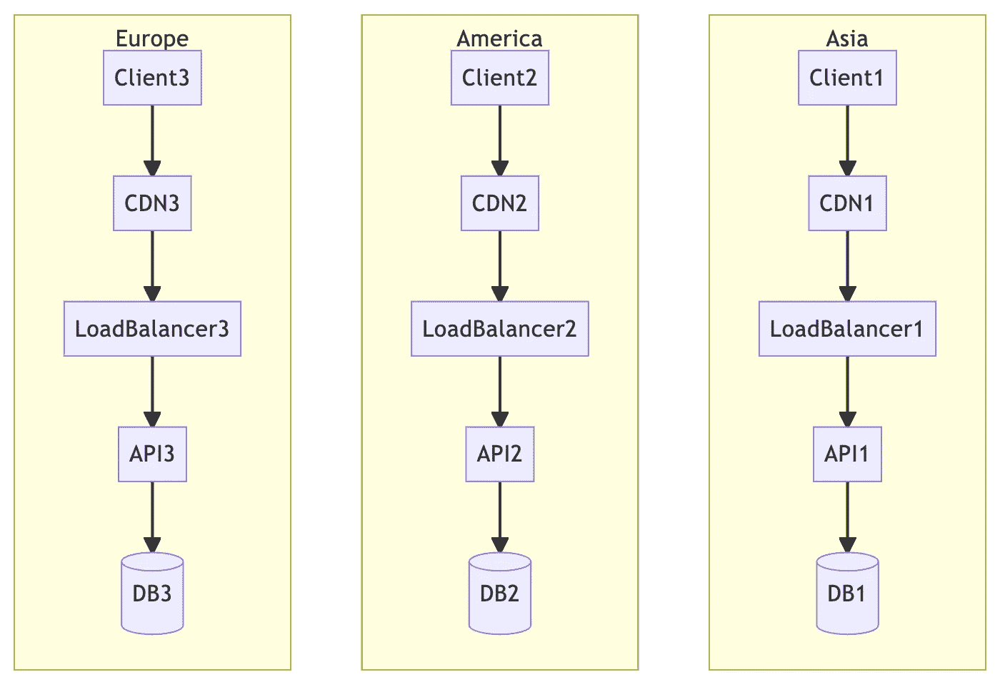

边缘计算

因此，对于三个相距较远的地区，我们可以建立三个不同的数据中心，为每个地区的用户提供更好的效率。

然而，当我们需要执行数据分析时，我们总是需要来自所有三个地区的数据。从数据分析的角度来看，我们需要一个逻辑上统一的数据库，而不是三个物理上独立的数据库。

换句话说，如何让数据库尽可能靠近用户，并且仍然有一个统一的入口点？

*   DB shards:这是一种相对简单的实践方法。只需使用区域作为分片键，并在每个区域中创建数据库分片。然后，会有一个统一的入口点，在 MongoDB 的情况下是`mongos`。
*   DB master-master 复制:master-master 复制也允许将不同的数据库实体放在不同的区域，但是由于物理距离的原因，复制的效率不是很高，所以同步速率是一个潜在的问题。
*   数据 ETL:从各种数据库中提取数据，转换并加载到统一的数据存储中。这是数据分析师在不改变原始应用程序的数据库结构的情况下，以及预处理数据甚至选择自己熟悉的数据存储时最常用的方法。

# 结论

本文从不同的角度分析了如何扩展 web 服务。从项目一开始，API 就进行了水平扩展，以处理大量的传入请求，直到数据库成为瓶颈。要解决数据库瓶颈，不能使用简单的水平扩展，因此使用读写拆分或缓存等技术来降低数据库的负载。但是，如果数据集非常大，我们仍然需要采用分片等方法来分离数据集。最后，如果用户遍布全球，则有必要建立不同的数据中心来物理分布工作负载。

然而，尽管本文重点解释了与基础设施相关的主题，但还有另一种服务扩展实际上非常重要，那就是功能需求的扩展。

随着项目走向成功，会提出越来越多的特性请求，那么如何快速响应特性缩放呢？现在最常用的技术是微服务，但微服务也有必须面对的问题，在我之前的文章中，我介绍了设计微服务架构有哪些方面值得考虑。

*   [微服务原罪，第一部](https://medium.com/interviewnoodle/original-sin-of-microservices-part-1-90461ddcefb)
*   [微服务原罪第二部](https://lazypro.medium.com/original-sin-of-microservices-part-2-8856c0e8426d)

这篇文章作为我的团队成员的内部培训，因为目标是初级工程师，所以每个主题没有太多的细节。如果您对任何主题感兴趣，请让我知道，我将深入分析这些技术。