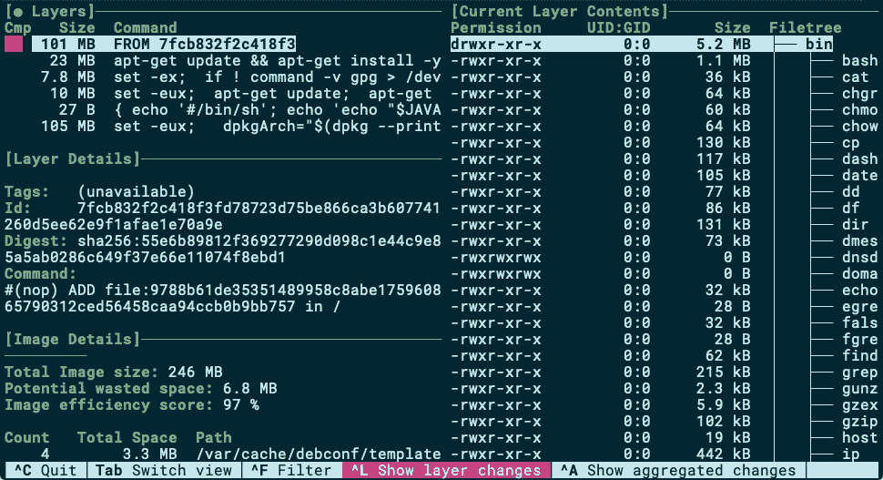
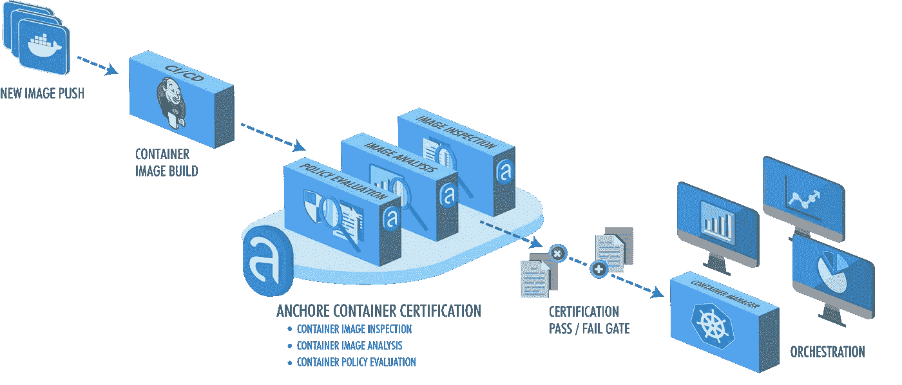
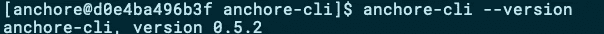
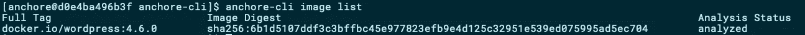
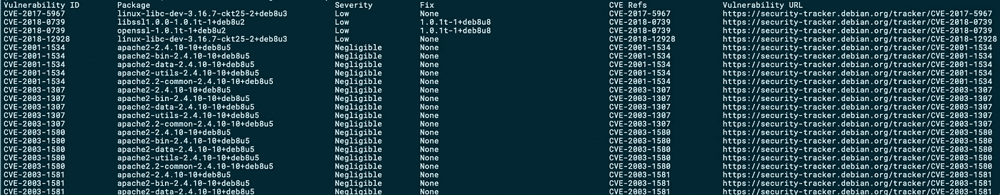

# 扫描您的 Docker 映像中的漏洞

> 原文：<https://betterprogramming.pub/scan-your-docker-images-for-vulnerabilities-81d37ae32cb3>

## 如何及时发现安全漏洞


迈克尔·盖格在 [Unsplash](https://unsplash.com?utm_source=medium&utm_medium=referral) 上的照片

因此，您已经制作了一个`Dockerfile`，在您的开发工作站中测试了您的容器，并且您正在等待 CI/CD 来拾取它。最终， *pre-prod* 被更新，集成测试通过，功能测试人员开了绿灯。现在是向*产品*推广的时候了吗？没那么快。

# Docker 图像层继承

添加到图像的每批文件最终都会创建一个添加到图像的图层。您的 Docker 图像是所有这些层按照它们最初创建的特定顺序的串联。

当您在您的`Dockerfile`中使用`FROM`指令创建一个继承父映像的映像时，同样的原则也适用。您的最终图像将包括父图像的所有层，并增加了您自己创建的层。

如果您使用的父映像也使用另一个父映像，也可能使用*另一个*父映像，最终使用像 [Ubuntu](https://hub.docker.com/_/ubuntu) 或 [Alpine](https://hub.docker.com/_/alpine) 这样的基础映像，该怎么办？我想您已经看到了这种情况的发展:您最终会从您自己从未见过(更不用说控制)的上游映像继承多层内容(即文件和可执行文件)。



使用[潜水](https://github.com/wagoodman/dive)可视化码头工人图像(图片由作者提供)

如果这些上游层中的任何一层存在安全漏洞，该怎么办？接下来我们将看看如何检测这些。但是首先，到底什么是安全漏洞？

# 安全漏洞

在上图左上方可以看到( [openjdk:8-jre](https://hub.docker.com/layers/openjdk/library/openjdk/8-jre/images/sha256-982eecc9473ebc43d291400577adb84ad5d5521ea24e095fb1ddb4914e5cf092) 图片)，有多个图层。在右边部分，您还可以通过 Dive 工具可视化该图像中包含的文件。这些文件中有许多是可执行文件，就像我们编写的所有源代码一样，容易受到安全问题和漏洞的影响。

如果这些文件在您的本地文件系统中，您可能会运行病毒扫描，并尽一切可能在可行的情况下这样做。从更广泛的意义上来说，病毒本身可以被视为一种安全漏洞。然而，计算机病毒是一种计算机程序，当执行时，它通过修改其他计算机程序和插入自己的代码来复制自己。当这种复制成功时，受影响的区域就被认为感染了计算机病毒。

安全漏洞不是病毒。

安全漏洞通常存在于意图良好的源代码中，这些源代码具有逻辑或技术缺陷，导致可被利用来危害系统的系统弱点。此类漏洞可能存在多年而未被发现，直到有人发现它们，要么是在积极寻找它们，要么仅仅是运气。

## 漏洞数据库

当您发现一个可能影响成千上万用户的漏洞时，负责任的做法是报告它。首先，私下向源代码所有者提供足够的时间来推出补丁，然后公开提高其他所有人的意识。

目前有许多成熟的在线漏洞数据库可用于此类公告，如 CVE、NVD⁴和 VULDB⁵.

# Docker 静态漏洞扫描

让我们回顾一下到目前为止我们已经确定的内容:

*   Docker 映像由包含文件和可执行文件的层组成。
*   可执行(或库)源代码的安全漏洞公开保存在在线数据库中。

如果我们把这两点结合起来呢？我们能否尝试将在我们的层中找到的可执行文件与在线漏洞数据库的条目进行比较，以确定我们的 Docker 映像是否暴露在已知的威胁中？

让我们接下来试试。

# 锚定发动机

有许多可用的工具，包括开源的和商业的，允许你扫描你的图像中已知的漏洞。此类工具可以作为 CI/CD 管道的一部分运行，也可以与您的映像注册表连接，并在新映像可用时对其进行扫描。这些工具中的一些包括[克莱尔](https://coreos.com/clair/docs/latest/)、[达德加](https://github.com/eliasgranderubio/dagda)、 [Nexus Repository Pro](https://www.sonatype.com/product-nexus-repository) 、[黑鸭](https://www.synopsys.com/software-integrity/security-testing/software-composition-analysis.html)、 [Qualys](https://www.qualys.com/) 、 [Harbor](https://goharbor.io) 和 [Twistlock](https://www.twistlock.com) 。

在这篇文章的实践部分，我将向你展示如何使用 Anchore⁶.Anchore 由商业版(Anchore Enterprise)和开源版(Anchor Engine)组成。



Anchore 引擎(图片由 Anchore 公司提供)

Anchor 的客户群令人印象深刻，包括思科、易贝、Atlassian、Nvidia 和 RedHat 等公司。商业版为你提供了一个额外的用户界面、RBAC 和其他支持——然而，它仍然使用底层的开源版，我们在这里将要使用的锚引擎。

## 装置

Anchore Engine 作为一组 Docker 映像提供，可以独立运行，也可以在一个编排平台中运行，如 Kubernetes、Docker Swarm、Rancher、Amazon ECS 和其他容器编排平台。您可以使用 Docker Compose 和以下一行程序快速启动本地版本的 Anchore Engine:

```
curl https://raw.githubusercontent.com/anchore/anchore-engine/master/docker-compose.yaml | docker-compose -p anchore -f - up
```

上面的`docker-compose.yaml`将创建五个容器，然后尝试获取在线漏洞数据库，因此可能需要几分钟才能完成。

## 运行客户端

锚引擎是通过命令行客户端访问的。您可以通过另一个 Docker 映像方便地运行 CLI 客户端:

```
docker run --rm -e ANCHORE_CLI_URL=[http://anchore_engine-api_1:8228/v1/](http://anchore_engine-api_1:8228/v1/) --network anchore_default -it anchore/engine-cli
```

现在，您有了一个 Anchore CLI 客户机的 shell，现在，您可以在其中执行一个测试命令，比如`anchore-cli --version`:



CLI 客户端工作(图片由作者提供)

## 签入 Docker 映像

Anchore Engine 分两步为您提供漏洞评估报告。您首先需要添加一个要扫描的映像，然后您可以请求该映像的漏洞报告，在这两个命令之间留出足够的时间来下载和扫描映像。

在下面的例子中，我们将使用一个已知有漏洞的旧的 Wordpress 图片。

⚠ *如果你打算在 Docker 上使用 Wordpress，确保你使用的是最近的图片。* ⚠

那么，是时候用 CLI 客户机添加我们的第一个 Docker 映像了:

```
anchore-cli image add wordpress:4.6.0 && anchore-cli image wait wordpress:4.6.0
```

使用上面的命令，我们添加一个要分析的新图像，并等待 Anchore 报告分析完成。



图像分析完成(图片由作者提供)

## 查看漏洞

要查看发现的安全漏洞，您可以执行以下命令:

```
anchore-cli image vuln wordpress:4.6.0 all
```

在像上面这样的旧图像中，我们可以发现很多很多漏洞。事实上，Anchore 报告了 1420 个已知的 Wordpress 测试漏洞——图片来自 2016 年:



Anchore:漏洞报告(摘录)(图片由作者提供)

正如您所看到的，用上面的图像实例化 Docker 容器是一个高风险的操作。如果这是您创建的用于分发您自己的应用程序的映像，您可能应该阻止此版本，直到首先进行漏洞评估。

# 结论

软件(仍然)是由人类编写的，人类会犯错误。不要让这样的错误困扰你的码头工人形象。使用 Docker 图像安全漏洞扫描器，至少可以避免已经发现的安全问题。将漏洞扫描作为 CI/CD 管道的一部分进行集成，并建立规则，以便在发现漏洞时有条件地阻止发布。

# 参考

[1]古德曼 A. 2019。Dive:探索 docker 图像中每一层的工具[VCS]。[github.com/wagoodman/dive](https://github.com/wagoodman/dive)(访问时间 2019–12–08)
【2】维基百科。2019.电脑病毒[网页]。[wikipedia.org/wiki/Computer_virus](https://en.wikipedia.org/wiki/Computer_virus)(访问时间 2019–12–08)
【3】米特公司。2019.常见漏洞和暴露。[cve.mitre.org](https://cve.mitre.org/)【网站】(访问时间 2019–12–08)
【4】美国商务部。2019.国家脆弱性数据库。[nvd.nist.gov](https://nvd.nist.gov/)【网站】(访问时间 2019–12–08)
【5】社区驱动的漏洞数据库。2019.[vuldb.com](https://vuldb.com/)【网站】(访问时间 2019–12–08)
【6】主播。2019.[anchore.com](https://anchore.com/)【网站】(访问时间:2019-12-08)