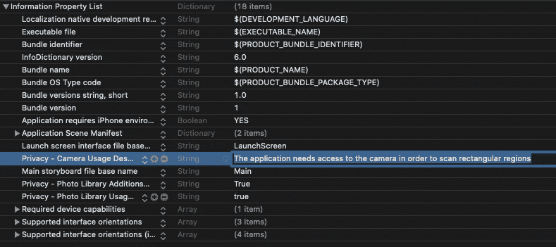
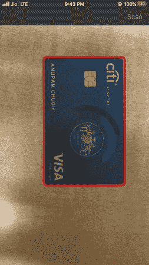
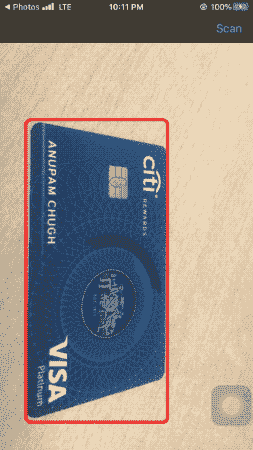
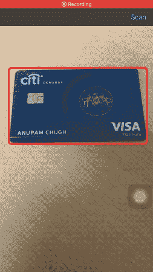
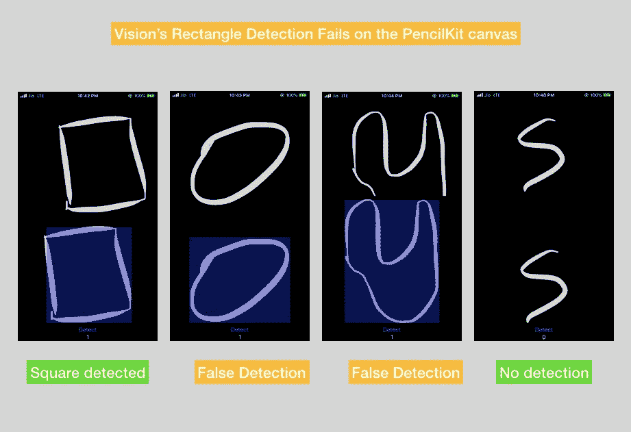

# 在 iOS 上用计算机视觉扫描信用卡

> 原文：<https://betterprogramming.pub/scanning-credit-cards-with-computer-vision-on-ios-c3f4d8912de4>

## 计算机视觉

## 利用 Vision 的矩形检测和文本识别器来检测实时摄像头馈送中的信用卡和其他名片


由 [Ales Nesetril](https://unsplash.com/@alesnesetril?utm_source=medium&utm_medium=referral) 在 [Unsplash](https://unsplash.com?utm_source=medium&utm_medium=referral) 拍摄的照片

自 iPhone 问世以来，摄影一直是苹果的核心关注点。多年来，他们已经发布了令人惊叹的新功能，让这个世界成为一个没有 iPhone 就很难生活的地方。由于苹果公司稳步增加的最先进的图像智能功能，用户能够捕捉越来越好的照片。

具体来说，苹果一直在计算机视觉领域进行大量投资，通过其 2017 年发布的视觉框架每年推出重大更新。

凭借人脸检测、物体跟踪、[捕捉质量](https://medium.com/r?url=https%3A%2F%2Fheartbeat.fritz.ai%2Fcomputer-vision-in-ios-determine-the-best-facial-expression-in-live-photos-452a2eaf6512)和[图像相似度](https://heartbeat.comet.ml/compute-image-similarity-using-computer-vision-in-ios-75b4dcdd095f)功能，苹果一直在让移动开发者能够集成复杂的计算机视觉算法，以构建基于人工智能的照片应用。

在 WWDC 2019 新发布的产品中，Vision 的[文本识别](https://venturebeat.com/2020/01/23/kneron-raises-40-million-to-grow-edge-ai-chip-design-operations/)和[显著性](https://medium.com/better-programming/cropping-areas-of-interest-using-vision-in-ios-e83b5e53440b)功能脱颖而出。

但是这不是我们在这篇文章中的目的。

# 我们的目标

*   这件作品的想法是深入挖掘视觉的**矩形检测**要求。
*   我们将探索`VNDetectRectanglesRequest`的各种可能配置。
*   在本文的整个过程中，我们将开发一个应用程序，该应用程序可以扫描信用卡或其他类似尺寸的名片，并从应用程序的实时摄像头获取图像。
*   最后，我们将使用 Vision 的文本识别请求从卡片中只解析所需的值。用户通过手势选择的值。

## 需要矩形检测

如果你有机会使用 iOS 13 的文档摄像头扫描文档——它内置在笔记和文件应用程序中，你会注意到它要求你手动设置文档的边角。

通过利用视觉的矩形检测，我们可以自动检测通常为矩形的文档的角。

# VNDetectRectanglesRequest

视觉的矩形检测请求是基于图像的请求，在图像中寻找矩形区域。除了指定可信度阈值，我们还可以使用以下属性定制此请求:

*   **vnaspectation**—通过指定视觉请求的最小和最大纵横比，我们可以限制我们想要检测的矩形类型。将`minimumAspectRatio`和`maximumAspectRatio`设置为 1 会将请求设置为仅检测正方形。
*   **最小尺寸** —我们可以指定想要检测的矩形的最小尺寸。它需要指定在 0 和 1.0 之间，默认值为 0.2。
*   **最大观察值** —一个整数属性，指定视觉请求可以返回的矩形的最大数量。
*   **边与边之间的角度** —通过使用属性`quadratureTolerance`，我们可以指定矩形边缘偏离 90 度的程度。

在接下来的几节中，我们将创建一个 iOS 应用程序，该应用程序使用带有 AVFoundation 的 Vision 框架来扫描来自自定义相机的文档。

我们将在裁剪检测到的区域并将其保存为图像之前进行透视校正。我们开始吧！

# 入门指南

启动 Xcode 并创建一个新的单视图应用程序。确保通过在您的`info.plist`文件中添加关键字`NSCameraUsageDescription`来添加摄像机隐私政策的描述。



# 设置摄像头输入

在下面的代码中，我们设置了我们的后置摄像头，媒体类型为 video，并将其添加到`AVCaptureSession`:

```
private let captureSession = AVCaptureSession()private func **setCameraInput**() {guard let device = AVCaptureDevice.DiscoverySession(deviceTypes: [.builtInWideAngleCamera, .builtInDualCamera, .builtInTrueDepthCamera],mediaType: .video, position: .back).devices.first else {
fatalError("No back camera device found.")
}let cameraInput = try! AVCaptureDeviceInput(device: device)self.captureSession.addInput(cameraInput)}
```

接下来，我们需要将摄像机镜头添加到我们的`ViewController`视图中。

# 显示相机预览并设置输出

下面的代码包含显示实时摄像机输入和设置输出的函数。输出视频帧最终将被馈送到视觉请求:

```
private lazy var previewLayer = AVCaptureVideoPreviewLayer(session: self.captureSession)private let videoDataOutput = AVCaptureVideoDataOutput()private func **showCameraFeed**() {
        self.previewLayer.videoGravity = .resizeAspectFill
        self.view.layer.addSublayer(self.previewLayer)
        self.previewLayer.frame = self.view.frame
    } private func **setCameraOutput**() {
    self.videoDataOutput.videoSettings = [(kCVPixelBufferPixelFormatTypeKey as NSString) : NSNumber(value: kCVPixelFormatType_32BGRA)] as [String : Any]self.videoDataOutput.alwaysDiscardsLateVideoFrames = true
    **self.videoDataOutput.setSampleBufferDelegate(self**, queue: DispatchQueue(label: "camera_frame_processing_queue"))self.captureSession.addOutput(self.videoDataOutput)
    guard let connection = self.videoDataOutput.connection(with: AVMediaType.video),
        connection.isVideoOrientationSupported else { return }connection.videoOrientation = .portrait
}
```

为了接收摄像机帧，我们需要遵守`AVCaptureVideoDataOutputSampleBufferDelegate`协议并实现`captureOutput`功能。

我们的相机准备好了！将这三个函数添加到`ViewController`的`viewDidLoad`方法中，并简单地调用`AVCaptureSession`实例上的`startRunning`函数。

```
override func viewDidLoad() {super.viewDidLoad()self.setCameraInput()
self.showCameraFeed()
self.setCameraOutput()
**self.captureSession.startRunning()**}
```

# 设置我们的愿景请求

现在是时候设置我们的视觉矩形检测请求了。在下面的函数`detectRectangles`中，我们设置了我们的`VNDetectRectanglesRequest`并将其传递给图像请求处理器以开始处理:

在上面的代码中需要注意一些事情:

*   我们已经将`minimumAspectRatio`和`maximumAspectRatios`设置为 1.3 和 1.7。因为大多数信用卡和商务卡都在这个范围内。
*   上述函数在以下函数中调用:

```
func captureOutput(
        _ output: AVCaptureOutput,
        didOutput sampleBuffer: CMSampleBuffer,
        from connection: AVCaptureConnection) {

        guard let frame = CMSampleBufferGetImageBuffer(sampleBuffer) else {
            debugPrint("unable to get image from sample buffer")
            return
        }

        self.detectRectangle(in: frame)
}
```

*   完成处理程序中的视觉请求返回的结果是类型`VNRectangleObservation`，由`boundingBox`和`confidence`值组成。
*   使用边界框属性，我们将在检测到矩形的摄像机顶部绘制一个层。
*   `doPerspectiveCorrection`功能用于在图像失真的情况下修复图像。我们将很快对此进行更深入的研究。当用户点击“扫描”按钮以从相机馈送中提取完全裁剪的卡时，调用该功能。

# 在相机视图上绘制边界框

Vision 的边界框坐标属于归一化坐标系，其原点为屏幕的左下角。

因此，我们需要将视觉的边界框`CGRect`转换到图像坐标系中，如下面的代码所示:

```
func drawBoundingBox(rect : VNRectangleObservation) {

let transform = CGAffineTransform(scaleX: 1, y: -1).translatedBy(x: 0, y: -self.previewLayer.frame.height)

let scale = CGAffineTransform.identity.scaledBy(x: self.previewLayer.frame.width, y: self.previewLayer.frame.height)

let bounds = rect.boundingBox.applying(scale).applying(transform)createLayer(in: bounds)}private func createLayer(in rect: CGRect) { maskLayer = CAShapeLayer()
        maskLayer.frame = rect
        maskLayer.cornerRadius = 10
        maskLayer.opacity = 0.75
        maskLayer.borderColor = UIColor.red.cgColor
        maskLayer.borderWidth = 5.0

        previewLayer.insertSublayer(maskLayer, at: 1)}
```

我们可以使用 Vision framework 提供的以下内置方法，而不是使用`CGAffineTransform`将边界框转换到图像的坐标空间:

```
func VNNormalizedRectForImageRect(_ imageRect: CGRect, 
                                _ imageWidth: Int, 
                                _ imageHeight: Int) -> CGRect
```

当`maskLayer`被设置在相机馈送中检测到的矩形上时，您将得到如下结果:



这项工作只完成了一半！我们的下一步包括提取边界框内的图像。让我们看看如何做到这一点。

# 从包围盒中提取图像

函数`doPerspectiveCorrection`从缓冲区中取出核心图像，将它的角点从归一化转换到图像空间，并对它们应用透视校正过滤器以给出图像。代码如下所示:

`UIImageWriteToSavedPhotosAlbum`功能用于将图像保存在用户设备的照片库中。

如果你直接将`CIImage`传递到`UIImage`初始化器中，图片不会显示在你的相册中。因此，首先将`CIImage`转换成`CGImage`，然后将它发送给`UIImage`是至关重要的。

让我们看看应用了透视校正的提取图像:



从上面的图示中可以明显看出，在核心图像上应用透视校正滤波器固定了所述图像的方向。

接下来，让我们来看看如何从扫描图像中提取所需的文本。

# 优化的视觉文本识别

iOS 13 的愿景是在`VNRecognizeTextRequest`中加入文本标识符，这在以前只能告诉我们文本是否存在。我们必须使用核心 ML 模型来解析所述文本的值。

具体来说，我们不得不使用正则表达式，它不仅效率低，而且不能通用。使用正则表达式模式需要支持许多边缘情况来过滤不同类型的信用卡(例如，不是所有的卡都是 16 位的。美国运通有 15 个)。

相反，我们将允许用户使用手势在图像上创建一个可移动的矩形。随后，我们将从用户选择的区域解析文本。这不仅提高了效率，还让用户可以控制他们共享的数据。

为了创建一个可移动的矩形，我们将跟踪用户在扫描图像上的触摸，并重新绘制选定的区域，如下所示:

一旦用户选择了一个矩形区域，并按下“提取”按钮，我们将从矩形中裁剪图像，并将其传递给视觉请求。

我没有粘贴`TextExtractorVC.swift`的完整源代码，只是分享了下面的相关片段:

下面是最终应用程序的输出结果:



上图并没有提取并给出我的信用卡号码，而是在卡的正面提取。

# 当与 PencilKit 一起使用时，准确性…不是最好的

Vision 的矩形检测在手绘形状上效果不佳。下面是我在使用上述视觉请求时在 PencilKit 框架上运行的一个实验的一瞥:



# 结论

在这篇文章中，我们完成了计算机视觉的另一个经典应用，在这个应用中，我们使用了一个实时摄像头馈送中的矩形检测请求来检测信用卡并将其裁剪出来，同时考虑到它的方向和变形。

接下来，我们在刚刚扫描的图像上实现了文本识别器，以提取信用卡的数字。通过让用户选择要解析的感兴趣的区域，我们不仅给了他们对自己信息的控制权，还去掉了不需要的信息。

在已识别的文本上设置一个边界框，并对它们进行点击测试，这可能是从卡片中提取所需信息的另一种方式！

这个项目的完整源代码可以在这个 [GitHub 库](https://github.com/anupamchugh/iowncode/tree/master/VisionCreditScan)中找到。

这一次到此为止。感谢阅读。