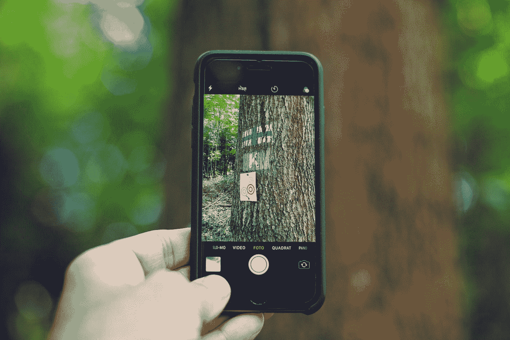
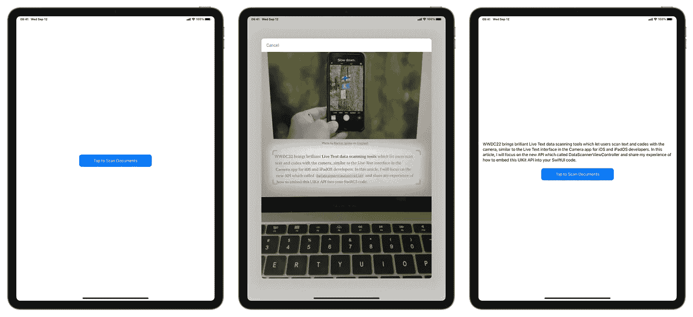

# iOS 16 中的 Live Text API 在 SwiftUI 中用相机扫描数据

> 原文：<https://betterprogramming.pub/scanning-data-with-the-camera-in-swiftui-491741e36f69>

## 如何在 SwiftUI 中使用`[DataScannerViewController](https://developer.apple.com/documentation/visionkit/datascannerviewcontroller)`



由[马库斯·斯皮斯克](https://unsplash.com/@markusspiske?utm_source=medium&utm_medium=referral)在 [Unsplash](https://unsplash.com?utm_source=medium&utm_medium=referral) 上拍摄

WWDC22 带来了出色的实时文本数据扫描工具，允许用户使用相机扫描文本和代码，类似于 iOS 和 iPadOS 开发人员在相机应用程序中的实时文本界面。

在本文中，我将重点介绍名为`[DataScannerViewController](https://developer.apple.com/documentation/visionkit/datascannerviewcontroller)`的新 API，并分享我在如何将该 API 嵌入到您的 SwiftUI 代码中的经验。下面的照片展示了今天的演示。



我们将创建的演示应用程序

# 提供使用相机的理由

因为这个演示应用程序只能在真实世界的设备上运行，所以要访问用户的相机，你最好提供一个清晰的声明，说明你为什么需要访问他们的相机。

您需要在 Xcode 项目配置中提供使用摄像机的原因。在 Xcode 中将`[NSCameraUsageDescription](https://developer.apple.com/documentation/bundleresources/information_property_list/nscamerausagedescription)`键添加到目标的信息属性列表中。

以下我提供的步骤来自苹果官方文档:[用摄像头扫描数据](https://developer.apple.com/documentation/visionkit/scanning_data_with_the_camera)。

1.  在项目编辑器中，选择目标并单击“信息”。
2.  在自定义 iOS 目标属性下，单击任意行中的加号按钮。
3.  从“密钥”栏的弹出式菜单中，选取“隐私——相机使用说明”。
4.  在“值”栏中，输入原因，如“您的相机用于扫描文本和代码”

# 创建主视图

在您的`ContentView.swift`文件中，添加以下代码:

```
VStack {
    Text(scanResults)
        .padding() Button {
        // Enable Scan Document Action
    } label: {
        Text("Tap to Scan Documents")
            .foregroundColor(.white)
            .frame(width: 300, height: 50)
            .background(Color.blue)
            .cornerRadius(10)
    }
}
```

其中`scanResult`是一个`String`变量，代表摄像头扫描结果，用于说明摄像头在扫描过程中看到的内容。

```
@State **private** **var** scanResults: String = ""
```

此处的按钮用于显示扫描视图。

当有人点击按钮时，设备将准备扫描数据。但是，并非所有设备都支持该功能。或者甚至当设备支持扫描数据时，当用户否认提供相机使用权限时，轻按按钮时，事情可能会失败。

在这种情况下，我会提供一个警报视图，在设备无法扫描数据时显示一条消息。

```
@State **private** **var** showDeviceNotCapacityAlert = **false**
```

上面的代码提供了一个变量来选择是否显示警报视图。如果`showDeviceNotCapacityAlert`是`true`，则显示告警视图。

在`VStack`代码后面添加以下代码:

```
.alert("Scanner Unavailable", isPresented: $showDeviceNotCapacityAlert, actions: {})
```

最后，当设备准备好扫描数据时，我们需要呈现一个扫描视图，如上面的代码，并将下面的代码添加到您的`ContentView.swift`文件中:

```
@State **private** **var** showCameraScannerView = **false****var** body: **some** View {
    VStack {
        ...
    }
    .sheet(isPresented: $showCameraScannerView) {
        // Present the scanning view
    }
    ...
}
```

现在我们剩下的是，当我们点击按钮时，如果设备无法扫描数据，将会显示一个警报视图。我们使用`isDeviceCapacity`来检查设备是否可以使用该功能。

```
@State **private** **var** isDeviceCapacity = **false**
```

现在，在按钮操作中添加以下代码:

```
**if** isDeviceCapacity {
    **self**.showCameraScannerView = **true** } **else** {
    **self**.showDeviceNotCapacityAlert = **true** }
```

# 创建相机扫描仪视图

创建一个新的 swift 文件并命名为`CameraScanner.swift`。在此添加以下代码:

```
**struct** CameraScanner: View {
    @Environment(\.presentationMode) **var** presentationMode
    **var** body: **some** View {
        NavigationView {
            Text("Scanning View")
                .toolbar {
                    ToolbarItem(placement: .navigationBarLeading) {
                        Button {
**self**.presentationMode.wrappedValue.dismiss()
                        } label: {
                              Text("Cancel")
                        }
                    }
                }
                .interactiveDismissDisabled(**true**)
        }
    }
}
```

# 扫描仪不可用时的处理

当用户打开应用程序时，我们需要检查扫描仪是否可用。只需添加以下代码，此应用程序便会打开:

```
**var** body: **some** View {
    VStack {
        ...
    }
    .onAppear {
        isDeviceCapacity = (DataScannerViewController.isSupported && DataScannerViewController.isAvailable)
    }
    ...
}
```

只有当上面检查两个值的便利属性返回`true`时，我们才能打开扫描视图。

# 创建数据扫描仪视图控制器

要实现一个可以在 SwiftUI 视图中使用的视图控制器，首先我们需要使用`**UIViewControllerRepresentable**`来包装一个 UIKit 视图控制器，以便它可以在 SwiftUI 中使用。创建一个名为`CameraScannerViewController.swift`的新 Swift 文件，并在此添加以下代码:

```
**import** SwiftUI
**import** UIKit
**import** VisionKit**struct** CameraScannerViewController: UIViewControllerRepresentable {
    **func** makeUIViewController(context: Context) -> DataScannerViewController {
        **let** viewController =  DataScannerViewController(recognizedDataTypes: [.text()],qualityLevel: .fast,recognizesMultipleItems: **false**, isHighFrameRateTrackingEnabled: **false**, isHighlightingEnabled: **true**) **return** viewController
    } **func** updateUIViewController(_ viewController: DataScannerViewController, context: Context) {}}
```

上面的代码返回了一个视图控制器，它提供了用于扫描实时视频中的项目的接口。在本文中，我将只关注扫描文本数据，所以这里的`recognizedDataTypes`只包含`.text()`属性。

# `Handle Delegate`协议

在创建视图控制器之后，在我们展示它之前，将它的委托设置为这个应用中处理`[DataScannerViewControllerDelegate](https://developer.apple.com/documentation/visionkit/datascannerviewcontrollerdelegate)`协议回调的一个对象。

在 UIKit 中，很容易编写以下代码:

```
viewController.delegate = self
```

幸运的是，在 SwiftUI 中处理`[DataScannerViewControllerDelegat](https://developer.apple.com/documentation/visionkit/datascannerviewcontrollerdelegate)e`非常方便。

> SwiftUI 的协调器被设计为充当 UIKit 视图控制器的代表。请记住，“委托”是对其他地方发生的事件做出响应的对象。例如，UIKit 允许我们将一个委托对象附加到它的文本字段视图中，当用户键入任何内容、按下 return 键等等时，该委托将会得到通知。这意味着 UIKit 开发人员可以修改他们的文本字段的行为方式，而不必创建他们自己的自定义文本字段类型。

因此，在`CameraScannerViewController`中添加以下代码:

```
**func** makeCoordinator() -> Coordinator {
    Coordinator(**self**)
}**class** Coordinator: NSObject, DataScannerViewControllerDelegate {
    **var** parent: CameraScannerViewController
    **init**(_ parent: CameraScannerViewController) {
        **self**.parent = parent
    }
}
```

现在我们可以在`makeUIViewController`里面使用类似的代码，只是在**上面返回**代码:

```
**func** makeUIViewController(context: Context) -> DataScannerViewController {
    ...
    viewController.delegate = context.coordinator
    **return** viewController
}
```

# 开始数据扫描

该开始数据扫描了。一旦用户允许不受限制地访问摄像机，您就可以通过调用`[startScanning()](https://developer.apple.com/documentation/visionkit/datascannerviewcontroller/3941759-startscanning)`方法开始扫描出现在直播视频中的项目。在这种情况下，当显示扫描视图时，我们将需要该视图来执行扫描操作。

我们需要一个值来告诉扫描视图进行扫描，将下面的代码添加到`CameraScannerViewController`中:

```
@Binding **var** startScanning: Bool
```

当`startScanning`的值设置为 true 时，我们需要更新 UIViewController 并开始扫描，在`updateUIViewController`中添加以下代码:

```
**func** updateUIViewController(_ viewController: DataScannerViewController, context: Context) {
    **if** startScanning {
        **try**? viewController.startScanning()
    } **else** {
        viewController.stopScanning()
    }
}
```

# 当我们点击一个项目时做出响应

当我们点击实时视频中的一个识别项时，视图控制器调用`[dataScanner(_:didTapOn:)](https://developer.apple.com/documentation/visionkit/datascannerviewcontrollerdelegate/3941771-datascanner)`委托方法并传递识别项。实现此方法以根据用户点击的项目采取一些操作。使用`[RecognizedItem](https://developer.apple.com/documentation/visionkit/recognizeditem)`枚举的参数来获得关于该项目的细节，比如边界。

在这种情况下，为了处理我们点击相机识别的文本，实现`[dataScanner(_:didTapOn:)](https://developer.apple.com/documentation/visionkit/datascannerviewcontrollerdelegate/3941771-datascanner)`方法来执行在屏幕上显示结果的动作。因此，在`Coordinator`类中添加以下代码:

```
**class** Coordinator: NSObject, DataScannerViewControllerDelegate {
    ...
    **func** dataScanner(_ dataScanner: DataScannerViewController, didTapOn item: RecognizedItem) {
        **switch** item {
            **case** .text(**let** text):
                parent.scanResult = text.transcript
            **default**:
                **break** }
    }
}
```

并在`CameraScannerViewController`里面增加一个`Binding`属性:

```
@Binding **var** scanResult: String
```

# 立即扫描

是时候更新`CameraScanner.swift`文件了。只需添加以下代码:

```
@Binding **var** startScanning: Bool
@Binding **var** scanResult: String
```

并将`Text(“Scanning View”)`改为以下代码:

```
**var** body: **some** View {
    NavigationView {
        CameraScannerViewController(startScanning: $startScanning, scanResult: $scanResult)
        ...
    }
}
```

最后，将以下代码添加到`ContentView`:

```
**struct** ContentView: View {
    ...
    @State **private** **var** scanResults: String = "" **var** body: **some** View {
        VStack {
            ...
        }
        .sheet(isPresented: $showCameraScannerView) {
            CameraScanner(startScanning: $showCameraScannerView, scanResult: $scanResults)
        }
        ...
    }
}
```

`scanResults`用于通过视图传递值。一旦相机扫描到什么东西，`scanResults`就会被更新然后更新文本视图。

现在运行这个项目，并享受自己。

# 下一步

WWDC 不仅带来了摄像头中的实时文本，还简化了开发人员如何实现实时文本与图像的交互。如果您对如何启用与图像的实时文本交互感兴趣，请查看我的新文章: [WWDC22:在 SwiftUI 中启用与图像的实时文本交互](https://medium.com/better-programming/enabling-live-text-interactions-with-images-in-swiftui-5dd1d7f1676)。

# 源代码

你可以在 [Github](https://github.com/HuangRunHua/ScanningDataCamera) 上找到源代码。

# 支持我

如果你认为这篇文章有帮助，你可以在 [Mac 应用商店](https://apps.apple.com/us/app/filerapp/id1626627609?mt=12&itsct=apps_box_link&itscg=30200)上下载我的第一个 Mac 应用，名为 [FilerApp](https://huangrunhua.github.io/FilerApp/) 。FilerApp 是一个用于 Mac 的 Finder 扩展，它使您能够在系统的任何地方轻松创建支持格式的文件。它是免费的，对许多人来说是有用的。希望你喜欢。