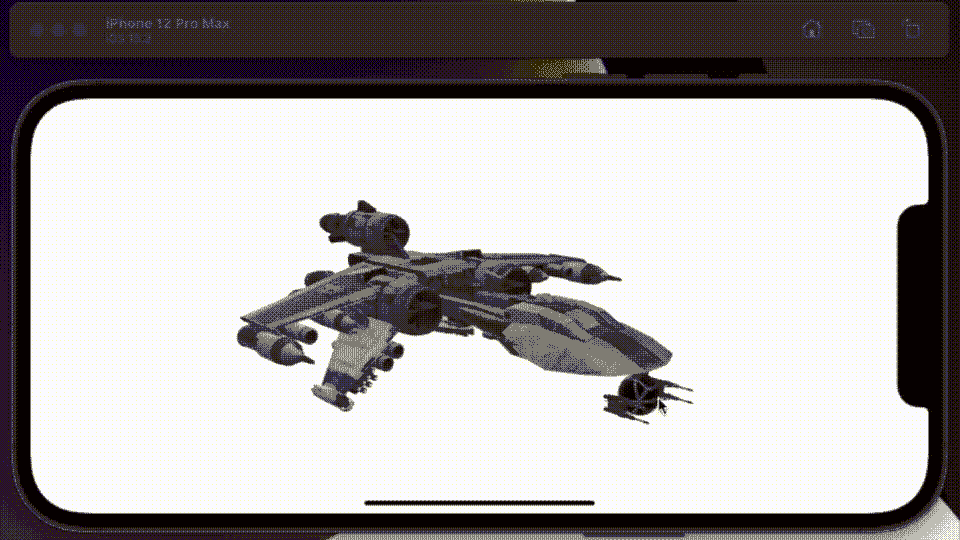
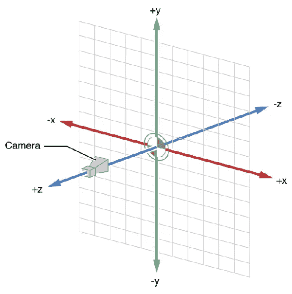
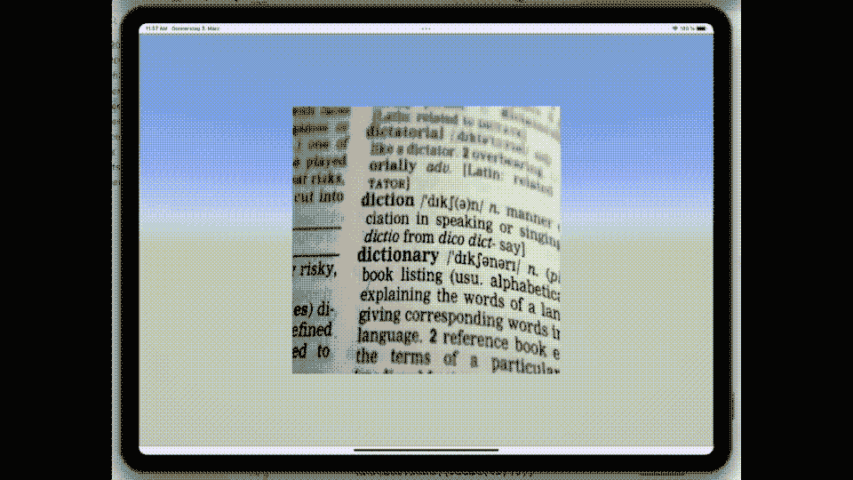

# SwiftUI 中的场景

> 原文：<https://betterprogramming.pub/scenekit-within-swiftui-5c242b040f83>

## 较新的 RealityKit/ARKit 框架的近亲



我发表了几篇关于在 SwiftUI 中使用 SpriteKit 框架的文章。苹果为在其平台上构建游戏而整合的少数框架之一，其他框架是 SceneKit、GameKit、RealityKit 和 ARKit，尽管后两者不仅仅是游戏还有争议——

现在，我从未写过 SceneKit、ARKit 或 RealityKit，这是我想在 2022 年解决的难题中缺失的一块。

然而，在我开始之前，我想说我怀疑 WWDC2021 没有提到 SceneKit，因为许多从事这项工作的工程师已经被重新部署到 ARKit 和 RealityKit 团队。重新部署，因为他们是近亲，学习一个，你会惊讶地发现你对另一个了解了多少。对于那些说 SceneKit 也死了的反对者，考虑一下这个。

*   要真正使用 ARKit/RealityKit，需要一个带激光雷达扫描仪的设备；大多数 iOS 设备还没有。
*   要真正使用 ARKit/RealityKit，你需要一个内嵌多线程引擎的设备；一些关键的 iOS 设备也没有这样的能力。
*   ARKit 在模拟器中不可用。

## 场景背景

因此，在阅读了免责声明之后，让我们继续努力，尝试找出是什么让 scene view[scene kit 的 SwiftUI 插件]成功的。

虽然在我开始写代码之前，我想提几件事情，当我开始更深入地研究这个问题时，这些事情让我很困惑，所以它们也不会让你困惑。

*   该网格显示了如何配置`SCNVector3`命令的布局。这是显而易见的，然而事实并非如此。



图片鸣谢:苹果 SceneKit [框架参考](https://developer.apple.com/library/mac/documentation/SceneKit/Reference/SceneKit_Framework/index.html)

*   `SCNNodes`您添加到场景中的哪些元素就像 UIKit 或 SwiftUI 中的视图；相似的是，它们被安排在一个等级内。因此，后来添加到场景中的对象可能会遮挡已经存在的对象。
*   如果你用相机离一个物体太近，就像它正对着你的脸一样，那么你实际上什么也看不见。
*   如果一个物体离相机太远，你将什么也看不见——这听起来很明显，但你会惊讶于它是如此的近却看不见。
*   所有使用角度旋转对象的命令都希望您使用弧度—如果您使用角度，它们不会抱怨；他们就是不会做你期待的事情！
*   当你开始玩这个的时候，使用平面和正方形——抵制那些性感的球体和一些教程喜欢展示的圆环。如果你这样做了，你会发现理解正在发生的事情要容易得多。
*   在前面的注释中，默认情况下，平面是垂直添加的[不是水平的]，这可能会引起混淆。
*   同样的，平原实际上是 2D，并且在旋转的时候是不同的，特别是，要注意，这也是令人困惑的。
*   最后，同样令人难以置信的是，你将很快遇到[欧拉角](https://www.andre-gaschler.com/rotationconverter/)，这是俯仰、滚动和偏航的数学说法。相对于您正在查看的对象位置的角度。

## 模型

Bon，说几句关于这篇文章标题的模型，一个我从[这里](https://sketchfab.com/3d-models?date=week&features=downloadable&sort_by=-likeCount&cursor=bz0zJnA9MjE%3D)下载的模型。一个只用了两行代码就展示出来的模型，是的——我在这里展示的只有两行。

```
struct GameScene : View {
  var body: some View {
    let scene = SceneView(scene: SCNScene(named: "BTL-S8_K-wing_assault_starfighter.usdz"), options: [.autoenablesDefaultLighting,.allowsCameraControl])
    return scene
  }
}
```

我应该提到重要的一点——我只是用鼠标改变相机的位置来移动这个物体，仅此而已。

# 通过 SwiftUI 控制的场景视图动画

正如我在开始时说的，尽管我喜欢玩星球大战模型，但你应该专注于正方形和平面。我想让这一节看看如何建立旋转书的定义。



现在，让我来描述一下你们在这里看到的，当然是用编码语言。

*   我创建了一个有六个节点的场景；一个是摄像机——一个是 2D 广场的`planeNode`,其余的是照明节点。我把一切都保持得很简单。
*   问题中的节点是平行的，所以相机与正方形成直角，直接看着它。
*   四个照明节点有效地使`plainNode`爆炸，因此没有阴影。
*   我将一个图像映射到一些字典定义的正方形中。
*   我在动画中翻转节点八次，同时变换它十次[你能抓住所有的变换吗]。[我用 iMovie 编辑了实际运行]。
*   尽管这是最小的交互，场景嵌入其中的 SwiftUI 界面通过每 2.1 秒触发一次的递归例程来管理过渡的定时——需要使用`@MainActor`来运行所述功能。
*   每次它启动时，我在我的场景中调用一个函数，这个函数通过调用`SCNTransaction`来运行一个转换，以在 2 秒内动画化所述变化。

进行转换的代码如下所示。

```
let oldTransform = planeNode.transform
let rotation = SCNMatrix4MakeRotation(GLKMathDegreesToRadians(degrees), 0, 1, 0)
SCNTransaction.begin()
SCNTransaction.animationDuration = 2
planeNode.transform = SCNMatrix4Mult(rotation, oldTransform)
SCNTransaction.commit()
```

获得这个序列是一个挑战，发送给它的角度是`45,45,-180,-45,-45,-45,-45,360,45,45`。在两次大的摆动中，我用这段代码翻转图像。

```
planeNode.scale = SCNVector3Make(-1,1,1)
```

至于同样重要的整体结构，场景是在我创建的一个类中设置的，该类返回一个设置了 Scene 和 cameraNode 变量的元组。我创建了一个类，在这个类中我创建了几个函数来完成我在这里概述的转换。

现在，我决定把它上传到 bitbucket，而不是发布一个怪物代码块，你可以在这里下载[并自己使用源代码。](https://bitbucket.org/wizard1066/scenekits/src/master/)

所有这些使我结束了这篇介绍性的文章——请放心，还有更多内容要介绍，我希望以后能发布更多内容。