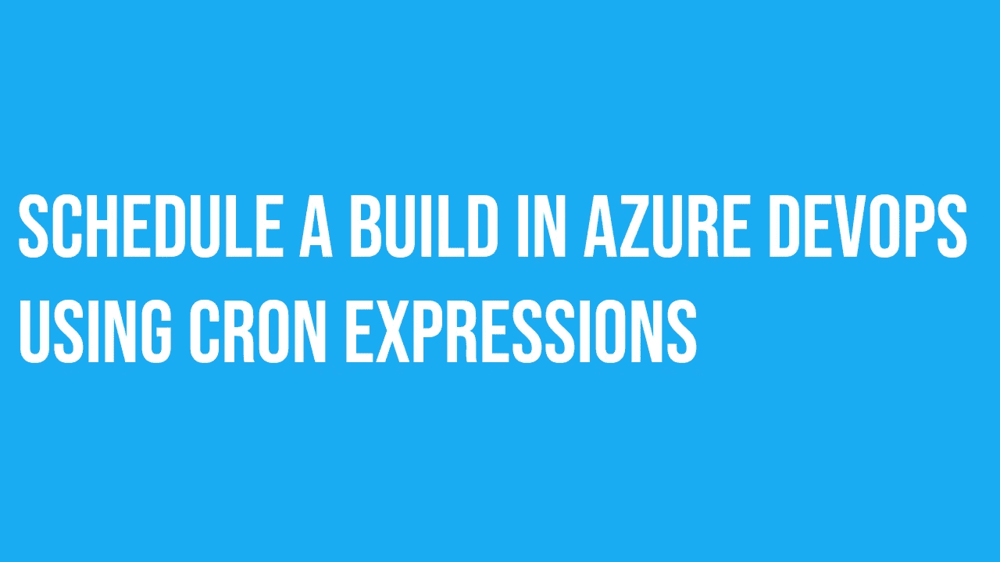

# 使用 CRON 表达式在 Azure DevOps 中调度构建

> 原文：<https://betterprogramming.pub/schedule-a-build-in-azure-devops-using-cron-expressions-9cd30360b5ae>

## 计划 Azure DevOps 管道



您可以触发 Azure DevOps 管道在许多不同的事件上运行。

在构建管道时，可能会有这样的情况:您希望按照定义的时间表运行管道。这就是 CRON 表达式派上用场的地方。

# 你能安排 Azure DevOps 管道吗？

是啊！您可以使用 CRON 表达式作为管道文件中的触发器来轻松地调度它们。

# CRON 是什么？

CRON 是一个命令行实用程序，用于调度作业。您会听到它被称为 CRON 作业或 CRON 任务。

第一次遇到 CRON 语法时，有时会感到困惑。CRON 语法中可以配置五个部分。您可以指定星期几、月份、日期、小时和分钟。

这不是你需要记住的东西，但是能够读懂语法是很有用的。下面是一个很好的图表，展示了语法是如何分解的。

克朗表情解释道

我喜欢使用 https://crontab.guru/的网站。你可以把语法放到网站上，它会解释这个时间表会做什么，或者同样，你可以用它来为你想要执行的时间表建立正确的语法。

# Azure DevOps CRON 语法是什么？

我想向您展示一个按计划运行的 Azure DevOps 管道的示例。

Azure DevOps 管道计划分解

以上是我的管道的一部分，它将在每周一、周二、周三、周四和周五的午夜触发，并完成管道的设计构建。

您应该注意的是，它将打开主分支的触发器，而不是任何其他分支。这允许对不同的分支和您可能有的需求进行粒度控制。

完整的管道如下所示:

Azure DevOps 管道示例

```
*Originally published at* [*https://www.techielass.com*](https://www.techielass.com/schedule-a-build-in-azure-devops-using-cron-expressions/)
```