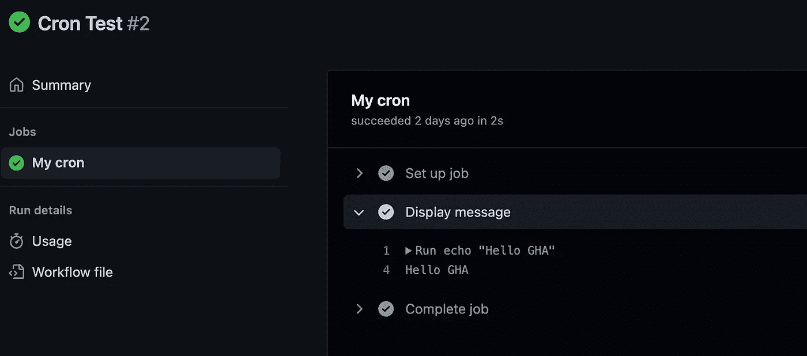
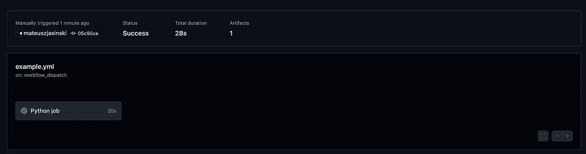
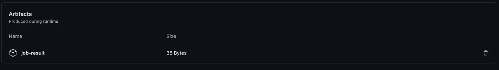

# 使用 GitHub 操作调度 Cron 作业

> 原文：<https://betterprogramming.pub/schedule-cron-jobs-with-github-actions-d279e8519cec>

## 我们过去常常使用我们非常熟悉的工具，不考虑缺点或成本，但现在，我们可以访问帮助我们的惊人平台


照片由[陈奕迅](https://unsplash.com/@okcdz?utm_source=medium&utm_medium=referral)在 [Unsplash](https://unsplash.com?utm_source=medium&utm_medium=referral) 拍摄

通常，当我和同事谈论计划任务时，首先想到的是芹菜。我必须承认这是一个强大的工具，但在许多情况下，它可能会太强大，或者需要太多的资源。这就是为什么不久前，我开始测试标准队列解决方案的替代方案。在我的上一篇文章中，我向您展示了如何使用 Kubernetes 来替换您当前的配置，这次我想使用 GitHub Actions 再做一次。

# GitHub 操作

GitHub action 是微软创建的一个 CI/CD 平台，提供自动化的管道(工作流)来构建、测试和部署你的应用。在本文中，我想向您展示如何使用 GHA 来替换您当前的 cron 配置。最显著的优势之一是免费使用动作(有限制)。

## 管道

简而言之，管道是我们需要执行的一系列步骤，以交付新版本的应用程序。管道通常包含构建、自动化测试和代码分析器(持续集成)等步骤，但也包含将我们的应用程序部署到服务器的自动化方式(持续部署)。

## 工人

它只是一台用于运行您的工作流程的机器。默认 GitHub works 没有持久内存，运行过程中所有数据都可用。稍后我会告诉你如何处理它。

## 句法

GitHub 工作流程是使用 YAML 文件创建的。每个工作流都定义了我们管道的一些重要属性:

*   `on`(触发器)
*   `jobs`(步骤——我们工作流程的操作)
*   `names`等。

完整语法可在此处获得:[https://docs . github . com/en/actions/using-workflows/workflow-syntax-for-github-actions](https://docs.github.com/en/actions/using-workflows/workflow-syntax-for-github-actions)。

## 扳机

在我们开始之前，让我们谈谈触发器。GitHub 提供了多种类型的触发器，可以用来启动管道。如果你熟悉事件，可能你见过类似于`push`或`commit`的触发器。为了达到我们的目标，我们将使用`schedule` — [基于 GitHub 文档](https://docs.github.com/en/actions/using-workflows/events-that-trigger-workflows#schedule)，使用 POSIX cron 语法，您可以定义您的 cron 将被启动的时间，例如`*/10 * * * *`将每十分钟运行您的作业。

如果您需要 cron 扩展方面的帮助，请查看—[https://crontab.guru/](https://crontab.guru/)。

好吧！理论够了。让我们创建我们的第一个工作流。

# 你好世界

让我们从一些基础开始。我们将首先创建一个管道来向命令行显示消息。看起来是这样的:

```
---
name: "Workflow example"
on:
  schedule:
    - cron: '*/10 * * * *'

jobs:
  hello:
    name: "Say hello"
    runs-on: ubuntu-latest
    steps:
      - name: Display message
        run: echo "Hello from GitHub Actions!"
```

看起来很简单，对吧？



# 计算机编程语言

现在，我们将使它变得复杂一点。这次我们想运行我们的 Python 脚本。

```
from datetime import datetime

with open('file.txt', 'w') as f:
    f.write(f"JOB DONE {datetime.now()}") 
```

我们的工作流程需要几个额外的步骤。首先，我们需要将我们的存储库克隆到我们的 worker 中。为此，我们可以使用 [GitHub Marketplace](https://github.com/marketplace) 上可用的操作之一。

```
- name: Checkout repository
  uses: actions/checkout@v2
```

下一步需要设置和配置 Python。使用 action，我们可以选择计划使用的 Python 版本。在这一步之后，您可以安装额外的需求(包)。最后一步是运行我们的脚本。

```
 - name: Setup python
   uses: actions/setup-python@v2
   with:
    python-version: '3.10.6'
 #Optional, you can also update pip before installing dependencies
 - name: Install dependencies
   run: pip install -r requirements.txt
 - name: Run python script
   run: python job.py
```



厉害！我们的管道正在工作，我们可以在命令行中看到结果，但是缺少了一些东西。因此，我们应该得到一个文件。怎么才能拿到？

我想给你介绍一些艺术品。这些允许您在工作完成后保存工作流程的结果。每个工作流(成功的或失败的)都可以包含运行过程中产生的工件。您还可以使用工件在作业之间共享数据，但是在我们的例子中并不需要。



您可以下载 zip 文件形式的工件。

一切都按预期运行，因此我们最终的工作流将如下所示:

```
---
name: "Workflow example"
on:
  schedule:
    - cron: '*/10 * * * *'

jobs:
  python-job:
    name: "Python job"
    runs-on: ubuntu-latest
    steps:
      - name: Checkout repository
        uses: actions/checkout@v2
      - name: Setup python
        uses: actions/setup-python@v2
        with:
          python-version: '3.10.6'
#     If you need to install extra packages
#     - name: Install dependencies
#       run: pip install -r requirements.txt
      - name: Run python script
        run: python job.py
      - name: Upload file as artifact
        uses: actions/upload-artifact@v3
        with:
          name: job-result
          path: file.txt
```

# 结论

如你所见，这并不困难。最重要的是你可以免费测试。GitHub 允许你用一个免费账户运行长达 2000 分钟的动作，无需添加任何支付信息。那么，你还在等什么？

敬请关注更多内容。我希望你喜欢我的其他文章。