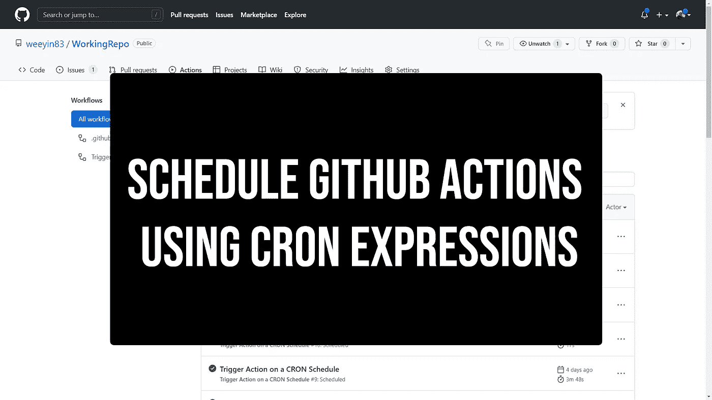

# 使用 CRON 表达式调度 GitHub 动作

> 原文：<https://betterprogramming.pub/schedule-github-actions-using-cron-expressions-5c7017df9cee>

## 每天在同一时间触发任务

您可以触发 [GitHub 动作](https://www.techielass.com/tag/github-actions/)在许多不同的事件上运行。最常见的是在您将变更推送到存储库时运行。此外，您可能希望触发一个操作来运行“拉”请求。

构建操作时，您可能希望按照定义的时间表运行它们。本教程向您展示了如何使用 CRON 表达式按照给定的时间表配置 GitHub 动作。

# 你能安排 GitHub 的行动吗？

是的，是的，你可以。您可以选择按计划触发 GitHub 操作，例如:

使用 CRON 安排 GitHub 操作工作流的示例

# CRON 是什么？

CRON 是一个命令行实用程序，用于调度作业。您会听到它被称为 CRON 作业或 CRON 任务。

第一次遇到 CRON 语法时，有时会感到困惑。CRON 语法中可以配置五个部分。您可以指定星期几、月份、日期、小时和分钟。

这不是你需要记住的东西，但是能够读懂语法是很有用的。下面是一个很好的图表，展示了语法是如何分解的。

CRON 语法解释

我喜欢使用 https://crontab.guru/的[网站。你可以把语法放到网站上，它会解释这个时间表会做什么，或者你可以用它来为你想要执行的时间表建立正确的语法。](https://crontab.guru/)

# 什么是 GitHub Actions CRON 语法？

我想向您展示一个包含 CRON 时间表的 GitHub Actions 工作流示例。

CRON 调度上触发 GitHub 操作工作流的示例

上述 GitHub Actions 工作流将按计划打开触发器。我设置的 CRON 作业将在周一到周五每天的上午 11 点运行。

然后，工作流将在 [Ubuntu runner](https://www.techielass.com/github-runners/) 上运行代码签出步骤。

这是一个简单的工作流，但是它使用 CRON 调度来触发，而不是在推 GitHub 或拉请求时触发。

一定要看看我写的其他关于 [GitHub Action](https://www.techielass.com/tag/github-actions/) 用途和特性的博客。

*最初发表于*[*https://www.techielass.com*](https://www.techielass.com/schedule-github-actions-using-cron-expressions/)