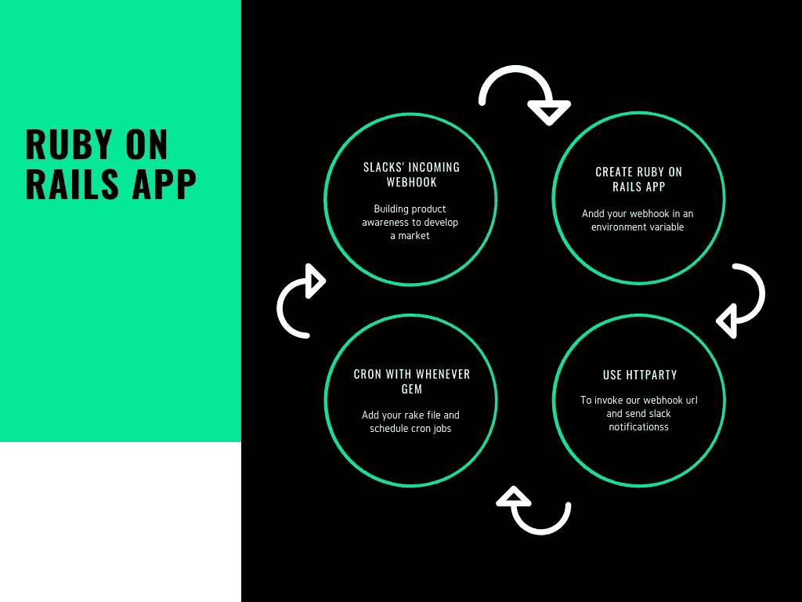
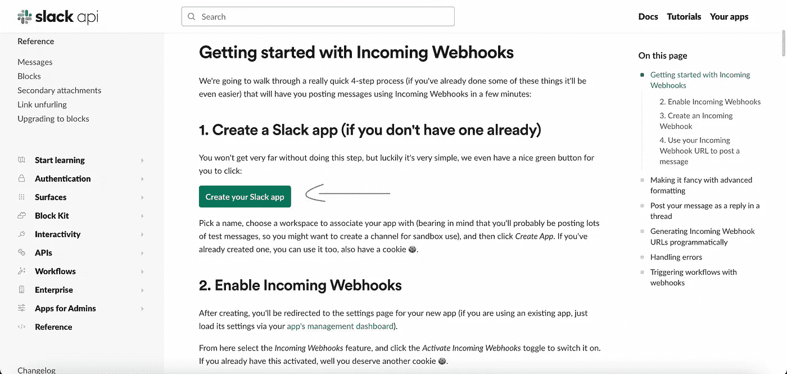
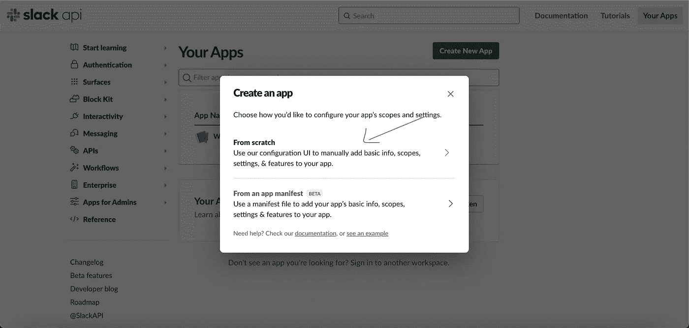
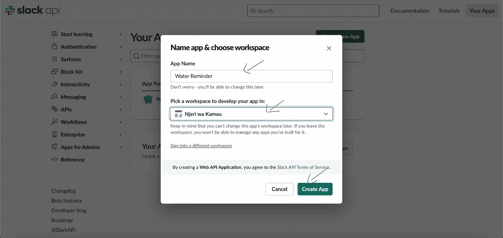
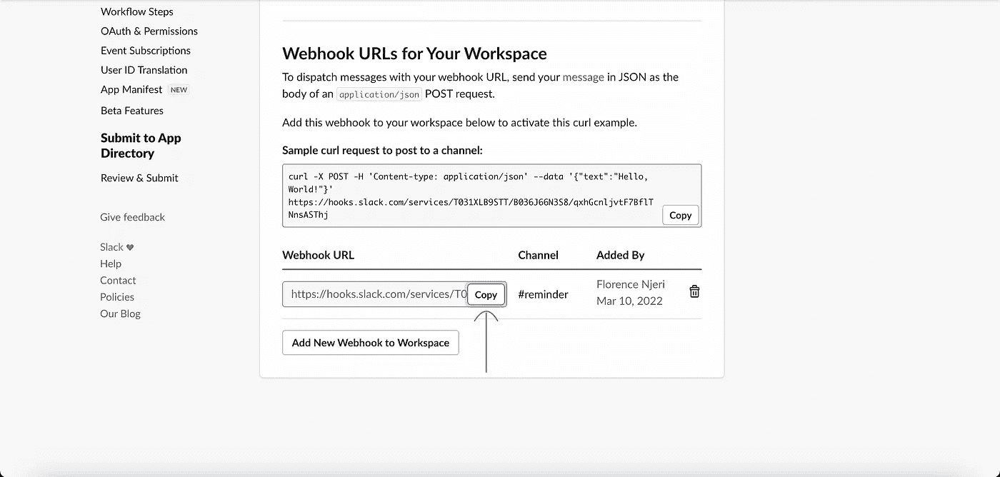
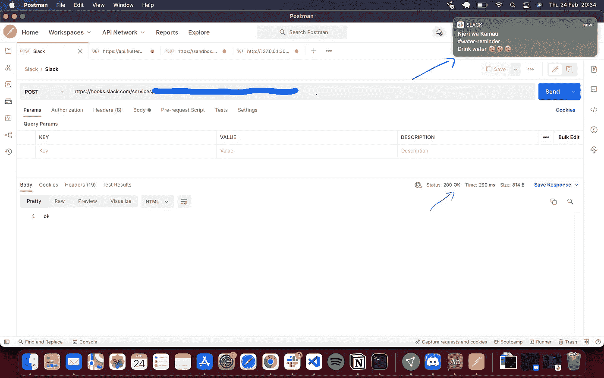
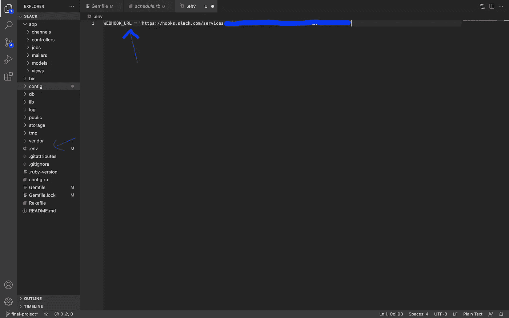
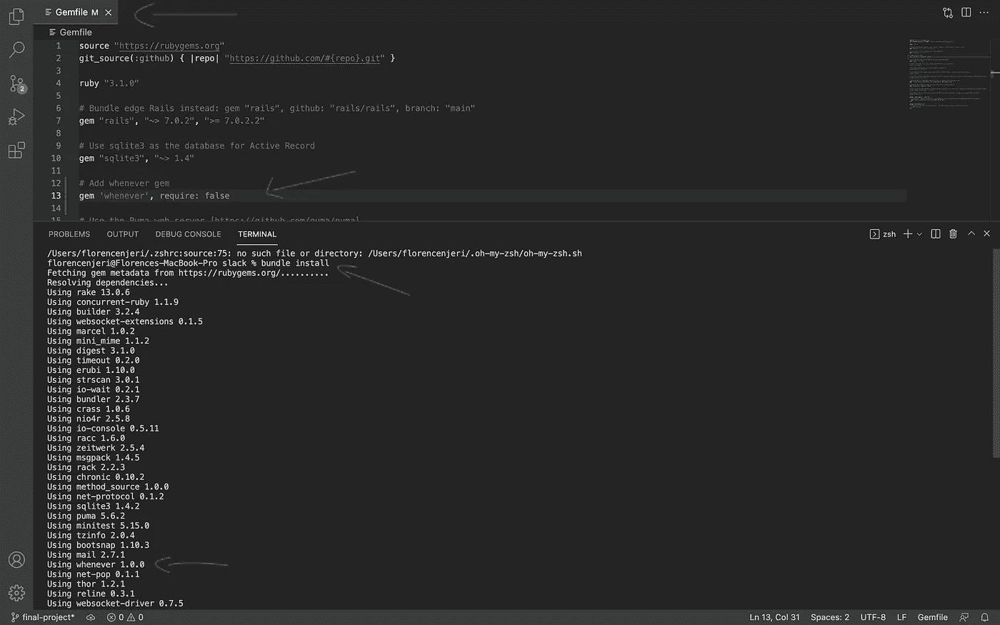
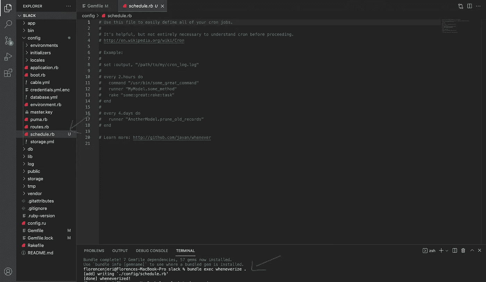

# 用 every gem 在 Ruby on Rails 中调度作业

> 原文：<https://betterprogramming.pub/schedule-jobs-in-ruby-on-rails-with-whenever-gem-7cb12f0a8a9e>

## 每小时提醒休息时喝水。



图片来源:作者

你是不是忘记喝水了？让我们创建一个水提醒应用程序，它将使用 slack 消息通知您每小时喝一杯水。

本教程结束时，您将学会如何:

1.  在 Slack 上创建传入的 webhooks 以发送 Slack 消息
2.  创建一个 Ruby on Rails 应用程序，并将 webhook URL 添加到`.env`文件中
3.  使用 HTTParty 调用 API 请求
4.  使用 when 来计划 cron 作业

## 入门指南

从下载 [VSCode](https://code.visualstudio.com/download) 开始。如果您已经有了 VSCode，请跳到下一节。

# 使用传入的 Webhooks 发布松弛消息

导航到[传入网页挂钩](https://api.slack.com/messaging/webhooks)并创建一个传入网页挂钩。

1.  点击[创建您的 Slack 应用](https://api.slack.com/apps?new_app=1)



创建一个 Slack 应用程序

2.从头开始创建应用程序



从头开始创建应用程序

3.编辑应用程序名称，从下拉列表中选择一个工作区，然后单击创建应用程序



添加应用程序名称，选择工作空间，然后单击创建应用程序

4.然后按照步骤 2 和 3 [这里](https://api.slack.com/messaging/webhooks)创建一个传入的 webhook。

5.复制 webhook URL，如下图所示。



复制 Webhook URL

您可以使用 [Postman](https://www.postman.com/) 测试 webhook URL，并确认您收到了一个 Slack 通知



# 创建 Ruby on Rails 应用程序

打开一个终端实例，创建一个没有视图和模型的新 rails 应用程序:

```
bundle gem slackbot
```

# 将 Webhook URL 添加到 Rails

当我们将项目推送到 Github 时，我们不想将我们的 slack 凭证暴露给公众，因此我们将使用环境变量。

**第一步。**在根目录下创建一个`.env`文件

**第二步。**添加`webhook URL`

```
WEBHOOK_URL = "your_webhook_url"
```

步骤 3: 将`dotenv` gem 添加到 gem 文件中，然后运行 bundle install

```
gem 'dotenv-rails', groups: [:development, :test]
bundle install
```



上面的步骤 1 和步骤 2

# 每当时使用*调度 Cron 作业*

## 什么是 cron 工作？

Cron 作业用于计划在每天或每周的特定时间重复运行的任务，例如，计划每小时喝水的提醒或每周三凌晨 4 点启动闹钟

**步骤 1:** 将 the 添加到 Gemfile 中

```
gem 'whenever', require: false
```

**第二步:**运行

```
bundle install
```



上面的步骤 1 和步骤 2

**第三步:**运行`wheneverize`，将产生`config/schedule.rb`

```
bundle exec wheneverize .
```



第三步

**第四步。**生成一个 rake 文件来定义 cron 作业要运行的任务。

```
rails g task slack run_notifications
```

上面的命令将在`lib/tasks`文件夹下生成`slack.rake`，然后将下面的代码添加到您的 rake 文件中:

```
require 'httparty'require 'dotenv/tasks'namespace :slack dodesc "Send hourly remonders to drink water in Slack"task :run_notifications => :environment doHTTParty.post(ENV["WEBHOOK_URL"], :body => {:channel  => '#general',:username => 'Slack Bot',:text     => 'Time to take a glass of water."'}.to_json)end
```

要安装`HTTParty`，请将下面的 gem 添加到您的 gem 文件中，然后运行软件包安装

```
gem 'httparty'bundle install
```

点击了解更多关于 rake [的信息。点击](https://www.rubyguides.com/2019/02/ruby-rake/)了解更多关于 http party[的信息](https://github.com/jnunemaker/httparty)

**第五步。**导航至`schedule.rb`文件。首先，您需要指定 cron 作业完成时将在哪里记录日志

```
set :output, "log/cron.log"
```

添加耙子任务:

```
every 1.hour dorake "slack:run_notifications"end
```

**第六步:**更新 crontab 文件。

导航到您的终端并运行以下命令:

```
whenever — update-crontab — set environment=’development’
```

**第 7 步:**通过在您的终端中运行下面的命令来测试您的 rake 任务

```
rake "slack:run_notifications"
```

您应该会收到延期通知

点击[此处](https://github.com/javan/whenever)了解更多有关 when when 的信息。GitHub 上的项目可以在这里找到[。](https://github.com/Florence-Njeri/SlackBotArticle)