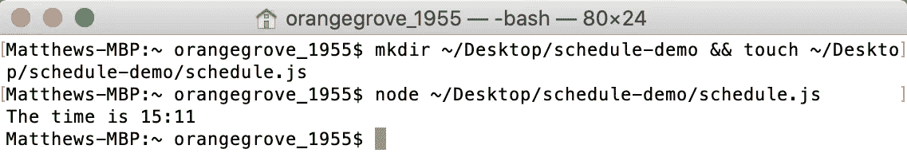
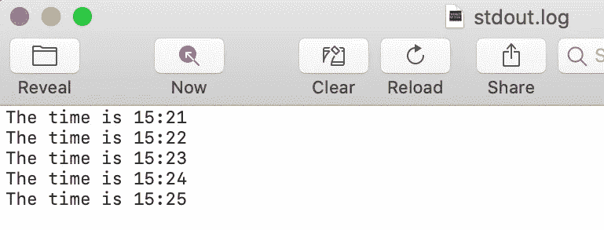
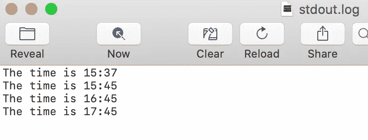
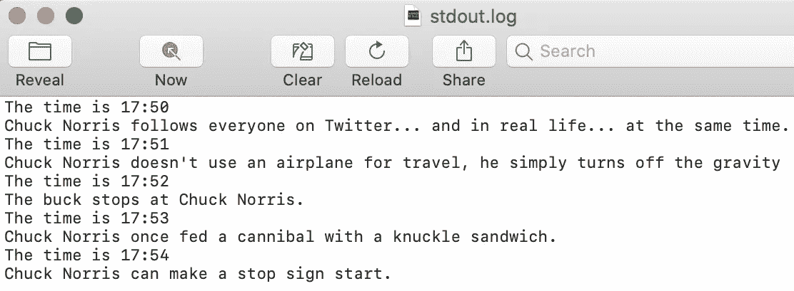
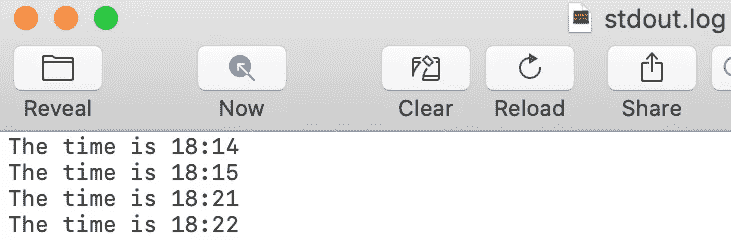
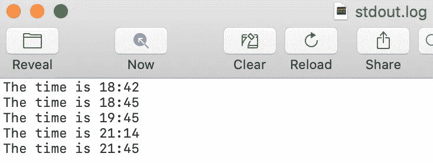

# 如何使用 Launchd 在 Mac 上调度 Node.js 脚本

> 原文：<https://betterprogramming.pub/schedule-node-js-scripts-on-your-mac-with-launchd-a7fca82fbf02>

## 自动化您的脚本


照片由[鞠波·史密斯](https://unsplash.com/@jessysmith?utm_source=medium&utm_medium=referral)在 [Unsplash](https://unsplash.com?utm_source=medium&utm_medium=referral) 上拍摄。

有时，有些 [Node.js](https://nodejs.org/en/) 脚本，您可能希望在没有任何交互的情况下定期运行。也许您希望每半小时 ping 一次服务器，或者定期从新闻 API 下载新数据。无论您的用例是什么，能够自动化这些脚本将会节省您的时间和精力。

如果你在 Mac 上工作，自动化这些脚本的一个很好的方法是使用`launchd`来设置一个自动化的时间表。它可以运行异步代码，将在 Mac 唤醒时运行您的任务，最重要的是，它已经是 macOS 的一部分，这意味着无需安装新工具！

让我们来看看如何开始使用`launchd`和 Node.js。

# 什么是 launchd？

> “launchd 管理整个系统和单个用户的流程。”—终端启动手册页

`launchd`是一个在 macOS 上运行守护进程和代理的工具。如果您不熟悉这些术语，守护程序是一种始终在后台运行的系统范围的服务，而代理是根据用户特定的请求执行的服务。因此，`launchd`是运行脚本的首选 macOS 自动化工具。

在本教程中，我们将发出特定于用户的请求来运行 Node.js 脚本，因此我们将利用启动代理。这些代理允许用户通过使用属性列表(`.plist`)文件来定义任务，该文件可以按照用户设置的常规时间表来执行。`launchd`可以定期(使用设定的执行间隔)和基于日历的时间表自动执行任务，允许您灵活安排脚本的运行方式。

# 自动化 Node.js 脚本

现在我们知道了什么是`launchd`的基本知识，让我们一起编写一个简单的 Node.js 脚本来测试它。我们首先将代理设置为每分钟运行一次，然后将其更改为根据基于日历的计划执行，以演示我们可以定义自动化任务的两种方式。

## 创建一个测试脚本

首先，我们将在桌面上创建一个新文件夹，并将一个空的 JavaScript 文件放入其中:

```
mkdir ~/Desktop/schedule-demo && touch ~/Desktop/schedule-demo/schedule.js
```

*注意:从技术上讲，这个文件可以随便叫，可以随便存，只要你把路径更新到剩余指令中的代码。*

现在我们有了一个可以使用的文件，让我们通过将以下内容粘贴到新文件中，将一个简单的`console.log`时间戳放入其中:

```
const now = new Date();const currentTime = `${now.getHours()}:${now.getMinutes()}`;console.log(`The time is ${currentTime}`);
```

这个`console.log`将在脚本运行时输出当前时间。我们可以使用 Node 测试这个脚本，并检查我们是否在终端中获得了正确的输出:

```
node ~/Desktop/schedule-demo/schedule.js
```



你的时间可能会有所不同，取决于你什么时候跑。

## 创建一个`plist`文件

现在我们有一个脚本要运行，我们需要创建一个`plist`文件`launchd`可以用来自动化脚本。`plist`文件是 Apple 用来设置配置的定制 XML 文件，因此它们将允许我们分配我们的时间表以及其他关于自动化的关键信息。

运行以下命令，在正确的位置创建一个空的`plist`文件:

```
touch ~/Library/LaunchAgents/com.schedule-demo.daemon.plist
```

使用您喜欢的代码编辑器打开该文件，并将以下代码粘贴到其中，将`{your directory}`更新到您正在使用的目录:

这种配置设置了一些东西:

*   守护程序的名称。
*   只要用户登录，守护程序就会启动。
*   两次处决之间间隔 60 秒。
*   输出错误和日志将被发送到`stderr.log`和`stdout.log`。
*   设置环境路径(如果您的程序使用其他命令，这很有用)。
*   代理将在分配的`WorkingDirectory`中执行。
*   脚本将通过执行`/usr/local/bin/node schedule.js`在节点中运行。

*注意:这只是本教程的一个简单配置。有关进一步的配置设置，请查看终端中的* `*launchd.plist*` *手册页。*

## 定期启动计划

要开始自动化，在终端中运行以下命令，将`plist`加载到`launchd`:

```
launchctl load ~/Library/LaunchAgents/com.schedule-demo.daemon.plist
```

您现在应该能够看到脚本每 60 秒运行一次，将`console.log`值输出到`stdout.log`:



就像时钟一样。

要停止计划，请在终端中运行以下命令:

```
launchctl unload ~/Library/LaunchAgents/com.schedule-demo.daemon.plist
```

## 设置一个基于日历的时间表来运行测试脚本

我们现在可以将计划设置为按时间间隔运行，但是如果我们希望它在特定的时间运行呢？为此，我们可以更新我们的`plist`文件，使用`StartCalendarInterval`而不是`StartInterval`来定义时间表。根据[苹果开发者文档](https://developer.apple.com/library/archive/documentation/MacOSX/Conceptual/BPSystemStartup/Chapters/CreatingLaunchdJobs.html)，日历语法与`cron`类似，因此`StartCalendarInterval`中省略的任何值都将被视为通配符。

因此，假设我们想在每小时 45 分钟后运行脚本。语法应该是:

```
<key>StartCalendarInterval</key>
<dict>
    <key>Minute</key>
    <integer>45</integer>
</dict>
```

或者，假设我们只想在每周一上午 11:30 运行脚本。其语法如下:

```
<key>StartCalendarInterval</key>
<dict>
    <key>Minute</key>
    <integer>30</integer>
    <key>Hour</key>
    <integer>11</integer>
    <key>Weekday</key>
    <integer>1</integer>
</dict>
```

关于如何设置时间表的更多信息可以在`launchd.plist` man 文件中找到，但是对于这个例子，让我们每小时在过去的 45 分钟运行这个脚本。

将下面的代码粘贴到您的`plist`中，再次更新`{your directory}`:

现在，像以前一样，我们可以加载`plist`，它将根据时间表开始自动运行:

```
launchctl load ~/Library/LaunchAgents/com.schedule-demo.daemon.plist
```



当您第一次加载`plist. And yes, this screenshot took a while.`时，它也会运行一次

现在，您可以使用 Node.js 为要执行的任务安排一个特定的时间了！

*注意:如果您想更快地看到以下部分的结果，您应该卸载基于日历的时间表，并将其替换为之前基于间隔的时间表，这样您就不必在日志之间等待一个小时。*

# 自动化异步脚本

既然我们已经看到简单的同步任务可以自动化，您可能会想“但是异步脚本呢？”好消息:`launchd`只是按计划运行 Node 的一个实例，所以异步脚本也可以运行。让我们更新代码以包含对 API 的异步调用来测试这一点。

让我们首先在我们的文件夹中创建一个 npm 包，并为我们的 API 调用安装`axios`:

```
npm init -y && npm install axios
```

现在，将以下代码添加到您的`schedule.js`文件的末尾，以调用 Chuck Norris API(一个提供随机 Chuck Norris 笑话的外部 API):

不需要重新加载`plist`。只要文件的路径没有改变，计划任务将自动使用脚本的新版本。现在，当脚本运行时，我们可以看到它不仅像以前一样记录时间，而且还从 API 获取信息！



感觉又回到了 2006 年。

# 睡眠后运行任务

我们已经知道，当你的 Mac 处于唤醒状态时,`launchd`能够按计划运行任务，但如果你正在使用 MacBook，你合上盖子，或者你的台式 Mac 启用了节能功能，但它进入睡眠状态，会发生什么情况呢？答案将取决于你是使用`StartInterval`来设置一个周期性的时间表，还是使用`StartCalendarInterval`来设置一个基于日历的时间表。

## 使用 StartInterval 时



当 Mac 唤醒时，时间表会恢复。

从上面可以看到，Mac 在 18:15 进入睡眠状态，然后在 18:21 被唤醒。一旦 Mac 被唤醒，时间表会自动继续，但当它处于睡眠状态时，任务不会运行。

## 使用 StartCalendarInterval 时



该计划会在唤醒时立即执行，并继续执行。

如你所见，当 Mac 处于唤醒状态时，时间表会被遵守。当它在 19:45 后进入睡眠状态时，它跳过了 20:45 的预定任务，但在 21:14 被唤醒时自动完成了该任务。然后，它恢复了正常的时间表。

因此，Mac 确实需要在其预定时间被唤醒，但有可能[自动唤醒您的 Mac](https://support.apple.com/en-bn/guide/mac-help/mchlp2266/mac) 以确保自动化发生。此外，如果任务的确切时间不重要，则当 Mac 被唤醒时，时间表会自动执行该任务。

# 结论

`launchd`是 macOS 中非常强大的自动化工具。它也不仅限于节点。它可以用来在你的 Mac 上自动运行任何脚本，甚至可能从终端发送电子邮件。你可以用它来运行同步或异步代码，它可以在你的 Mac 进入睡眠状态后赶上来。

凭借其强大的功能，您可以轻松地安排任何需要自动化的事情。

# 资源

*   `launchd`终端手册页
*   苹果支持— [在 Mac 终端中启动脚本管理](https://support.apple.com/en-au/guide/terminal/apdc6c1077b-5d5d-4d35-9c19-60f2397b2369/mac)
*   苹果开发者文档— [创建启动守护进程和代理](https://developer.apple.com/library/archive/documentation/MacOSX/Conceptual/BPSystemStartup/Chapters/CreatingLaunchdJobs.html)