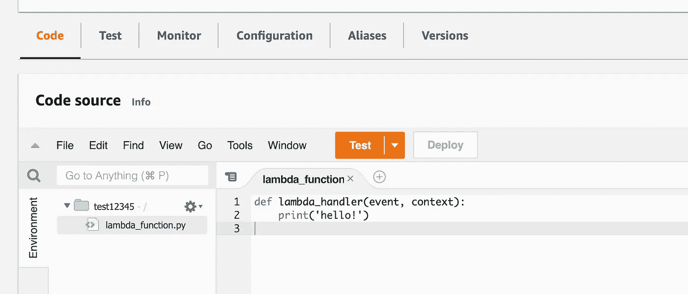
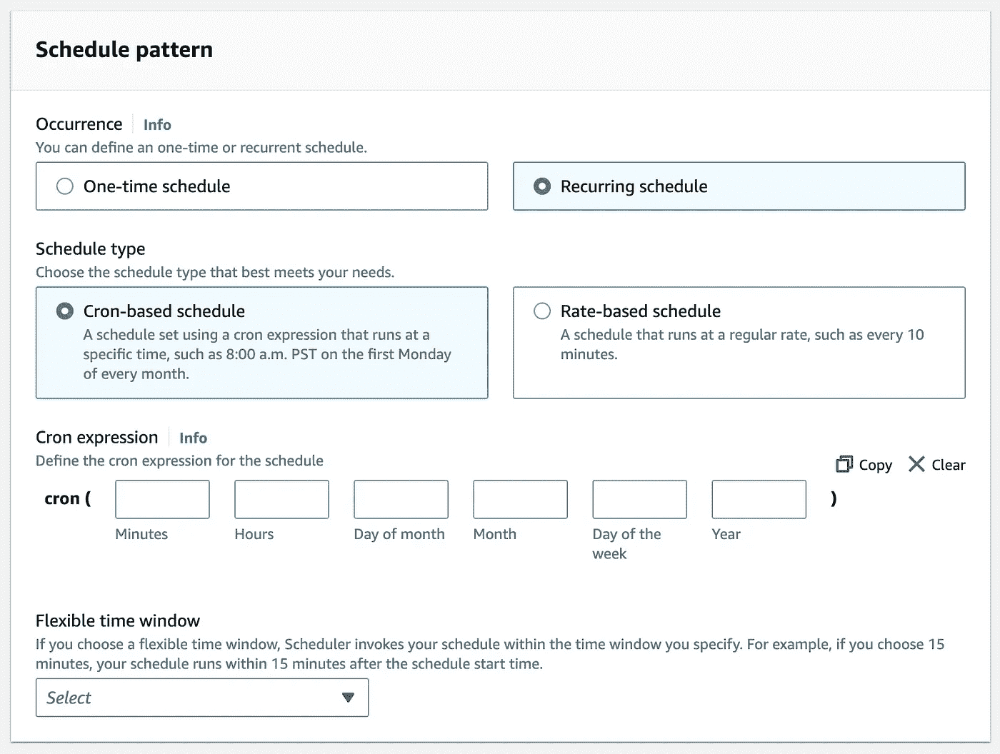
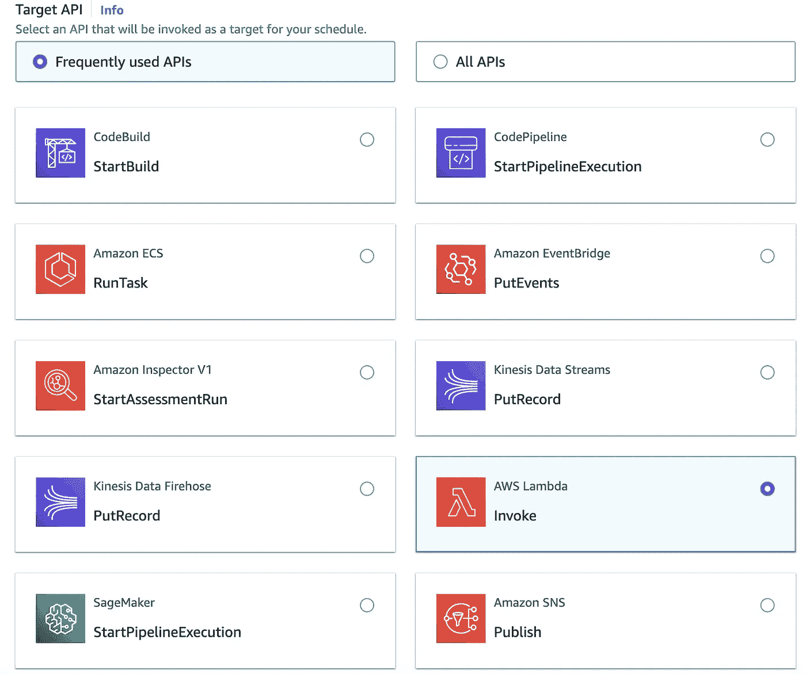
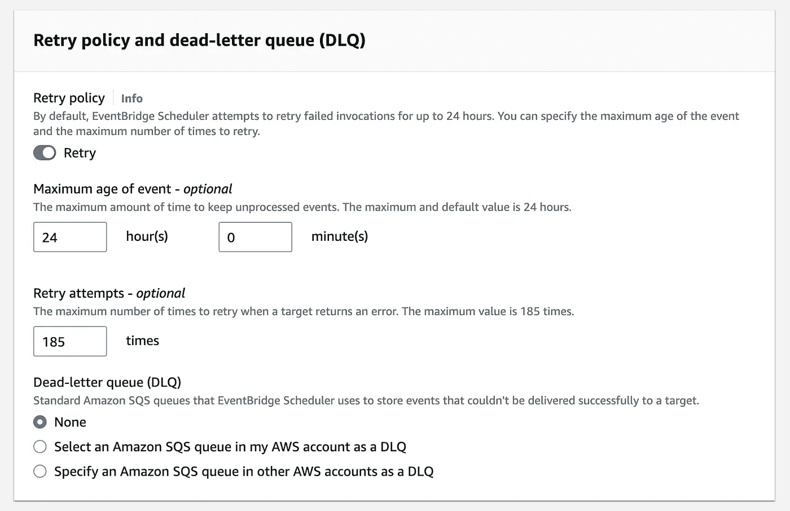
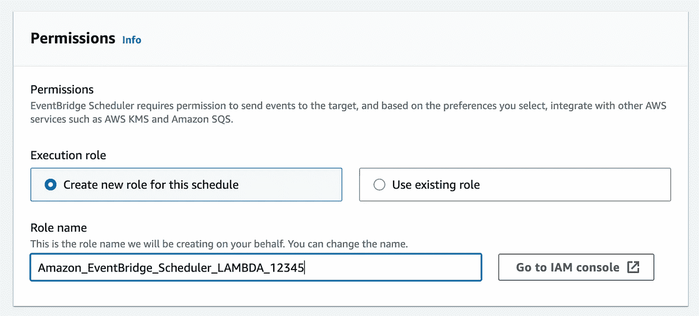
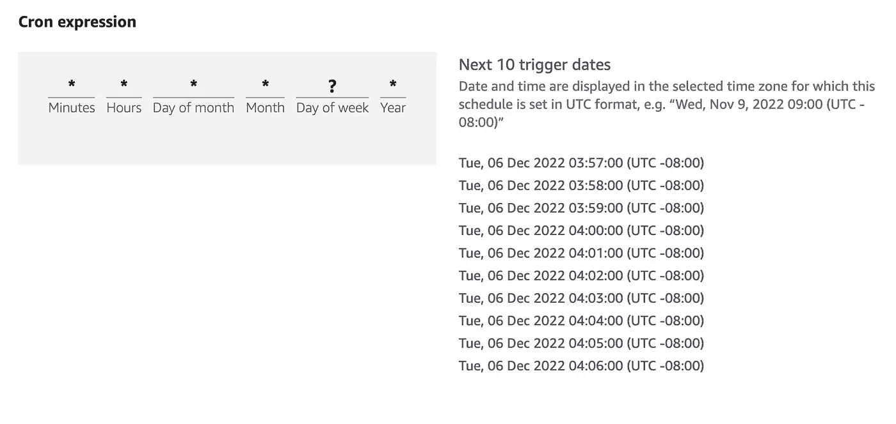

# 使用 Amazon EventBridge 计划 AWS Lambdas

> 原文：<https://betterprogramming.pub/scheduling-aws-lambdas-using-amazon-eventbridge-7440c6270c15>

## 需要时运行功能，无需额外开销


卢卡斯·布拉塞克在 [Unsplash](https://unsplash.com/s/photos/schedule?utm_source=unsplash&utm_medium=referral&utm_content=creditCopyText) 上的照片

你有没有想过安排一个 Lambda 定期运行，却发现没有一个内置的方法来？令人惊讶的是，这个特性并不是 AWS Lambda 产品的标准部分。令人遗憾的是，最初的产品中没有一个简单的 cron 风格的调度程序，甚至没有一个基本的任务运行程序。

这迫使我们许多人从其他地方运行调度程序，甚至可能是其他 Lambda 函数。这不仅使工作量增加了一倍，也使一切变得更加脆弱。如果您必须在某个地方运行另一个持久调度服务，这并不完全是无服务器的。

好消息是，亚马逊最近给 [EventBridge](https://aws.amazon.com/eventbridge/) 增加了一个新功能，叫做“[调度器](https://aws.amazon.com/eventbridge/scheduler/)”。此功能允许您设置重复的 cron 样式计划。每个时间表都能够启动许多 AWS 目录服务，包括 Lambda。

在本文中，我们将探索如何设置 EventBridge 来定期运行 Lambda 函数。现在你的时间表可以像你的 Lambda 函数一样简单。

# 先决条件

EventBridge 的一个特点是调度程序只能在特定区域设置。您将无法在其他地区锁定 Lambdas。当你设置 Lambda 和 Scheduler 时，确保它们在同一个区域。

以下是当前支持的 EventBridge 调度程序区域列表:

*   *美国东部-1*
*   *美国东部-2*
*   *美国西部-2*
*   *AP-东南-1*
*   *美联社-东南-2*
*   *AP-东北-1*
*   *欧盟-中欧-1*
*   *欧盟-西方-1*
*   *欧盟-北方-1*

查看[官方调度文档](https://aws.amazon.com/eventbridge/scheduler/)以获取对该列表的任何更新或修改。

# 设置 Lambda

对于这个例子，让我们构建一个简单的 Python Lambda 函数，它只打印一些输出:

```
def lambda_handler(event, context):
    print('hello!')
```

这非常简单，但给了我们一个函数来运行并确认我们的时间表确实在正确的时间启动。对于您自己的功能，您可能要控制 EC2 实例，运行常规的备份脚本，甚至拍摄对象的快照。



构建基本的 Python Lambda。

继续部署这个简单的功能，并确认它正常运行。现在，我们不需要对函数本身做太多其他的事情。

# 设置 EventBridge 调度程序

现在我们有一个 Lambda 可以使用，我们可以开始设置我们的时间表。一开始这可能有点令人生畏，因为有很多选项，但实际上非常简单。反正你可能不需要很多。

创建新的 EventBridge 计划，并提供基本名称和其他描述性信息。在模式部分，您可以创建一次性计划或重复计划。循环调度将使用 cron 样式的模式来触发事件，就像普通的 crontab 一样。



创建 EventBridge 调度程序模式。

现在，您需要做的就是提供您希望调度运行的 cron 表达式。如果你需要帮助选择正确的模式，你可以使用 Crontab Guru。这个网站帮助分解 cron 表达式，使它们更容易组合。

现在让我们为这个时间表设定目标。

# 瞄准λ

在下一页，您可以选择一个目标。此部分允许您从 AWS 目录的大部分内容中进行选择:



选择 AWS Lambda 作为 EventBridge 计划的目标。

从下拉列表中选择 AWS Lambda API、您的函数，然后设置所需的有效负载以传递给您的函数:


为 Lambda 设置有效载荷。

这里我们只是在有效载荷中传递一些测试数据，因为我们的函数不使用它。如果你正在部署一个真正的函数，你可以在不同的调度中使用不同的负载来操作同一个 Lambda。这使得将一个功能用于多个时间表变得很容易。

接下来，我们将看看剩下的几个配置选项。

# 处理错误

在下一页，您可以设置重试逻辑和未送达事件的队列。这对于高容量事件可能会被丢弃的其他服务尤其有用，但对于我们定期安排的功能就不那么有用了。



现在，我们可以不管重试逻辑，或者完全关闭它。在某些情况下，如果事件没有被传递，重试事件可能没有意义。

无论你制定了什么样的时间表，你都有可能在第一次尝试时错过一个重要的窗口，而延迟交付可能会导致服务中断或其他不良副作用。如果函数被快速连续调用多次，请确保您知道该函数的行为。或者，使函数幂等，这样它就不会因重复运行而出错。

# 许可

在同一页的末尾，你会发现权限部分。在大多数情况下，简单地自动创建一个新角色就可以了。这将为 EventBridge 设置默认权限。



为计划程序设置权限。

如果您在目标 Lambda 上遇到了更多限制性权限的问题，您可能需要调整这里列出的策略，或者给它分配一个新的策略。

# 最终确定时间表

在最后一页，您可以查看整个计划配置。这个页面还有一个非常方便的 cron 表达式回顾部分。此部分显示输入计划的下 10 个触发日期。



在最后一个调度程序设置页面上确认 cron 调度。

这有助于确认，并在必要时调整 cron 表达式。此外，一定要记住，触发日期上列出的日期和时间实际上是初始 cron 表达式配置页面上列出的本地时区。

如果您注意到任何与触发日期不一致的地方(如时区)，只需返回到计划设置并调整表达式或时区。

一旦一切正常，保存时间表，享受 Lambda 函数的好处。

# 结论

使用 EventBridge Scheduler 来触发 Lambda 函数是健壮的循环任务设置中缺少的部分。设置只需几分钟，更改时间表也同样简单。

没有代码提交，没有自己管理 cron，只是相同的无服务器简单性。

如果你想寻找更多的内容，可以看看我下面的一些帖子:

*   [*6 更独特的 Linux 实用程序你忘了*](/6-more-unique-linux-utilities-you-forgot-about-1215ac0c58da)
*   [*5 个让构建 API 更简单的 Python 模块*](/5-python-modules-that-make-building-apis-easier-a8d39911f6a8)
*   [*使用 Ansible*](/clean-up-your-kubernetes-deployments-using-ansible-10a000db313b) 清理您的 Kubernetes 部署