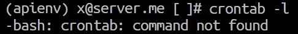
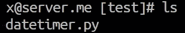
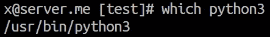
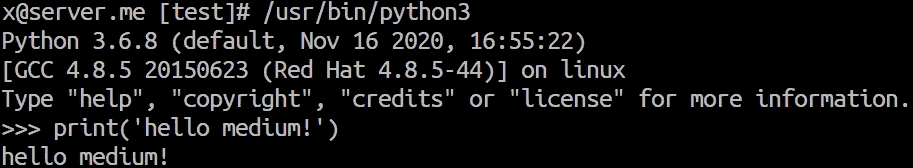
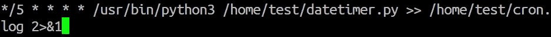
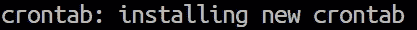
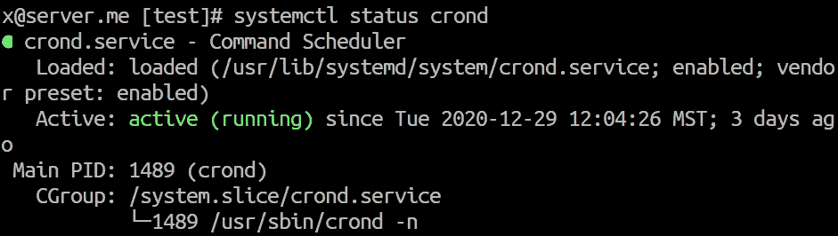
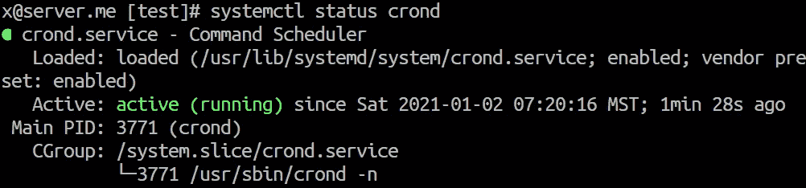
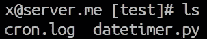
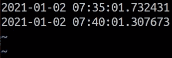

# 在 Linux 上调度 Python 脚本

> 原文：<https://betterprogramming.pub/scheduling-python-scripts-on-linux-fa0d28a8f915>

## 使用 cron 轻松实现任务自动化


[摄于](https://unsplash.com/@greenpjy123?utm_source=medium&utm_medium=referral) [Unsplash](https://unsplash.com?utm_source=medium&utm_medium=referral) 上的智妍公园。

对于大量的任务来说，调度脚本是绝对必要的。从人工智能的数据收集到每周的博客通讯，日程表无处不在。

很大一部分可调度的作业托管在 Linux 机器上，由 Python 脚本操作。今天，我们将看看如何在 Linux 中使用 [cron](https://pubs.opengroup.org/onlinepubs/9699919799/utilities/crontab.html) 来自动化脚本调度。

*注意:这里使用的例子是特定于 Fedora 发行版的(特别是 CentOS)。然而，据我所知，这个过程(除了安装 cron 之外)对于大多数其他流行的发行版来说基本上是一样的。*

如果有什么不同，请在评论中告诉我，我可以为其他人更新文章。谢谢！

# Cron 安装

很可能您的 Linux 机器上已经安装了 cron，但是为了进行检查，我们可以打开终端并键入:

```
crontab -l
```

这将返回当前由 cron 控制的进程列表。如果你什么也没看见也不用担心。这仅仅意味着您没有定义 cron 进程！

但是，如果它返回如下内容:



您需要使用下表中给出的命令安装 cron:

这里，安装命令将根据您的发行版而有所不同。不亲自测试，我无法确定所有这些是否 100%有效。如果您发现与这里显示的有任何不同，请告诉我。

# Python 部分

这部分主要取决于您，但是我们将使用一个简单的脚本来打印我们的示例的时间。我们可以用`vim /home/test/datetimer.py`创建和编辑文件:

```
from datetime import datetimeprint(datetime.now())
```



在我们的/home/test 目录中，我们有一个文件:datetimer.py。

脚本保存为`/home/test/datetimer.py`，使用用户安装的 Python。理想情况下，您应该建立一个 Python 环境，但这取决于您。

在任一情况下，在终端中(如果使用环境，首先用`source`激活它)，键入:

```
which python
*# or 'which python3'*
```



键入哪个 python 或哪个 python3 将为我们提供 python 实例的路径。

这为我们提供了 Python 安装的路径。我们在 cron 文件中需要这个来初始化 Python，然后我们用它来执行`datetimer.py`:



在我们的终端中输入/usr/bin/python3 只是初始化一个 python 实例。键入/usr/bin/python 3/home/test/datetimer.py 将使用这个 Python 实例执行 date timer . py。

# 日程安排

设置我们的 cron 计划再简单不过了。回到 Linux 终端，键入:

```
crontab -e
```

这将打开 cron 计划文件。该文件中的每一行都可以是一个预定的进程。很有可能文件现在是空的。这很正常——没有什么是预定的！

我们通过按下`i`并键入我们的时间表来编辑文件，它看起来像这样:



我们的 datetimer.py 脚本的五分钟时间表。

这里发生了一些事情，所以让我们仔细研究并理解所有这些事情的确切含义。

## 调度程序

```
***/5 * * * *** ...
```

这个奇怪的五星图案，其实就是后面运行一切的时间表。我们可以修改五种时间单位:

```
<minutes> <hours> <day-of-month> <month> <day-of-week>
```

和几个产生不同行为的符号:

*   `*` —每个值。因此，`* * * * *`的意思是一周的每一天(周一至周日)，每一个月的每一天的每一小时的每一分钟。
*   `,` —值列表分隔符。当我们想一次指定几个值时，我们用逗号分隔每个值。例如，如果我们只想在 1 月 1 日中午运行一次进程，并在 3 月 1 日再次运行，我们编写`0 12 1 **1,3** *`。
*   `-` —数值范围。当我们想要安排一个过程在一个时间范围内运行时。例如，对于周一到周五中午的流程，我们应该编写`0 12 * * 1-5`。
*   `/` —步长值。我们可以用它来安排每五分钟、三小时或两个月一次的服务。我们所做的就是将`/`和步长值相加。

所以对于前面的三个例子:

*   `***/5** * * * *`是每五分钟一次。
*   `0 ***/3** * * *`在每隔三小时的第 0 分钟。
*   `0 0 0 ***/2** *`是每两个月的第一天 00:00。


截图来自 [crontab.guru](https://crontab.guru/) ，这是一款用于理解和编写 cron 日程表的交互式网络应用。

这些都是非常难记的，所以我一定会推荐使用这个 [cron 调度 app](https://crontab.guru/) 。这使得它变得非常简单，并且对于理解语法是如何工作的非常有帮助。

## 命令

```
<scheduler> **/path/to/python /home/test/datetimer.py** ...
```

我们计划的第二部分是我们正在运行的。从终端，如果我们键入`/path/to/python /home/test/datetimer.py`，我们的脚本将打印我们的调度程序 cron 的每个时间表的时间。

## 记录输出

剩余的时间表帮助我们记录预定过程的输出，这对于调试来说是非常重要和绝对必要的。

```
<scheduler> <command> **>> cron.log 2>&1**
```

首先，我们有`>>`，简单的说就是从左边取输出(例如`<command>`)加到右边(例如`cron.log`)。

然后是`2>&1`，翻译过来就是“获取任何错误输出`2`，并将其`>`重定向到输出文件`&1`在这种情况下，那就是`cron.log`。

至此，我们的 cron 调度作业就准备好了。我们用`ESC`后跟`:wq`和`ENTER`保存并退出文件。您应该会在终端中看到一个提示，确认已经添加了新的计划:



每当创建新的 cron 计划时，都会显示此提示。

现在我们可以转到`systemctl`来看看我们的 cron 调度程序的基本控制。

# 系统 ctl

Systemctl 是一个 Linux 服务，它控制在我们机器的后台运行的所有进程。Cron 就是这些后台任务之一。

我们首先要检查的是 cron 是否正在运行。我们用`systemctl status crond`来做这件事:



systemctl 控制的 crond 服务的状态。

我们应该会看到一个绿色图标，表示 cron 正在运行。这太棒了。然而，我们需要重启(或启动)cron 来使我们的新调度生效。我们用`sudo systemctl restart crond`来做这件事(如果需要，用`start`替换`restart`)。

再次查看 cron 状态时，应显示`active (running) since …`中的变化:



我们的 crond 服务中的活动自时间已经更新为执行 sudo systemctl restart crond 的时间。

一旦服务按照我们的新时间表重新启动，输出应该开始读取到我们的时间表中的`>> /home/test/cron.log`指定的新的`cron.log`文件。检查它是否存在:



我们可以在/home/test 中看到新的 cron.log 文件

如果有，我们可以用`vim cron.log`在 Vim 中打开它，查看我们的流程输出:



运行大约十分钟后 cron.log 的内容。

# 结论

用 Cron 实现 Linux 中的进程调度就是这样！当然，这可以应用于大量的后台进程，而不仅仅是 Python 脚本。

我希望你喜欢这篇文章！如果你有任何问题，请在下面的评论中告诉我。感谢阅读！

[🤖《变形金刚》课程 NLP 的 70%折扣](https://bit.ly/nlp-transformers)