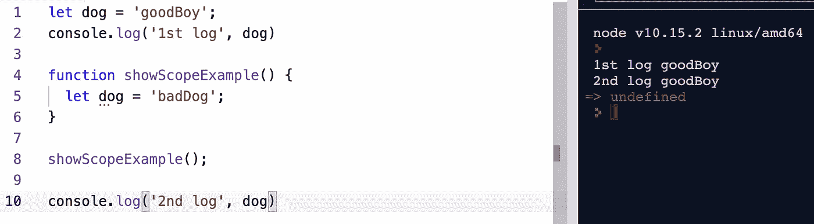
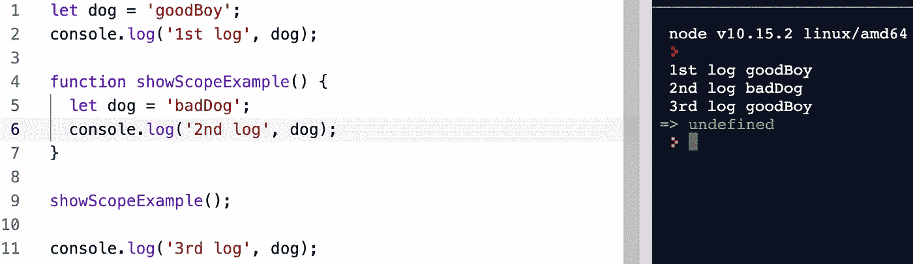
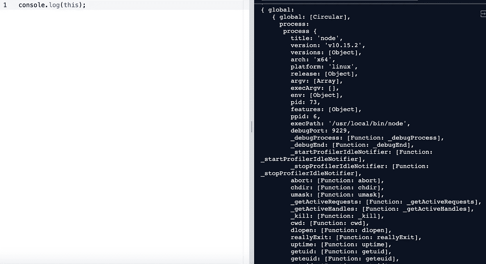
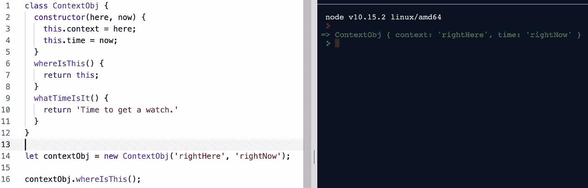

# JavaScript 中的范围与上下文

> 原文：<https://betterprogramming.pub/scope-vs-context-in-javascript-b31818f58558>

## 范围和上下文可能看起来相似，但它们实际上有非常不同的功能

[Jp 瓦列里](https://unsplash.com/@jpvalery?utm_source=unsplash&utm_medium=referral&utm_content=creditCopyText)在 [Unsplash](https://unsplash.com/search/photos/scope?utm_source=unsplash&utm_medium=referral&utm_content=creditCopyText) 上的照片

乍一看，计算机代码看起来像是一个深奥的击键组合，长达数百甚至数千行，没有太多的组织或凝聚力。实际上，代码是一个高度组织化和层次化的系统，其中的进程是同步的，但又是分离的。

简单的原则支配着计算机如何构造和解释代码。这些原则建立在彼此的基础上，反复组合以创建更复杂和有效的应用程序。这篇文章将特别描述其中的两个原则:**范围**和**上下文。虽然这两个原则在其他编码语言中无疑是重要的，但我将特别关注它们在 JavaScript 中最基本的行为。**

范围和上下文可能看起来非常相似，如果你不时把它们弄混，*不要感到孤独*。像编码的许多方面一样，范围和上下文可能很难可视化，并且可能阻碍 JavaScript 新手尽可能快地提高他们的能力。

这种混淆的一个可能原因是，范围和上下文都指变量或某些关键字何时变得相关，以及它们被调用时具体指的是什么。让我们先仔细看看 scope。

# **范围**

用最简单的术语来说，作用域有两个层次:**全局作用域**和**局部作用域**。全局作用域是指在任何地方都可以访问的变量，因为它们是在任何单独的函数或方法之外声明的——通常在文件的顶部。他们存在于全球空间，随时准备被召唤。下面的第一个例子涉及*全局范围*。

全局范围变量的示例

局部作用域指的是在其函数边界内可访问的变量。在这个例子中，我们在文件的顶部有变量`dog`的初始声明，它被赋给字符串“goodBoy”紧接着下面，我们控制台. log 了`dog`变量。

正如所料，第一张`console.log`印出了“goodBoy”，如图片右侧所示。然后，我们有一个函数`showScopeExample()`，它将我们的`dog`变量重新分配给字符串“badDog”

这个函数立即被调用，但是当我们在第 10 行第二次使用`console.log`“dog”时，它仍然显示为“goodBoy”尽管第二个`console.log`发生在我们在函数内部重新分配变量之后，但是`dog`变量目前还不能作为“badDog”返回这是故意的。

我们在`showScopeExample()`中对`dog`的重新声明是在*本地*作用域内。最简单的方法就是看它的位置。重声明位于左花括号和右花括号之间，它们是这些变量相关性的障碍。

限制在函数内部声明的变量的可访问性允许我们重用应用于代码不同部分的变量名。局部作用域的变量还可以防止我们的代码不必要地让数十或数百个全局变量在全局空间中浮动。通过将对变量的访问限制在需要它们的地方，在我们的 JavaScript 中进行适当的抽象也是一个很好的实践。让我们看一个稍微不同的例子…

在这个例子中，我们改变的只是第二个`console.log`的位置，它现在在`showScopeExample()`函数的边界内。如右侧控制台所示，第一个`console.log`仍如预期打印“goodBoy”。

不幸的是，当我们调用`showScopeExample()`(可怜的小狗)时，我们的第二个`console.log`现在打印“badDog”。这是因为我们的第二个`console.log`现在位于花括号的边界内，它将打印位于相同范围内的信息。

最后，第三个`console.log`返回到印刷“好孩子”这也是因为它无法访问本地重新分配，而是求助于初始声明。

# 语境

JavaScript 中的上下文是另一个容易混淆的主题。它主要指关键字`this`的使用。`this`的值取决于它被调用的位置。

在全局空间中调用`this`将返回整个窗口对象。这是因为窗口对象是我们编写的所有代码的起点。试一试，你可能会得到这样的回应…

“This”指的是窗口对象——我们代码的最外层上下文

我们得到的回报就是`window` 对象*无尽的白色文字。*`this`的**第一个**规则是，默认情况下是指窗口对象。如果有机会，您应该在全局上下文中探索调用`this`返回的窗口对象。

但是，如果我们在全球背景之外的地方援引`this`，会发生什么呢？如果我们在一个新对象的上下文中调用`this`，它将返回该对象，就像它返回整个窗口对象一样。让我们看一个简单的例子，然后在此基础上进行构建。

现在“this”指的是新的 context obj——一个比以前更有限的上下文

在上面的例子中，我们已经创建了一个新的对象，命名为`newContextObj`。当我们调用方法`invokeThisInNewContext()` 时，它返回整个`newContextObj`。

这与我们第一个例子中它返回窗口对象的时候是一样的。唯一不同的是，window 对象是一个很大很复杂的对象，而我们的`newContextObj`很小很简单。`this`的**第二个**规则是，在一个对象的上下文中调用时，`this` 会引用那个对象*。*

最后，`this`的**第三**规则稍微复杂一点。在 JavaScript 中，我们使用*类*来创建共享属性的对象的多个实例，即使这些属性的值可能不同。

例如，我们可以有一个产生`car`对象实例的类。尽管事实上所有的汽车都有大小、容量和发动机类型，但这三样东西可能因车而异。下面是在`ContextObj`实例的上下文中调用`this`的例子。

我们在上面的例子中看到的是对我们的`ContextObj`实例的`whereIsThis()`方法的调用。在第三个也是最后一个例子中，关键字`this`指的是这个特定的`ContextObj` *、*实例，不管我们的代码中有多少个`ContextObj`实例。

# 结论

这三个例子试图用最基本的形式来总结`this`，你会在自己的经历中发现*这个*变成了一个非常方便的工具供你使用。更熟悉诸如*上下文*和*范围*这样的概念的最好方法就是简单地对它们进行实验。

打开你喜欢的文本编辑器，开始创建你自己的函数和对象。在函数中乱搞变量放置。你什么时候可以访问它们，它们什么时候返回未定义的？

创建越来越复杂的对象，并在越来越具体和有限的上下文中调用*这个*。没有比把手指放在键盘上，一次一个概念地努力理解概念更好的方法了。