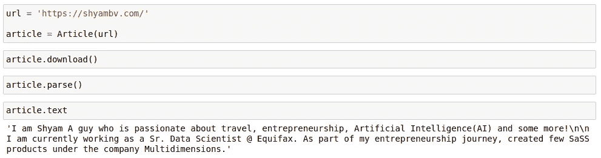
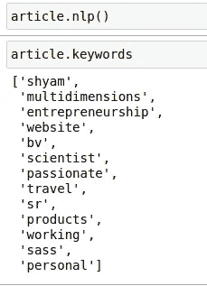
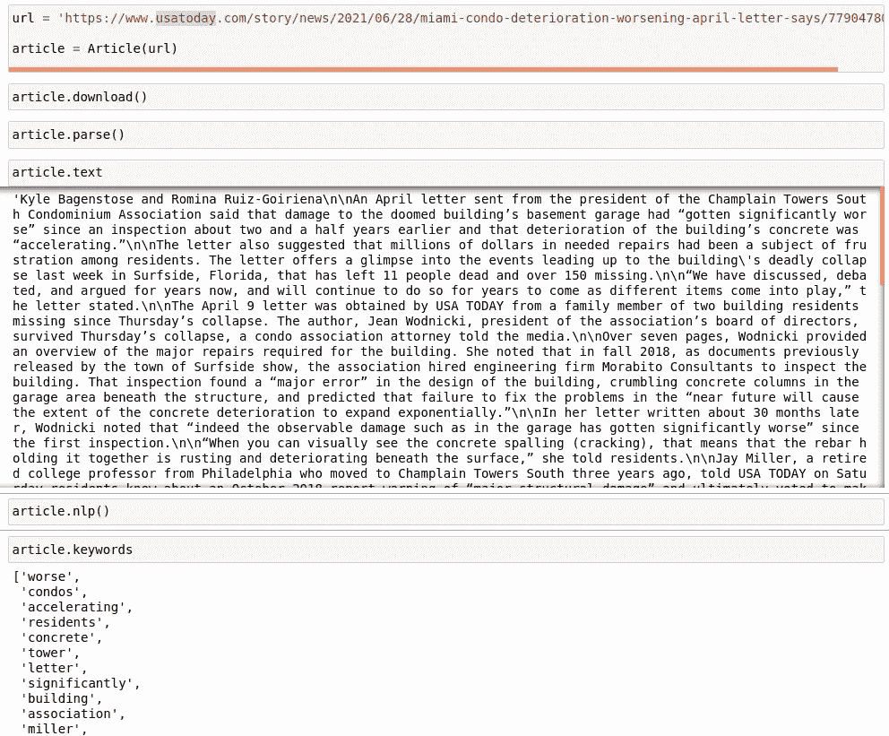
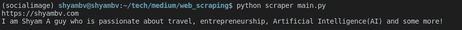
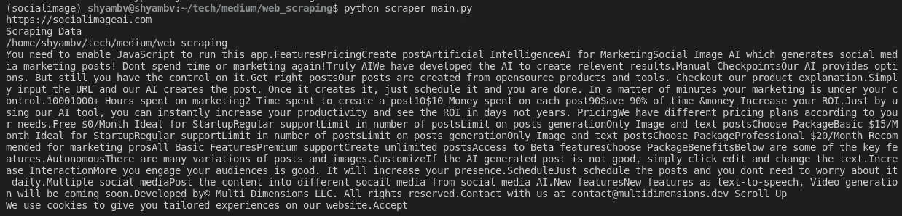

# 使用 Python 抓取任何网站并获取包含关键词的内容

> 原文：<https://betterprogramming.pub/scrape-any-websites-and-get-content-with-keywords-using-python-b060b9fa41ce>

## 在 HTML 和基于角度的网站上执行抓取


在 [Unsplash](https://unsplash.com?utm_source=medium&utm_medium=referral) 上由 [Austin Distel](https://unsplash.com/@austindistel?utm_source=medium&utm_medium=referral) 拍摄的照片

# 介绍

我们经常看到一整页都是较小新闻内容的广告。此外，一些现代网站，如 React/Angular，非常难刮。在这篇文章中，我们将走过如何刮任何网站。

# 设置

我们将使用 Python 和一些额外的包来抓取。以下是我们需要的软件包:

```
pip install newspaper3k
pip install bs4
pip install readability
```

正常处理需要上述软件包。然而，要抓取现代的 React/Angular 网站，我们需要使用 Chrome web 驱动程序手动解析。所以检查你的 Chrome 浏览器版本，从[这里](https://chromedriver.chromium.org/downloads)下载相应的驱动。

我们将使用下面列出的导入:

```
from newspaper import Article
import requests
from bs4 import BeautifulSoup
from readability.readability import Document as Paper
from requests.packages.urllib3.exceptions import InsecureRequestWarning
import re
```

# 抓取正常网站

作为第一次尝试，让我们看看如何刮一个正常的网站是没有反应。由于我不想让其他网站瘫痪，我将使用我的网站(shyambv.com)进行清理。



简单解析作者的网站图片。

简单，对吗？在上面的例子中，我们已经在不太复杂的情况下抓取了网站。我们不需要详细讨论使用 bs4 进行解析。

此外，如果您想获得网站的基本关键字，请执行以下操作:



太好了！你可能认为这在任何有广告的地方都行得通？是的，大部分情况下。只是把文章上无数的广告都废了。它还会剔除屏幕底部不想要的广告。



现在我们可以从一篇没有广告的文章中获取所有的数据和关键词。时事通讯还支持多种语言。

但是，我们经常不会收到一篇优秀的解析文章，所以我们需要尝试不同的库。

上面的代码很棒！它会尝试访问网页。如果可以到达，它将尝试使用库 newspaper3k 并抓取数据。如果第一个库无法访问它，它将尝试使用另一个库并将其擦除。



抓取了一个网站——作者图片

我们说完了吗？不要！这段代码只适用于用 flask、HTML、PHP 等构建的普通网站。用 React/Angular 搭建的网站就不行了。

# 抓取基于 React 的网站

如果我们试图通过一个基于 React 的网站，如 [Socialimageai，](https://socialimageai.com/home)网页可能看起来正常。然而，当你试图查看源代码时，它只会显示一大段 JavaScript 代码。代码没有任何文本，所以我们不能抓取它。

如果我们试图抓取 React 网站，我们将收到 200 错误，因此我们之前的所有代码都将无法工作。正如在设置部分提到的，我们需要一个 Chrome 驱动程序来解析 React 或 Angular 网站。

以下代码将开始连接到 Chrome web 驱动程序:

```
driver = webdriver.Chrome(executable_path=location_of_chrome_driver, options=chrome_options)driver.delete_all_cookies()driver.wait = WebDriverWait(driver, random.choice(range(30,60,1)))driver.maximize_window()
```

在服务器上，我们需要添加一个名为 headless browser 的参数。一旦我们连接到网站，我们需要导航到网站并获取 HTML 页面的主体(这就像在 HTML 页面上使用 inspect)。以上解析是接收现代网站 HTML 代码的唯一方式。

```
body_web_elelment = driver.wait.until(EC.presence_of_element_located((By.TAG_NAME, 'body')))html = body_web_elelment.get_attribute('innerHTML')
```

一旦我们收到 HTML 代码，我们就可以通过 beautiful soup 解析代码。我们可以专门解析网页中的任何链接或文本。

```
soup = BeautifulSoup(html, 'html5lib')for script in soup(["script", "style"]):script.extract()text = soup.get_text()
```

拍拍自己的背！我们现在能够抓取任何网站。



Scraped React 网站输出—图片由作者提供

# 结论

1.  我们可以抓取任何正常的基于 HTML 的网站。
2.  使用 Chrome web 驱动程序在 React/Angular 网站上执行任何抓取操作。

# 获取代码

*通过我的* [***简讯***](https://codesprout.substack.com/welcome) *，加入 100 多名免费获得我的文章和其他更新的完整工作代码的用户。*