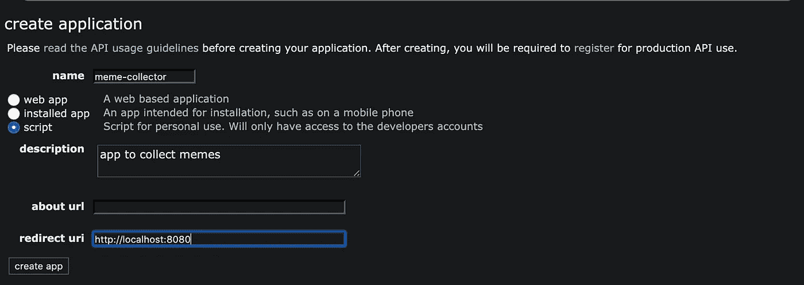
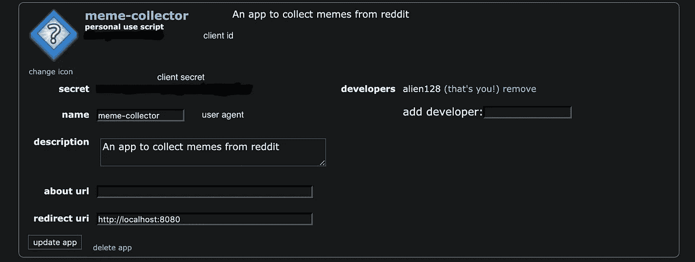

# 用 Python Reddit API 从 Reddit 抓取迷因

> 原文：<https://betterprogramming.pub/scraping-memes-from-reddit-55842273b3e1>

## 有趣的周末项目——编写代码从 r/programmer humore 中抓取迷因


由 [Kon Karampelas](https://unsplash.com/@konkarampelas?utm_source=unsplash&utm_medium=referral&utm_content=creditCopyText) 在 [Unsplash](https://unsplash.com/search/photos/reddit?utm_source=unsplash&utm_medium=referral&utm_content=creditCopyText) 上拍摄的照片

很长一段时间，我曾经认为从互联网上抓取数据太无聊了，在 DevTools 中检查网页，找到你感兴趣的 DOM 节点——对我来说似乎太麻烦了。

直到有一天，我用[*Beautiful Soup*](https://pypi.org/project/beautifulsoup4/)**试了一下，看到使用解析的 dom 和收集感兴趣的数据是多么容易，我真的受到了启发。**

**从那以后，我一直在探索抓取的世界，最近遇到了 [PRAW](https://praw.readthedocs.io/en/latest/) ，它是 Python Reddit API 包装器，使访问 Reddit 数据变得非常容易。**

**在探索了这个包一段时间后，我真的想做一个有趣的小周末项目，还有什么比编写代码从 [r/ProgrammerHumor](https://www.reddit.com/r/ProgrammerHumor/comments/bolfnr/that_code_you_copy_which_runs_smooth_af/) 中抓取迷因更好的呢。**

**对于本教程，我们需要:**

*   **Python。**
*   **Reddit 账户。**
*   **访问 Reddit API 的客户端 ID 和客户端密码。**
*   **用户代理。**
*   **[urllib](https://docs.python.org/3/library/urllib.html) 。**
*   **[熊猫](https://pandas.pydata.org/)**

**现在我们知道了需求，让我们首先创建一个 Reddit 应用程序，并获取我们的客户端 ID、客户端密码和用户代理。**

**进入 [*应用偏好*](https://www.reddit.com/prefs/apps) ，点击*创建应用*或创建另一个应用，这将带你进入此屏幕。对于重定向 URL，输入`[http://localhost:8080](http://localhost:8080)`，如[文档](https://praw.readthedocs.io/en/latest/getting_started/authentication.html#script-application)中所述。**

****

**创建-Reddit-应用程序**

**一旦你输入了细节，点击*创建应用*，你将被带到这个屏幕。请在此处记下您的客户 ID 和客户密码，因为我们稍后将需要它们来进行身份验证。**

****

**客户端 id、密码和用户代理**

**现在我们已经创建了一个应用程序，让我们安装 Python 依赖项。**

**打开终端/cmd 并运行:**

```
pip install praw pandas
```

**因为我们已经有了客户端 ID、密码和用户代理，所以我们现在可以继续编写代码并开始使用 Reddit API。**

**PRAW 初始化**

**上面这段代码将让我们访问`praw.Reddit` 实例，现在我们可以访问子编辑，从特定的 Reddit 获取帖子、评论等。**

**接下来，我们将从/r/ProgrammerHumor 获取帖子，并遍历这些帖子，收集我们想要的数据并保存图像文件。**

**上面这段代码获取 subreddit r/progammer humor**并获取热门帖子，将其限制为 10 个。****

****接下来，您可以遍历帖子并保存适当的数据。查看 [PRAW 的文档](https://praw.readthedocs.io/en/latest/getting_started/quick_start.html)，更深入地了解所有可用的方法。****

****现在我们已经可以访问 URL，我们将使用 urllib 简单地将迷因下载到本地文件系统，这是一个用于在互联网上交互和获取数据的高级接口。****

****下载到文件系统****

****现在我们只需遍历 URL 并检查它们是否是允许的扩展名之一，我们使用`urllib.urlretrieve`将它们下载到文件系统，最后，我们可以使用 [pandas](https://pandas.pydata.org/) 将数据保存到 CSV 中。****

****导出到 CSV****

****下面是最终的脚本:****

****访问我的 [GitHub 获取 GitHub 回购](https://github.com/asjadanis/reddit-scrapper)。****

****[](https://github.com/asjadanis/reddit-scrapper) [## asjadanis/reddit-scrapper

### 一个使用 PRAW 的 python 脚本，可以让你从你最喜欢的子编辑中下载媒体文件，并将帖子信息导出到…

github.com](https://github.com/asjadanis/reddit-scrapper)****