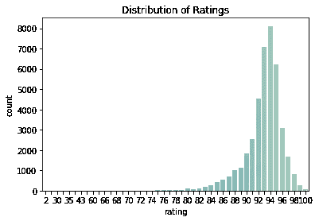
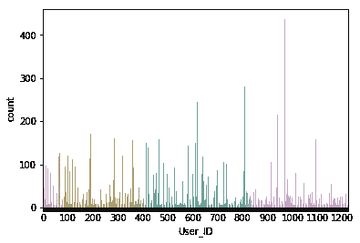
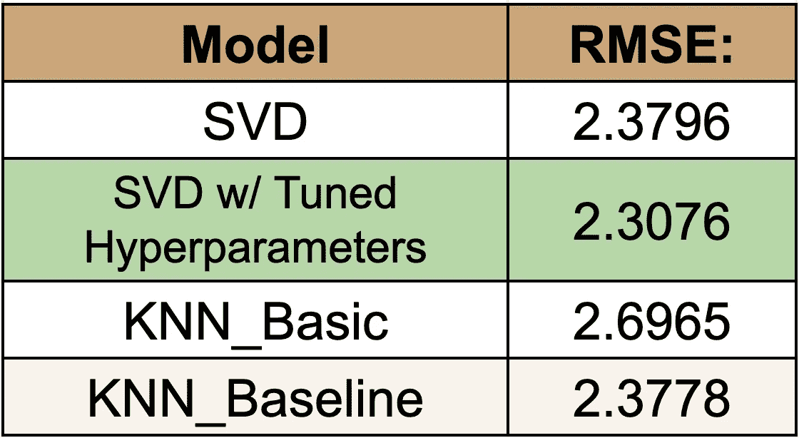

# 抓取威士忌评论数据构建推荐系统

> 原文：<https://betterprogramming.pub/scraping-whiskey-review-data-to-build-a-recommendation-system-af6b82f31301>

## 学习网络抓取复杂性的有趣方式

亚当·威尔森在 [Unsplash](https://unsplash.com/search/photos/whiskey?utm_source=unsplash&utm_medium=referral&utm_content=creditCopyText) 上拍摄的照片

在这篇文章中，我解释了我和我的同学阿克谢(@akshay.sharma8426)、Fhel (@FhelDimaano)在纽约市熨斗学校期间建立的一个推荐系统。虽然我不会给出奇异值分解和协同过滤背后的数学细节，但我会向您展示我们构建系统的步骤。这个项目大约花了三天时间。

在这篇文章的底部有一个到我们威士忌推荐系统演示的链接。

# 数据

我们从[威士忌基地](https://www.whiskybase.com/)收集数据，这是一个致力于威士忌爱好者的网站。该网站的用户可以对世界各地的威士忌进行评分，并与网站上的其他用户分享他们的评分和个人资料。

为了收集数据，我们需要三个主要组件:

*   用户标识
*   用户评价的威士忌
*   特定威士忌的等级

起初抓取数据似乎是一项简单的任务——只需使用 [BeautifulSoup4](https://pypi.org/project/beautifulsoup4/) 从页面中提取特定的 HTML 标签来获取我们需要的内容。但是等等，不要这么快。当然，要找到我们需要的页面，会遇到比预期更多的障碍。我们意识到，为了让我们的脚本正常运行，我们需要能够登录到 whiskeybase 来访问网站上其他用户的个人资料。

这个任务的完美解决方案是一个名为 [Selenium](https://www.seleniumhq.org/docs/) 的包(我用过的最酷的包之一)。Selenium 是一个 web 自动化工具，可以用来模拟人类与 web 页面的交互。因此，我们在脚本中添加了这一点，以允许自动登录功能。

现在，随着 Selenium 的工作，我们能够成功地收集所需的数据。我们最终从世界上排名前 1000 的威士忌中收集用户评论数据，以及 whiskeybase 新发布的威士忌列表。

当我们的刮擦完成时，我们得到了来自:

*   1，223 个独立用户
*   1092 种独特的威士忌
*   41，018 总评分

# 收视率分布

正如人们所猜测的，在我们的数据集中，不同威士忌的平均评分相当高。这主要是因为我们使用的威士忌来自前 1000 名以及一些新发布的威士忌。因为我们有大量的收视率(41K+)，这应该不是太大的问题。

# 评论的分布

对我们有利的是，网站上的用户相当活跃。你可以从上面的图表中看到，相当多的用户甚至在他们的个人资料上有超过 100 个评分，有一个评论者有 400+。为了适应我们的模型，我们删除了所有评论少于五条的用户。

# 建模

在决定最终使用哪个模型时，我们比较了 [Surprise](http://surpriselib.com/) 库中不同模型的性能。这些包括奇异值分解，KNN 基本，KNN 基线。三个模型的结果非常接近，RMSE 大约为 2.378。总的来说，这是一个不错的结果。

我们最初测试的 SVD 超参数是 n_factors=100，n_epochs=20，reg_all=0.02。这产生了 2.3796 的误差度量 RMSE。在 GridSearch 的多次迭代中调整超参数后，我们的最终模型是 SVD，最终误差度量 RMSE = 2.3076。我们找到的最佳参数是 n_factors=40，reg_all=0.1，n_epochs=40。

# 用户建议演示

如上面的 GIF 所示，我们的推荐系统提示用户他们想要多少推荐，并询问他们的初始预算。之后，用户被要求从 1 到 100 给五种威士忌打分。一旦用户对五种威士忌进行了评级，模型就会根据他们的数据进行重新调整，我们会输出对新用户的推荐。向用户提供威士忌的名称、价格和可以买到它的 URL。

# 结论

总的来说，这个项目是一个学习网络抓取复杂性的好方法。每个网站都不一样，总有新的挑战需要克服。我们的最终结果非常好，我们对它们非常满意。我想说这是我在熨斗工作期间参与的最有趣的项目之一，我很高兴我们能够很好地合作以实现我们的目标。

对进一步推进这个项目有什么建议吗？我很想收到你的来信！在 [GitHub](https://github.com/AustinKrause/Flatiron_Mod_4_Recommendation_System) 上查看源代码。

干杯。