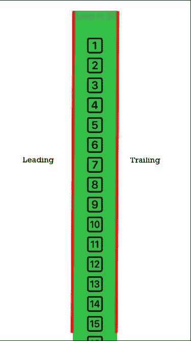
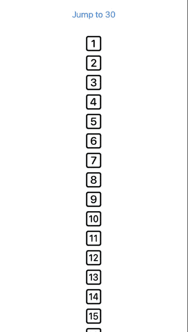
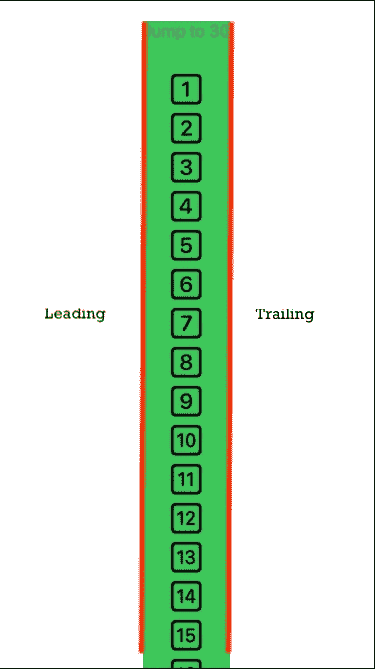
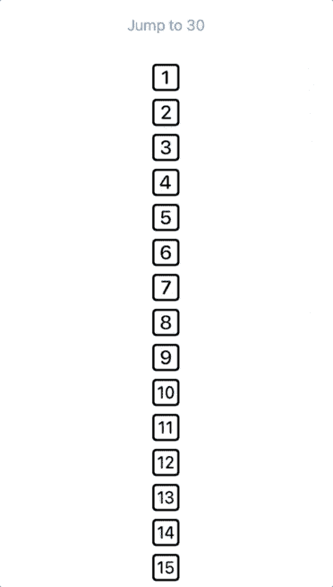
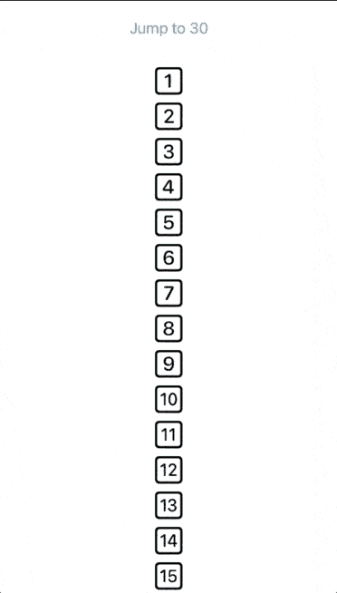
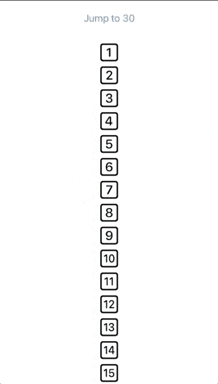

# 在 SwiftUI 2 中使用 ScrollViewReader 滚动到 ScrollView 中的不同位置

> 原文：<https://betterprogramming.pub/scroll-to-different-positions-in-a-scrollview-with-scrollviewreader-in-swiftui-2-6b4d775d5470>

## ScrollViewReader 简介



在最近的 WWDC 2020 中，苹果推出了`ScrollViewReader`。这是我们很多人一直期待的功能之一，因为 SwiftUI 1 中缺乏对滚动的支持。

正如我们许多人所知，SwiftUI 1 中没有任何内置的支持来滚动到特定的行。在 Stack Overflow 上，可能有多种不同的方式来处理由不同的人编写的一堆代码，但是如果只用一行代码就能处理好，不是更好吗？

使用`ScrollViewReader`，您现在可以使用 index 滚动到任何一行。

**注:**同样的行为对`List`不起作用。在发布时，似乎不支持跳转到`List`中的元素。

> "`ScrollViewReader`:一个视图，它的子视图被定义为一个`ScrollViewProxy`的函数，目标是子视图中的可滚动视图。"
> 
> —苹果文档

## 先决条件

要学习本教程，您需要了解以下方面的一些基本知识:

*   对 Swift 的基本熟悉
*   至少 Xcode 12+
*   仅支持 iOS 14+

# ScrollViewReader 入门

首先，您需要将`ScrollViewReader`嵌入到`ScrollView`中。

在这里，你将使用来自科幻符号的图像-第一个版本首先在 2019 年 WWDC 推出，随后的版本在 2020 年 WWDC 推出。这是苹果的一个很棒的工具，你可以在那里找到很多有用的图标，但它主要只支持 iOS 13+。为了让它支持 iOS 13+，有一个变通办法(就是导出它)。

不管怎样，我们不要被 SF 符号分散注意力，把注意力放在`ScrollViewReader`上。这个想法是在`ScrollView`的顶部有一个按钮，上面有大约 50 张图片。

```
ScrollView {
    ScrollViewReader { value in
        // 1
        Button("Jump to 30") {
            value.scrollTo(30, anchor: .top)
        }
        // 2
        ForEach(1..<51) { index in
            Image(systemName: "\(index).square")
                .font(.largeTitle)
                .frame(height: 70)
                .id(index)
        }
    }
}
```

1.  这是将出现在列表上的按钮。通过点击它，您将被重定向到该行。
2.  使用带数字的`forEach`创建图像。

您的设备应该如下所示，带有图像和按钮:



点击按钮会把你带到索引 30。


这实际上取决于您希望如何显示您的索引，您可以通过用不同的`UnitPoint`替换锚点来调整它。

```
value.scrollTo(30, anchor: .top)
```

知道`ScrollView`的框架可能是好的，这样你就知道当应用不同的锚时会发生什么，比如尾随或前导。



# 。零



# 。中心



# 。主要的



# 。蔓延的


# 。底部


# 。顶端领先

你甚至可以尝试`topTrailing`，但是你得到的想法。


# 。底部拖曳

你甚至可以尝试`.bottomLeading`，但是你得到的想法。


# 结论

感谢阅读。