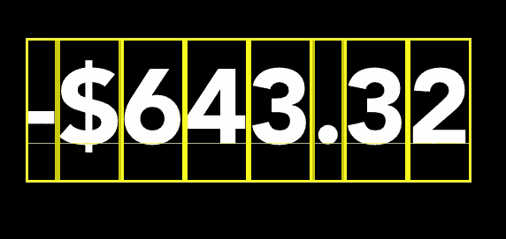

# scroll counter:robin hood 数字动画的开源 Pod

> 原文：<https://betterprogramming.pub/scrollcounter-an-ios-solution-to-the-robinhood-number-animation-bbcbd8c90355>

## ScrollCounter 将 Robinhood 整洁的滚动过渡动画带到了 iOS 和 CocoaPods

Robinhood 是 app store 中制作最好的金融应用之一。这不仅仅是我的观点；他们的 iOS 应用程序有罕见的“编辑选择”徽章，这是为应用程序商店中最好看和感觉最好的应用程序保留的。

他们的 iOS 应用程序有许多很酷的用户界面功能，我最喜欢的是它们在数字之间转换的动画方式。

Robinhood 整洁的滚动动画，用于数字之间的转换。

Robinhood 的动画不是开源的，所以我为 iOS 创建了 [ScrollCounter 框架](https://github.com/stokatyan/ScrollCounter)，并通过 [CocoaPods](https://cocoapods.org/) 提供。

本文将从较高的层次来看看 ScrollCounter 的幕后发生了什么。

# 它是如何工作的

## 这些碎片

ScrollCounter 框架有三个对象:

1.  `ScrollableCounter`:**`UIView`的一个子类，给出了一个有序的视图数组，可以在其中滚动。**
2.  **`DigitScrollCounter`:是`ScrollableCounter`的一个子类，用于滚动一系列数字。**
3.  **`NumberScrollCounter`:管理`DigitScrollCounters`集合和标点符号的任何附加视图的`UIView`的子类。**

## **ScrollableCounter 和 DigitScrollCounter**

**用一个视图数组初始化一个`ScrollableCounter`来滚动，并使用给定数组中每个元素的索引来管理滚动动画。**

**从这里开始，我们将视图阵列称为`items`。`items`的元素可以是任意的`UIView`。`DigitScrollCounter`是`ScrollableCounter`的子类，它使得将`items`的元素设置为一个数字范围变得更加容易。**

**为了在`items`中的元素之间制作动画，当前可见的元素用于计算需要“滚动”哪些元素才能到达所需索引处的元素。**

**需要滚动的`items`中的每个元素都是垂直堆叠的，所有的元素都会立刻动画化。查看`ScrollableCounter`中的`setupItemsToAnimate(_:_:)`以了解实现细节。**

**动画在一个方向上(向上或向下),以便滚动最少数量的元素到达其目标。**

**因此，从零滚动到九和从九滚动到零将导致不同方向的动画。在`ScrollableCounter`的`calculateDirection(toIndex: Int)`查看实现细节。**

**左边的 DigitScrollCounter 显示了动画如何在一个镜头中移动垂直堆叠的视图。当动画中断时，需要制作动画的视图会相对于最可见的视图重新堆叠。**

**最后一步是处理滚动动画的中断。**

**当一个动画需要停止以允许一个新的动画时，我们认为它是“中断的”。当`ScrollableCounter`在没有完成当前播放动画的情况下被更新时，就会发生这种情况。**

**当动画中断时，需要确定*最可见元素*的索引。一旦确定了索引，要滚动的新元素相对于当前元素进行堆叠(“当前元素”是项目中与最可见的元素相对应的元素)。**

## **数字滚动计数器**

**一个`NumberScrollCounter`是一个`DigitScrollCounters`和“标点符号”视图的集合，它们被组合在一起以允许在一个无限的数字范围内滚动。**

**首先，`NumberScrollCounter`根据需要编排`DigitScrollCounter`和标点符号。**

****

**`NumberScrollCounter arranges each DigitScrollCounter individually, and accounts for any additional views needed for punctuation.`**

**当`NumberScrollCounter`的值改变时，只要将`DigitScrollCounters`和标点从当前位置移动到新的目标位置即可。**

**这意味着对于`NumberScrollCounter`动画被中断的情况不需要特别注意。简单来说，`DigitScrollCounter`就是四处移动，根据需要淡入淡出。**

**当布局被动画化时，每个单独的`DigitScrollCounter`被动画化为任何需要的元素，以便`NumberScrollCounter`更新其值。**

**水平滑动动画和淡入淡出动画将数字滚动计数器和标点符号视图发送到它们需要的位置。结合每个单独的 DigitScrollCounter 的滚动动画，这就产生了所需的 Robinhood 风格的过渡动画。**

**最后，由于`NumberScrollCounter`是`UIView`的子类，它的框架应该随着它的子视图的更新而更新。**

**`NumberScrollCounter`的框架应该根据其`DigitScrollCounter`和“标点符号”视图的最终布局进行更新。**

**这只是简单的任务，找到限制在`NumberScrollCounter`中使用的所有视图的最小宽度和高度。检查`sizeToFit()`的覆盖以了解实施细节。**

**可以调整整个 NumberScrollCounter 的框架(红色轮廓)的大小，以适合显示的数字(或正在动画显示的数字)。**

# **结束**

**所涉及的数学可能有点繁琐，所以我在本文中省略了它，但是您可以自己随意看看源代码，如果您有任何问题或评论，请联系我们:[GitHub 上的源代码。](https://github.com/stokatyan/ScrollCounter)**

**如果你在这篇文章中做到了这一步，我希望你发现它有用，享受 ScrollCounter！**